Here is the result of "fetch" for the Page with URL https://app.notion.com/p/3c65c17b0d0d81cdb851c0835b25a538 as of 2026-09-30T19:23:40.973Z:
<page url="https://app.notion.com/p/3c65c17b0d0d81cdb851c0835b25a538" icon="🧮">
<ancestor-path>
<parent-page url="https://app.notion.com/p/3c65c17b0d0d81c7b646e548e65d9446" title="Technical knowledge base"/>
<ancestor-2-page url="https://app.notion.com/p/3b75c17b0d0d8148b63dd36e88459017" title="Me"/>
</ancestor-path>
<properties>
{"title":"Topic: math"}
</properties>
<iconMetadata>{"type":"emoji","emoji":"🧮"}</iconMetadata>
<content>
<embed src="notion-file-block://bcd5b16d-e6e3-4c28-a12d-de77a94ff6bb/376f538a-36b9-4167-8011-c35c6fed7da9?space_id=13e79c56-ebab-4528-83aa-967a204b1f04&name=topic-math.html">Interactive: Topic: math</embed>
# Video
A narrated 7-minute explainer derived from this page. The page stays canonical: the video is a derived representation, and every figure it states comes from here.
<video src="notion-file-block://3e45c17b-0d0d-81c9-baf0-d8c292da22ef/71d57f43-ebe5-48ff-8e0f-ef2bf6bed8ca?space_id=13e79c56-ebab-4528-83aa-967a204b1f04&name=topic_math_overview.mp4">Topic: math: what each area lets you see</video>
*This video was made on 22 September 2026 and does not cover the two worked examples under "What only shows with all four in view" (one set of logits read four ways, and a Bernoulli's curvature read as Hessian, variance and Fisher information), the short answers to the flagged questions, or How it connects.*
⏱ 10 min read · +19h 50m resources
Refresh-and-reference map of the mathematics behind ML: linear algebra, probability and statistics, calculus and optimisation, information theory. Depth lives in the linked deep-dive pages; this page is the index, and the home of the two objects the four areas share.

```mermaid
graph TD
    M[Math for ML]
    M --> LA[Linear algebra]
    LA --> LA1[Vector spaces, norms, rank]
    LA --> LA2[Decompositions: eigen, SVD, QR, Cholesky; condition number]
    LA --> LA3[Low-rank approximation: LoRA, MLA, GaLore]
    LA --> LA4[Matrix calculus layout, Jacobians, einsum]
    M --> PS[Probability and statistics]
    PS --> PS1[Bernoulli to BCE, categorical to softmax CE]
    PS --> PS2[Gaussian to MSE, Laplace to L1, Poisson]
    PS --> PS3[MLE vs MAP vs Bayesian]
    PS --> PS4[Bias-variance, paired tests, CLT, concentration]
    M --> CO[Calculus and optimisation]
    CO --> CO1[Cost-function gradients worked out]
    CO --> CO2[Chain rule as VJPs, backprop]
    CO --> CO3[Second order: Hessians, Newton, XGBoost, conditioning]
    CO --> CO4[Convexity, Lagrange multipliers]
    M --> IT[Information theory]
    IT --> IT1[Entropy, cross-entropy, KL forward vs reverse]
    IT --> IT2[Mutual information, InfoNCE]
    IT --> IT3[Perplexity, bits-per-byte]
```

## What each area buys you
Four areas, each earning its place for a different reason, and two objects they turn out to share, which have a section of their own below.
**Linear algebra** is the notation every model is written in: a layer is a matrix, an attention head a pair of contractions, a batch one more axis. Four ideas pay off daily. **Rank** is how many independent directions a map actually uses, and the empirical observation that fine-tuning updates have low intrinsic rank is exactly what LoRA exploits; low-rank KV compression (multi-head latent attention, MLA) and low-rank gradient projection (GaLore) use the same factorisation through a narrow bottleneck. The **SVD**, via Eckart-Young, turns truncation from guesswork into arithmetic. The **condition number** is the single number that predicts whether an optimisation problem will be a long narrow valley. And **matrix-calculus layout conventions** (numerator versus denominator) are why a gradient written in a paper and the gradient autograd hands you are transposes of each other.
**Probability and statistics** turns a loss from an arbitrary choice into a consequence. Choose a distribution for $`p(y \mid x)`$, take the negative log-likelihood, and the standard loss falls out. That one move answers "why this loss" every time, and because these are proper scoring rules whose optimum is the true conditional probability, it is also what makes calibration a meaningful thing to ask about. **MLE, MAP and Bayesian** are the three things you can do with a likelihood, and every "loss plus regulariser" is already the middle one whether you say so or not. The statistics half is what makes eval results honest: **paired tests** and **bootstrap confidence intervals** on benchmark deltas, and the $`1/\sqrt{n}`$ shrinkage of error bars that decides whether a claimed one-point gain on a 500-example eval is real at all.
**Calculus and optimisation** is the mechanics of how a model actually gets trained. First order gives **backprop**, reverse-mode automatic differentiation that never materialises a Jacobian and only ever asks each op for a **vector-Jacobian product**, which is why a backward pass costs roughly twice a forward one and why stored activations, not FLOPs, are the binding constraint that activation checkpointing exists to relieve. Second order gives the **Hessian**, and that is where the practical training intuitions live: gradient descent diverges above a learning rate of $`2/\lambda_{\max}`$, ill-conditioning is what normalisation layers and good init are really fixing, Adam's second moment is a crude diagonal curvature proxy (closer to the diagonal of the empirical Fisher than of the Hessian, and not a Newton step), and XGBoost's leaf weights are literal per-leaf Newton steps. **Convexity** marks which guarantees survive, and **Lagrange multipliers** are the machinery behind KL-constrained policy updates such as TRPO and behind reading a regularisation penalty as a norm-ball constraint.
**Information theory** is the measurement layer, and what makes language-model numbers mean something. **Cross-entropy** is the training objective read as a code length, the length you pay when the code was built for your model but the data came from reality; **KL divergence** is the gap, so the loss floors at the data's own entropy rather than at zero. Downstream this decides how you read evals: **perplexity** is tokenizer-dependent and cannot be compared across models with different vocabularies, while **bits-per-byte** is the tokenizer-free unit used in scaling-law work. The **forward versus reverse KL** asymmetry explains why MLE-trained models cover every mode of the data while RLHF-style KL penalties are mode-seeking and cost you output diversity.
## What only shows with all four in view
**Cross entropy is one object wearing four hats**: a maximum-likelihood estimator (probability), a code length (information theory), the quantity whose gradient collapses to $`p - y`$ (calculus), and, as an N-way softmax over a single positive, the contrastive objective InfoNCE.
**Worked example: one set of logits, four hats.** Take logits $`z = (2, 1, 0)`$ over three classes A, B and C, with A correct. Then $`e^{z} = (7.389, 2.718, 1)`$, summing to 11.107, so the softmax gives $`p = (0.665, 0.245, 0.090)`$. The same computation, read four ways:
- **Probability.** Model the label as a categorical draw with these probabilities. The negative log-likelihood of A is $`-\ln 0.665 = 0.408`$ nats, and minimising its average over a dataset is maximum-likelihood estimation.
- **Information theory.** Divided by $`\ln 2`$, the same number is 0.588 bits, the length of A's codeword in a code built from $`p`$. Averaged over real data it is the cross-entropy, which is the data's own entropy plus the KL divergence from the data to the model.
- **Calculus.** Its gradient with respect to the logits is $`p - \mathbf{1}_A = (-0.335, 0.245, 0.090)`$: prediction minus the one-hot target, summing to zero.
- **Contrastive learning.** Read A as an anchor's positive and B and C as two negatives with similarity scores 2, 1 and 0. Then 0.408 is the InfoNCE loss with $`N = 3`$ candidates, and it certifies a mutual information between the two views of at least $`\ln 3 - 0.408 = 0.691`$ nats.
where $`z_k`$ is the logit (raw score) of class $`k`$, $`p_k = e^{z_k} / \sum_j e^{z_j}`$ its softmax probability, $`\mathbf{1}_A`$ the one-hot vector of the true class, and $`N`$ the number of InfoNCE candidates (the positive plus the negatives), whose bound is $`I \ge \ln N - L_{\text{NCE}}`$.
**Curvature is one object read three ways**: the Hessian of a loss, the condition number of a matrix, and the Fisher information of a model. The condition number is the ratio of the Hessian's largest to smallest eigenvalue, and it sets how slowly gradient descent crosses a long narrow valley, while the largest eigenvalue alone sets the $`2/\lambda_{\max}`$ learning-rate limit. The Fisher information is the expected curvature of a model's negative log-likelihood, equivalently the variance of its score (the gradient of the log-likelihood). For the canonical losses (sigmoid with BCE, softmax with CE, identity with MSE) the Hessian with respect to the logit does not depend on the label at all, so it equals its own expectation, the Fisher. That is why natural-gradient methods and K-FAC can precondition with the Fisher in place of the Hessian, and why the curvature of TRPO's KL constraint is the Fisher matrix.
**Worked example: a Bernoulli's curvature.** Binary cross-entropy on a logit $`z`$, with $`p = \sigma(z)`$:
- Hessian: the second derivative of the loss with respect to $`z`$ is $`p(1 - p)`$, whatever the label.
- Variance: a Bernoulli($`p`$) label has variance $`p(1 - p)`$.
- Fisher information: the score with respect to $`z`$ is $`y - p`$, and its variance is $`p(1 - p)`$.
At $`z = 0`$ ($`p = 0.5`$) all three are 0.25, the largest they get; at $`z = \ln 9 = 2.197`$ ($`p = 0.9`$) all three are 0.09. A confident prediction sits in a flat direction of the loss. Here $`\sigma(z) = 1/(1 + e^{-z})`$ is the sigmoid, $`y \in \{0, 1\}`$ the label, and the score is the derivative of the log-likelihood $`y \ln p + (1 - y)\ln(1 - p)`$ with respect to $`z`$.
**Which area to reach for is a diagnosis.** If you cannot see why the loss is that loss and not some other one, that is **probability**: choose the distribution and the loss is already decided. If a run has exhausted memory and you cannot see where it went, that is **calculus**, and nearly always the backward pass. If a representation has collapsed, or a fine-tune has barely moved anything, that is **linear algebra**, and the word is **rank**. And if an eval number will not tell you what it actually means, that is **information theory**. Where two of the four answer with the same object, as they do for cross entropy and for curvature, that is one idea you were carrying two copies of.
## Map of the deep dives
<table header-row="true">
<tr>
<td>Page</td>
<td>Covers</td>
<td>Read when you need</td>
</tr>
<tr>
<td><mention-page url="https://app.notion.com/p/3c65c17b0d0d81d89c26e1dab2fcb701">Linear algebra for ML</mention-page> (18 min read · +8h 15m resources)</td>
<td>Vector spaces, rank-nullity and norms; the four decompositions ML actually uses (eigen, SVD, QR, Cholesky) and the condition number; Eckart-Young, LoRA, MLA and GaLore; matrix calculus conventions (numerator vs denominator layout); Jacobians, Hessians and the gradients worth knowing cold; einsum and what it costs</td>
<td>Any derivation with matrices in it; reading papers that state gradients without derivation</td>
</tr>
<tr>
<td><mention-page url="https://app.notion.com/p/3c65c17b0d0d815f9a47d613409b5a0c">Probability and statistics for ML</mention-page> (22 min read · +11h 50m resources)</td>
<td>Random variables, likelihood and NLL; independent vs dependent variables (both meanings); Bernoulli to BCE, categorical to softmax CE, Gaussian to MSE, Laplace to L1 and Poisson, in one table; MLE vs MAP vs Bayesian with a Beta prior; bias-variance and double descent; p-values, error bars, McNemar's test and the paired bootstrap; CLT and Hoeffding's inequality</td>
<td>Why losses look the way they do; comparing two models honestly</td>
</tr>
<tr>
<td><mention-page url="https://app.notion.com/p/3c65c17b0d0d81eb8b49ed6a0f897f3b">Calculus and optimisation for ML</mention-page> (25 min read · +8h 45m resources)</td>
<td>Gradients of MSE, BCE+sigmoid and CE+softmax worked out (all collapse to p - y); backprop as VJPs and what it costs; the Hessian: Newton's method, XGBoost's leaves as Newton steps, conditioning and the learning-rate limit, saddles; convexity; Lagrange multipliers and KKT; which method when</td>
<td>Deriving or sanity-checking any gradient; understanding second-order methods</td>
</tr>
<tr>
<td><mention-page url="https://app.notion.com/p/3c65c17b0d0d81c6baf3f778a62e14e5">Information theory for ML</mention-page> (15 min read · +4h 30m resources)</td>
<td>Entropy as expected surprise and as optimal code length, cross-entropy, KL (forward vs reverse), CE = entropy + KL, mutual information, perplexity = exp(CE) and bits-per-byte, InfoNCE and its log N ceiling, a cheat sheet</td>
<td>What LM eval numbers mean; why CE loss is the right objective</td>
</tr>
</table>
## Flagged questions, answered where
- Independent vs dependent variables: two unrelated meanings. In experimental design the independent variable is what you set (the features $`x`$) and the dependent variable what you measure (the target $`y`$); in probability, $`X`$ and $`Y`$ are independent when $`P(X, Y) = P(X)P(Y)`$, and features and target must be dependent in that sense for learning to be possible. <mention-page url="https://app.notion.com/p/3c65c17b0d0d815f9a47d613409b5a0c">Probability and statistics for ML</mention-page>, section "Independent vs dependent variables", right after the definitions.
- What is entropy: the expected surprise $`H(X) = -\sum_x p(x) \log p(x)`$, and the shortest average code length any lossless code can achieve; 1 bit for a fair coin, about 0.47 bits for a coin that lands heads 90% of the time. <mention-page url="https://app.notion.com/p/3c65c17b0d0d81c6baf3f778a62e14e5">Information theory for ML</mention-page>, first section, "What is entropy?".
- Bernoulli distribution and its relation to classification: a single yes/no trial with $`P(Y = 1) = p`$; a sigmoid classifier models $`y \mid x`$ as Bernoulli, and its negative log-likelihood is binary cross-entropy. <mention-page url="https://app.notion.com/p/3c65c17b0d0d815f9a47d613409b5a0c">Probability and statistics for ML</mention-page>, section "Bernoulli and binary classification", the first of the distributions.
- Differentiation of each cost function: for MSE with an identity output, BCE with a sigmoid and CE with a softmax, the gradient with respect to the logit is prediction minus target (times $`2/n`$ for the MSE average). <mention-page url="https://app.notion.com/p/3c65c17b0d0d81eb8b49ed6a0f897f3b">Calculus and optimisation for ML</mention-page>, section "Differentiation of each cost function".
- Second-order differentiation: the Hessian, the matrix of second derivatives, which gives Newton's step $`-H^{-1}g`$, XGBoost's leaf weights $`-G/(H + \lambda)`$ and the condition number. <mention-page url="https://app.notion.com/p/3c65c17b0d0d81eb8b49ed6a0f897f3b">Calculus and optimisation for ML</mention-page>, section "Second-order differentiation".
## How it connects
- <mention-page url="https://app.notion.com/p/3c65c17b0d0d8161a72bc8c572f37d55"/>: the catalogue of losses and when to use each; this topic says why each one is the negative log-likelihood of a distribution and what its gradient is.
- <mention-page url="https://app.notion.com/p/3c65c17b0d0d817080bbc90954681d09"/>: how SGD, momentum, Adam and Muon work; the curvature reasoning here ($`2/\lambda_{\max}`$, conditioning) is why they behave as they do.
- <mention-page url="https://app.notion.com/p/3c65c17b0d0d81018f15edd19fa5c28a"/> and <mention-page url="https://app.notion.com/p/3c65c17b0d0d81eba08eef56b3e3b4eb"/>: the low-rank update in full, the evidence that fine-tuning updates have low intrinsic rank, and current practice.
- <mention-page url="https://app.notion.com/p/3c65c17b0d0d8180b808c8c0cf8ddbe6"/> and <mention-page url="https://app.notion.com/p/3c65c17b0d0d818c9bcff7177325fe56"/>: TRPO's KL-constrained update, and the reverse-direction KL penalty to a reference policy in RLHF.
- <mention-page url="https://app.notion.com/p/3c65c17b0d0d8103a916c4824abbd82e"/>: activation checkpointing and the rest of the backward pass's memory budget at scale.
## Best resources for the whole topic
- [Mathematics for Machine Learning (Deisenroth, Faisal, Ong)](https://mml-book.github.io/) (book, \~6h 10m for ch. 2-7): the backbone text, free PDF; chapters 2-7 map almost one-to-one onto these pages.
- [The Matrix Calculus You Need For Deep Learning (Parr and Howard)](https://explained.ai/matrix-calculus/) (\~1h 30m): the single best matrix-calculus refresher for DL.
- [Visual Information Theory (Chris Olah)](https://colah.github.io/posts/2015-09-Visual-Information/) (\~40 min): entropy, CE, KL, MI with visual intuition.
- [Convex Optimization (Boyd and Vandenberghe)](https://web.stanford.edu/~boyd/cvxbook/) (book, \~5h for ch. 2-5): free PDF; chapters 2-5 for convexity and duality.
- [CS229 main notes](https://cs229.stanford.edu/main_notes.pdf) (course notes, \~5h) and [CS229 probability review](https://cs229.stanford.edu/section/cs229-prob.pdf) (\~1h): the probabilistic view of losses (GLMs) in compact form.
- [The Matrix Cookbook (Petersen and Pedersen)](https://www.math.uwaterloo.ca/~hwolkowi/matrixcookbook.pdf) (reference, \~30 min to skim): the lookup table for matrix identities and derivatives.
<page url="https://app.notion.com/p/3c65c17b0d0d81d89c26e1dab2fcb701">Linear algebra for ML</page>
<page url="https://app.notion.com/p/3c65c17b0d0d815f9a47d613409b5a0c">Probability and statistics for ML</page>
<page url="https://app.notion.com/p/3c65c17b0d0d81eb8b49ed6a0f897f3b">Calculus and optimisation for ML</page>
<page url="https://app.notion.com/p/3c65c17b0d0d81c6baf3f778a62e14e5">Information theory for ML</page>
</content>
</page>