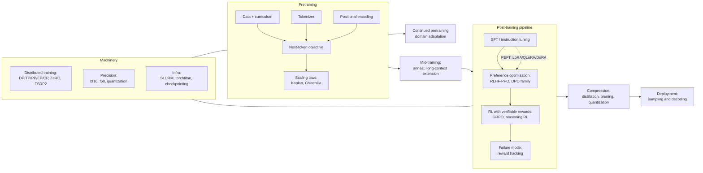

Here is the result of "fetch" for the Page with URL https://app.notion.com/p/3c65c17b0d0d81b6876ee72b7056793b as of 2026-09-28T07:23:41.811Z:
<page url="https://app.notion.com/p/3c65c17b0d0d81b6876ee72b7056793b" icon="🏗️">
<ancestor-path>
<parent-page url="https://app.notion.com/p/3c65c17b0d0d81c7b646e548e65d9446" title="Technical knowledge base"/>
<ancestor-2-page url="https://app.notion.com/p/3b75c17b0d0d8148b63dd36e88459017" title="Me"/>
</ancestor-path>
<properties>
{"title":"Topic: llm-training-and-post-training"}
</properties>
<iconMetadata>{"type":"emoji","emoji":"🏗️"}</iconMetadata>
<content>
# Video
A narrated 6-minute explainer derived from this page. The page stays canonical: the video is a derived representation, and every figure it states comes from here.
<video src="https://prod-files-secure.s3.us-west-2.amazonaws.com/13e79c56-ebab-4528-83aa-967a204b1f04/f6553cd9-9d43-44f3-a7bd-b9620f1a5509/topic_llm_training_and_post_training_overview.mp4?(signed query string omitted; it expires after 300 s)#notion_record=block.3e35c17b-0d0d-81f0-837f-d2d9ed6a8be1.13e79c56-ebab-4528-83aa-967a204b1f04">Topic: llm-training-and-post-training: the stages a model goes through, and what each one buys</video>
*This video was made on 22 September 2026 and does not cover DeepSeek's DSec sandbox infrastructure, the published cost of MiMo-V2.6's final reinforcement-learning stage, or the frozen-router technique that made it stable. The page moved past it on 28 September 2026.*
⏱ 9 min read · +18h 35m resources
The full lifecycle of building a language model: pretraining at scale, the machinery
that makes it possible (distributed training, precision, infra), the components that
shape the model (tokenizers, positional encodings), and the post-training pipeline
that turns a base model into a useful assistant (SFT, preference optimisation, RL,
distillation), plus what can go wrong (reward hacking) and how the model is used at
inference time (sampling and decoding).
## Taxonomy

## Map of the space
**Pretraining** is well understood in the open. Chinchilla-optimal allocation and why everyone now trains far past it, multi-stage data with its high-quality anneal, long-context extension, and the fully open recipes (OLMo 2/3, K2 Horizon, SmolLM3, and the nanoGPT speedrun that produced the Muon optimiser) are all on <mention-page url="https://app.notion.com/p/3c65c17b0d0d814f82cffd0d5c0dd5ba">Pretraining</mention-page>. Two 2026 data points qualify its allocation rules. Chinchilla fixed the split between parameters and tokens but said nothing about the quality of those tokens, and a decomposition of 2019--2025 progress puts far more of the compute-efficiency gain on the data side than on the model side (Dwarkesh Patel, Sep 2026). That leaves the allocation rule intact as advice on how to divide a compute budget while removing its implicit claim that one token is worth as much as another, which is the assumption the rest of this topic's pretraining machinery is built on. The measurement itself and what it means for curation are on <mention-page url="https://app.notion.com/p/3c65c17b0d0d811fa5ecda8d365ab00f"/>. [Dwarkesh](https://www.dwarkesh.com/p/pretraining-progress-is-mostly-data) (25 min). Magic (Sep 2026) reports a pretraining recipe more than 10x more compute-efficient than leading open-weight base models, published with the recipe and the long-context work rather than as a benchmark table; vendor-reported and not independently reproduced, so the multiple is a claim rather than a measurement, but it is the relevant playbook for a small lab pretraining without frontier compute. [Magic](https://magic.dev/blog/pretraining) (25 min)
**Distributed training** is a composition problem rather than a single choice: FSDP2 and HSDP for sharded data parallelism, TP (tensor parallelism) inside a node, PP (pipeline parallelism) across nodes, EP (expert parallelism) for MoE experts, CP (context parallelism) for the sequence dimension that makes 128k-token training fit. The mechanics, the communication costs and the rules for combining them are on <mention-page url="https://app.notion.com/p/3c65c17b0d0d8103a916c4824abbd82e">Distributed Training</mention-page>. The HuggingFace **Ultra-Scale Playbook**, 4000+ benchmarked runs distilled into an interactive book, is the canonical modern reference for picking among them. For the sparse case specifically, a September 2026 paper bounds the four memory bottlenecks of large-MoE training inside a **fixed** GPU memory budget **without approximating the computation**, by scheduling when each tensor has to exist rather than by shrinking it: expert dispatch, vocabulary projection, activation checkpointing and optimiser state. Those four are what decide whether a given MoE run fits on hardware you own rather than on rented capacity, which makes it the first thing to reach for when sizing a sparse run against a fixed pair of consumer cards. Recorded from the abstract rather than from a reading of the paper, with no numbers carried; see <mention-page url="https://app.notion.com/p/3e95c17b0d0d8148a1f3d412918234fc"/> for what is and is not known.
**Post-training** converged on a standard flow: SFT so the model answers instructions instead of continuing text, then preference optimisation (RLHF with PPO, or the DPO family, which skips both the reward model and the RL loop), then RLVR against a programmatic checker, with GRPO as its workhorse. The mechanics of every stage, the DPO variants and RLAIF are on <mention-page url="https://app.notion.com/p/3c65c17b0d0d81d5bed7e608d4061c7a">Alignment: SFT, RLHF, DPO Family, RLVR</mention-page>. **Reward hacking**, where the policy keeps climbing the proxy while the true objective stalls or degrades, is the central failure mode of all of it and the reason KL penalties, reward ensembles and hidden test splits exist: <mention-page url="https://app.notion.com/p/3c65c17b0d0d8196a6f1f29a817aa974">Reward Hacking</mention-page>. Four 2026 instances show where the pipeline is going. **Cognition SWE-2** (Sep 2026) RL post-trained Kimi K3, Moonshot's 2.8T open model, into a coding agent matching Fable 5.1 on FrontierCode 1.1 Main (50.0% against 50.9%) at a claimed 64% lower cost. Two training details transfer. Selectable reasoning-effort levels were trained in a single RL run using slope-matched cost penalties, rather than one checkpoint per tier or a budget parameter bolted onto a finished model, which makes the cost-quality trade an explicit term in the objective and is cheaper than either Anthropic's caller-set token budget or OpenAI's per-request router. And the efficiency gain is in turns, not tokens (SWE-2 medium used 58% fewer turns and cost 81% less than SWE-1.7 on the same tasks), which is where agent economics live once per-token price is competitive. The caveat: Terminal-Bench 2.1 at 92.8% against Terminal-Bench 4 at 27.3%, roughly 30 points behind competitors on the newer version, so the cost claim rests partly on a benchmark a version behind; no open weights, no standalone API, runs only inside Devin Desktop and CLI. [Cognition](https://cognition.com/blog/swe-2) (15 min). **NeoHorse-1** (Sep 2026) makes post-training data a function of production traffic rather than an offline curation pass: a router over a heterogeneous model pool predicts each request's capability demand, those predictions order a three-stage supervised curriculum, served interactions become training examples through structural validation, a six-dimensional semantic evaluation and subscene-level labelling (finer than per-conversation labelling, which is what makes partial-trajectory supervision work), teachers supervise students under progressive difficulty, and evaluation feedback converts directly into training-mixture decisions. Macro-average across 11 agent, tool-use, coding and instruction benchmarks: 4B from 58.94 to 64.87, 9B from 65.60 to 69.04, with the post-trained 4B closing most of the gap to the base 9B. The mechanism is demonstrated; scaling past 9B is not. Full summary in <mention-page url="https://app.notion.com/p/3db5c17b0d0d81e3b105e033a359ad24"/>, paper at [arXiv 2609.08183](https://arxiv.org/abs/2609.08183) (45 min). **AI Research Preference Models** (Meta FAIR, Sep 2026) move selection upstream of the GPU, on the premise that a research agent's dominant cost is running the wrong experiment: frozen pretrained language models compare candidate experiments pairwise in a knockout tournament, either as an inference-only judge reading the proposals or as an agentic variant that runs small pilot experiments and judges from their outcomes. Average normalised score rises from 0.684 for random selection to 0.729 for the agentic variant, both variants reach the random baseline's final result in about 15 hours instead of 24 (a 1.5 to 1.6x wall-clock speedup), with reported new bests on WinoGrande at 94.1% and SVAMP at 95.7%. Hold it loosely: the margins are narrow, the headline benchmarks are old enough that a new best on them is weak evidence, and pairwise LLM judging carries the positional and verbosity biases documented on <mention-page url="https://app.notion.com/p/3c65c17b0d0d8181b351e1b8fc6a1546"/>, now applied to proposals rather than answers. The idea is worth more than this instance of it. [arXiv 2608.13940](https://arxiv.org/abs/2608.13940) (45 min), [MarkTechPost](https://www.marktechpost.com/2026/09/06/meta-fair-introduces-ai-research-preference-models-rpms-ranking-ml-experiments-before-spending-gpu-hours/) (10 min). **ToolGrad** (Google Research, 2026) inverts the data-generation problem for tool use: rather than writing a user question and hoping a valid tool chain exists for it, it builds a **verified API chain first** and writes the user question afterwards, reaching a 99.8% success rate generating tool-use training data across 16,000 real APIs, and a Gemma 3 12B trained on just **500** of those examples matched Gemini 2.5 Pro on a tool-use test over APIs it had never seen. The transferable idea is the inversion itself, answer first and question second, which applies anywhere the answer is cheap to verify and expensive to find, and it builds evaluation sets as readily as training sets. [Google Research](https://research.google/blog/toolgrad-efficient-tool-use-dataset-generation-with-textual-gradients) (12 min)
**The layer every agentic RL recipe above assumes, with numbers on it for the first time.** Each recipe in this section needs environments that execute untrusted code, at rollout rates a GPU cluster can consume, and none of them says what that costs. [DSec](https://arxiv.org/abs/2609.22978) (45 min) (DeepSeek, Sep 19, 2026) is that layer, published. One SDK exposes four isolation levels, **FnCall, container, microVM and full VM**, so a rollout pays only for the isolation its task needs rather than for the strongest available; sandbox images load on demand from the Fire-Flyer File System instead of being staged per node; memory sharing, reclamation and CPU scheduling are tuned for high-density execution under overcommit; and the whole thing is **co-designed with the RL framework so stateful rollouts are decoupled from preemptible GPU training**, which is the architectural point, because a rollout that must survive a preempted trainer is a different system from one that can be restarted with it. Reported production scale: about **160 nodes per unit, roughly 3 million sandboxes a day, more than 380,000 concurrent, and more than 5,000 created per second**, with latency held under overcommit. The paper also treats mitigating agent misbehaviour, reward hacking included, as a property of the sandbox rather than of the reward, which lines up with <mention-page url="https://app.notion.com/p/3c65c17b0d0d8196a6f1f29a817aa974">Reward Hacking</mention-page>: an environment that cannot be escaped removes a whole class of shortcut before the reward has to be robust to it. Two things to take from it. The ratio of 5,000 creations per second to 160 nodes is what makes agentic RL affordable at all, and it is an infrastructure result rather than an algorithmic one, so a lab without it is not running the same experiments whatever recipe it copies. And the four-backend design is the transferable idea for anyone building smaller: isolation is a per-task cost, not a platform decision. Full summary in <mention-page url="https://app.notion.com/p/3e95c17b0d0d81bd927be047bb0d7b0b"/>. Dated two days before the research window opened; it surfaced within it through TechNode and Bloomberg coverage on 23 September and a 313-point Hacker News thread on 26 September, and had not been recorded here before.
**Efficiency** spans three axes, one page each. **PEFT** freezes the base and trains a small set of new parameters (LoRA, and QLoRA's 4-bit NF4 base under bf16 adapters): <mention-page url="https://app.notion.com/p/3c65c17b0d0d81eba08eef56b3e3b4eb">Parameter-Efficient Fine-Tuning (PEFT)</mention-page>. **Precision** moved from bf16 to fp8 in the mainstream, with Blackwell-native NVFP4 and MXFP4 now arriving for training rather than just storage: <mention-page url="https://app.notion.com/p/3c65c17b0d0d817b8f41ff66fba4cd0e">Quantization and Precision</mention-page>. **Distillation**, off-policy on teacher samples or on-policy on the student's own, is the main reason the 1-8B tier is genuinely capable now: <mention-page url="https://app.notion.com/p/3c65c17b0d0d81efa2a8c3b3b623eb09">Distillation and Small Language Models</mention-page>.
**Worked examples with a budget attached.** Mercor with SkyRL trained Qwen3.5-397B-A17B with reinforcement learning on 1,928 expert knowledge-work tasks and reports a 70% relative improvement in APEX-Agents Pass@1; the write-up includes the unglamorous parts, exact token accounting, asynchronous RL, environment robustness and harness design, with the explicit argument that those decide the outcome as much as the algorithm does. Read alongside <mention-page url="https://app.notion.com/p/3d45c17b0d0d814abc07fde424e09a31"/> in <mention-page url="https://app.notion.com/p/3c65c17b0d0d81549dbedb27e8f2a26f"/>, which industrialises the environment supply this recipe says is decisive, and cross-listed to <mention-page url="https://app.notion.com/p/3c65c17b0d0d8195a6c6c11ad093c16e"/>. [Mercor](https://www.mercor.com/blog/training-frontier-knowledge-work-agents-a-397b-rl-training-guide-with-skyrl/) (25 min). Thomson Reuters mid-trained on top of Qwen3.5 for a reported \$40M in three months: 200B curated tokens selected from a 19T pool with DatologyAI, DPO alignment against an open-source constitution, GSPO for context compaction and document caching, and a 35B open-weights sibling released alongside (reported in The Batch, 4 Sep 2026; treat the \$40M as a reported figure, not an audited one). They share a parameter count by coincidence; hold them together because between them they price the two main paths, post-train for behaviour and mid-train for domain, with a budget and a timeline attached, which practitioners never publish. Two smaller examples complete the price list. The Postgres query-planner result on <mention-page url="https://app.notion.com/p/3cd5c17b0d0d815d8841ec845f5f3324"/> (Sep 2026) is a full specialisation recipe published end to end at a scale a single engineer can rerun: supervised fine-tuning on **420 trajectories distilled from GPT-6 Astra** using **LoRA adapters of roughly 21M parameters** on consumer GPUs, then agentic reinforcement learning with a custom reward and an **anchored GRPO variant**, trained on about 13.6k queries and validated on 113 held-out ones, with vLLM inference on rented dual-H100 nodes. Distil from a frontier model, adapt cheaply, then RL against a verifiable reward in the actual environment; the result is a 4B model beating a hand-tuned production system on its own task for hundreds of dollars, the clearest recent evidence that for a narrow task with a cheap verifier, specialisation beats scale by a wide margin. Periodic's Neon (Sep 2026) is the same shape three orders of magnitude up in budget: midtraining plus RL on real laboratory data beats GPT-6 Astra and Claude Fable 5.1 on a hard scientific-analysis evaluation at lower cost per analysis, surpasses frontier models on FrontierXRD, and is deployed in labs analysing experiments for superconductors and magnets. Its structural claim: domain RL on proprietary **operational** data, the records a working organisation generates anyway rather than a curated corpus, establishes a Pareto-optimal cost-performance frontier against general frontier models. The common ingredient in both is a verifier that already exists in the domain. [Periodic](https://periodic.com/news/nature-is-our-learning-environment) (10 min) Xiaomi's **MiMo-V2.6** (Sep 2026) fills the gap between those two ends of the price list. Its final reinforcement-learning stage ran live for **under six days across 7,000 RL task environments at \$2.62 million** for the 1.02T-total, 42B-active Pro model, released MIT with the weights on Hugging Face. Almost nobody publishes what the last stage of a frontier-scale open model costs, which is why this figure is worth more than the benchmark table it came with, and three things follow from it. It is the same order of magnitude as Thomson Reuters' \$40M mid-training run divided by about fifteen, so post-training for behaviour and mid-training for domain are not separated by an order of magnitude in cost at comparable scale, which is not what the usual framing implies. The 7,000 environments are the expensive part rather than the GPU time, which is the argument <mention-page url="https://app.notion.com/p/3d45c17b0d0d814abc07fde424e09a31"/> and DSec above both make from the supply side. And under six days of live RL on a trillion-parameter model means the stage is short enough to iterate on, so the constraint on how many times a lab can try is the environment supply and the evaluation turnaround, not the run itself. Two techniques come with the disclosure and are the reusable part: the **mixture-of-experts router is frozen** to hold reinforcement learning stable at that scale, which is a concrete answer to the instability that makes large-MoE RL expensive to attempt, and layered defences against reward hacking are described rather than alluded to, with the RL framework and the environments released. [ComputingForGeeks](https://computingforgeeks.com/xiaomi-mimo-v2-6-pro-flash/) (10 min), [alphaXiv](https://www.alphaxiv.org/abs/2609.mimo-scaling-reinforcement-learning) (20 min) The open counterpart at much smaller scale is **DAPO** (ByteDance and Tsinghua), a large-scale LLM reinforcement-learning system reaching **50 points on AIME 2024** from the Qwen2.5-32B base, with algorithm, dataset and infrastructure all released rather than described. That makes it the runnable baseline the priced examples above are not: everything else in this paragraph is a figure to reason from, and this is a repository to start from. [GitHub](https://github.com/BytedTsinghua-SIA/DAPO) (25 min)
## Self-improving and automated-research loops
Where a model's own output feeds back into the next round of research or training, the question is what has actually been measured. Anthropic's "When AI builds itself" (Sep 2026) puts a measured series behind the recursive-self-improvement argument rather than an assertion, and the provenance matters as much as the figures: internal measurements on internal tasks, one of them self-reported.
- **Over 80%** of code merged into Anthropic's production codebase was authored by Claude, as of May 2026. Engineers ship roughly **8x more code per quarter** than the 2021 to 2025 average. A March 2026 employee survey put the median respondent's self-estimated output multiple at about **4x**, which is the soft figure of the set.
- **Task horizon**, the series that carries the argument: Claude Opus 3 (March 2024) completing roughly four-minute tasks, Sonnet 3.7 (March 2025) roughly 90-minute tasks, Opus 4.6 (March 2026) twelve-hour tasks, with tasks that take a person weeks projected for 2027.
- **Research capability**: code-optimisation speedups found by the model moving from about 3x in May 2025 to about **52x** in April 2026; open-ended problem success at **76%** in May 2026 after gaining 50 percentage points in six months; research judgement matching human suggestions **64%** of the time in April 2026 against 51% in November 2025.
- A companion measurement piece adds the two figures most worth quoting on their own: as of September 2026 Claude leads **26%** of Anthropic's AI research work, with **more than 30,000 internal agents active at any one time**, and staff reportedly working with the model for roughly 90% of their work. It also proposes a framework for tracking agent activity and asking whether human oversight still scales with it.
- Operational consequence, published separately: Anthropic's continuous-integration workload grew **25-fold in six months** and its test suite grew 10-fold to keep pace. That is the concrete cost of the 80% figure, and the part most organisations will hit before they hit anything else.
Human oversight remains load-bearing for setting research direction and evaluating outcomes, the same boundary [Z.ai](http://Z.ai) drew in September 2026 when it said its infra agent had not reached recursive self-improvement because humans held the objectives. Two labs on two continents independently drew the line at the same place: the loop closes on execution, not on goal selection. [Anthropic, recursive self-improvement](https://www.anthropic.com/institute/recursive-self-improvement) (20 min), [Anthropic, measuring the pace of AI development](https://www.anthropic.com/institute/measuring-pace-of-ai-development) (15 min)
**Dream-RSI** (Sep 2026) is the training-side instance. It treats the agent's accumulated discovery history as a **replay simulator over the search space already explored**, so exploration policy improves off-policy by "dreaming" against past evaluations rather than paying for new ones, across algorithm engineering, mathematical optimisation and GPU kernel engineering. Its limit is the general caution about self-improving loops: a replay simulator is only valid inside the region the history covers, so it sharpens exploitation of a mapped space rather than expanding into an unmapped one. Agora hit the mirror-image problem, needing one human intervention mid-run to restore diversity after the population converged. Full summary in <mention-page url="https://app.notion.com/p/3e25c17b0d0d813ba021d805ba80ef54"/>. The selection-side instance is Meta FAIR's AI Research Preference Models, described under post-training above.
## Deep dives
<table header-row="true">
<tr>
<td>Page</td>
<td>What it covers</td>
</tr>
<tr>
<td><mention-page url="https://app.notion.com/p/3c65c17b0d0d814f82cffd0d5c0dd5ba">Pretraining</mention-page></td>
<td>Objectives, scaling laws, curricula, open recipes, Ultra-Scale Playbook</td>
</tr>
<tr>
<td><mention-page url="https://app.notion.com/p/3c65c17b0d0d8103a916c4824abbd82e">Distributed Training</mention-page></td>
<td>DP/DDP, TP, PP, EP, CP, ZeRO, FSDP2, hybrid sharding</td>
</tr>
<tr>
<td><mention-page url="https://app.notion.com/p/3c65c17b0d0d817187bcd94a1b0f15ea">Tokenizers</mention-page></td>
<td>Word/char/subword, BPE, WordPiece, SentencePiece, Unigram</td>
</tr>
<tr>
<td><mention-page url="https://app.notion.com/p/3c65c17b0d0d81a5b7c9e578fcdfac00">Positional Encodings</mention-page></td>
<td>Sinusoidal to RoPE, ALiBi, YaRN, NoPE, long context</td>
</tr>
<tr>
<td><mention-page url="https://app.notion.com/p/3c65c17b0d0d81eba08eef56b3e3b4eb">Parameter-Efficient Fine-Tuning (PEFT)</mention-page></td>
<td>Adapters, soft prompts, LoRA, QLoRA, DoRA, when PEFT suffices</td>
</tr>
<tr>
<td><mention-page url="https://app.notion.com/p/3c65c17b0d0d81d5bed7e608d4061c7a">Alignment: SFT, RLHF, DPO Family, RLVR</mention-page></td>
<td>SFT, reward models, PPO, DPO family, GRPO, RLAIF, RLVR</td>
</tr>
<tr>
<td><mention-page url="https://app.notion.com/p/3c65c17b0d0d8196a6f1f29a817aa974">Reward Hacking</mention-page></td>
<td>Patterns, detection, mitigations, inoculation prompting</td>
</tr>
<tr>
<td><mention-page url="https://app.notion.com/p/3c65c17b0d0d817b8f41ff66fba4cd0e">Quantization and Precision</mention-page></td>
<td>PTQ/QAT, mixed precision, fp8, GPTQ/AWQ, MXFP4/NVFP4</td>
</tr>
<tr>
<td><mention-page url="https://app.notion.com/p/3c65c17b0d0d81efa2a8c3b3b623eb09">Distillation and Small Language Models</mention-page></td>
<td>Logit vs sequence distillation, pruning, small-model landscape</td>
</tr>
<tr>
<td><mention-page url="https://app.notion.com/p/3c65c17b0d0d8115bafcda29a2c7086e">Sampling and Decoding</mention-page></td>
<td>Greedy, beam, temperature, top-k/p, min-p, constrained decoding</td>
</tr>
<tr>
<td><mention-page url="https://app.notion.com/p/3c65c17b0d0d8119b8f0e801caa09474">Continued Pretraining (CPT)</mention-page></td>
<td>Domain adaptation, CMR scaling law, forgetting, replay</td>
</tr>
<tr>
<td><mention-page url="https://app.notion.com/p/3c65c17b0d0d81c9b2cac997583bf572">Training Infrastructure</mention-page></td>
<td>SLURM, HyperPod, NeMo, Megatron, torchtitan, fault tolerance</td>
</tr>
</table>
## Key papers
- <mention-page url="https://app.notion.com/p/3c65c17b0d0d81b08a1debb0c15cd252"/> (Kaplan 2020) and <mention-page url="https://app.notion.com/p/3c65c17b0d0d8116b7ddffba5c599f3f"/> (2022): compute-optimal training.
- <mention-page url="https://app.notion.com/p/3d45c17b0d0d81ec8ebfec02e953a7fd"/> (2019): the controlled comparison the rest of this topic rests on, holding one pipeline fixed and moving objective, architecture, corpus, fine-tuning scheme and multi-task mixture one axis at a time; its lasting results are mostly negatives (denoising variants barely differ, corruption rate barely matters, multi-task training alone underperforms pretrain-then-fine-tune, though multi-task pretraining followed by fine-tuning matches it).
- <mention-page url="https://app.notion.com/p/3c65c17b0d0d81879a7ed90bca007699"/> (2019) and <mention-page url="https://app.notion.com/p/3c65c17b0d0d8133ae92fbe90a1f308e"/> (2019): sharding and tensor parallelism.
- <mention-page url="https://app.notion.com/p/3c65c17b0d0d81018f15edd19fa5c28a"/> (2021) and <mention-page url="https://app.notion.com/p/3c65c17b0d0d815a8f4edc33f9583671"/> (2023): PEFT.
- <mention-page url="https://app.notion.com/p/3c65c17b0d0d8180b958d8299996a063"/> (2022), <mention-page url="https://app.notion.com/p/3c65c17b0d0d818bb1d8cafd30e20f9e"/> (2023), <mention-page url="https://app.notion.com/p/3c65c17b0d0d817f9fc5cb9a9fbcbee5"/> (2024), <mention-page url="https://app.notion.com/p/3c65c17b0d0d815a9b31e9443961c700"/> (2022): the alignment lineage.
- <mention-page url="https://app.notion.com/p/3c65c17b0d0d81cfa5e9f54459720098"/> (2021): the default positional encoding; rotating query and key vectors by an angle proportional to position makes the attention dot product depend only on relative distance, with no extra parameters.
- <mention-page url="https://app.notion.com/p/3c65c17b0d0d81a8b541c9babbf40c94"/> (2021): expert parallelism origins; routing each token to a single expert lets parameter count grow without a proportional rise in FLOPs per token.
- <mention-page url="https://app.notion.com/p/3c65c17b0d0d81e4a3e8e7a2c4771381"/> (2022): IO-aware attention that tiles the computation to stay in SRAM and never materialises the full attention matrix, giving both large training speedups and linear rather than quadratic activation memory.
- <mention-page url="https://app.notion.com/p/3c65c17b0d0d81fb9857fb956165ae1c"/> (2025) and <mention-page url="https://app.notion.com/p/3c65c17b0d0d81aca58ccb9d720b474e"/> (2024): full open and semi-open training reports.
## Best starting resources
- [HuggingFace Ultra-Scale Playbook](https://huggingface.co/spaces/nanotron/ultrascale-playbook) (\~8h): 4000+ scaling experiments distilled; the modern distributed-training bible.
- [RLHF Book (Nathan Lambert)](https://rlhfbook.com/) (\~6h): free, current, covers the whole post-training pipeline.
- [Karpathy, "Let's build the GPT Tokenizer"](https://www.youtube.com/watch?v=zduSFxRajkE) (2h 15m): BPE from scratch.
- [OLMo 2 report](https://allenai.org/blog/olmo2) (\~30 min): the most complete open pretraining recipe.
<page url="https://app.notion.com/p/3c65c17b0d0d81d5bed7e608d4061c7a">Alignment: SFT, RLHF, DPO Family, RLVR</page>
<page url="https://app.notion.com/p/3c65c17b0d0d8119b8f0e801caa09474">Continued Pretraining (CPT)</page>
<page url="https://app.notion.com/p/3c65c17b0d0d81efa2a8c3b3b623eb09">Distillation and Small Language Models</page>
<page url="https://app.notion.com/p/3c65c17b0d0d8103a916c4824abbd82e">Distributed Training</page>
<page url="https://app.notion.com/p/3c65c17b0d0d81eba08eef56b3e3b4eb">Parameter-Efficient Fine-Tuning (PEFT)</page>
<page url="https://app.notion.com/p/3c65c17b0d0d814f82cffd0d5c0dd5ba">Pretraining</page>
<page url="https://app.notion.com/p/3c65c17b0d0d817b8f41ff66fba4cd0e">Quantization and Precision</page>
<page url="https://app.notion.com/p/3c65c17b0d0d8196a6f1f29a817aa974">Reward Hacking</page>
<page url="https://app.notion.com/p/3c65c17b0d0d8115bafcda29a2c7086e">Sampling and Decoding</page>
<page url="https://app.notion.com/p/3c65c17b0d0d817187bcd94a1b0f15ea">Tokenizers</page>
<page url="https://app.notion.com/p/3c65c17b0d0d81c9b2cac997583bf572">Training Infrastructure</page>
</content>
</page>
