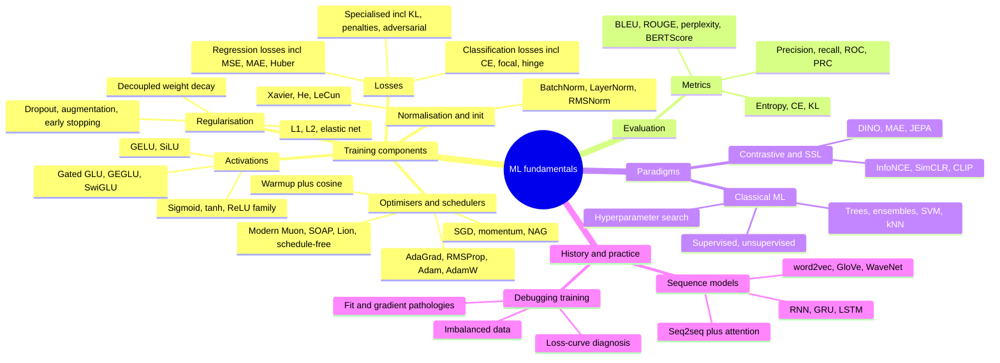

Here is the result of "fetch" for the Page with URL https://app.notion.com/p/3c65c17b0d0d81d796ccc0a293218c57 as of 2026-09-22T22:45:03.103Z:
<page url="https://app.notion.com/p/3c65c17b0d0d81d796ccc0a293218c57" icon="📐">
<ancestor-path>
<parent-page url="https://app.notion.com/p/3c65c17b0d0d81c7b646e548e65d9446" title="Technical knowledge base"/>
<ancestor-2-page url="https://app.notion.com/p/3b75c17b0d0d8148b63dd36e88459017" title="Me"/>
</ancestor-path>
<properties>
{"title":"Topic: ml-fundamentals"}
</properties>
<iconMetadata>{"type":"emoji","emoji":"📐"}</iconMetadata>
<content>
# Video
A narrated 7-minute explainer derived from this page. The page stays canonical: the video is a derived representation, and every figure it states comes from here.
<video src="https://prod-files-secure.s3.us-west-2.amazonaws.com/13e79c56-ebab-4528-83aa-967a204b1f04/65c3bd57-bb99-44b8-a409-dd9c8d876d9b/topic_ml_fundamentals_overview.mp4?(signed query string omitted; it expires after 300 s)#notion_record=block.3e35c17b-0d0d-8157-aa52-e3f2fe27aa9a.13e79c56-ebab-4528-83aa-967a204b1f04">Topic: ml-fundamentals: ten pages, and the four threads that cut across them</video>
⏱ 6 min read · +24h 15m resources
Core machine learning building blocks: the losses, activations, optimisers, normalisation, and metrics every network is assembled from, plus classical ML, contrastive/self-supervised learning, the pre-transformer sequence-model lineage, and a practical training-debugging cookbook. Mostly review material, formatted for fast refresh; genuinely modern developments (SwiGLU, RMSNorm, Muon, JEPA) are flagged inline with dates.
## Taxonomy

## Map of the space
Each band below gets its orienting claim and whatever only becomes visible when all the children are in view. The depth is on the deep-dive pages, mapped in the table that follows.
**Losses** follow from the target type and the outlier profile; classification is all cross entropy, varied by reweighting the terms (label smoothing, class weights, focal). **KL divergence** is the exception that is not a task loss at all but the distance-like quantity between two distributions, the same object in VAE regularisers, in distillation, and in RLHF's policy anchor.
**Activations** are the ReLU family in hidden layers and task-specific at the output. The gated variants (SwiGLU, the transformer FFN default) are the same construction as an LSTM gate, two projections with one gating the other, so the effective slope is learned per neuron rather than fixed.
**Regularisation** is penalty, dropout, augmentation or early stopping. Weight decay is the band's boundary case, a regulariser by intent and an optimiser property by implementation, which is exactly why AdamW exists: it applies the decay to the weights directly, instead of letting Adam's per-parameter scaling rescale the penalty along with the gradient.
**Optimisers** combine a momentum term with per-parameter adaptive scaling, while a schedule sets the base learning rate they scale relative to, so the two are always chosen together. The 2024-26 challengers (Muon, Shampoo/SOAP, Lion, schedule-free) change the update geometry or remove the schedule rather than tuning it.
**Normalisation and initialisation** chase one invariant between them: roughly constant activation and gradient variance across layers, at step zero and forever after. Which activation you picked is what decides which initialisation scheme is right.
**Metrics** split three ways: threshold-based classification numbers, where the ROC-versus-PR choice turns entirely on whether the denominator is the whole negative class or the model's own positive predictions; n-gram and embedding scores for text; and the entropy, cross-entropy and KL trio, which is the classification loss read as a measurement rather than as an objective.
**Classical ML** still owns tabular data, and its machinery keeps resurfacing elsewhere: hinge loss and the kernel trick, nearest neighbours as the ancestor of vector retrieval, and boosting's use of second-order information, which is the reason some losses have to have a defined Hessian.
**Contrastive and self-supervised learning** is where the objective, not the backbone, is what makes something an embedding model. Its workhorse loss, InfoNCE, is cross entropy again, an N-way classification over one positive against the in-batch negatives, which is why batch size matters so much there and nowhere else in this topic.
**The pre-transformer lineage** earns its place because the transformer is what is left of it: attention was invented to remove seq2seq's fixed-vector bottleneck, and the LSTM's additively updated cell state is a skip connection through time.
One thread runs through four of these bands at once. Vanishing gradients is activation saturation, initialisation scale, normalisation placement and the product of Jacobians in backpropagation through time, seen from four directions, which is why **debugging training** reads as the symptom-to-cause path back through everything above.
## Map of the deep dives
<table header-row="true">
<tr>
<td>Page</td>
<td>Covers</td>
<td>Refresh in one line</td>
</tr>
<tr>
<td><mention-page url="https://app.notion.com/p/3c65c17b0d0d8161a72bc8c572f37d55">Loss functions</mention-page></td>
<td>Regression (MSE/RMSE/MAE/MAPE/Huber/log-cosh), classification (CE family, label smoothing, focal, hinge), KL, penalties, adversarial</td>
<td>Match the loss to the target type and the outlier/imbalance profile</td>
</tr>
<tr>
<td><mention-page url="https://app.notion.com/p/3c65c17b0d0d819f8049c255e6f206e2">Activation functions</mention-page></td>
<td>Sigmoid, tanh, ReLU family, softmax, GELU, SiLU, GLU/GEGLU/SwiGLU</td>
<td>ReLU family in hidden layers, task-specific at the output; SwiGLU is the LLM default</td>
</tr>
<tr>
<td><mention-page url="https://app.notion.com/p/3c65c17b0d0d81e988b5c3cb5e197f98">Regularisation</mention-page></td>
<td>L1/L2/elastic net, dropout (train vs inference scaling), augmentation, early stopping, decoupled weight decay</td>
<td>Penalise, drop, augment, or stop early; decouple decay from Adam</td>
</tr>
<tr>
<td><mention-page url="https://app.notion.com/p/3c65c17b0d0d817080bbc90954681d09">Optimisers and learning-rate schedulers</mention-page></td>
<td>GD variants, momentum/NAG, AdaGrad through AdamW, Newton; warmup + cosine; Muon/SOAP/Lion/schedule-free (2024-26)</td>
<td>AdamW + warmup-cosine is the default; Muon is the challenger</td>
</tr>
<tr>
<td><mention-page url="https://app.notion.com/p/3c65c17b0d0d81369e1cc38ed4e11d48">Normalisation and initialisation</mention-page></td>
<td>Feature scaling, BatchNorm (train vs inference), LayerNorm, RMSNorm; naive/random/Xavier/He/LeCun init</td>
<td>Keep activation variance constant across layers, at init and forever after</td>
</tr>
<tr>
<td><mention-page url="https://app.notion.com/p/3c65c17b0d0d81a29acef722e842a29b">Evaluation metrics</mention-page></td>
<td>Precision/recall/F1, ROC-AUC vs AUPRC on imbalance, BLEU/ROUGE/METEOR/perplexity, BERTScore/MoverScore, entropy vs CE vs KL</td>
<td>Rare positives -\> PR curve, not ROC</td>
</tr>
<tr>
<td><mention-page url="https://app.notion.com/p/3c65c17b0d0d81ffb886ff30176bc6ce">Classical ML</mention-page></td>
<td>Supervised/unsupervised map, clustering, anomaly detection, dim reduction, trees/RF/XGBoost, SVM, kNN, grid/random/Bayesian search</td>
<td>Boosted trees still rule tabular; random beats grid</td>
</tr>
<tr>
<td><mention-page url="https://app.notion.com/p/3c65c17b0d0d811db6a7d02d0ee7215c">Contrastive and self-supervised learning</mention-page></td>
<td>InfoNCE, SimCLR, MoCo, BYOL, CLIP; why contrastive objectives produce encoders; DINO, MAE, JEPA</td>
<td>The objective, not the backbone, makes an embedding model</td>
</tr>
<tr>
<td><mention-page url="https://app.notion.com/p/3c65c17b0d0d818da4ded61ace6847ce">Sequence models: the pre-transformer lineage</mention-page></td>
<td>word2vec, GloVe, WaveNet, RNN/BPTT, GRU, LSTM gate-by-gate, seq2seq + attention</td>
<td>Additive cell-state updates beat vanishing gradients; attention removed the bottleneck</td>
</tr>
<tr>
<td><mention-page url="https://app.notion.com/p/3c65c17b0d0d8198857bd8347723ad70">Debugging training</mention-page></td>
<td>Over/underfitting, vanishing/exploding gradients, loss-curve diagnosis (flat/NaN/oscillating/plateau), imbalanced data</td>
<td>Symptom -\> causes -\> fixes tables; overfit one batch first</td>
</tr>
</table>
## Related papers
- <mention-page url="https://app.notion.com/p/3c65c17b0d0d81999af7f16f8ed8ee9e"/> (2017): where the sequence-model lineage ends.
- <mention-page url="https://app.notion.com/p/3c65c17b0d0d81e5ad9bd09cbf18ad7c"/> (2018): encoder pretraining; referenced from metrics (BERTScore) and contrastive/SSL.
- <mention-page url="https://app.notion.com/p/3c65c17b0d0d8194a85dfc5f3bf3f799"/> (2021) and <mention-page url="https://app.notion.com/p/3c65c17b0d0d811fa231cfcde6c1954d"/> (2020): contrastive and SSL backbones.
## Best resources for the whole topic
- [A Recipe for Training Neural Networks (Karpathy)](https://karpathy.github.io/2019/04/25/recipe/) (\~35 min)
- [Ruder: An overview of gradient descent optimization algorithms](https://www.ruder.io/optimizing-gradient-descent/) (\~40 min)
- [Lilian Weng's blog (Lil'Log)](https://lilianweng.github.io/) (blog, \~3h for the core surveys): surveys spanning contrastive learning, SSL, and beyond
- [Deep Learning book (Goodfellow, Bengio, Courville)](https://www.deeplearningbook.org/) (\~20h): the textbook backbone for all of the above
<page url="https://app.notion.com/p/3c65c17b0d0d819f8049c255e6f206e2">Activation functions</page>
<page url="https://app.notion.com/p/3c65c17b0d0d81ffb886ff30176bc6ce">Classical ML</page>
<page url="https://app.notion.com/p/3c65c17b0d0d811db6a7d02d0ee7215c">Contrastive and self-supervised learning</page>
<page url="https://app.notion.com/p/3c65c17b0d0d8198857bd8347723ad70">Debugging training</page>
<page url="https://app.notion.com/p/3c65c17b0d0d8161a72bc8c572f37d55">Loss functions</page>
<page url="https://app.notion.com/p/3c65c17b0d0d81a29acef722e842a29b">Evaluation metrics</page>
<page url="https://app.notion.com/p/3c65c17b0d0d81369e1cc38ed4e11d48">Normalisation and initialisation</page>
<page url="https://app.notion.com/p/3c65c17b0d0d817080bbc90954681d09">Optimisers and learning-rate schedulers</page>
<page url="https://app.notion.com/p/3c65c17b0d0d81e988b5c3cb5e197f98">Regularisation</page>
<page url="https://app.notion.com/p/3c65c17b0d0d818da4ded61ace6847ce">Sequence models: the pre-transformer lineage</page>
</content>
</page>
