# Agentic frameworks

Last reviewed: 2026-08-24

Frameworks for BUILDING agents: orchestration libraries, gateways, observability, and
memory layers. Ready-made harnesses (Claude Code, Codex CLI, Cursor, Devin) live in
[../agentic-harnesses/](../agentic-harnesses/).

## Taxonomy

```mermaid
graph TD
    AF[Agentic frameworks]

    AF --> ORCH[Orchestration]
    AF --> GW[Gateways / routing]
    AF --> OBS[Observability]
    AF --> MEM[Memory]

    ORCH --> GRAPH["Graph / state machine<br/>LangGraph, LlamaIndex Workflows"]
    ORCH --> ROLE["Role / crew abstractions<br/>CrewAI, AutoGen -> AG2,<br/>Microsoft Agent Framework"]
    ORCH --> MIN["Minimal / typed loops<br/>Pydantic AI, smolagents,<br/>OpenAI Agents SDK, Google ADK"]
    ORCH --> HARN["Harness-as-library<br/>Claude Agent SDK"]

    GW --> LITE["LiteLLM: self-hosted proxy,<br/>keys, budgets, fallbacks"]
    GW --> OR["OpenRouter: managed aggregator,<br/>300+ models, one key"]

    OBS --> LF["Langfuse (OSS, MIT)"]
    OBS --> LS["LangSmith (LangChain-native)"]
    OBS --> BT["Braintrust (evals-first)"]
    OBS --> PHX["Arize Phoenix (OTel-native)"]
    OBS --> OTEL["OpenLLMetry / OTel GenAI semconv"]

    MEM --> M0["Mem0: layered fact memory"]
    MEM --> ZEP["Zep: temporal knowledge graph"]
    MEM --> LETTA["Letta: MemGPT-style runtime,<br/>agent-managed context"]
```

## Map of the space

**Orchestration** is where the real design choice lives. Four schools as of 2026:

- **Graph/state machine**: LangGraph (nodes, edges, a typed state object, durable
  checkpointing). The most-installed agent framework; LangChain 1.0's `create_agent`
  now runs on the LangGraph runtime. LlamaIndex Workflows are the event-driven
  equivalent. See [langchain-and-langgraph.md](langchain-and-langgraph.md).
- **Role/crew abstractions**: CrewAI (agents with roles, goals, backstories, tasks),
  AutoGen (conversation-driven multi-agent; now in maintenance mode, community fork
  AG2 continues), and the Microsoft Agent Framework (GA April 2026), which merged
  AutoGen's orchestration with Semantic Kernel's enterprise features and is the
  official successor to both.
- **Minimal/typed loops**: Pydantic AI (type-safe agents, validated structured output,
  v2 in June 2026), smolagents (Hugging Face; agents write and execute Python code as
  their action language, ReAct-style), OpenAI Agents SDK (agents, handoffs,
  guardrails; the productionised Swarm), Google ADK (Python/TS/Java/Go, A2A protocol,
  Vertex AI Agent Engine deployment).
- **Harness-as-library**: Claude Agent SDK ships the whole Claude Code agent loop
  (tools, MCP, subagents, hooks, skills, permissioning) as a library. See
  [claude-agent-sdk.md](claude-agent-sdk.md).

**Gateways**: LiteLLM (self-hosted proxy: one OpenAI-format endpoint over 100+
providers, virtual keys, budgets, rate limits, fallbacks; what Khalid runs at work)
vs OpenRouter (managed aggregator, one key for 300+ models across 60+ providers,
unified billing). They compose: LiteLLM can use OpenRouter as an upstream provider.

**Observability**: traces as trees of spans/generations, plus evals and prompt
management. Langfuse (open source, MIT, self-hostable), LangSmith (best when
LangGraph anchors the app), Braintrust (evals-first), Arize Phoenix (OTel-native,
OpenInference conventions), OpenLLMetry (vendor-neutral OTel instrumentation that
most backends, Langfuse and LangSmith included, can ingest). See
[observability.md](observability.md).

**Memory**: Mem0 (layered conversation/user/org fact memory, extraction plus
promotion between layers), Zep (temporal knowledge graph, facts as edges with
validity intervals; strongest published LongMemEval numbers), Letta (MemGPT lineage:
an agent runtime where the agent manages its own core/recall/archival memory the way
an OS manages RAM and disk).

## Framework vs plain API calls

The "just write the loop" school, canonically Anthropic's
[Building effective agents](https://www.anthropic.com/engineering/building-effective-agents)
(Dec 2024, still the reference): most "agents" are better built as **workflows**
(prompt chaining, routing, parallelization, orchestrator-workers,
evaluator-optimizer) with explicit control flow, and a true agent is just an LLM
calling tools in a while-loop on environment feedback. Frameworks earn their keep
once you need durable state, checkpointing, human-in-the-loop pauses, or fleet-scale
observability; they cost you abstraction layers that hide prompts and complicate
debugging. [12-factor agents](https://github.com/humanlayer/12-factor-agents) is the
best expansion of this position: own your prompts, own your control flow, treat the
LLM as a stateless function.

Rule of thumb: start with direct API calls behind your gateway; adopt a framework
when a specific capability (checkpointed state, interrupts, replay) would otherwise
have to be built by hand. Khalid's DAG execution engine over LLM calls is exactly the
workflow half of this spectrum, hand-rolled.

## Deep dives

| File | Contents |
|---|---|
| [langchain-and-langgraph.md](langchain-and-langgraph.md) | LangChain's evolution, LangGraph graph/state model, checkpointing, HITL, criticisms |
| [claude-agent-sdk.md](claude-agent-sdk.md) | Agent loop as a library: tools, MCP, skills, subagents, hooks; vs OpenAI Agents SDK |
| [multi-agent-patterns.md](multi-agent-patterns.md) | Orchestrator-workers, handoffs, debate, fan-out, blackboard; when multi-agent helps vs hurts |
| [observability.md](observability.md) | Langfuse vs LangSmith vs OTel approaches, evals-in-the-loop, cost attribution, reliability patterns |

## Related papers

- [ReAct](../../papers/2022-10_react/summary.md): the reason-then-act loop that every
  tool-calling agent descends from.

## Best resources

- [Building effective agents](https://www.anthropic.com/engineering/building-effective-agents) (Anthropic): the canonical workflows-vs-agents essay.
- [12-factor agents](https://github.com/humanlayer/12-factor-agents): principles for production agents without framework lock-in.
- [Langfuse: comparing open-source agent frameworks](https://langfuse.com/blog/2025-03-19-ai-agent-comparison): neutral survey of the orchestration field.
- [Don't Build Multi-Agents](https://cognition.com/blog/dont-build-multi-agents) (Cognition) vs [How we built our multi-agent research system](https://www.anthropic.com/engineering/multi-agent-research-system) (Anthropic): the two poles of the multi-agent debate.
