# Agentic frameworks

⏱ 11 min read · +1h 58m resources

Last reviewed: 2026-08-24

Frameworks for BUILDING agents: orchestration libraries, gateways, observability, and
memory layers. Ready-made harnesses (Claude Code, Codex CLI, Cursor, Devin) live in
[../agentic-harnesses/](../agentic-harnesses/summary.md).

## Taxonomy

```mermaid
graph TD
    AF[Agentic frameworks]

    AF --> ORCH[Orchestration]
    AF --> GW[Gateways / routing]
    AF --> OBS[Observability]
    AF --> MEM[Memory]

    ORCH --> GRAPH["Graph / state machine<br/>LangGraph, LlamaIndex Workflows"]
    ORCH --> ROLE["Role / crew abstractions<br/>CrewAI, AutoGen -> AG2,<br/>Microsoft Agent Framework"]
    ORCH --> MIN["Minimal / typed loops<br/>Pydantic AI, smolagents,<br/>OpenAI Agents SDK, Google ADK"]
    ORCH --> HARN["Harness-as-library<br/>Claude Agent SDK"]

    GW --> LITE["LiteLLM: self-hosted proxy,<br/>keys, budgets, fallbacks"]
    GW --> OR["OpenRouter: managed aggregator,<br/>300+ models, one key"]

    OBS --> LF["Langfuse (OSS, MIT)"]
    OBS --> LS["LangSmith (LangChain-native)"]
    OBS --> BT["Braintrust (evals-first)"]
    OBS --> PHX["Arize Phoenix (OTel-native)"]
    OBS --> OTEL["OpenLLMetry / OTel GenAI semconv"]

    MEM --> M0["Mem0: layered fact memory"]
    MEM --> ZEP["Zep: temporal knowledge graph"]
    MEM --> LETTA["Letta: MemGPT-style runtime,<br/>agent-managed context"]
```

Diagram source (mermaid)

## Map of the space

**Orchestration** is where the real design choice lives. Four schools as of 2026:

- **Graph/state machine**: **LangGraph** models an agent as a directed graph whose nodes are ordinary functions taking and returning a typed state object, with a checkpointer that snapshots that state after every step. The checkpoint is the whole point: it buys durable execution (resume a run after a crash), human-in-the-loop pauses that can last days (`interrupt()` persists and returns later), and time-travel replay from any past state, none of which a hand-rolled while-loop gives you. It is the most-installed agent framework, and LangChain 1.0's `create_agent` is a prebuilt tool-calling loop running on the LangGraph runtime, so the two are a high-level API over a low-level runtime rather than competitors. **LlamaIndex Workflows** is the event-driven equivalent: steps subscribe to and emit typed events instead of declaring edges, which suits fan-out pipelines better and tightly branchy control flow worse. See [langchain-and-langgraph.md](langchain-and-langgraph.md).
- **Role/crew abstractions**: **CrewAI** describes a system as agents carrying a role, a goal, and a backstory, plus tasks assigned to them and a process (sequential or hierarchical) deciding who runs when; the prompts are generated from those fields, which makes a system fast to sketch and hard to control precisely. **AutoGen** (Microsoft Research) made multi-agent work a *conversation*: agents post messages into a shared chat, a manager picks who speaks next, and a code-executor agent runs whatever the others write. It is in maintenance mode; the community fork **AG2** continues it. The **Microsoft Agent Framework** (GA April 2026) is the official successor to both, merging AutoGen's orchestration patterns with Semantic Kernel's enterprise plumbing (typed plugins, connectors, telemetry, durable threads). The thing worth carrying away is what did not survive the merge: the peer-to-peer chat swarm AutoGen popularised is no longer the default shape, because unconstrained agent-to-agent messaging proved undebuggable in production.
- **Minimal/typed loops**: **Pydantic AI** wraps the loop in Pydantic's validation machinery, so tool signatures and result types are ordinary Python type hints, model output is parsed and validated against them, and a validation failure is fed back to the model as a retry (`ModelRetry`) instead of raised at you. **smolagents** (Hugging Face) changes the *action language*: rather than emitting a JSON tool call, the model writes a short Python snippet that is executed in a sandbox, so several calls plus control flow collapse into one step and the number of model round trips falls, at the cost of needing real sandboxing. **OpenAI Agents SDK** is the productionised version of the Swarm experiment: five primitives (Agent, Tool, Handoff, Guardrail, Session) over a `Runner.run` loop short enough to read end to end, where a handoff transfers the entire conversation to another agent rather than calling it as a subroutine. **Google ADK** (Agent Development Kit, in Python, TypeScript, Java, and Go) is the same minimal shape with Google's deployment story attached: it speaks **A2A** (Agent2Agent, the cross-vendor protocol by which one agent delegates to another opaque agent it did not write, using published Agent Cards for discovery; see [../protocols/](../protocols/summary.md)) and deploys to Vertex AI Agent Engine.
- **Harness-as-library**: the **Claude Agent SDK** ships the entire Claude Code agent loop as an importable library: the built-in file, shell, and search tools, automatic context compaction as the window fills, the permission system, lifecycle hooks, skills, isolated subagents, and an MCP (Model Context Protocol) client for third-party tools. You do not write the loop, you configure what it can see and do, which is the inverse of every school above. See [claude-agent-sdk.md](claude-agent-sdk.md).

**Gateways** sit between your code and the providers so that model choice, credentials, and spend become configuration rather than code. **LiteLLM** is a self-hosted proxy presenting one OpenAI-format endpoint over 100+ providers and translating request and response shapes per provider; its real value is on the control side, namely virtual keys per team with budgets and rate limits attached, a fallback chain with cooldowns so a 429 or a provider outage is absorbed below the application, and a logging callback that ships every request to a tracing backend without touching application code. This is what Khalid runs at work. **OpenRouter** is the managed equivalent: one key and one bill for 300+ models across 60+ providers, with routing and price/latency arbitrage offered as a service, in exchange for a network hop you do not operate and a margin on every token. They compose, since LiteLLM can treat OpenRouter as one more upstream.

**Observability** here means one **trace** per agent run holding a tree of **spans**, with *generations* as the span type carrying model, prompt, completion, token counts, and cost, so a failed run can be replayed and a bill can be attributed to a user or a feature. **Langfuse** is the open-source option (MIT, self-hostable on Postgres plus ClickHouse) and bundles tracing, datasets, evals, and a prompt registry in one; its LiteLLM callback traces the whole gateway with a config line. **LangSmith** is LangChain's commercial product, worth the money when LangGraph anchors the app because it understands checkpoints and lets you step through graph state rather than a flat span list. **Braintrust** inverts the emphasis: the primary object is an experiment (a dataset crossed with a scorer and a prompt version), with tracing in service of answering "is v3 better than v2". **Arize Phoenix** is open source and OpenTelemetry-native from the start, using the OpenInference span conventions, and is the strongest of these on retrieval and embedding analysis. **OpenLLMetry** is not a backend at all: it auto-patches provider and framework SDK calls into OpenTelemetry spans, so you instrument once and change backends by changing an exporter URL, which is the portability hedge. Direction of travel: OpenTelemetry's `gen_ai.*` semantic conventions are becoming the common wire format, and vendor SDKs increasingly both emit and ingest OTLP. See [observability.md](observability.md).

**Memory** libraries all attack the same problem, that a context window is no place to keep anything, and differ in what they choose to store. **Mem0** runs an extraction pass over the conversation, distils it into discrete facts, and files them in layers (conversation, user, organisation) with promotion between layers, so retrieval returns a handful of relevant sentences instead of a transcript. **Zep** stores memory as a temporal knowledge graph: facts are edges carrying validity intervals, so something true in March and false now is superseded rather than overwritten and the graph can be queried as of a point in time. It holds the strongest published LongMemEval numbers. **Letta** (the MemGPT lineage) is a runtime rather than a store: it hands the agent memory-management tools of its own over a small always-resident core, a recall tier of past messages, and an archival tier, and lets the agent page between them the way an operating system pages between RAM and disk.

## Framework vs plain API calls

The "just write the loop" school, canonically Anthropic's
[Building effective agents](https://www.anthropic.com/engineering/building-effective-agents) (25 min)
(Dec 2024, still the reference): most "agents" are better built as **workflows**
(prompt chaining, routing, parallelization, orchestrator-workers,
evaluator-optimizer) with explicit control flow, and a true agent is just an LLM
calling tools in a while-loop on environment feedback. Frameworks earn their keep
once you need durable state, checkpointing, human-in-the-loop pauses, or fleet-scale
observability; they cost you abstraction layers that hide prompts and complicate
debugging. [12-factor agents](https://github.com/humanlayer/12-factor-agents) (repo, ~35 min for the twelve factor pages) is the
best expansion of this position: own your prompts, own your control flow, treat the
LLM as a stateless function.

Rule of thumb: start with direct API calls behind your gateway; adopt a framework
when a specific capability (checkpointed state, interrupts, replay) would otherwise
have to be built by hand. Khalid's DAG execution engine over LLM calls is exactly the
workflow half of this spectrum, hand-rolled.

## Deep dives

| File | Contents |
|---|---|
| [langchain-and-langgraph.md](langchain-and-langgraph.md) | LangChain's evolution, LangGraph graph/state model, checkpointing, HITL, criticisms |
| [claude-agent-sdk.md](claude-agent-sdk.md) | Agent loop as a library: tools, MCP, skills, subagents, hooks; vs OpenAI Agents SDK |
| [multi-agent-patterns.md](multi-agent-patterns.md) | Orchestrator-workers, handoffs, debate, fan-out, blackboard; when multi-agent helps vs hurts |
| [observability.md](observability.md) | Langfuse vs LangSmith vs OTel approaches, evals-in-the-loop, cost attribution, reliability patterns |

## Related papers

- **ReAct** (Yao et al., 2022): the loop every tool-calling agent descends from. The model alternates a free-text *thought* with an *action* (a tool call) and then reads the *observation* the environment returns, so reasoning and acting interleave within a single trajectory instead of the model planning once up front and executing blind. The finding that matters is that grounding each reasoning step in a real observation removes most of the hallucinated intermediate steps that pure chain-of-thought produces whenever an external source of truth exists.

## Best resources

- [Building effective agents](https://www.anthropic.com/engineering/building-effective-agents) (Anthropic) (25 min): the canonical workflows-vs-agents essay.
- [12-factor agents](https://github.com/humanlayer/12-factor-agents) (repo, ~35 min for the twelve factor pages): principles for production agents without framework lock-in.
- [Langfuse: comparing open-source agent frameworks](https://langfuse.com/blog/2025-03-19-ai-agent-comparison) (18 min): neutral survey of the orchestration field.
- [Don't Build Multi-Agents](https://cognition.com/blog/dont-build-multi-agents) (Cognition) (15 min) vs [How we built our multi-agent research system](https://www.anthropic.com/engineering/multi-agent-research-system) (Anthropic) (25 min): the two poles of the multi-agent debate.
