# Agentic Harnesses (Coding Agents)

*Updated: 2026-08-24*

A **harness** is the product that wraps an LLM in an agent loop with tools: prompt assembly,
tool schemas, permission gating, context management, and a UI. The model supplies reasoning;
the harness decides what the model sees and what it is allowed to do. Harness quality moves
benchmark scores by 10-20 points on identical model weights, which is why this layer matters
as much as model choice. This topic covers the products; build-your-own frameworks live in
[../agentic-frameworks/](../agentic-frameworks/summary.md), and MCP (the tool protocol they
all speak) lives in [../protocols/](../protocols/summary.md).

## Taxonomy (Aug 2026)

```mermaid
graph TD
    H[Agentic harnesses]
    H --> CLI[Terminal CLIs]
    H --> IDE[IDEs / editors]
    H --> CLOUD[Autonomous / cloud agents]
    H --> RES[Research scaffolds]

    CLI --> CC[Claude Code<br/>Anthropic, closed, Claude-locked]
    CLI --> CX[Codex CLI<br/>OpenAI, Rust, open source]
    CLI --> GC[Gemini CLI / Antigravity CLI<br/>Google, open source]
    CLI --> OC[OpenCode<br/>open source, 75+ providers]
    CLI --> AI[Aider<br/>open source, git-native]
    CLI --> GO[Goose<br/>Block to Linux Foundation]

    IDE --> CU[Cursor<br/>closed, Composer model]
    IDE --> DD[Devin Desktop<br/>ex-Windsurf, Cognition]
    IDE --> AG[Antigravity<br/>Google, agent-first IDE]
    IDE --> ZD[Zed<br/>open source, ACP host]
    IDE --> CP[Copilot in VS Code<br/>Microsoft, multi-model]
    IDE --> CL[Cline / Roo / Kilo<br/>open VS Code extensions]

    CLOUD --> DV[Devin<br/>Cognition]
    CLOUD --> CXC[Codex cloud<br/>OpenAI sandboxes]
    CLOUD --> JL[Jules<br/>Google async VMs]
    CLOUD --> CCW[Claude Code web/cloud<br/>+ agent teams]

    RES --> SA[SWE-agent / mini-SWE-agent<br/>Princeton, ACI research]
    RES --> OH[OpenHands<br/>open platform]
```

Diagram source (mermaid)

## The landscape in one pass

**Terminal CLIs** (the center of gravity since 2025):
- **Claude Code**: the reference harness; CLAUDE.md memory, skills, hooks, subagents, agent
  teams, plugins, MCP, SDK. Deep dive: [claude-code.md](claude-code.md).
- **Codex CLI**: open-source Rust rewrite; kernel-level sandboxing (Seatbelt/Landlock+seccomp)
  is its signature; `codex exec` for CI; pairs with Codex cloud.
- **Gemini CLI**: open source, 1M-token context, historically generous free tier; consumer
  access moved to Antigravity CLI in June 2026; extension system (including a Jules extension).
- **OpenCode**: the leading open-source, provider-agnostic CLI (165k+ stars, 75+ providers);
  client/server split with a Go TUI.
- **Aider**: the original terminal pair-programmer; tree-sitter repo map, git-commit-per-edit
  discipline; velocity slowed since late 2025.
- **Goose**: Block's Rust agent, donated to the Linux Foundation's Agentic AI Foundation in
  April 2026; MCP-native, extension-driven, desktop + CLI.

**IDEs / editors**:
- **Cursor**: closed VS Code fork; trains its own fast agent model (Composer); Cursor 3
  (Apr 2026) added an Agents Window for parallel worktree/remote agents and Design Mode.
- **Devin Desktop**: Windsurf rebranded after Cognition's acquisition; a cockpit hosting
  Devin, Claude, and Codex agents side by side via ACP.
- **Antigravity**: Google's agent-first IDE (Nov 2025, 2.0 at I/O 2026); agents work across
  editor, terminal, and browser and emit reviewable Artifacts.
- **Zed**: fast Rust editor; created the **Agent Client Protocol (ACP)**, now the standard
  (JSON-RPC over stdio) for plugging any agent into any editor; 25+ agents, adopted by
  JetBrains, Google, GitHub.
- **Copilot in VS Code**: agent mode plus background/cloud agents; multi-model (GPT, Claude,
  Gemini); VS Code itself is becoming a multi-agent host.
- **Cline / Roo / Kilo**: open VS Code extensions; Cline (Apache-2.0, plan/act split), Roo
  (archived May 2026, community-maintained), Kilo (merged fork of both, fastest growing).

**Autonomous / cloud agents** (fire-and-forget, review a PR later):
- **Devin**: the original "AI software engineer"; strongest as a fleet of delegated juniors.
- **Codex cloud**: parallel sandboxed tasks from web/GitHub/Slack/Linear; best-of-N attempts.
- **Jules**: Google's async agent; clones your repo into a VM, works in the background,
  opens branches; drivable from Gemini CLI.
- **Claude Code web/cloud sessions**: same harness in managed sandboxes; agent teams
  (research preview) run parallel sessions with cross-session messaging.

**Research scaffolds**: SWE-agent (agent-computer interface research), mini-SWE-agent
(100 lines, ~65% SWE-bench Verified: evidence that strong models need little scaffold on
short tasks), OpenHands. See [open-source-harnesses.md](open-source-harnesses.md).

## Axes that matter

| Axis | Poles | Examples |
|---|---|---|
| Openness | open source vs closed | Codex CLI, Gemini CLI, OpenCode, Aider, Goose, Cline vs Claude Code, Cursor, Devin |
| Model coupling | model-locked vs model-agnostic | Claude Code, Codex, Jules (locked) vs OpenCode, Aider, Goose, Cline, Zed |
| Autonomy | synchronous pair vs async delegate | Aider vs Devin/Jules/Codex cloud; most now span both |
| Surface | terminal, editor, cloud, or all three | Claude Code and Codex now span all three |

What differentiates harness quality (expanded in
[harness-engineering.md](harness-engineering.md)): context management and compaction, tool
design (few, well-specified tools beat many), permission models and sandboxing, sub-agent
orchestration, hooks/extensibility, and planning modes with real verification.

## Files

- [claude-code.md](claude-code.md): Claude Code deep dive: loop architecture, CLAUDE.md,
  skills, hooks, MCP, subagents, plugins, SDK, power-user practice.
- [openai-and-google-harnesses.md](openai-and-google-harnesses.md): Codex CLI + cloud;
  Gemini CLI, Antigravity, Jules.
- [open-source-harnesses.md](open-source-harnesses.md): OpenCode, Aider, Goose,
  Cline/Roo/Kilo, SWE-agent lineage; what each teaches.
- [harness-engineering.md](harness-engineering.md): the transferable engineering: loops,
  context, tools, permissions, sandboxing, memory, benchmarks.

## Best resources for the whole topic

- [Anthropic: Effective context engineering for AI agents](https://www.anthropic.com/engineering/effective-context-engineering-for-ai-agents)
- [Anthropic: Effective harnesses for long-running agents](https://www.anthropic.com/engineering/effective-harnesses-for-long-running-agents)
- [SWE-agent paper (arXiv 2405.15793)](https://arxiv.org/abs/2405.15793): the ACI framing everyone builds on
- [Terminal-Bench leaderboard](https://www.tbench.ai/leaderboard): agent+model pairs ranked; the cleanest public view of harness effects
- [Agent Client Protocol](https://agentclientprotocol.com/): the editor-agent decoupling standard
