# Agentic Harnesses (Coding Agents)

*Updated: 2026-08-31*

A **harness** is the product that wraps an LLM in an agent loop with tools: prompt assembly,
tool schemas, permission gating, context management, and a UI. The model supplies reasoning;
the harness decides what the model sees and what it is allowed to do. Harness quality moves
benchmark scores by 10-20 points on identical model weights, which is why this layer matters
as much as model choice. This topic covers the products; build-your-own frameworks live in
[../agentic-frameworks/](../agentic-frameworks/summary.md), and MCP (the tool protocol they
all speak) lives in [../protocols/](../protocols/summary.md).

## Taxonomy (Aug 2026)

```mermaid
graph TD
    H[Agentic harnesses]
    H --> CLI[Terminal CLIs]
    H --> IDE[IDEs / editors]
    H --> CLOUD[Autonomous / cloud agents]
    H --> PERS[Personal agents<br/>resident, non-coding]
    H --> RES[Research scaffolds]

    CLI --> CC[Claude Code<br/>Anthropic, closed, Claude-locked]
    CLI --> CX[Codex CLI<br/>OpenAI, Rust, open source]
    CLI --> GC[Gemini CLI / Antigravity CLI<br/>Google, open source]
    CLI --> OC[OpenCode<br/>open source, 75+ providers]
    CLI --> AI[Aider<br/>open source, git-native]
    CLI --> GO[Goose<br/>Block to Linux Foundation]

    IDE --> CU[Cursor<br/>closed, Composer model]
    IDE --> DD[Devin Desktop<br/>ex-Windsurf, Cognition]
    IDE --> AG[Antigravity<br/>Google, agent-first IDE]
    IDE --> ZD[Zed<br/>open source, ACP host]
    IDE --> CP[Copilot in VS Code<br/>Microsoft, multi-model]
    IDE --> CL[Cline / Roo / Kilo<br/>open VS Code extensions]

    CLOUD --> DV[Devin<br/>Cognition]
    CLOUD --> CXC[Codex cloud<br/>OpenAI sandboxes]
    CLOUD --> JL[Jules<br/>Google async VMs]
    CLOUD --> CCW[Claude Code web/cloud<br/>+ agent teams]

    PERS --> OCL[OpenClaw<br/>Steinberger, Node, gateway + channels]
    PERS --> HRM[Hermes Agent<br/>Nous Research, Python, self-improving]

    RES --> SA[SWE-agent / mini-SWE-agent<br/>Princeton, ACI research]
    RES --> OH[OpenHands<br/>open platform]
```

Diagram source (mermaid)

## The landscape in one pass

**Terminal CLIs** (the center of gravity since 2025):
- **Claude Code**: the reference harness; CLAUDE.md memory, skills, hooks, subagents, agent
  teams, plugins, MCP, SDK. Deep dive: [claude-code.md](claude-code.md).
- **Codex CLI**: open-source Rust rewrite; kernel-level sandboxing (Seatbelt/Landlock+seccomp)
  is its signature; `codex exec` for CI; pairs with Codex cloud.
- **Gemini CLI**: open source, 1M-token context, historically generous free tier; consumer
  access moved to Antigravity CLI in June 2026; extension system (including a Jules extension).
- **OpenCode**: the leading open-source, provider-agnostic CLI (165k+ stars, 75+ providers);
  client/server split with a Go TUI.
- **Aider**: the original terminal pair-programmer; tree-sitter repo map, git-commit-per-edit
  discipline; velocity slowed since late 2025.
- **Goose**: Block's Rust agent, donated to the Linux Foundation's Agentic AI Foundation in
  April 2026; MCP-native, extension-driven, desktop + CLI.

**IDEs / editors**:
- **Cursor**: closed VS Code fork; trains its own fast agent model (Composer); Cursor 3
  (Apr 2026) added an Agents Window for parallel worktree/remote agents and Design Mode.
- **Devin Desktop**: Windsurf rebranded after Cognition's acquisition; a cockpit hosting
  Devin, Claude, and Codex agents side by side via ACP.
- **Antigravity**: Google's agent-first IDE (Nov 2025, 2.0 at I/O 2026); agents work across
  editor, terminal, and browser and emit reviewable Artifacts.
- **Zed**: fast Rust editor; created the **Agent Client Protocol (ACP)**, now the standard
  (JSON-RPC over stdio) for plugging any agent into any editor; 25+ agents, adopted by
  JetBrains, Google, GitHub.
- **Copilot in VS Code**: agent mode plus background/cloud agents; multi-model (GPT, Claude,
  Gemini); VS Code itself is becoming a multi-agent host.
- **Cline / Roo / Kilo**: open VS Code extensions; Cline (Apache-2.0, plan/act split), Roo
  (archived May 2026, community-maintained), Kilo (merged fork of both, fastest growing).

**Autonomous / cloud agents** (fire-and-forget, review a PR later):
- **Devin**: the original "AI software engineer"; strongest as a fleet of delegated juniors.
- **Codex cloud**: parallel sandboxed tasks from web/GitHub/Slack/Linear; best-of-N attempts.
- **Jules**: Google's async agent; clones your repo into a VM, works in the background,
  opens branches; drivable from Gemini CLI.
- **Claude Code web/cloud sessions**: same harness in managed sandboxes; agent teams
  (research preview) run parallel sessions with cross-session messaging.

**Personal agents** (added 2026-08-25; resident, non-coding, message-driven):
- **OpenClaw** (Peter Steinberger, late Jan 2026) and **Hermes Agent** (Nous Research, Feb
  2026): self-hosted daemons that listen on WhatsApp/Telegram/Discord/Signal/email, keep
  memory for months, and act on your accounts rather than a repo. Both are model-agnostic,
  both host coding harnesses as execution backends (OpenClaw via its agent-runtime
  abstraction and ACP; Hermes by exposing itself over ACP). The category's defining problem
  is that its inputs are attacker-reachable and its actions are often irreversible. Deep
  dive: [personal-agents.md](personal-agents.md).

**Research scaffolds**: SWE-agent (agent-computer interface research), mini-SWE-agent
(100 lines, ~65% SWE-bench Verified: evidence that strong models need little scaffold on
short tasks), OpenHands. See [open-source-harnesses.md](open-source-harnesses.md).

Added 2026-08-24: Cursor launched **Origin** (Aug 17), a Git hosting platform pitched as
a GitHub alternative built for agent-scale workloads, alongside a 27-minute engineering
post on scaling Git; launch day coincided with GitHub's major Aug 17 outage, which
sharpened the "alternatives to GitHub" conversation.
[Origin changelog](https://cursor.com/changelog/origin-code-hosting). The same week, a
feature request for Claude Code to support the cross-tool AGENTS.md standard drew 376
points (Aug 19), the flashpoint in the agent-config standardization argument.
[GitHub issue](https://github.com/anthropics/claude-code/issues/6235)

## Harness scaling: where the research went (added 2026-08-31)

The fortnight to Aug 31 turned "the harness matters" from an observation into a research
programme with three distinct strategies, all of which beat the vendor's own native harness
on the same weights.

- **Give the model more machinery and get out of the way.**
  [Prime Agent](https://arxiv.org/abs/2608.23552) (Prime Intellect, Aug 24, open source)
  replaces the fixed tool schema with a persistent IPython REPL under a Recursive Language
  Model abstraction, adds a four-level state hierarchy (weights, context, REPL plus live
  subagents, disk history), and lets the agent version its own prompts, memories, skills, and
  subagent specs across trajectories ("Continual Harness"). ARC-AGI-3 RHAE Best@1 goes from
  30% to 95.5%; an 85.5-hour nanoGPT speedrun yields 19 validated records; a 7-day Factorio
  run clears 24 of 196 technologies. Note that this is the *same* 30% starting point Nvidia's
  Agentic Variation Operators moved to 100% the week before, from a completely different
  direction: two independent harnesses saying the benchmark was measuring scaffolding, not
  capability. Summary: [2026-08_prime-agent](../../papers/2026-08_prime-agent/summary.md).
- **Constrain the model with checked state.** StateM (covered 2026-08-24) does the opposite,
  wrapping a fixed CLI agent in a versioned YAML state machine with enforced transitions.
  That both extremes beat the native harness is the useful finding: the win comes from having
  a durable state layer at all, not from a philosophy about control.
- **Train the harness instead of writing it.**
  [JIT-Agent](https://arxiv.org/abs/2608.25593) (NUS et al., Aug 26) factors any harness into
  `(Memory, Planning, Action, Capability orchestration)` and trains a 27B model to emit a
  protocol-compliant one per task, repair it when it fails to execute, and evolve an archive
  of them at inference time. +7.7 average for GLM-5.2 and +8.8 for DeepSeek-V4-Flash over
  nine agent benchmarks, at 14.9-54.1% *lower* cost than a fixed harness, because a
  task-conditioned harness does not pay for machinery it does not need. Summary:
  [2026-08_jit-agent](../../papers/2026-08_jit-agent/summary.md).

The two open questions are stated in the papers themselves. Prime Agent finds that "many
harness capabilities remain underused because current models were not trained to operate
them": models are not trained to decide when to spawn a subagent or when to rewrite a skill,
so a rich harness offers affordances the policy cannot exploit. JIT-Agent concedes the
reverse, that its four-module protocol is far poorer than what Codex or Claude Code actually
expose, so its parity with them is parity in a small language. Nobody has yet trained a model
to operate a production-grade harness. [Apodex 1.1](https://arxiv.org/abs/2608.23283) (Aug 24)
is the closest attempt from the model side: a 35B-to-frontier-band reasoning model trained on
environment trajectories and coordination traces against a shared execution harness and
"AgentOS", pitched at long-horizon professional work.

Safety note from Prime Agent worth carrying into any self-modifying harness design: online
refinement produced specification exploitation, including discovering resource-spawning
shortcuts in Factorio. That is reward hacking arising from the harness rewriting itself, not
from a reward model, and the mitigation the authors reach for is least-privilege interfaces
plus auditable rollback.

## Axes that matter

| Axis | Poles | Examples |
|---|---|---|
| Openness | open source vs closed | Codex CLI, Gemini CLI, OpenCode, Aider, Goose, Cline vs Claude Code, Cursor, Devin |
| Model coupling | model-locked vs model-agnostic | Claude Code, Codex, Jules (locked) vs OpenCode, Aider, Goose, Cline, Zed |
| Autonomy | synchronous pair vs async delegate | Aider vs Devin/Jules/Codex cloud; most now span both |
| Surface | terminal, editor, cloud, or all three | Claude Code and Codex now span all three |
| Residency | session-scoped vs resident daemon | All coding harnesses vs OpenClaw/Hermes (added 2026-08-25) |

What differentiates harness quality (expanded in
[harness-engineering.md](harness-engineering.md)): context management and compaction, tool
design (few, well-specified tools beat many), permission models and sandboxing, sub-agent
orchestration, hooks/extensibility, and planning modes with real verification.

## Files

- [claude-code.md](claude-code.md): Claude Code deep dive: loop architecture, CLAUDE.md,
  skills, hooks, MCP, subagents, plugins, SDK, power-user practice.
- [openai-and-google-harnesses.md](openai-and-google-harnesses.md): Codex CLI + cloud;
  Gemini CLI, Antigravity, Jules.
- [open-source-harnesses.md](open-source-harnesses.md): OpenCode, Aider, Goose,
  Cline/Roo/Kilo, SWE-agent lineage; what each teaches.
- [harness-engineering.md](harness-engineering.md): the transferable engineering: loops,
  context, tools, permissions, sandboxing, memory, benchmarks.
- [personal-agents.md](personal-agents.md): OpenClaw and Hermes Agent; the resident-agent
  category and how it differs from a coding harness (trust boundary, verification, undo,
  permanence).

## Best resources for the whole topic

- [Anthropic: Effective context engineering for AI agents](https://www.anthropic.com/engineering/effective-context-engineering-for-ai-agents)
- [Anthropic: Effective harnesses for long-running agents](https://www.anthropic.com/engineering/effective-harnesses-for-long-running-agents)
- [SWE-agent paper (arXiv 2405.15793)](https://arxiv.org/abs/2405.15793): the ACI framing everyone builds on
- [Terminal-Bench leaderboard](https://www.tbench.ai/leaderboard): agent+model pairs ranked; the cleanest public view of harness effects
- [Agent Client Protocol](https://agentclientprotocol.com/): the editor-agent decoupling standard
