# Topic: agentic-harnesses

## Video

A narrated 7-minute explainer derived from this page. The page stays canonical: the video is a derived representation, and every figure it states comes from here.

[Topic: agentic-harnesses: what the model sees, and what it is allowed to do](https://prod-files-secure.s3.us-west-2.amazonaws.com/13e79c56-ebab-4528-83aa-967a204b1f04/122925d8-0549-451f-9067-4efe10b2caf6/topic_agentic_harnesses_overview.mp4)

⏱ 21 min read · +12h 24m resources

A **harness** is the product that wraps an LLM in an agent loop with tools: prompt assembly,

tool schemas, permission gating, context management, and a UI. The model supplies reasoning;

the harness decides what the model sees and what it is allowed to do. Harness quality swings

SWE-bench scores by 10-22 points on identical model weights, and decides the bill even where

it does not move the score, which is why this layer matters as much as model choice. This topic covers the products; build-your-own frameworks live in [Topic: agentic-frameworks](../agentic-frameworks/summary.md), and MCP (Model Context Protocol, the JSON-RPC standard by which a harness discovers and calls external tools, so a server written once plugs into every harness) lives in [Topic: protocols](../protocols/summary.md).

### Taxonomy (2 min)

```mermaid
graph TD
    H[Agentic harnesses]
    H --> CLI[Terminal CLIs]
    H --> IDE[IDEs / editors]
    H --> CLOUD[Autonomous / cloud agents]
    H --> PERS[Personal agents<br/>resident, non-coding]
    H --> RES[Research scaffolds]

    CLI --> CC[Claude Code<br/>Anthropic, closed, Claude-locked]
    CLI --> CX[Codex CLI<br/>OpenAI, Rust, open source]
    CLI --> GC[Gemini CLI / Antigravity CLI<br/>Google, open source]
    CLI --> OC[OpenCode<br/>open source, 75+ providers]
    CLI --> AI[Aider<br/>open source, git-native]
    CLI --> GO[Goose<br/>Block to Linux Foundation]
    CLI --> MC[Muse Code<br/>Meta, sandbox+approval defaults]

    IDE --> CU[Cursor<br/>closed, Composer model]
    IDE --> DD[Devin Desktop<br/>ex-Windsurf, Cognition]
    IDE --> AG[Antigravity<br/>Google, agent-first IDE]
    IDE --> ZD[Zed<br/>open source, ACP host]
    IDE --> CP[Copilot in VS Code<br/>Microsoft, multi-model]
    IDE --> CL[Cline / Roo / Kilo<br/>open VS Code extensions]

    CLOUD --> DV[Devin<br/>Cognition]
    CLOUD --> CXC[Codex cloud<br/>OpenAI sandboxes]
    CLOUD --> JL[Jules<br/>Google async VMs]
    CLOUD --> CCW[Claude Code web/cloud<br/>+ agent teams]

    PERS --> OCL[OpenClaw<br/>Steinberger, Node, gateway + channels]
    PERS --> HRM[Hermes Agent<br/>Nous Research, Python, self-improving]

    RES --> SA[SWE-agent / mini-SWE-agent<br/>Princeton, ACI research]
    RES --> OH[OpenHands<br/>open platform]
```

### The landscape in one pass (2 min)

**Terminal CLIs** (the center of gravity since 2025):

- **Claude Code**: the reference harness, and the deepest extension stack: `CLAUDE.md` memory, skills, hooks, subagents, agent teams, plugins, MCP, SDK. Deep dive: [Claude Code: deep dive](claude-code.md).
- **Codex CLI**: open-source Rust; kernel-level sandboxing is its signature; pairs with Codex cloud.
- **Gemini CLI**: open source, 1M-token context; consumer access moved to Antigravity CLI in June 2026; extension bundles.
- **OpenCode**: the leading open-source, provider-agnostic CLI; client/server split with a Go TUI.
- **Aider**: the original terminal pair-programmer; tree-sitter repo map, git-commit-per-edit discipline; slowed since late 2025.
- **Goose**: Block's Rust agent, donated to the Linux Foundation's Agentic AI Foundation in April 2026; MCP-native, extension-driven, desktop + CLI.
- **Muse Code**: Meta's first-party terminal and continuous-integration (CI) coding agent, shipped alongside Muse Spark 1.3 on Sep 2, 2026, with sandbox-and-approval defaults. Its CI mode moves the harness out of the developer's terminal and into the build pipeline, which changes the permission model from interactive approval to policy. That makes four serious vendor CLIs: Claude Code, Codex, Cursor and Muse Code. [Muse Code](https://dev.meta.ai/) (10 min)
**IDEs / editors**:

- **Cursor**: closed VS Code fork; trains its own fast agent model (Composer); Cursor 3 (Apr 2026) added an Agents Window for parallel worktree/remote agents and Design Mode.
- **Devin Desktop**: Windsurf rebranded after Cognition's acquisition; a cockpit hosting Devin, Claude and Codex agents side by side over the Agent Client Protocol (ACP).
- **Antigravity**: Google's agent-first IDE (Nov 2025, 2.0 at I/O 2026); agents work across editor, terminal, and browser and emit reviewable Artifacts.
- **Zed**: fast Rust editor; created **ACP**, now the standard (JSON-RPC over stdio) for plugging any agent into any editor; 25+ agents, adopted by JetBrains, Google, GitHub.
- **Copilot in VS Code**: agent mode plus background/cloud agents; multi-model (GPT, Claude, Gemini); VS Code itself is becoming a multi-agent host.
- **Cline / Roo / Kilo**: open VS Code extensions; Kilo, the merged fork of the other two, is the fastest growing.
**Autonomous / cloud agents** (fire-and-forget, review a PR later):

- **Devin**: the original "AI software engineer"; strongest as a fleet of delegated juniors.
- **Codex cloud**: parallel sandboxed tasks from web/GitHub/Slack/Linear; best-of-N attempts.
- **Jules**: Google's async agent; clones your repo into a VM, works in the background, opens branches; drivable from Gemini CLI.
- **Claude Code web/cloud sessions**: same harness in managed sandboxes; agent teams (research preview) run parallel sessions with cross-session messaging. Anthropic merged Claude chat and Cowork into one interface on Sep 16, 2026, routing between chat, Cowork, Artifacts and Design without manual switching.
**Personal agents** (resident, non-coding, message-driven):

- **OpenClaw** (Peter Steinberger, late Jan 2026) and **Hermes Agent** (Nous Research, Feb 2026): self-hosted, model-agnostic daemons that listen on WhatsApp/Telegram/Discord/Signal/email, keep memory for months, and act on your accounts rather than a repo. Both host coding harnesses as execution backends. The category's defining problem is that its inputs are attacker-reachable and its actions are often irreversible. Deep dive: [Personal agents: OpenClaw, Hermes Agent, and how they differ from coding harnesses](personal-agents.md).
**Research scaffolds**: **SWE-agent** (Princeton) introduced the agent-computer interface (ACI) idea, that an agent's tools are a user interface to be designed rather than a thin API wrapper; **mini-SWE-agent**, its 100-line successor with bash as the only tool, reaches ~65% on SWE-bench Verified and is the standing evidence that strong models need very little scaffold on short, well-specified tasks; **OpenHands** (formerly OpenDevin) is the closest open-source analogue to Devin. See [Open-source harnesses](open-source-harnesses.md).

Cursor launched **Origin** (Aug 17), a Git hosting platform pitched as a GitHub alternative built for agent-scale workloads, alongside a 27-minute engineering post on scaling Git; launch day coincided with GitHub's major Aug 17 outage, which sharpened the "alternatives to GitHub" conversation. [Origin changelog](https://cursor.com/changelog/origin-code-hosting) (15 min)

**The agent-config standardisation argument is settled.** Its flashpoint was a feature request for Claude Code to support the cross-tool `AGENTS.md` standard, at 376 points on Aug 19. [GitHub issue](https://github.com/anthropics/claude-code/issues/6235) (10 min) Claude Code accepted the standard in September 2026: release 2.1.277 for projects with no `CLAUDE.md`, 2.1.278 as a full alternative. Deployment detail in [Claude Code: deep dive](claude-code.md).

**The delegating coordinator is now the default, not a differentiator.** An orchestrator agent that hands coding tasks out to a fleet is present in Claude Code agent teams, Codex cloud, Devin, and Cursor Projects, which shipped in beta on Sep 10, 2026. Its recurring companion is the inbox pattern, the standing answer to where an asynchronous agent's output should land: AWS released **Pizza Bot** on Sep 13, 2026, an open-source inbox for background agents built on DeepAgents and LangGraph. Claude Projects gained a parallel-thread coordinator in beta on Sep 17, 2026, scoping work across separate cloud branches with shared memory; that cross-branch shared memory is the piece the pattern was missing, and the first vendor answer to what parallel agents are supposed to know about each other's work.

**Orchestration sold as a model.** Sakana's **Fugu Max** and **Fugu Ultra v2**, cross-filed from [Topic: llms](../llms/summary.md), are a learned orchestrator packaged and priced as a model: it builds an agentic scaffold per query and routes across a pool of other models behind one OpenAI-compatible API. The first commercial product to sell orchestration rather than weights, which is why it belongs here: the scaffold, not the checkpoint, is what is priced.

### Harness scaling: where the research went (4 min)

The fortnight to Aug 31 turned "the harness matters" into a research programme with three distinct strategies, all of which beat the vendor's own native harness on the same weights.

- **Give the model more machinery and get out of the way.** [Prime Agent](https://arxiv.org/abs/2608.23552) (90 min) (Prime Intellect, Aug 24, open source) replaces the fixed tool schema with a persistent IPython REPL under a Recursive Language Model abstraction, adds a four-level state hierarchy (weights, context, REPL plus live subagents, disk history), and lets the agent version its own prompts, memories, skills, and subagent specs across trajectories ("Continual Harness"). ARC-AGI-3 RHAE Best@1 goes from 30% to 95.5%; an 85.5-hour nanoGPT speedrun yields 19 validated records; a 7-day Factorio run clears 24 of 196 technologies. That 30% is the same starting point Nvidia's Agentic Variation Operators moved to 100% the week before, from a completely different direction: two independent harnesses saying the benchmark measured scaffolding, not capability.
- **Constrain the model with checked state.** [StateM: Reaching 95.3% Raw Accuracy, or a $15 Frontier Run, on Terminal-Bench 2.1 via Harness Scaling](../../papers/2026-08_statem/summary.md) does the opposite, wrapping a fixed CLI agent in a versioned YAML state machine with enforced transitions. That both extremes beat the native harness is the useful finding: the win comes from having a durable state layer at all, not from a philosophy about control.
- **Train the harness instead of writing it.** [JIT-Agent](https://arxiv.org/abs/2608.25593) (45 min) (NUS et al., Aug 26) factors any harness into `(Memory, Planning, Action, Capability orchestration)` and trains a 27B model to emit a protocol-compliant one per task, repair it when it fails to execute, and evolve an archive of them at inference time. +7.7 average for GLM-5.2 and +8.8 for DeepSeek-V4-Flash over nine agent benchmarks, at 14.9-54.1% *lower* cost than a fixed harness, because a task-conditioned harness does not pay for machinery it does not need.
Both open questions are stated in the papers. Prime Agent finds that "many harness capabilities remain underused because current models were not trained to operate them": nothing trains a model to decide when to spawn a subagent or rewrite a skill, so a rich harness offers affordances the policy cannot exploit. JIT-Agent concedes the reverse, that its four-module protocol is far poorer than what Codex or Claude Code expose, so its parity with them is parity in a small language. Nobody has yet trained a model to operate a production-grade harness. [Apodex 1.1](https://arxiv.org/abs/2608.23283) (45 min) (Aug 24) is the closest attempt from the model side: a 35B-to-frontier-band reasoning model trained on environment trajectories and coordination traces against a shared execution harness and "AgentOS", pitched at long-horizon professional work.

**The persistent-knowledge strategy.** [WikiSkill](https://arxiv.org/abs/2608.27454) (45 min) (Google Research, Aug 29) is the fourth strategy, aimed at the gap Prime Agent named. It co-evolves the agent's skills with a persistent wiki compiled from its own execution history, in three layers: Raw (full traces), Wiki (distilled patterns, never reset), Skill (active procedural instructions). A Wiki Maintainer mines the traces, a Skill Proposer drafts edits, and a gate validates a change before it lands, which is what keeps the archive from degrading. Averaged over five benchmarks (maths, web search, spreadsheets, document QA, virtual environments): Gemini-3.5-Flash 49.5% to 68.1%, Qwen-3.6-27B 39.4% to 63.3%, LiveMath 33.0% to 72.6% for Gemini. Smaller models with WikiSkill match larger models without it, the same headline Prime Agent and JIT-Agent produced from different directions. The contrast with Prime Agent matters: Prime Agent versions skills inline and finds the policy underuses the affordance, while WikiSkill moves curation out of the trajectory into separate maintainer and proposer roles behind a validation gate, so nothing depends on the policy having been trained to curate. [The Decoder](https://the-decoder.com/google-gives-ai-agents-their-own-wiki-so-they-can-learn-from-mistakes-and-successes/) (6 min)

[ContextPilot](https://arxiv.org/abs/2608.28476) (45 min) (Tencent, Aug 28, EMNLP 2026 main track) attacks the same layer from the context side. Context management is normally a harness policy (compact at N tokens, summarise, drop oldest); ContextPilot makes it a trained behaviour, exposing planning, long-term memory and soft context offloading as tools and using fine-grained RL keyed on context and entropy variation to locate the decisions where an edit changes the outcome. Reports better long-context QA and deep search with a smaller working context. A 14B checkpoint on the Qwen3-14B base ships with the [code](https://github.com/Tencent/ContextPilot) (repo, ~15 min for the README). It is the first strong argument that context management should be a model responsibility the harness merely permits, against [Harness engineering: the transferable layer](harness-engineering.md), which treats it as a harness responsibility.

Safety note from Prime Agent, for any self-modifying harness design: online refinement produced specification exploitation, including resource-spawning shortcuts in Factorio. That is reward hacking arising from the harness rewriting itself rather than from a reward model, and the authors' mitigation is least-privilege interfaces plus auditable rollback.

**The vendor-side strategy, and the first frontier model card to be a harness result.** ARC Prize published two labelled numbers for GPT-6 Astra on ARC-AGI-3 Semi-Private: 62.7% through the standard provider-agnostic harness for $26,098, and 99.9% through a new **Provider Adapter** harness for $18,817. The adapter does one thing the standard harness cannot: **preserve opaque reasoning state between requests, with compaction for long conversations**, instead of requiring the model to externalise its working as visible notes. That run was about 3.66x faster by elapsed time and used 49% fewer total tokens, so the better score is also the cheaper one. This is a fifth strategy, and the only one the harness author cannot implement: keep the state inside the provider. It exists only because Astra reasons partly in latent space (recurrent depth, see [Topic: llms](../llms/summary.md)), so there is now a class of model capability a neutral harness structurally cannot reach. ARC Prize's framing is that the two measure different things, the standard harness what a future general system should manage under neutral conditions and the adapter whether a model exploits its own provider's features; both are on the leaderboard with explicit labels. The rule this KB carries now has a vendor-scale demonstration behind it: a harness-sensitive benchmark number without a named harness carries no information. [ARC Prize](https://arcprize.org/blog/astra) (15 min)

**The sixth strategy: let the vendor host the loop.** On Sep 10, 2026 both frontier vendors made the harness itself a hosted product on the same day. OpenAI put its **Agents API** into public beta: OpenAI runs the agent loop on its own infrastructure, coordinating model calls, tool use and context, with managed sessions, first-class integrations for Blaxel, Cloudflare, E2B and Modal, and a choice of OpenAI-hosted or self-hosted sandboxes. Anthropic shipped the control surface for the same shape that day on the Claude Developer Platform: **auto permission policies for Managed Agents**, letting a server evaluate, run, deny or pause each agent and MCP tool call rather than prompting a human, plus a beta sessions connect command attaching a terminal to a live session so a person can watch tool calls and approve or deny them in real time. With the Provider Adapter above, that is three vendor moves in a fortnight in one direction: the parts of the harness that most affect outcomes (state management, the loop itself, permission evaluation) are migrating from the caller's process into the vendor's. The five strategies above all assume the harness author owns the loop, and two of them, more machinery and checked state, stop being available in full when the loop runs on someone else's infrastructure. The permission story runs the other way and is the genuine improvement: policy-evaluated tool calls are what unattended operation actually needs, and both vendors shipped it in the same week that agentic attack campaigns hit 395 organisations. [OpenAI updates](https://releasebot.io/updates/openai) (10 min), [Anthropic platform updates](https://releasebot.io/updates/anthropic) (10 min)

**Three papers that complete the harness-scaling stack.** The first week of September 2026 produced the three pieces needed to industrialise the strategies above, and they slot together.

- **Can a model build its own harness?** [HarnessDev](https://arxiv.org/abs/2609.01437) (45 min) (Sep 1) is the benchmark for exactly that, and the first work here to score the *infrastructure* rather than the task. Two phases: Creation, building an execution system from minimal components and a few sample cases, and Evolution, refining it from performance feedback. Six creator LLMs, four domains, five downstream benchmarks, 2,207 downstream instances, scored on both capability and execution-token cost. A clean split: generated harnesses stay substantially behind mature human-engineered references on code and on search, but match or exceed them on writing and on machine-learning experimentation, so the gap is concentrated where the reference harness encodes years of accumulated domain tooling rather than general agent structure. Evolution gains are unstable and transfer poorly to unseen tasks, and everything stays strongly dependent on which model executes the harness, the same coupling JIT-Agent reported from the other direction.
- **Where does a harness get its operational knowledge?** [Repo-To-Skill](https://arxiv.org/abs/2609.02749) (45 min) (Sep 2) names what agent skills usually lack: **operational knowledge**, the know-how of getting a published method to actually run, which lives in READMEs, issue threads and config files rather than in papers. DisCo distils it out of repositories into reusable skills, task-agnostically (mine what a repo knows) or task-orientedly (generate for the task in hand), producing the AREX-Skill Library of over 5,000 verified skills from 1,000 widely used ML repositories across 20 areas and 178 capability families. On a GPT-5.5 backbone at fixed compute: +134.3% on MLE-bench, +34.4% on PaperBench, +9.2% on FrontierCS, +14.0% on PassNet. Read next to [Demystifying Agent Skills: Why They Work - Until They Don't](../../papers/2026-08_agent-skills/summary.md), which found that skills work as procedural anchors rather than knowledge injection: this is the industrial supply of that kind of procedure, and WikiSkill above is the same idea sourced from the agent's own history rather than other people's repositories. Paper2Agent reached Nature on Sep 16, 2026 with 74 of 100 computational biology papers converted into working MCP servers with no manual intervention; the 26% that fail are where the operational knowledge needed to run the code is absent from the repository. First evidence at scale that MCP servers can be **generated** rather than written.
- **Where do the training environments come from?** [Terminal-Universe](https://arxiv.org/abs/2609.04148) (45 min) (Sep 3, Qwen team and collaborators) makes the observation the field had been walking past: a recorded agent trajectory already contains its own environment, because the file operations it performed can be replayed. Replay them, fill the missing dependencies, and you have a workspace; then grow tasks along breadth (cross-workspace queries resembling real development) and depth (single-turn tasks extended into multi-round sessions with feedback). 37,300 usable environments from public trajectories; fine-tuning Qwen3.5-27B on the result gives +11.9 on Terminal-Bench 2.1 and +13.8 on EvoCode-Bench v2 MT@4. Terminal-Bench 4.0 replaced the 2.x line in September 2026 and the two scales are not comparable, so that figure and the 2.0 result further down both belong to the older scale and neither sits beside the 4.0 numbers below. The complement to EnvHarness, which wraps existing environments to make them richer; Terminal-Universe manufactures new ones from artifacts nobody thought were environments.
Together these supply the two missing inputs, skills at scale and environments at scale, plus a benchmark, for the question every strategy above leaves open: whether a model can be trained to operate a production-grade harness.

**The loop, run end to end at small scale.** [NeoHorse-1](https://arxiv.org/abs/2609.08183) (45 min) (Sep 8, 2026) is the first published instance of that loop: a router over a heterogeneous model pool predicts each request's capability demand, those routing signals order a three-stage supervised curriculum, served interactions become training data through structural validation plus a six-dimensional semantic evaluation plus subscene-level labelling, and evaluation feedback returns to the training mixture. Macro-average across 11 agent, tool-use, coding and instruction benchmarks moves 58.94 to 64.87 at 4B and 65.60 to 69.04 at 9B, the post-trained 4B closing most of the gap to the untrained 9B. Affirmative but at small scale: the harness can train the model, if the harness is a router and the signal is its own routing decisions. Full summary: [NeoHorse-1: Towards Recursive Self-Improvement via Agentic Post-Training with Routing Harness](../../papers/2026-09_neohorse-1/summary.md).

**The practitioner's counterpart.** A [harness architecture playbook](https://stencil.so/blog/harness-playbook) (48 min) walks state management, runtimes, control planes, inference, tools, interfaces and language choice, and argues that unavoidable complexity belongs in a harness's core abstractions rather than being pushed out onto extensions. A testable claim against HarnessDev's domain split, and the most substantive human-written harness engineering piece to date; it belongs next to [Harness engineering: the transferable layer](harness-engineering.md).

**The cost axis: what the harness wastes.** [SoL-Pi](https://arxiv.org/abs/2609.20519) (NVIDIA, Sep 17, 2026) runs the same improvement loop for **cost** rather than capability, the half with a cheap automatic verifier: did it cost less and still pass? Auto-research loops across varied environments discover four reusable harness techniques, deliberately unremarkable in themselves (action execution optimisation, context compaction, observation handling, delegated reading); the contribution is that a loop found them and that they transfer across environments. On EdgeBench's 51 tasks: performance parity, **recorded token traffic down 44.7 to 49.0%**, API cost down about a third, 8.75 to 13.50 US dollars saved per hour against native Codex and Claude Code and 4.36 to 5.71 US dollars against the baseline Pi system. The number to carry: roughly half of what an agent spends is harness inefficiency rather than model inefficiency, at no cost in task performance. Every strategy above optimises what the harness can achieve; none measured what it wastes. Full summary: [SoL-Pi: Recursively Scaling Auto-Research Loops for Efficient Agent Harness](../../papers/2026-09_sol-pi-recursively-scaling-auto/summary.md).

**The same lever, pulled the other way.** Meta AI's Proactive Memory Agent runs a second model alongside the acting agent, deciding when to remind it of something it already knows and has lost from working context. Terminal-Bench 2.0 success moves 37.6% to 45.9% for Claude Sonnet 4.5 and 37.6% to 41.1% for Qwen3.5-27B; tau2-Bench moves 55.0% to 61.8% for Sonnet 4.5 and 66.2% to 68.7% for Opus 4.6, with no retraining of the worker model. Reminding **selectively** beats reminding at every step, which makes the memory agent's job discrimination rather than retrieval. Against SoL-Pi's context compaction this is the same variable from the other side: one removes what the agent carries forward, the other restores what it dropped, and nothing published measures the two together. Full summary: [Proactive Memory Agent: selective reminding for long-horizon agents](../../papers/2026-00_proactive-memory-agent-selective-reminding/summary.md).

### What harnesses actually score (2 min)

Public leaderboard numbers come from public tasks under generous conditions. Two results price the distance to real work, and both are more useful as harness telemetry than as rankings.

**Private codebases: Real-SWE.** Specific Labs licensed ten tasks from private enterprise codebases, ran eight model-and-harness combinations in their native harnesses, and scored 640 rollouts, eight per task per model, median 11 files changed per task. Fable 5.1 38.8%, GPT-6 Astra 33.8%, Gemini 3.8 Flash 31.2%, GLM-5.3 28.8%, Grok 4.6 23.8%, Muse Spark 1.3 23.8%, Kimi K3 18.8%, GPT-5.6 Sol 16.2%. No model solved every task, six of the ten resolved below 15%, cost ranged from 2.50 to 6.96 US dollars per rollout with no relationship to success, and the dominant failure was **missed requirements** rather than broken code. Worth stealing for your own harness telemetry: **71.4% of rollouts that finished in under ten minutes failed**, making short elapsed time a cheap failure predictor available before any test runs. Against the 55.8% and 57.9% Terminal-Bench 4.0 figures the same models reported days earlier, the private-codebase penalty is around 20 points, and the failure taxonomy says it is a specification-comprehension gap rather than a coding gap: a harness problem (what context the agent is shown, how requirements are surfaced) more than a model one. [Real-SWE](https://withspecific.com/benchmarks/real-swe) (15 min)

**Alone against paired: Sierra's Hyper-tau-bench.** Claude Opus 5 at maximum reasoning passes **23.9%** of Sierra's held-out tasks working alone and **82.2%** paired with an engineer who holds deep context on the task. That 3.4x gap on identical work is the figure to set an autonomy budget against, because it prices what every harness design implicitly bets on. [Sierra](https://sierra.ai/blog/hyper-t-bench-evaluating-agents-that-build-agents) (20 min)

**A counterweight on how much the harness moves the score at all.** An evaluation of 21 model-harness pairs, seven models across three harnesses, found harness choice barely moves task success rate but significantly changes cost, and that a simple harness can be competitive with an elaborate one. That locates SoL-Pi's overhead finding rather than contradicting it: the harness is where the money is, not where the capability is, so agent-platform procurement is a cost question. It also sharpens the rule this page carries about harness-sensitive benchmark numbers, by suggesting the sensitivity shows up in the bill rather than in the score. [Arena](https://arena.ai/blog/coding-agents-harness-tax) (12 min)

### Running agents at scale: feedback, containment and verification (4 min)

The strategies above vary what a harness lets a model *do*. What decides whether a long or heavily parallel run actually works is cruder: the quality of the signal the agent gets back, and whether anything stops it once that signal says stop.

**Feedback design is the bottleneck, not the model.** Z.ai's GLM-5.3 Infra Agent write-up (Sep 17, 2026) is the only account on this page from a live production system rather than a benchmark, and its conclusion contradicts the framing of its own title. Z.ai used GLM-5.3 to build the inference service that now serves GLM-5.3-Flash on more than 100,000 Chinese-made accelerators, in 13 days, with a **3.22x end-to-end throughput gain** from baseline to launch, then states plainly that it has **not** reached recursive self-improvement, because humans retained control of the objectives and the boundaries. Sparse signals ("the test failed") do not let an agent improve infrastructure, because infrastructure failures are rarely visible at the end of a pipeline. Three kinds of **dense, local, verifiable** feedback were supplied instead:

- **Correctness**, by comparing numerical results across execution paths. This surfaced a TF32 precision bug appearing only when kernels ran under specific parallelism strategies.
- **System behaviour**, by timeline analysis. This traced a 20% slowdown to the Python global interpreter lock blocking KV-transfer overlap, a concurrency problem no end-to-end metric would attribute correctly.
- **Performance**, by layered testing that shows which constraint actually binds rather than only that the whole thing is slow.
The advice generalises well past serving: audit what feedback your agent actually receives after it makes a change; build cheap intermediate validation rather than relying on the final check; define acceptance criteria numerically before starting; let validated techniques accumulate in a reusable library instead of being rediscovered per task. The strategies above vary what the harness gives the model to *do*; this varies what it gives the model to *see*, and reports the larger effect. [Z.ai](https://z.ai/blog/glm-built-its-inference-infrastructure) (25 min)

**Where the verification gap sits in a large run.** Nous Research coordinated **1,393 subagents** for about 19 active hours to refactor a million-line Python repository, cutting non-test source by **34.4%** for roughly 19,300 US dollars in model costs. Git worktrees and frozen baselines are what made parallel integration tractable. The finding worth more than the numbers is what the test suite missed: community review still caught **removed public APIs and changed exception handling that the tests passed**. A green suite over a 1,393-agent change is not evidence the change is safe, and the verification gap sits precisely where the tests are silent rather than where they fail. Same conclusion as the feedback argument above: the quality of the signal, not the quantity of the agents, is the binding constraint. [Nous Research](https://nousresearch.com/refactoring-hermes-with-1393-agents) (20 min)

**A shared memory with no planner.** [Agora](https://arxiv.org/abs/2609.18094) (Sep 16, 2026) deletes the planner from multi-agent research entirely. Research is recorded as an **append-only directed acyclic graph stored in Git**, so every claim is a commit anyone can check out and rerun, coordination emerges from reading the graph rather than from assignment, and duplicated work shows up as visible divergent branches instead of hidden queue contention. In a 12-day run, 13 workers published 1,703 contributions, moved the evaluator from 3.39 to 1.899 bits per byte (62% of the distance to a trained GPT-2 124M), and produced a winning solution whose ancestry spans 145 commits across 15 accounts, with **165 independent reproductions and zero failures**. One human intervention mid-run, to restore diversity. The lesson for any harness with durable memory: provenance and reproducibility are the same mechanism if the memory is content-addressed and re-executable, and Git already is both. Full summary: [Agora: Git as Shared Memory for Collective AutoResearch](../../papers/2026-09_agora-git-as-shared-memory/summary.md).

**What happens when you attack one.** [Emergence World](https://arxiv.org/abs/2609.17320) (Emergence AI, Sep 17, 2026) is the same system shape under attack. Eight parallel worlds of ten agents each, 16 days, over 850,000 LLM calls and roughly 50 billion tokens, subjected to indirect prompt injection, misinformation campaigns and exposure of private agent memories. No system was resilient. The sharper finding: **detection did not ensure containment**. Systems recognised adversarial content and carried on interacting with it, in cases up to **46 hours** later. A detector is not a control, and the gap between recognising hostile input and ceasing to act on it is a separate piece of engineering nobody has been building, because the detector was assumed to be the hard part. Persistent operation also produced failures nobody injected: compounding tool errors, goal drift, language opacity, coordinated refusal of assigned work. Individually safe agents compose into systems with qualitatively different failure modes, so safety work has to move from aligning a model to engineering a resilient system. Read it next to the auto permission policies both frontier vendors shipped on Sep 10, 2026: policy-evaluated tool calls are the right primitive, and the policy needs a stop condition that survives the agent having already noticed the problem. Full summary: [Emergence World: Adversarial Stress-Testing of Long-Horizon Multi-Agent Systems](../../papers/2026-09_emergence-world-adversarial-stress-testing/summary.md).

**A production agent whose security assumes the model will be fooled.** Meta's Muse Spark 1.3 (September 2026) is the best-documented production answer yet to the lethal trifecta: the architecture treats a successful prompt injection as given and moves everything that matters outside the blast radius.

- The agent **never sees credentials**. A credential service outside the runtime cell holds them, and a separate agent, Sentinel, swaps the real token in as the request leaves the VM. An injected instruction cannot exfiltrate what the model was never shown.
- Approvals arrive as **OS-level system dialogs**, not as messages in the conversation, so text inside the context window cannot manufacture consent. That closes the most common escalation path.
- The browser sub-agent reads the **accessibility tree** rather than page code, and cannot run JavaScript.
- Bounties: up to 300,000 US dollars for a valid report and 130,000 US dollars for a successful prompt injection.
The principle is the transferable part, and it sits directly against the Emergence World finding above: if detection does not produce containment, the answer is not a better detector but an architecture in which being fooled grants nothing. Enforcement lives outside the thing that can be persuaded, which is where [Harness engineering: the transferable layer](harness-engineering.md) arrives from the egress-control direction. Against it: Meta has published **no classifier accuracy metrics**, so the parts that do rely on judgement are unmeasured. Reported by The Batch on 18 September 2026; no primary URL resolved, so this is recorded from that coverage.

### Axes that matter (2 min)

| Axis | Poles | Examples |
| --- | --- | --- |
| Openness | open source vs closed | Codex CLI, Gemini CLI, OpenCode, Aider, Goose, Cline vs Claude Code, Cursor, Devin |
| Model coupling | model-locked vs model-agnostic | Claude Code, Codex, Jules (locked) vs OpenCode, Aider, Goose, Cline, Zed |
| Autonomy | synchronous pair vs async delegate | Aider vs Devin/Jules/Codex cloud; most now span both |
| Surface | terminal, editor, cloud, or all three | Claude Code and Codex now span all three |
| Residency | session-scoped vs resident daemon | All coding harnesses vs OpenClaw/Hermes |

**Surface is the axis that decides what verification is still available**, which is why it is a first choice rather than a deployment detail. In an editor you see every edit as it lands; with a cloud agent you read a pull request afterwards, so the question becomes review; with a resident agent the action has usually already happened by the time you look. The other axes change what a harness costs and who you are locked to. This one changes what you can still catch.

What differentiates harness quality (expanded in

[Harness engineering: the transferable layer](harness-engineering.md)): context management and compaction, tool

design (few, well-specified tools beat many), permission models and sandboxing, sub-agent

orchestration, hooks/extensibility, and planning modes with real verification.

### Deep dives (1 min)

- [Claude Code: deep dive](claude-code.md): loop architecture, `CLAUDE.md`, skills, hooks, MCP, subagents, plugins, SDK, power-user practice.
- [OpenAI and Google harnesses](openai-and-google-harnesses.md): Codex CLI + cloud; Gemini CLI, Antigravity, Jules.
- [Open-source harnesses](open-source-harnesses.md): OpenCode, Aider, Goose, Cline/Roo/Kilo, SWE-agent lineage; what each teaches.
- [Harness engineering: the transferable layer](harness-engineering.md): loops, context, tools, permissions, sandboxing, memory, benchmarks.
- [Personal agents: OpenClaw, Hermes Agent, and how they differ from coding harnesses](personal-agents.md): the resident-agent category and how it differs from a coding harness (trust boundary, verification, undo, permanence).

### Best resources for the whole topic (1 min)

- [Anthropic: Effective context engineering for AI agents](https://www.anthropic.com/engineering/effective-context-engineering-for-ai-agents) (25 min): compaction, note-taking, and sub-agent isolation as the three levers on a finite context window.
- [Anthropic: Effective harnesses for long-running agents](https://www.anthropic.com/engineering/effective-harnesses-for-long-running-agents) (25 min): the initializer, incremental-feature, verification loop for multi-hour autonomous runs.
- [SWE-agent paper (arXiv 2405.15793)](https://arxiv.org/abs/2405.15793) (45 min): the ACI framing everyone builds on
- [Terminal-Bench leaderboard](https://www.tbench.ai/leaderboard) (10 min): agent+model pairs ranked; the cleanest public view of harness effects
- [Agent Client Protocol](https://agentclientprotocol.com/) (docs, ~30 min for the core pages): the editor-agent decoupling standard
- [Claude Code: deep dive](claude-code.md)
- [OpenAI and Google harnesses](openai-and-google-harnesses.md)
- [Open-source harnesses](open-source-harnesses.md)
- [Harness engineering: the transferable layer](harness-engineering.md)
- [Personal agents: OpenClaw, Hermes Agent, and how they differ from coding harnesses](personal-agents.md)
