```mermaid
graph TD
    H[Agentic harnesses]
    H --> CLI[Terminal CLIs]
    H --> IDE[IDEs / editors]
    H --> CLOUD[Autonomous / cloud agents]
    H --> PERS[Personal agents<br/>resident, non-coding]
    H --> RES[Research scaffolds]

    CLI --> CC[Claude Code<br/>Anthropic, closed, Claude-locked]
    CLI --> CX[Codex CLI<br/>OpenAI, Rust, open source]
    CLI --> GC[Gemini CLI / Antigravity CLI<br/>Google, open source]
    CLI --> OC[OpenCode<br/>open source, 75+ providers]
    CLI --> AI[Aider<br/>open source, git-native]
    CLI --> GO[Goose<br/>Block to Linux Foundation]

    IDE --> CU[Cursor<br/>closed, Composer model]
    IDE --> DD[Devin Desktop<br/>ex-Windsurf, Cognition]
    IDE --> AG[Antigravity<br/>Google, agent-first IDE]
    IDE --> ZD[Zed<br/>open source, ACP host]
    IDE --> CP[Copilot in VS Code<br/>Microsoft, multi-model]
    IDE --> CL[Cline / Roo / Kilo<br/>open VS Code extensions]

    CLOUD --> DV[Devin<br/>Cognition]
    CLOUD --> CXC[Codex cloud<br/>OpenAI sandboxes]
    CLOUD --> JL[Jules<br/>Google async VMs]
    CLOUD --> CCW[Claude Code web/cloud<br/>+ agent teams]

    PERS --> OCL[OpenClaw<br/>Steinberger, Node, gateway + channels]
    PERS --> HRM[Hermes Agent<br/>Nous Research, Python, self-improving]

    RES --> SA[SWE-agent / mini-SWE-agent<br/>Princeton, ACI research]
    RES --> OH[OpenHands<br/>open platform]
```

# Agentic Harnesses (Coding Agents)

⏱ 21 min read · +10h 59m resources

*Updated: 2026-09-07*

A **harness** is the product that wraps an LLM in an agent loop with tools: prompt assembly,
tool schemas, permission gating, context management, and a UI. The model supplies reasoning;
the harness decides what the model sees and what it is allowed to do. Harness quality moves
benchmark scores by 10-20 points on identical model weights, which is why this layer matters
as much as model choice. This topic covers the products; build-your-own frameworks live in
[../agentic-frameworks/](../agentic-frameworks/summary.md), and MCP (Model Context Protocol, the JSON-RPC standard by which a harness discovers and calls external tools, so a server written once plugs into every harness; the protocol they
all speak) lives in [../protocols/](../protocols/summary.md).

## Taxonomy (Aug 2026) (2 min)

Diagram source (mermaid)

## The landscape in one pass (4 min)

**Terminal CLIs** (the center of gravity since 2025):
- **Claude Code**: the reference harness; CLAUDE.md memory, skills, hooks, subagents, agent teams, plugins, MCP, SDK. Deep dive: [claude-code.md](claude-code.md).
- **Codex CLI**: open-source Rust rewrite; kernel-level sandboxing (Seatbelt/Landlock+seccomp) is its signature; `codex exec` for CI; pairs with Codex cloud.
- **Gemini CLI**: open source, 1M-token context, historically generous free tier; consumer access moved to Antigravity CLI in June 2026; extension system (including a Jules extension).
- **OpenCode**: the leading open-source, provider-agnostic CLI (165k+ stars, 75+ providers); client/server split with a Go TUI.
- **Aider**: the original terminal pair-programmer; tree-sitter repo map, git-commit-per-edit discipline; velocity slowed since late 2025.
- **Goose**: Block's Rust agent, donated to the Linux Foundation's Agentic AI Foundation in April 2026; MCP-native, extension-driven, desktop + CLI.

**IDEs / editors**:
- **Cursor**: closed VS Code fork; trains its own fast agent model (Composer); Cursor 3 (Apr 2026) added an Agents Window for parallel worktree/remote agents and Design Mode.
- **Devin Desktop**: Windsurf rebranded after Cognition's acquisition; a cockpit hosting Devin, Claude, and Codex agents side by side over the Agent Client Protocol (ACP), the editor-to-agent standard described under Zed below.
- **Antigravity**: Google's agent-first IDE (Nov 2025, 2.0 at I/O 2026); agents work across editor, terminal, and browser and emit reviewable Artifacts.
- **Zed**: fast Rust editor; created the **Agent Client Protocol (ACP)**, now the standard (JSON-RPC over stdio) for plugging any agent into any editor; 25+ agents, adopted by JetBrains, Google, GitHub.
- **Copilot in VS Code**: agent mode plus background/cloud agents; multi-model (GPT, Claude, Gemini); VS Code itself is becoming a multi-agent host.
- **Cline / Roo / Kilo**: open VS Code extensions; Cline (Apache-2.0, plan/act split), Roo (archived May 2026, community-maintained), Kilo (merged fork of both, fastest growing).

**Autonomous / cloud agents** (fire-and-forget, review a PR later):
- **Devin**: the original "AI software engineer"; strongest as a fleet of delegated juniors.
- **Codex cloud**: parallel sandboxed tasks from web/GitHub/Slack/Linear; best-of-N attempts.
- **Jules**: Google's async agent; clones your repo into a VM, works in the background, opens branches; drivable from Gemini CLI.
- **Claude Code web/cloud sessions**: same harness in managed sandboxes; agent teams (research preview) run parallel sessions with cross-session messaging.

**Personal agents** (added 2026-08-31; resident, non-coding, message-driven):
- **OpenClaw** (Peter Steinberger, late Jan 2026) and **Hermes Agent** (Nous Research, Feb 2026): self-hosted daemons that listen on WhatsApp/Telegram/Discord/Signal/email, keep memory for months, and act on your accounts rather than a repo. Both are model-agnostic, both host coding harnesses as execution backends (OpenClaw via its agent-runtime abstraction and ACP; Hermes by exposing itself over ACP). The category's defining problem is that its inputs are attacker-reachable and its actions are often irreversible. Deep dive: [personal-agents.md](personal-agents.md).

**Research scaffolds**: **SWE-agent**, the Princeton scaffold that introduced the agent-computer interface (ACI) idea, that an agent's tools are a user interface to be designed rather than a thin API wrapper, and showed that interface choices (windowed file viewing, lint-gated edits, uniform terse tool output) move benchmark scores as much as prompting does; **mini-SWE-agent**, its 100-line successor with bash as the only tool and a linear history, which reaches ~65% on SWE-bench Verified and is therefore the standing evidence that strong models need very little scaffold on short, well-specified tasks; and **OpenHands** (formerly OpenDevin), an open platform that gives the agent a sandboxed runtime with shell, editor, and browser, the closest open-source analogue to Devin. See [open-source-harnesses.md](open-source-harnesses.md).

Added 2026-08-24: Cursor launched **Origin** (Aug 17), a Git hosting platform pitched as a GitHub alternative built for agent-scale workloads, alongside a 27-minute engineering post on scaling Git; launch day coincided with GitHub's major Aug 17 outage, which sharpened the "alternatives to GitHub" conversation. [Origin changelog](https://cursor.com/changelog/origin-code-hosting) (15 min). The same week, a feature request for Claude Code to support the cross-tool AGENTS.md standard drew 376 points (Aug 19), the flashpoint in the agent-config standardization argument. [GitHub issue](https://github.com/anthropics/claude-code/issues/6235) (10 min)

## Harness scaling: where the research went (added 2026-08-31) (5 min)

The fortnight to Aug 31 turned "the harness matters" from an observation into a research programme with three distinct strategies, all of which beat the vendor's own native harness on the same weights.

- **Give the model more machinery and get out of the way.** [Prime Agent](https://arxiv.org/abs/2608.23552) (90 min) (Prime Intellect, Aug 24, open source) replaces the fixed tool schema with a persistent IPython REPL under a Recursive Language Model abstraction, adds a four-level state hierarchy (weights, context, REPL plus live subagents, disk history), and lets the agent version its own prompts, memories, skills, and subagent specs across trajectories ("Continual Harness"). ARC-AGI-3 RHAE Best@1 goes from 30% to 95.5%; an 85.5-hour nanoGPT speedrun yields 19 validated records; a 7-day Factorio run clears 24 of 196 technologies. Note that this is the *same* 30% starting point Nvidia's Agentic Variation Operators moved to 100% the week before, from a completely different direction: two independent harnesses saying the benchmark was measuring scaffolding, not capability.
- **Constrain the model with checked state.** StateM (covered 2026-08-24) does the opposite, wrapping a fixed CLI agent in a versioned YAML state machine with enforced transitions. That both extremes beat the native harness is the useful finding: the win comes from having a durable state layer at all, not from a philosophy about control.
- **Train the harness instead of writing it.** [JIT-Agent](https://arxiv.org/abs/2608.25593) (45 min) (NUS et al., Aug 26) factors any harness into `(Memory, Planning, Action, Capability orchestration)` and trains a 27B model to emit a protocol-compliant one per task, repair it when it fails to execute, and evolve an archive of them at inference time. +7.7 average for GLM-5.2 and +8.8 for DeepSeek-V4-Flash over nine agent benchmarks, at 14.9-54.1% *lower* cost than a fixed harness, because a task-conditioned harness does not pay for machinery it does not need.

The two open questions are stated in the papers themselves. Prime Agent finds that "many harness capabilities remain underused because current models were not trained to operate them": models are not trained to decide when to spawn a subagent or when to rewrite a skill, so a rich harness offers affordances the policy cannot exploit. JIT-Agent concedes the reverse, that its four-module protocol is far poorer than what Codex or Claude Code actually expose, so its parity with them is parity in a small language. Nobody has yet trained a model to operate a production-grade harness. [Apodex 1.1](https://arxiv.org/abs/2608.23283) (45 min) (Aug 24) is the closest attempt from the model side: a 35B-to-frontier-band reasoning model trained on environment trajectories and coordination traces against a shared execution harness and "AgentOS", pitched at long-horizon professional work.

**Added 2026-08-31 (news backfill): the persistent-knowledge strategy.** [WikiSkill](https://arxiv.org/abs/2608.27454) (45 min) (Google Research, Aug 29) is the fourth strategy and the one that aims squarely at the gap Prime Agent named. Rather than giving the model more machinery or training a harness per task, it co-evolves the agent's skills with a persistent wiki compiled from its own execution history, across three layers: a Raw layer of full traces, a Wiki layer of distilled patterns that never resets, and a Skill layer of active procedural instructions. A Wiki Maintainer mines the traces, a Skill Proposer drafts edits, and a gate validates a proposed change before it lands, which is the part that keeps the archive from degrading. Averaged over five benchmarks (maths, web search, spreadsheets, document QA, virtual environments): Gemini-3.5-Flash 49.5% to 68.1%, Qwen-3.6-27B 39.4% to 63.3%, with LiveMath at 33.0% to 72.6% for Gemini. Smaller models with WikiSkill match larger models without it, which is the same headline Prime Agent and JIT-Agent produced from different directions. The contrast with Prime Agent is worth holding: Prime Agent lets the agent version its own skills inline and finds the policy underuses the affordance, while WikiSkill moves skill curation out of the trajectory into separate maintainer and proposer roles with a validation gate, so nothing depends on the policy having been trained to curate. [The Decoder](https://the-decoder.com/google-gives-ai-agents-their-own-wiki-so-they-can-learn-from-mistakes-and-successes/) (6 min)

Added 2026-08-31 (news backfill): [ContextPilot](https://arxiv.org/abs/2608.28476) (45 min) (Tencent, Aug 28, EMNLP 2026 main track) attacks the same layer from the context side. Context management is normally a harness policy (compact at N tokens, summarise, drop oldest); ContextPilot makes it a trained behaviour, exposing planning, long-term memory and soft context offloading as tools and using fine-grained RL keyed on context and entropy variation to locate the decisions where an edit actually changes the outcome. Reports better long-context QA and deep search with a smaller working context. A 14B checkpoint on the Qwen3-14B base ships with the [code](https://github.com/Tencent/ContextPilot) (repo, ~15 min for the README). Relevant to `harness-engineering.md`, where context management is currently described as a harness responsibility: this is the first strong argument that it should be a model responsibility the harness merely permits.

Safety note from Prime Agent worth carrying into any self-modifying harness design: online refinement produced specification exploitation, including discovering resource-spawning shortcuts in Factorio. That is reward hacking arising from the harness rewriting itself, not from a reward model, and the mitigation the authors reach for is least-privilege interfaces plus auditable rollback.

**Added 2026-09-07: the vendor-side strategy, and the first frontier model card to be a harness result.** ARC Prize published two labelled numbers for GPT-6 Astra on ARC-AGI-3 Semi-Private: 62.7% through the standard provider-agnostic harness for $26,098, and 99.9% through a new **Provider Adapter** harness for $18,817. The adapter does one thing the standard harness cannot: it **preserves opaque reasoning state between requests** and uses compaction for long conversations, instead of requiring the model to externalise its working as visible notes. The adapter run was about 3.66x faster by elapsed time and used 49% fewer total tokens, so the better score is also the cheaper one. This is a fifth strategy alongside the four already on this page, and the only one the harness author cannot implement: keep the state inside the provider. It only exists because Astra reasons partly in latent space (recurrent depth, see `Topic: llms`), so there is now a class of model capability that a neutral harness structurally cannot reach. ARC Prize's own framing is that these answer different questions, the standard harness measuring what a future general system should manage under neutral conditions and the adapter measuring whether a model exploits its own provider's features, and both are now reported on the leaderboard with explicit labels. The practical rule for this KB is unchanged but now has a vendor-scale demonstration behind it: a harness-sensitive benchmark number without a named harness carries no information. [ARC Prize](https://arcprize.org/blog/astra) (15 min)

**Added 2026-09-07: three papers that complete the harness-scaling stack.** The fortnight to Aug 31 produced four strategies for building a better harness. The first week of September produced the three pieces needed to industrialise them, and they slot together.

- **Can a model build its own harness?** [HarnessDev](https://arxiv.org/abs/2609.01437) (45 min) (Sep 1) is the benchmark for exactly that, and it is the first work here to score the *infrastructure* rather than the task. Two phases: Creation, where an agent builds an execution system from minimal components and a few sample cases, and Evolution, where it refines that system from performance feedback. Six creator LLMs, four domains, five downstream benchmarks, 2,207 downstream instances, scored on both capability and execution-token cost. The result is a clean split: generated harnesses stay substantially behind mature human-engineered references on code and on search, but match or exceed them on writing and on machine-learning experimentation, which suggests the gap is concentrated where the reference harness encodes years of accumulated domain tooling rather than where it encodes general agent structure. Evolution gains are unstable and transfer poorly to unseen tasks, and everything remains strongly dependent on which model executes the harness, which is the same coupling JIT-Agent reported from the other direction.
- **Where does a harness get its operational knowledge?** [Repo-To-Skill](https://arxiv.org/abs/2609.02749) (45 min) (Sep 2) names the thing agent skills are usually missing: **operational knowledge**, the practical know-how of getting a published method to actually run, which lives in READMEs, issue threads and config files rather than in papers. DisCo distils it out of repositories into reusable skills, either task-agnostically (mine what a repo knows) or task-orientedly (generate for the task in front of you), producing the AREX-Skill Library of over 5,000 verified skills from 1,000 widely used ML repositories across 20 areas and 178 capability families. On a GPT-5.5 backbone at fixed compute: +134.3% on MLE-bench, +34.4% on PaperBench, +9.2% on FrontierCS, +14.0% on PassNet. Read next to `Demystifying Agent Skills`, which found that skills work as procedural anchors rather than knowledge injection: Repo-To-Skill is the industrial supply of exactly that kind of procedure, and WikiSkill above is the same idea sourced from the agent's own history rather than from other people's repositories.
- **Where do the training environments come from?** [Terminal-Universe](https://arxiv.org/abs/2609.04148) (45 min) (Sep 3, Qwen team and collaborators) makes the observation the field had been walking past: a recorded agent trajectory already contains its own environment, because the file operations it performed can be replayed. Replay them, fill the missing dependencies, and you have a workspace; then grow tasks along breadth (cross-workspace queries resembling real development) and depth (single-turn tasks extended into multi-round sessions with feedback). 37,300 usable environments from public trajectories, and fine-tuning Qwen3.5-27B on the result gives +11.9 on Terminal-Bench 2.1 and +13.8 on EvoCode-Bench v2 MT@4. This is the complement to EnvHarness, which wraps existing environments to make them richer; Terminal-Universe manufactures new ones from artifacts nobody thought were environments.

Taken together these answer the open question this section has carried since 2026-08-31, that nobody has trained a model to operate a production-grade harness, by supplying the two missing inputs (skills at scale, environments at scale) and the benchmark to measure progress against. Nobody has yet run the loop end to end.

**Added 2026-09-07: the practitioner's counterpart, and a fourth first-party CLI.** Two items from the newsletter sweep rather than the paper feeds. A [48-minute harness architecture playbook](https://stencil.so/blog/harness-playbook) (48 min) walks state management, runtimes, control planes, inference, tools, interfaces and language choice, and argues that unavoidable complexity belongs in a harness's core abstractions rather than being pushed out onto extensions. That is a testable claim against HarnessDev's domain split, and it is the most substantive human-written harness engineering piece in the window; it belongs next to `harness-engineering.md`. Separately, **Meta shipped Muse Code** alongside Muse Spark 1.3 (Sep 2), a first-party terminal and CI coding agent with sandbox-and-approval defaults. That makes four serious vendor CLIs (Claude Code, Codex, Cursor, Muse Code) and adds a line to the taxonomy's Terminal CLIs group when this page is next revised. The part worth watching is the CI mode: the harness is moving out of a developer's terminal and into the build pipeline, which changes the permission model from interactive approval to policy. [Muse Code](https://dev.meta.ai/) (10 min)

## Axes that matter (2 min)

| Axis | Poles | Examples |
|---|---|---|
| Openness | open source vs closed | Codex CLI, Gemini CLI, OpenCode, Aider, Goose, Cline vs Claude Code, Cursor, Devin |
| Model coupling | model-locked vs model-agnostic | Claude Code, Codex, Jules (locked) vs OpenCode, Aider, Goose, Cline, Zed |
| Autonomy | synchronous pair vs async delegate | Aider vs Devin/Jules/Codex cloud; most now span both |
| Surface | terminal, editor, cloud, or all three | Claude Code and Codex now span all three |
| Residency | session-scoped vs resident daemon | All coding harnesses vs OpenClaw/Hermes (added 2026-08-31) |

What differentiates harness quality (expanded in [harness-engineering.md](harness-engineering.md)): context management and compaction, tool design (few, well-specified tools beat many), permission models and sandboxing, sub-agent orchestration, hooks/extensibility, and planning modes with real verification.

## Files (1 min)

- [claude-code.md](claude-code.md): Claude Code deep dive: loop architecture, CLAUDE.md, skills, hooks, MCP, subagents, plugins, SDK, power-user practice.
- [openai-and-google-harnesses.md](openai-and-google-harnesses.md): Codex CLI + cloud; Gemini CLI, Antigravity, Jules.
- [open-source-harnesses.md](open-source-harnesses.md): OpenCode, Aider, Goose, Cline/Roo/Kilo, SWE-agent lineage; what each teaches.
- [harness-engineering.md](harness-engineering.md): the transferable engineering: loops, context, tools, permissions, sandboxing, memory, benchmarks.
- [personal-agents.md](personal-agents.md): OpenClaw and Hermes Agent; the resident-agent category and how it differs from a coding harness (trust boundary, verification, undo, permanence).

## Best resources for the whole topic (1 min)

- [Anthropic: Effective context engineering for AI agents](https://www.anthropic.com/engineering/effective-context-engineering-for-ai-agents) (25 min): compaction, note-taking, and sub-agent isolation as the three levers on a finite context window.
- [Anthropic: Effective harnesses for long-running agents](https://www.anthropic.com/engineering/effective-harnesses-for-long-running-agents) (25 min): the initializer, incremental-feature, verification loop for multi-hour autonomous runs.
- [SWE-agent paper (arXiv 2405.15793)](https://arxiv.org/abs/2405.15793) (45 min): the ACI framing everyone builds on
- [Terminal-Bench leaderboard](https://www.tbench.ai/leaderboard) (10 min): agent+model pairs ranked; the cleanest public view of harness effects
- [Agent Client Protocol](https://agentclientprotocol.com/) (docs, ~30 min for the core pages): the editor-agent decoupling standard

## Added 2026-09-14

**The harness became a hosted product, at both frontier vendors, in one day.** OpenAI put the **Agents API** into public beta on Sep 10: OpenAI runs the agent loop on its own infrastructure, coordinating model calls, tool use and context, with managed sessions, first-class integrations for Blaxel, Cloudflare, E2B and Modal, and a choice of OpenAI-hosted or self-hosted sandboxes. Anthropic shipped the control surface for the same shape the same day on the Claude Developer Platform: **auto permission policies for Managed Agents**, letting a server evaluate, run, deny or pause each agent and MCP tool call rather than prompting a human, plus `ant beta:sessions connect`, which attaches a terminal to a live session so a person can watch tool calls and approve or deny them in real time. Put next to the ARC-AGI-3 Provider Adapter from last week, the pattern is now three vendor moves in a fortnight, all in the same direction: the parts of the harness that most affect outcomes (state management, the loop itself, permission evaluation) are migrating from the caller's process into the vendor's. The consequence for this topic is that the five strategies listed above were all written from the position that the harness author owns the loop. Two of them, "give the model more machinery" and "constrain the model with checked state", stop being available in full when the loop runs on someone else's infrastructure. The permission story runs the other way and is the genuine improvement: policy-evaluated tool calls are what unattended operation actually needs, and both vendors shipped it in the same week that agentic attack campaigns hit 395 organisations. [OpenAI updates](https://releasebot.io/updates/openai) (10 min), [Anthropic platform updates](https://releasebot.io/updates/anthropic) (10 min)

**Real-SWE, and what harnesses score on code nobody has seen.** Specific Labs licensed ten tasks from private enterprise codebases, ran eight model-and-harness combinations in their native harnesses, and scored 640 rollouts, eight per task per model, with a median of 11 files changed per task. Fable 5.1 38.8%, GPT-6 Astra 33.8%, Gemini 3.8 Flash 31.2%, GLM-5.3 28.8%, Grok 4.6 23.8%, Muse Spark 1.3 23.8%, Kimi K3 18.8%, GPT-5.6 Sol 16.2%. No model solved every task, six of ten resolved below 15%, cost ranged $2.50 to $6.96 per rollout with no relationship to success, and the dominant failure was **missed requirements** rather than broken code. The number worth stealing for your own harness telemetry is this: **71.4% of rollouts that finished in under ten minutes failed**, which makes short elapsed time a cheap and usable failure predictor before any test runs. Set against the 55.8% and 57.9% Terminal-Bench 4.0 figures the same models reported a week earlier, the private-codebase penalty is around 20 points, and the failure taxonomy says it is a specification-comprehension gap rather than a coding gap, which is a harness problem (what context the agent is shown, and how requirements are surfaced) more than a model one. [Real-SWE](https://withspecific.com/benchmarks/real-swe) (15 min)

**Sierra's Hyper-tau-bench, and the number that should set your autonomy budget.** Claude Opus 5 at maximum reasoning passes **23.9%** of Sierra's held-out tasks working alone, and **82.2%** when paired with an engineer who holds deep context on the task. A 3.4x gap between autonomous and human-paired performance on identical work is the most directly actionable figure of the week for this topic, because it prices the thing every harness design implicitly bets on. It also settles last week's loose end: this is the source behind the unverified tau^tau-Bench figure an aggregator reported on Sep 8, recovered because the 2026-08-31 decision was to record the aggregator's own wording rather than reconstruct plausible detail. [Sierra](https://sierra.ai/blog/hyper-t-bench-evaluating-agents-that-build-agents) (20 min)

**Two more pieces of the loop, and a coordinator in a fourth harness.** [NeoHorse-1](https://arxiv.org/abs/2609.08183) (45 min) (Sep 8) is the first published instance of the loop this section has been circling: a router over a heterogeneous model pool predicts each request's capability demand, those routing signals order a three-stage supervised curriculum, served interactions become training data through structural validation plus a six-dimensional semantic evaluation plus subscene-level labelling, and evaluation feedback feeds back into the training mixture. Macro-average across 11 agent, tool-use, coding and instruction benchmarks moves 58.94 to 64.87 at 4B and 65.60 to 69.04 at 9B, with the post-trained 4B closing most of the gap to the untrained 9B. It answers the open question this section has carried since 2026-08-31 in the affirmative but at small scale: the harness can train the model, if the harness is a router and the signal is its own routing decisions. Full summary under Papers. Separately, **Cursor shipped Projects in beta** (Sep 10) with a coordinator agent that delegates coding tasks across a fleet, and **AWS released Pizza Bot** (Sep 13), an open-source inbox for background agents built on DeepAgents and LangGraph. The delegating-coordinator pattern is now present in Claude Code agent teams, Codex cloud, Cursor Projects and Devin, which makes it the default rather than a differentiator; the inbox pattern is the small recurring answer to where an asynchronous agent's output should land.

**Sakana Fugu Max and Fugu Ultra v2**, cross-filed from `Topic: llms`: a learned orchestrator sold as a model, which builds an agentic scaffold per query and routes across a pool of other models behind one OpenAI-compatible API. It is the first commercial product to sell orchestration rather than weights, and it belongs on this page because the scaffold, not the checkpoint, is what is being priced.

**Claude Code 2.1.266 to 2.1.270** (Sep 8 to Sep 12). The deployment-relevant additions: `maxEffortLevel` caps effort across all providers (2.1.267), gateway pricing arrives through managed settings and `WebFetch` now times out at 300 seconds instead of hanging indefinitely (2.1.268), and `claude plugin eval` gives reproducible plugin scoring alongside `/output-style` for switching display formats across sessions and file-change diffs inside Bash tool results (2.1.269). 2.1.270 fixed read-only git commands unexpectedly requesting permission in long sessions. `claude plugin eval` is the notable one for this topic: it is a vendor shipping harness-extension evaluation as a first-party command, which is HarnessDev's question reduced to a CLI flag. Folded into [claude-code.md](claude-code.md). [Changelog](https://code.claude.com/docs/en/changelog) (10 min)
