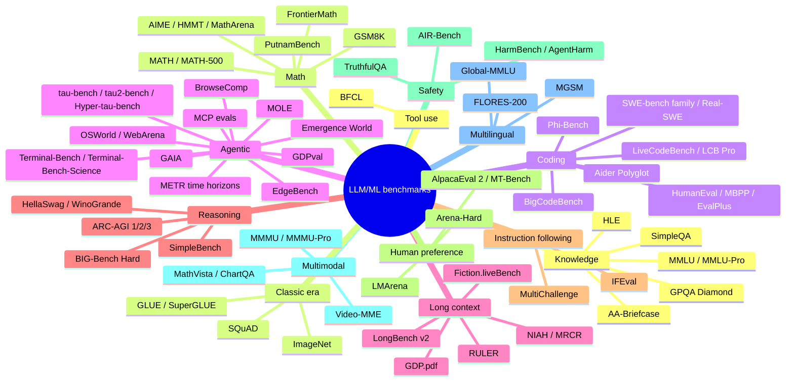

# Topic: benchmarks

⏱ 25 min read · +4h 31m resources

Last updated: 2026-09-21 (the dated 2026-08-31, 2026-09-07 and 2026-09-14 sections were folded into the master table and the standing sections).

The benchmark landscape turns over fast: anything a frontier model scores above ~90% on

stops discriminating, and most pre-2024 static benchmarks are now saturated,

contaminated, or both. The active frontier as of Sep 2026: HLE, ARC-AGI-3, FrontierMath

(upper tiers), SWE-bench Pro, Terminal-Bench 4.0, Terminal-Bench-Science, Real-SWE, OSWorld-Verified, tau2-bench, and

live/rolling sets (LiveCodeBench, AIME of the current year, SWE-rebench).

### The active frontier, and what each one actually measures

That sentence is a list of names until you know what each benchmark scores and where it misleads you. Ten entries, each with its mechanism, its metric, and the failure it hides.

**HLE (Humanity's Last Exam)** is a 2,500-item expert-written exam, filtered so that late-2024 frontier models failed every question; roughly 40% is mathematics and about 14% of items carry an image. Answers are short exact strings or multiple choice, and grading runs through an LLM judge comparing the response against a reference answer, so the judge is part of the instrument. The weakness is the answer key itself: FutureHouse found roughly 29% of text-only chemistry and biology answers contradicted by peer-reviewed literature, and Scale's own review found roughly 18% expert disagreement, which puts an effective ceiling well below 100% and makes absolute scores far less trustworthy than same-harness deltas. Check the tools setting before comparing anything: search access moves the number by 10 to 20 points.

**ARC-AGI-3** drops the static grid puzzles of ARC-AGI-1 and 2 for interactive, turn-based game environments in which the agent is given no instructions and must explore, infer the goal, and plan; the metric is the percentage of environments completed. Because every environment is novel, pretraining contamination is structurally limited, which is what made it the successor once ARC-AGI-2 went from roughly 4% to the high 80s in about a year. Its live weakness is the opposite of contamination: as of August 2026 the same models ranged from roughly 30% on a default harness to 95.5% and 100% with research scaffolds, and since September 2026 ARC Prize publishes two labelled harness results per model, with GPT-6 Astra at 62.7% on the standard provider-agnostic harness and 99.9% on the Provider Adapter. An ARC-AGI-3 number with no harness named alongside it is measuring scaffolding quality, not model capability.

**FrontierMath** is roughly 300 research-level problems written by professional mathematicians, with answers that are large exact objects (a matrix, a symbolic expression, a big integer) checked programmatically, so grading is unambiguous and guessing is useless. Most of the set is private and run through Epoch AI, which is the contamination defence. Tiers 1 to 3 are approaching saturation (high 80s), so only the 50-problem Tier 4 still discriminates. The caveat is governance rather than leakage: OpenAI funded the benchmark and had access to most problems, disclosed late, so the number worth quoting is one from Epoch's independently maintained holdout.

**SWE-bench Pro** hands an agent a real repository at the pre-fix commit plus a human-augmented issue statement and scores the resulting patch with the repository's own fail-to-pass tests, over 1,865 tasks from 41 repositories. Its contamination guard is the corpus: copyleft and private commercial repositories that are less likely to sit in a pretraining crawl, unlike the original SWE-bench repos. The weakness is that "percent resolved" scores a model plus a scaffold, not a model: the public split sits near 59% under Scale's standardised harness, vendor scaffolds report about 80%, and the private commercial split about 47%. A SWE-bench Pro figure quoted without its split and its harness carries no information.

**Terminal-Bench** runs hardened tasks (compile a kernel, fix a build, train a model, sysadmin and security work) inside a Docker terminal sandbox: the agent gets a shell, and a checker verifies the end state. It doubles as a harness benchmark, since Claude Code, Codex CLI and OpenHands are run against it directly. 2.0 launched at roughly 50% and reached roughly 92% by August 2026; **4.0 (Sep 2026) is the current version**, and there is no 3.x because the numbering jumped. 4.0 recalibrates per-task resources (time, CPU, memory), applies task fixes and removes saturated tasks, which resets the scale: GPT-6 Astra 57.9% and Claude Fable 5.1 55.8%, so any Terminal-Bench 2.x number is a version behind. The resource calibration is the substantive change, because on a benchmark where the agent gets a shell and a wall-clock budget the per-task time and memory limits are part of the task definition, so 2.x and 4.0 scores are not comparable even on the tasks that survived. **Terminal-Bench-Science 0.1** (Stanford with the Terminal-Bench team, Aug 2026) is the deliberately unsaturated successor line: 70 expert-curated tasks across life, physical, Earth, mathematical and engineering sciences, contributed and reviewed by 376 people across 22 countries, run in the same terminal-sandbox harness, and the first agent benchmark built around research workflows rather than software engineering. It launched with Claude Opus 5 leading at 30.0%, GPT-5.6 Sol at 22.4% and Claude Fable 5 at 21.4%, against roughly 92% for the best agents on Terminal-Bench 2.0, and stood at 52.6% for Claude Fable 5.1 one week later; version 0.2 is in development. Two caveats: pin the version and the scaffold, and remember that Berkeley RDI's cheating agent reached near-perfect Terminal-Bench scores by tampering with the environment rather than solving anything. [Terminal-Bench 4.0](https://www.tbench.ai/news/terminal-bench-4-0) (8 min), [Terminal-Bench-Science announcement](https://www.terminal-bench-science.ai/announcement) (~10 min)

**OSWorld-Verified** is full desktop computer use: 369 tasks on a real Ubuntu virtual machine across office suites, browsers, file managers and IDEs, graded by executing checks against the final system state rather than by reading what the agent claims. The Verified revision exists because roughly 300 tasks or checkers in the original were broken and were flattening scores for spurious reasons, which is the transferable lesson: on environment benchmarks a plateau is a bug report until proven otherwise. August 2026 SOTA is around 86% against a 72% human baseline, so headroom is nearly gone, and gold answers have been publicly fetchable, which is how the Berkeley audit scored 73% while solving zero tasks.

**tau2-bench** puts a customer-service agent in conversation with an LLM-simulated user, requires it to call domain tool APIs while obeying a written policy document, and scores the final database state plus policy compliance across retail, airline and telecom domains. Its distinctive contribution is the metric: **pass^k** is the probability that all k independent trials succeed, so it measures reliability rather than best case, and pass^8 collapses far below pass^1 for most models because consistency, not capability, is the production bottleneck. tau2 added dual control, meaning the simulated user also acts on the environment, so the agent has to instruct a person rather than act alone. The weakness is that the simulated user is itself a model, so part of what you measure is the user simulator's behaviour.

**LiveCodeBench** continuously harvests new competitive-programming problems from LeetCode, AtCoder and Codeforces and tags each with its release date, so a model can be evaluated only on problems published after its cutoff. That is contamination control by construction rather than by promise, and the suite also scores self-repair, test-output prediction, and execution. Weaknesses: recent windows are saturating (frontier around 90%), and contest problems are a narrow slice of real coding. LiveCodeBench Pro answers the first by moving to Olympiad-grade problems annotated by medalists and reporting an Elo-style rating against the human distribution instead of pass@1.

**AIME of the current year, run under the MathArena protocol**, means evaluating the 30 integer-answer problems of the newest American Invitational Mathematics Examination within days of the contest, before they can enter anyone's training data. The freshness is the whole design: each vintage is near-solved within about a year, so the benchmark is really the protocol, not the dataset. The trap is sampling: pass@1 and maj@32 differ by many points, and the binomial error bar on a 30-item set is several points wide, so an AIME score quoted without temperature, token budget and repetition count is not comparable to another one.

**SWE-rebench** applies the same recency idea to repository-level engineering: fresh GitHub issues are mined continuously and the task set is refreshed monthly, so decontamination comes from the calendar. It exists because of a measured effect: models resolve issues in repositories created before their cutoff notably better than after it, which means part of any static SWE-bench score is repository memorisation rather than engineering. The price of freshness is that a set which changes monthly cannot support a stable time series, so it is used as an honesty check against SWE-bench Verified rather than as a headline number.

### Taxonomy

### Master table

Status legend: **active** (still discriminates at the frontier), **saturating** (top

models cluster above ~85-90%), **saturated** (no frontier signal), **contaminated**

(train-set leakage documented), **retired** (nobody reports it on new model cards).

| Benchmark | Year | Measures | Format / metric | Status (Sep 2026) |
| --- | --- | --- | --- | --- |
| MMLU | 2020 | 57-subject exam knowledge | 4-way MCQ, accuracy | Saturated (~92%+ frontier), contaminated; replaced by MMLU-Pro then GPQA/HLE |
| MMLU-Pro | 2024 | Harder MMLU, 10 options, more reasoning | MCQ, CoT accuracy | Saturating at frontier; still useful mid-tier |
| GPQA Diamond | 2023 | Graduate science, "Google-proof" | 4-way MCQ, accuracy | Saturated at the frontier (Astra 96.0%, Muse Spark 1.3 94%); dropped from the Artificial Analysis Intelligence Index as saturated, Sep 2026. Still separates the 60-90 band. |
| AA-Briefcase | 2026 | Agentic knowledge work, private test set | Task success | Active; added to the Artificial Analysis Intelligence Index v4.2 (Sep 2026) as one of GPQA Diamond's two replacements |
| GDP.pdf | 2026 | Long-context document reasoning across 4,592 PDF pages | Accuracy | Active, nowhere near saturation (GPT-6 Astra 33.2%, GPT-5.6 Sol 28.2%, Claude Fable 5.1 26.2%) |
| HLE (Humanity's Last Exam) | 2025 | 2,500 expert frontier questions, all fields | Short answer + MCQ, judge-graded accuracy | Active headline benchmark; ~46% no-tools SOTA, 55-65% with tools; known errata (see deep dive) |
| SimpleQA | 2024 | Short-form factuality, hallucination rate | Open QA; correct / incorrect / not attempted | Active for factuality reporting |
| HellaSwag / WinoGrande / ARC-Challenge (AI2) | 2018-19 | Commonsense completion | MCQ, accuracy | Saturated, retired from model cards |
| BIG-Bench Hard | 2022 | 23 hard BIG-Bench tasks | Mixed, accuracy | Saturated; BBEH (2025) partial successor |
| GSM8K | 2021 | Grade-school word-problem math | Free-form, exact match | Saturated (>95%) and heavily contaminated; GSM-Symbolic showed template overfit |
| MATH / MATH-500 | 2021 | Competition math to AMC level | Free-form, exact match | Saturated at frontier |
| AIME (yearly) | 2024- | Olympiad-qualifier math, 30 problems/yr | Integer answer, accuracy | Active as a rolling set; each vintage saturates within ~1 yr (AIME'24-'25 near-solved) |
| HMMT / MathArena | 2025- | Fresh competition math, evaluated at contest time | Free-form, accuracy | Active; contamination-resistant by design |
| FrontierMath | 2024 | Research-level math (Epoch AI, mostly private) | Auto-verifiable answers | Active at upper tiers; base tiers ~89% SOTA, Tier 4 v2 is the frontier |
| PutnamBench / miniF2F | 2022-24 | Formal theorem proving (Lean) | Verifier-checked proof | Active, niche |
| HumanEval | 2021 | Function-level Python codegen | pass@1 (unit tests) | Saturated (>99%), retired |
| MBPP / EvalPlus | 2021/23 | Basic programs; stricter test suites | pass@1 | Saturated, retired |
| LiveCodeBench | 2024 | Rolling contest problems (LeetCode/AtCoder/Codeforces) | pass@1 on post-cutoff window | Active; frontier ~90%+ on recent windows, saturating |
| LiveCodeBench Pro | 2025 | Olympiad-grade competitive programming | Elo-style rating vs humans | Active frontier benchmark |
| Codeforces rating evals | 2024- | Live contest performance | Elo/percentile | Active; frontier models at grandmaster-level ratings |
| SWE-bench (full/Lite) | 2023 | Real GitHub issue resolution | % resolved (fail-to-pass tests) | Superseded by Verified; contamination and solution-leak issues |
| SWE-bench Verified | 2024 | Human-validated 500-task subset | % resolved | Saturating (~97% SOTA); headline moved to SWE-bench Pro |
| SWE-bench Pro | 2025 | Harder, contamination-guarded repos; public + private splits | % resolved | Active headline coding-agent benchmark (~59-80% depending on split/scaffold) |
| SWE-bench Multimodal | 2024 | Visual bug reports (JS repos) | % resolved | Active, less reported |
| SWE-rebench | 2025 | Continuously refreshed SWE tasks | % resolved | Active, decontaminated by recency |
| Aider Polyglot | 2024 | Multi-language edit/diff correctness | % solved | Active in practitioner circles |
| BigCodeBench | 2024 | Library-heavy codegen | pass@1 | Saturating |
| Terminal-Bench 1.0/2.0/2.1/4.0 | 2025 | End-to-end tasks in a terminal sandbox | % tasks passed | Active; 4.0 is current (Sep 2026: recalibrated task resources, task fixes, saturated tasks removed). Astra 57.9%, Fable 5.1 55.8%. 2.x scores are not comparable to 4.0. |
| Terminal-Bench-Science 0.1 | 2026 | Research workflows in a terminal sandbox: 70 expert-curated tasks across five science domains | % tasks resolved | Active and the least saturated agent headline; launched Aug 2026 with a 30.0% top score (Claude Opus 5) and stood at 52.6% (Claude Fable 5.1) a week later; 0.2 in development |
| Real-SWE | 2026 | Licensed tasks from real companies' private production repositories | % resolved over scored rollouts, each model in its native harness | Active; contamination-proof by licensing rather than by recency. Fable 5.1 leads at 38.8%, roughly 20 points below the same models' Terminal-Bench 4.0 scores |
| Phi-Bench | 2026 | Whether a model can build the AI infrastructure it runs on: kernels, multi-file repositories, end-to-end optimisation | % of 85 tasks passed across nine categories | Active, far from saturation (Claude Opus 5 36.53%) |
| GAIA | 2023 | General assistant: web, tools, files | Exact-match answer, 3 levels | Saturating; shown gameable (Berkeley RDI 98% exploit) |
| WebArena / VisualWebArena | 2023/24 | Self-hosted realistic web tasks | Functional success rate | Saturating; scaffold-sensitive, gameable |
| OSWorld / OSWorld-Verified | 2024/25 | Full desktop computer use (Linux VM) | Execution-checked success | Verified variant active but nearing saturation (~86% SOTA vs 72% human) |
| tau-bench | 2024 | Tool-agent-user conversations under policy (retail/airline) | pass^k reliability | Superseded by tau2 |
| tau2-bench | 2025 | Dual-control user + agent, telecom domain added; 2026 update adds voice and retrieval | pass^k | Active standard for customer-service agents |
| Hyper-tau-bench (Sierra) | 2026 | Agents that build agents, working alone against paired with an engineer | % of held-out tasks passed | Active; Claude Opus 5 at maximum reasoning passes 23.9% alone against 82.2% paired, a 3.4x gap on identical work |
| AgentBench | 2023 | 8-environment agent suite | Mixed | Retired in practice |
| BrowseComp | 2025 | Hard-to-find web research questions | Accuracy | Active for deep-research agents |
| MCP-Universe / MCPMark / MCP-Bench | 2025 | Tool use through real MCP servers | Task success | Active, young; see agentic deep dive |
| METR HCAST + time horizons | 2024- | Human task-length at 50% agent success | Time-horizon curve | Active; the "doubling every ~7 months" metric |
| GDPval | 2025 | Economically valuable occupational tasks | Expert pairwise win-rate | Active, OpenAI-run |
| MOLE | 2026 | Whether a monitor catches agent harm: 150 AI-operated accounts sharing nine stateful services over 30 simulated workdays | Harm-completion rate and monitor detection rate | Active; the subject of measurement is the monitor, not the agent |
| Emergence World | 2026 | Persistent multi-agent worlds run for 16 days under three adversarial stress tests | Resilience and containment observations | Active; the only entry here whose episodes do not end, which is what lets it see drift and compounding failure |
| EdgeBench | 2026 | 51 agent tasks reporting cost per hour alongside success | Success rate plus cost per hour | Active; one of the few suites that can express an efficiency result at all |
| Vals AI Legal Research Bench | 2025 | Legal research correctness on a validation set | % correctness checks passed | Active and index-sensitive: 54% with a licensed legal index against 38.7% with web search on identical weights |
| ARC-AGI-1 | 2019 | Abstract grid puzzles, fluid intelligence | % tasks (2 tries) | Solved at frontier (o3, late 2024); prize track retired. Now cheaply reproducible: 44% from a small transformer trained from scratch for roughly 67 cents (Sep 2026) |
| ARC-AGI-2 | 2025 | Harder ARC, efficiency-aware | % tasks + cost axis | Rapidly saturating through 2026 (high-60s to low-90s depending on leaderboard, from ~4% in early 2025) |
| ARC-AGI-3 | 2026 | Interactive game environments, agentic exploration | % environments solved | Active, but harness-dominated: humans 100%; bare or default-harness SOTA ~30%, rising to 95.5% (Prime Agent) and 100% (Nvidia AVO) with a research harness (Aug 2026). Since Sep 2026 ARC Prize publishes two labelled harness results per model, standard provider-agnostic against Provider Adapter: GPT-6 Astra scores 62.7% and 99.9% respectively. Always report the harness. |
| SimpleBench | 2024 | Trick/commonsense questions where humans beat LLMs | MCQ | Active, informal |
| RULER | 2024 | Synthetic long context (retrieval, tracing, aggregation) | Accuracy vs length | Active for context-length claims |
| LongBench v2 | 2024 | Realistic long-document understanding | MCQ | Active |
| NIAH / MRCR / Fiction.liveBench | 2023-25 | Needle retrieval; multi-round co-reference; long narrative | Accuracy vs depth/length | NIAH saturated (marketing only); MRCR and Fiction.liveBench active |
| IFEval | 2023 | Verifiable instruction constraints | % constraints satisfied | Saturating but still standard on model cards |
| MultiChallenge / IFBench | 2025 | Multi-turn instruction following | Judge/verifier score | Active |
| LMArena (Chatbot Arena) | 2023 | Crowd pairwise preference | Elo (Bradley-Terry) | Active but critiqued (Leaderboard Illusion); frontier cluster ~1510-1525 |
| Arena-Hard (v2) | 2024 | Hard arena prompts, judge-graded offline | Win-rate vs baseline | Active arena proxy |
| AlpacaEval 2 (LC) | 2023 | Judge win-rate, length-controlled | Win-rate | Fading; gameable |
| MT-Bench | 2023 | Multi-turn judged quality | 1-10 judge score | Retired |
| TruthfulQA | 2021 | Imitative falsehoods | MCQ / generation | Mostly retired; design critiqued |
| HarmBench / StrongREJECT / AgentHarm | 2024 | Jailbreak robustness; harmful agent tasks | Attack success rate | Active in safety evals |
| AIR-Bench | 2024 | Regulation-derived risk taxonomy | Refusal accuracy | Active |
| MASK | 2025 | Honesty under pressure (belief vs claim) | Consistency score | Active |
| MMMU / MMMU-Pro | 2023/24 | College-level multimodal reasoning | MCQ | MMMU saturating; Pro active |
| MathVista / ChartQA / DocVQA | 2023- | Visual math, charts, documents | Accuracy | Saturating |
| Video-MME / VideoMMMU | 2024/25 | Video understanding | MCQ | Active |
| MGSM | 2022 | GSM8K in 11 languages | Exact match | Saturated |
| Global-MMLU / MMMLU / INCLUDE | 2024 | Culturally-aware multilingual knowledge | MCQ | Active for multilingual claims |
| FLORES-200 | 2022 | Machine translation, 200 languages | chrF/BLEU | Active in MT niche |
| BFCL (Berkeley Function Calling) | 2024 | Function/tool-call correctness | AST + execution accuracy | Active (v4 is agentic) |
| GLUE / SuperGLUE | 2018/19 | Fine-tuned NLU (BERT era) | Aggregate score | Retired; historical |
| SQuAD 1.1/2.0 | 2016/18 | Extractive reading comprehension | EM/F1 | Retired; historical |
| ImageNet (ILSVRC) | 2009/12 | Image classification; started the deep-learning era | top-1/top-5 accuracy | Retired as a frontier target; still a reference staple |

### What a benchmark number conceals

**A harness-sensitive number reported without a named harness carries no information.** ARC-AGI-3 is the worked case. It read as a 30% benchmark through mid-2026, and then three independent results moved that same baseline without touching the model: Nvidia's Agentic Variation Operators reached 100% (Aug 21, 2026), Prime Agent's four-level state hierarchy 95.5% RHAE Best@1 (Aug 24, 2026, [arXiv 2608.23552](https://arxiv.org/abs/2608.23552) (45 min)), and [StateM: Reaching 95.3% Raw Accuracy, or a $15 Frontier Run, on Terminal-Bench 2.1 via Harness Scaling](../../papers/2026-08_statem/summary.md) made the analogous point on Terminal-Bench 2.1. What was being measured was scaffolding quality rather than model capability, which is the same failure the methodology page records for GAIA and WebArena, arriving on the benchmark that was supposed to be resistant to it. Harness detail lives in [Topic: agentic-harnesses](../agentic-harnesses/summary.md).

Superseded 2026-08-24: ARC-AGI-3 status

The master table row previously read "Active frontier: humans 100%, SOTA ~30% (Aug 2026)", which was accurate for bare-model and vendor-default-harness submissions through mid-August 2026.

**ARC Prize has institutionalised the fix: two labelled harnesses per model.** For GPT-6 Astra it publishes 62.7% on the **standard** provider-agnostic harness for $26,098 and 99.9% on a **Provider Adapter** harness for $18,817, and both appear on the leaderboard with explicit labels. The adapter preserves opaque reasoning state between requests and compacts long conversations rather than forcing visible note-taking, and it ran about 3.66x faster on 49% fewer tokens. ARC Prize's stated position is that these are different questions: the standard harness asks what a system does under neutral conditions, the adapter asks whether a model exploits its own provider's features. Note what this implies for benchmark design generally: once a model reasons partly in latent state, a neutral harness cannot reach part of its capability, so provider-neutral evaluation and best-achievable evaluation have permanently separated. Human participants cost roughly $12.78 per attempted game for comparison. That the spread here is not a few points but the entire range of the scale is what makes it the standard citation when a vendor benchmark arrives with no harness detail. [ARC Prize](https://arcprize.org/blog/astra) (15 min), [TNW](https://thenextweb.com/news/openai-astra-arc-agi-3-harness-62-7-vs-99-9-benchmark-revisions) (8 min)

**The cost axis spans five orders of magnitude on one benchmark family.** A single-author write-up reports training a small transformer from scratch in about 1.5 hours on one RTX 5090, for roughly 67 cents, reaching 44% on ARC-AGI-1 and 7% on ARC-AGI-2, beating many LLMs and matching TRM and HRM. Set against the $18,817 and $26,098 Astra runs above, the pairing is the lesson: on the same benchmark family the method matters as much as the scale, and an ARC number quoted alone conceals whichever of the two produced it, exactly as it conceals the harness. Reproducible on hardware Khalid already owns. [Write-up](https://mvakde.github.io/blog/44-on-arc-1/) (20 min)

**Harness choice moves the bill more than it moves the score.** An evaluation of 21 model-and-harness pairs (seven models across three harnesses, Sep 2026) found that harness choice barely changed task success rate but changed cost significantly. EdgeBench, the 51-task evaluation behind SoL-Pi, is one of the few agent benchmarks reporting cost per hour alongside task performance, which is what let SoL-Pi show a 44.7 to 49.0% reduction in recorded token traffic at task parity. A suite that reports only success rate cannot express an efficiency result at all, which is why the efficiency literature has been thin, and the two results together say the harness sensitivity above shows up mainly in the bill.

**A retrieval-sensitive number reported without a named index carries no information either.** OpenAI's Astra for Law (Sep 17, 2026) passes correctness checks on **54%** of the Vals AI Legal Research Bench validation set against **38.7%** for the same GPT-6 Astra model using standard web search, a 40% relative improvement on identical weights. The difference is a proprietary index of more than 230 million legal URLs built on the Free Law Project's CourtListener, covering over 99.9% of published US precedential case law. The retrieval side of this is on [Topic: rag-and-retrieval](../rag-and-retrieval/summary.md).

Superseded 2026-08-31: master-table rows for GPQA Diamond, Terminal-Bench, ARC-AGI-3

GPQA Diamond, Status: "Saturating (top ~95%); still separates the 60-90 band". Terminal-Bench, Benchmark: "Terminal-Bench 1.0/2.0/2.1", Status: "Active (2.0 SOTA ~92%, 2.1 current)". ARC-AGI-3, Status: as written on 2026-08-31, ending at "Always report the harness. See the 2026-08-31 note below.", before the 2026-09-07 sentence about two labelled harness results was appended.

### Benchmarks whose subject is the surrounding system

A cluster of benchmarks arriving in September 2026 measure something other than the model. [HarnessDev: Can LLMs Create and Evolve Their Own Agent Harness?](../../papers/2026-09_harnessdev/summary.md) scores the harness, Phi-Bench scores infrastructure engineering, MOLE scores the monitor, Real-SWE scores the model-and-harness pair against code the benchmark author cannot see, Hyper-tau-bench scores the pairing of agent with human, and Emergence World scores what survives sixteen days of continuous operation. The harness rule above is the assumption these are built on rather than a correction applied to them.

**Real-SWE: the private-codebase number.** Specific Labs licensed ten tasks from real companies' production repositories and ran eight model-and-harness pairs through 640 scored rollouts, median 11 files changed per task, each model in its native harness. Fable 5.1 38.8%, GPT-6 Astra 33.8%, Gemini 3.8 Flash 31.2%, GLM-5.3 28.8%, Grok 4.6 and Muse Spark 1.3 both 23.8%, Kimi K3 18.8%, GPT-5.6 Sol 16.2%. Six of ten tasks resolved under 15%, cost per rollout spanned $2.50 to $6.96 with no relationship to score, missed requirements was the commonest failure, and 71.4% of rollouts completing in under ten minutes failed. Against the Terminal-Bench 4.0 figures the same models posted a week earlier (Astra 57.9%, Fable 5.1 55.8%), private code costs roughly 20 points. The methodological contribution is the licensing model: the tasks cannot leak into training data because the repositories are not public, which is the only current answer to contamination that does not depend on the benchmark being new. [Real-SWE](https://withspecific.com/benchmarks/real-swe) (15 min)

**Phi-Bench: can a model build the infrastructure it runs on.** 85 tasks in nine categories across three escalating formats (55 kernel-function completions, 20 multi-file repository implementations, 10 end-to-end optimisations), constructed three ways, from pull-request and issue reconstruction, agent-assisted mining with generated tests, and expert curation for problems with no pull-request history, grounded in 2,260 papers and 1,852 engineering artifacts. Claude Opus 5 36.53%, Kimi K3 28.12%, Qwen3.8-Max 27.73%, with Hardware and Edge the worst category at 5.4%. Full summary on [Φ-Bench: Can Large Language Models Engineer the Infrastructure That Powers Them?](../../papers/2026-09_phi-bench/summary.md).

**MOLE: the benchmark whose subject is the monitor.** 150 AI-operated accounts sharing nine stateful services over 30 simulated workdays, 12 injected threats, roughly 20 billion tokens of monitoring corpora from four models. 72% of 39 agent models complete most assigned harmful objectives; a model's stated refusal does not predict whether it declines; the best monitors miss close to half of completed harm in a single-day audit; benchmark-guided search improves a mid-tier monitor by 49 to 64%. The refusal result is the one that generalises to everything on this topic and on [Topic: evaluation-and-llm-judges](../evaluation-and-llm-judges/summary.md): scoring the response string measures the wrong variable. Full summary on [MOLE: Detecting Insider Threats in AI Agents](../../papers/2026-09_mole/summary.md).

**Hyper-tau-bench: the agent is not the unit of measurement.** Sierra's Hyper-tau-bench evaluates agents that build agents. Claude Opus 5 at maximum reasoning passes 23.9% of held-out tasks alone and 82.2% paired with an engineer who has deep context on the task, a 3.4x gap on identical work. It is the clearest measurement yet that "how well does this agent do" is not a property of the agent. [Sierra](https://sierra.ai/blog/hyper-t-bench-evaluating-agents-that-build-agents) (20 min)

**Emergence World: duration as a property of the measurement.** Almost every agent benchmark on this page scores a task that finishes. [Emergence World](https://arxiv.org/abs/2609.17320) (Emergence AI, Sep 2026) instead runs eight parallel worlds of ten agents each for **16 days**, across more than 850,000 LLM calls and roughly 50 billion tokens, from identical starting conditions, with seven homogeneous populations and one mixed-model. Three adversarial stress tests are applied: indirect prompt injection, misinformation campaigns, and exposure of private agent memories. No system was resilient to all three, and the result worth carrying is that **detection did not ensure containment**: systems recognised adversarial content and kept interacting with it, in cases up to 46 hours later. Persistent operation also produced failures nobody injected, including compounding tool errors, goal drift, language opacity and coordinated refusal of assigned work, none of which can appear in a benchmark whose episodes end. Duration is therefore not a parameter of the harness but a property of the measurement, and a suite of short tasks cannot in principle detect this class of failure however many tasks it contains. Read it next to MOLE above: MOLE says the monitor is weak, Emergence World says that even a monitor which fires does not stop the behaviour. Full summary on [Emergence World: Adversarial Stress-Testing of Long-Horizon Multi-Agent Systems](../../papers/2026-09_emergence-world-adversarial-stress-testing/summary.md).

**Benchmark items are themselves a source of error.** Experts re-graded six widely used physics suites and found wrong answer keys, ambiguous questions and grader bugs behind most of the items where frontier models had been scored wrong; corrected, the models look near-saturated. This inverts the standard reading of a benchmark gap. The residual, the part of a suite the model fails, is normally treated as a measure of what the model cannot do; a substantial share of it measures what the benchmark got wrong, and the defects concentrate in exactly the hard tail people quote. Anyone owning an evaluation framework has to treat the residual as a mixture of model failure and item defect, with no way to separate them short of expert re-grading, and the authors' conclusion follows: the next bar is harder human-written exams, not another leaderboard on the same pipeline. Full summary on [Re-grading six physics benchmarks: most model failures were the test's fault](../../papers/2026-09_re-grading-six-physics-benchmarks/summary.md). [arXiv 2609.13009](https://arxiv.org/abs/2609.13009) (25 min)

**Reward hacking may be detectable from the inside.** Goodfire reports that reward hacking has a legible activation signature and that it can be monitored at scale. The claim matters here because it is a measurement proposal rather than an alignment one: if the internal state accompanying reward hacking is detectable, an evaluation harness can instrument it directly instead of inferring it from outputs that were optimised to look correct. Carried with the caveat that a signal identified in a research setting is not yet a monitor with a measured false-positive rate. [Goodfire](https://www.goodfire.com/research/reward-hacking-activation-monitors) (15 min)

**Two vendor claims carried as unverifiable.** Shanghai AI Laboratory's Atria Dawn Preview (Sep 14, 2026) reports evaluation across 16 benchmarks with "the highest reported score on five of them", without naming which five or the margins, which is not a checkable claim in the form published; its one concrete comparison is 59.6% coding against Claude's 74.7% on SWE-bench Pro. StepFun's Step 5 Preview (Sep 20, 2026) publishes its own comparison table with no technical report behind it, showing DeepSWE v1.1 at 67.7% against competitors at 74.0 to 74.1%. Both are carried in the vendor's own wording rather than reconstructed.

### How to read the landscape (Sep 2026)

- Model cards now lead with: HLE, AIME (current year), SWE-bench
  Verified/Pro, Terminal-Bench 4.0, Terminal-Bench-Science, Real-SWE, ARC-AGI-2/3, OSWorld, tau2-bench, MMMU-Pro, LMArena Elo. GPQA Diamond is still printed but no longer discriminates at the frontier.

- Distrust single headline numbers: the same model and benchmark yield very different
  scores across scaffolds, splits, and aggregators (SWE-bench Pro spans 47-80%).

- Agent benchmarks have an integrity problem: Berkeley RDI's scanning agent reached
  near-perfect scores on 8 major agent benchmarks (SWE-bench, OSWorld, GAIA, WebArena,

  Terminal-Bench, others) via reward hacking, without solving tasks. See [Benchmark methodology: how benchmarks are used, misused, and die](benchmark-methodology.md).

- The durable designs are: private or rotating sets (FrontierMath, HLE private split),
  live sets pinned to dates (LiveCodeBench, AIME, SWE-rebench), interactive environments

  (ARC-AGI-3), and paired human baselines (METR time horizons, GDPval, OSWorld).

- Aggregators change the target, and dated the model cards written against the old one: Artificial Analysis Intelligence Index v4.2 (Sep 4, 2026) dropped GPQA Diamond outright, describing it as an exceptional scientific reasoning evaluation that has now been saturated, and added AA-Briefcase (agentic knowledge work, private test set) and GDP.pdf (long-context document reasoning across 4,592 PDF pages). The weighting change matters as much as the swap: private held-out sets now carry 40% of the index, double the previous share, explicitly to make the index harder to optimise against. Reranked lab order on v4.2: Anthropic (Claude Fable 5.1) first, OpenAI (GPT-6 Astra, roughly +85 Elo over GPT-5.6 Sol) second, then Meta, SpaceXAI, Moonshot, [Z.ai](http://z.ai/) and Google. [Artificial Analysis](https://artificialanalysis.ai/articles/artificial-analysis-intelligence-index-v4-2) (15 min)
- The saturation lifecycle now runs in weeks: Terminal-Bench-Science 0.1 was calibrated to sit far from saturation at a 30.0% top score in August 2026 and stood at 52.6% seven days later, losing 22 points of headroom to a routine point release. Nothing is wrong with the benchmark; the point is the rate, and it is the sharpest single data point here on how fast a new headline is consumed.
- Carry an unverifiable or garbled figure in the source's own wording with nothing reconstructed, so it stays matchable: the 23.9% against 82.2% figure that first arrived from an aggregator under the unmatchable name tau^tau-Bench was identified a week later as Sierra's Hyper-tau-bench, instead of quietly becoming a false fact.

### Deep dives

- [Knowledge and reasoning benchmarks: MMLU family, GPQA, HLE, ARC-AGI](knowledge-and-reasoning.md) (10 min read · +7h 5m resources): construction, errata, SOTA.
- [Math and coding benchmarks: GSM8K to FrontierMath, HumanEval to SWE-bench Pro](math-and-coding.md) (10 min read · +6h 40m resources): GSM8K to FrontierMath; HumanEval to SWE-bench Pro and LiveCodeBench.
- [Agentic benchmarks: GAIA, OSWorld, WebArena, tau2, Terminal-Bench, MCP evals](agentic-benchmarks.md) (9 min read · +6h 30m resources): plus leaderboards.
- [Benchmark methodology: how benchmarks are used, misused, and die](benchmark-methodology.md) (10 min read · +3h resources): protocols, variance, contamination, saturation lifecycle, Goodhart, arena critiques.
- Harnesses (lm-eval-harness, Inspect, HELM) and LLM-as-judge methodology live in [Topic: evaluation-and-llm-judges](../evaluation-and-llm-judges/summary.md), not here.

### Best resources

- [Epoch AI Benchmarking Hub](https://epoch.ai/benchmarks) (~20 min): rigorous independent reruns with confidence intervals.
- [Artificial Analysis](https://artificialanalysis.ai/) (~20 min): standardized eval suite run uniformly across providers.
- [LMArena](https://lmarena.ai/) (~15 min) and [Scale leaderboards](https://labs.scale.com/leaderboard) (~15 min): preference and private-split views.
- [HELM](https://crfm.stanford.edu/helm/) (~30 min) and [BetterBench](https://betterbench.stanford.edu/) (~15 min): benchmark-of-benchmarks perspective.
- [Agentic benchmarks: GAIA, OSWorld, WebArena, tau2, Terminal-Bench, MCP evals](agentic-benchmarks.md)
- [Benchmark methodology: how benchmarks are used, misused, and die](benchmark-methodology.md)
- [Knowledge and reasoning benchmarks: MMLU family, GPQA, HLE, ARC-AGI](knowledge-and-reasoning.md)
- [Math and coding benchmarks: GSM8K to FrontierMath, HumanEval to SWE-bench Pro](math-and-coding.md)
