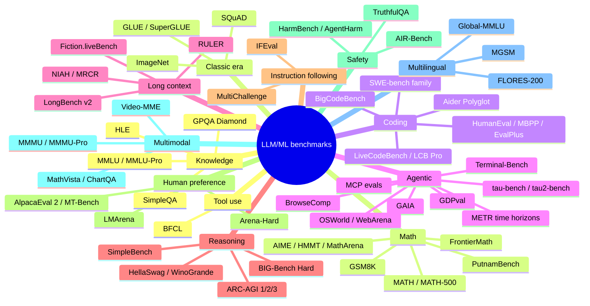

# Benchmarks: taxonomy of what LLM/ML benchmarks measure

Last updated: 2026-08-24.

The benchmark landscape turns over fast: anything a frontier model scores above ~90% on
stops discriminating, and most pre-2024 static benchmarks are now saturated,
contaminated, or both. The active frontier as of Aug 2026: HLE, ARC-AGI-3, FrontierMath
(upper tiers), SWE-bench Pro, Terminal-Bench 2.x, OSWorld-Verified, tau2-bench, and
live/rolling sets (LiveCodeBench, AIME of the current year, SWE-rebench).

## Taxonomy

## Master table

Status legend: **active** (still discriminates at the frontier), **saturating** (top
models cluster above ~85-90%), **saturated** (no frontier signal), **contaminated**
(train-set leakage documented), **retired** (nobody reports it on new model cards).

| Benchmark | Year | Measures | Format / metric | Status (Aug 2026) |
|---|---|---|---|---|
| MMLU | 2020 | 57-subject exam knowledge | 4-way MCQ, accuracy | Saturated (~92%+ frontier), contaminated; replaced by MMLU-Pro then GPQA/HLE |
| MMLU-Pro | 2024 | Harder MMLU, 10 options, more reasoning | MCQ, CoT accuracy | Saturating at frontier; still useful mid-tier |
| GPQA Diamond | 2023 | Graduate science, "Google-proof" | 4-way MCQ, accuracy | Saturating (top ~95%); still separates the 60-90 band |
| HLE (Humanity's Last Exam) | 2025 | 2,500 expert frontier questions, all fields | Short answer + MCQ, judge-graded accuracy | Active headline benchmark; ~46% no-tools SOTA, 55-65% with tools; known errata (see deep dive) |
| SimpleQA | 2024 | Short-form factuality, hallucination rate | Open QA; correct / incorrect / not attempted | Active for factuality reporting |
| HellaSwag / WinoGrande / ARC-Challenge (AI2) | 2018-19 | Commonsense completion | MCQ, accuracy | Saturated, retired from model cards |
| BIG-Bench Hard | 2022 | 23 hard BIG-Bench tasks | Mixed, accuracy | Saturated; BBEH (2025) partial successor |
| GSM8K | 2021 | Grade-school word-problem math | Free-form, exact match | Saturated (>95%) and heavily contaminated; GSM-Symbolic showed template overfit |
| MATH / MATH-500 | 2021 | Competition math to AMC level | Free-form, exact match | Saturated at frontier |
| AIME (yearly) | 2024- | Olympiad-qualifier math, 30 problems/yr | Integer answer, accuracy | Active as a rolling set; each vintage saturates within ~1 yr (AIME'24-'25 near-solved) |
| HMMT / MathArena | 2025- | Fresh competition math, evaluated at contest time | Free-form, accuracy | Active; contamination-resistant by design |
| FrontierMath | 2024 | Research-level math (Epoch AI, mostly private) | Auto-verifiable answers | Active at upper tiers; base tiers ~89% SOTA, Tier 4 v2 is the frontier |
| PutnamBench / miniF2F | 2022-24 | Formal theorem proving (Lean) | Verifier-checked proof | Active, niche |
| HumanEval | 2021 | Function-level Python codegen | pass@1 (unit tests) | Saturated (>99%), retired |
| MBPP / EvalPlus | 2021/23 | Basic programs; stricter test suites | pass@1 | Saturated, retired |
| LiveCodeBench | 2024 | Rolling contest problems (LeetCode/AtCoder/Codeforces) | pass@1 on post-cutoff window | Active; frontier ~90%+ on recent windows, saturating |
| LiveCodeBench Pro | 2025 | Olympiad-grade competitive programming | Elo-style rating vs humans | Active frontier benchmark |
| Codeforces rating evals | 2024- | Live contest performance | Elo/percentile | Active; frontier models at grandmaster-level ratings |
| SWE-bench (full/Lite) | 2023 | Real GitHub issue resolution | % resolved (fail-to-pass tests) | Superseded by Verified; contamination and solution-leak issues |
| SWE-bench Verified | 2024 | Human-validated 500-task subset | % resolved | Saturating (~97% SOTA); headline moved to SWE-bench Pro |
| SWE-bench Pro | 2025 | Harder, contamination-guarded repos; public + private splits | % resolved | Active headline coding-agent benchmark (~59-80% depending on split/scaffold) |
| SWE-bench Multimodal | 2024 | Visual bug reports (JS repos) | % resolved | Active, less reported |
| SWE-rebench | 2025 | Continuously refreshed SWE tasks | % resolved | Active, decontaminated by recency |
| Aider Polyglot | 2024 | Multi-language edit/diff correctness | % solved | Active in practitioner circles |
| BigCodeBench | 2024 | Library-heavy codegen | pass@1 | Saturating |
| Terminal-Bench 1.0/2.0/2.1 | 2025 | End-to-end tasks in a terminal sandbox | % tasks passed | Active (2.0 SOTA ~92%, 2.1 current) |
| GAIA | 2023 | General assistant: web, tools, files | Exact-match answer, 3 levels | Saturating; shown gameable (Berkeley RDI 98% exploit) |
| WebArena / VisualWebArena | 2023/24 | Self-hosted realistic web tasks | Functional success rate | Saturating; scaffold-sensitive, gameable |
| OSWorld / OSWorld-Verified | 2024/25 | Full desktop computer use (Linux VM) | Execution-checked success | Verified variant active but nearing saturation (~86% SOTA vs 72% human) |
| tau-bench | 2024 | Tool-agent-user conversations under policy (retail/airline) | pass^k reliability | Superseded by tau2 |
| tau2-bench | 2025 | Dual-control user + agent, telecom domain added; 2026 update adds voice and retrieval | pass^k | Active standard for customer-service agents |
| AgentBench | 2023 | 8-environment agent suite | Mixed | Retired in practice |
| BrowseComp | 2025 | Hard-to-find web research questions | Accuracy | Active for deep-research agents |
| MCP-Universe / MCPMark / MCP-Bench | 2025 | Tool use through real MCP servers | Task success | Active, young; see agentic deep dive |
| METR HCAST + time horizons | 2024- | Human task-length at 50% agent success | Time-horizon curve | Active; the "doubling every ~7 months" metric |
| GDPval | 2025 | Economically valuable occupational tasks | Expert pairwise win-rate | Active, OpenAI-run |
| ARC-AGI-1 | 2019 | Abstract grid puzzles, fluid intelligence | % tasks (2 tries) | Solved at frontier (o3, late 2024); prize track retired |
| ARC-AGI-2 | 2025 | Harder ARC, efficiency-aware | % tasks + cost axis | Rapidly saturating through 2026 (high-60s to low-90s depending on leaderboard, from ~4% in early 2025) |
| ARC-AGI-3 | 2026 | Interactive game environments, agentic exploration | % environments solved | Active frontier: humans 100%, SOTA ~30% (Aug 2026) |
| SimpleBench | 2024 | Trick/commonsense questions where humans beat LLMs | MCQ | Active, informal |
| RULER | 2024 | Synthetic long context (retrieval, tracing, aggregation) | Accuracy vs length | Active for context-length claims |
| LongBench v2 | 2024 | Realistic long-document understanding | MCQ | Active |
| NIAH / MRCR / Fiction.liveBench | 2023-25 | Needle retrieval; multi-round co-reference; long narrative | Accuracy vs depth/length | NIAH saturated (marketing only); MRCR and Fiction.liveBench active |
| IFEval | 2023 | Verifiable instruction constraints | % constraints satisfied | Saturating but still standard on model cards |
| MultiChallenge / IFBench | 2025 | Multi-turn instruction following | Judge/verifier score | Active |
| LMArena (Chatbot Arena) | 2023 | Crowd pairwise preference | Elo (Bradley-Terry) | Active but critiqued (Leaderboard Illusion); frontier cluster ~1510-1525 |
| Arena-Hard (v2) | 2024 | Hard arena prompts, judge-graded offline | Win-rate vs baseline | Active arena proxy |
| AlpacaEval 2 (LC) | 2023 | Judge win-rate, length-controlled | Win-rate | Fading; gameable |
| MT-Bench | 2023 | Multi-turn judged quality | 1-10 judge score | Retired |
| TruthfulQA | 2021 | Imitative falsehoods | MCQ / generation | Mostly retired; design critiqued |
| HarmBench / StrongREJECT / AgentHarm | 2024 | Jailbreak robustness; harmful agent tasks | Attack success rate | Active in safety evals |
| AIR-Bench | 2024 | Regulation-derived risk taxonomy | Refusal accuracy | Active |
| MASK | 2025 | Honesty under pressure (belief vs claim) | Consistency score | Active |
| MMMU / MMMU-Pro | 2023/24 | College-level multimodal reasoning | MCQ | MMMU saturating; Pro active |
| MathVista / ChartQA / DocVQA | 2023- | Visual math, charts, documents | Accuracy | Saturating |
| Video-MME / VideoMMMU | 2024/25 | Video understanding | MCQ | Active |
| MGSM | 2022 | GSM8K in 11 languages | Exact match | Saturated |
| Global-MMLU / MMMLU / INCLUDE | 2024 | Culturally-aware multilingual knowledge | MCQ | Active for multilingual claims |
| FLORES-200 | 2022 | Machine translation, 200 languages | chrF/BLEU | Active in MT niche |
| BFCL (Berkeley Function Calling) | 2024 | Function/tool-call correctness | AST + execution accuracy | Active (v4 is agentic) |
| GLUE / SuperGLUE | 2018/19 | Fine-tuned NLU (BERT era) | Aggregate score | Retired; historical |
| SQuAD 1.1/2.0 | 2016/18 | Extractive reading comprehension | EM/F1 | Retired; historical |
| ImageNet (ILSVRC) | 2009/12 | Image classification; started the deep-learning era | top-1/top-5 accuracy | Retired as a frontier target; still a reference staple |

## How to read the landscape (Aug 2026)

- Model cards now lead with: HLE, GPQA Diamond, AIME (current year), SWE-bench
  Verified/Pro, Terminal-Bench, ARC-AGI-2/3, OSWorld, tau2-bench, MMMU-Pro, LMArena Elo.
- Distrust single headline numbers: the same model and benchmark yield very different
  scores across scaffolds, splits, and aggregators (SWE-bench Pro spans 47-80%).
- Agent benchmarks have an integrity problem: Berkeley RDI's scanning agent reached
  near-perfect scores on 8 major agent benchmarks (SWE-bench, OSWorld, GAIA, WebArena,
  Terminal-Bench, others) via reward hacking, without solving tasks. See methodology file.
- The durable designs are: private or rotating sets (FrontierMath, HLE private split),
  live sets pinned to dates (LiveCodeBench, AIME, SWE-rebench), interactive environments
  (ARC-AGI-3), and paired human baselines (METR time horizons, GDPval, OSWorld).

## Deep dives

- [knowledge-and-reasoning.md](knowledge-and-reasoning.md): MMLU family, GPQA, HLE, ARC-AGI: construction, errata, SOTA.
- [math-and-coding.md](math-and-coding.md): GSM8K to FrontierMath; HumanEval to SWE-bench Pro and LiveCodeBench.
- [agentic-benchmarks.md](agentic-benchmarks.md): GAIA, OSWorld, WebArena, tau2, Terminal-Bench, MCP evals, leaderboards.
- [benchmark-methodology.md](benchmark-methodology.md): protocols, variance, contamination, saturation lifecycle, Goodhart, arena critiques.
- Harnesses (lm-eval-harness, Inspect, HELM) and LLM-as-judge methodology live in
  [../evaluation-and-llm-judges/](../evaluation-and-llm-judges/), not here.

## Best resources

- [Epoch AI Benchmarking Hub](https://epoch.ai/benchmarks): rigorous independent reruns with confidence intervals.
- [Artificial Analysis](https://artificialanalysis.ai): standardized eval suite run uniformly across providers.
- [LMArena](https://lmarena.ai) and [Scale leaderboards](https://labs.scale.com/leaderboard): preference and private-split views.
- [HELM](https://crfm.stanford.edu/helm/) and [BetterBench](https://betterbench.stanford.edu/): benchmark-of-benchmarks perspective.
