```mermaid
graph TD
    CUDA["CUDA platform"] --> APIs["APIs"]
    CUDA --> Compiler["Compiler stack"]
    CUDA --> Libs["Libraries"]
    CUDA --> Tools["Profiling and tooling"]
    CUDA --> DSL["Higher-level DSLs"]

    APIs --> Driver["Driver API (cu*): low-level, explicit contexts"]
    APIs --> Runtime["Runtime API (cuda*): what you normally use"]

    Compiler --> NVCC["nvcc: CUDA C++ to PTX/SASS"]
    Compiler --> PTX["PTX (virtual ISA), SASS (real ISA)"]
    Compiler --> NVRTC["NVRTC / JIT"]

    Libs --> BLAS["cuBLAS / cuBLASLt: GEMM"]
    Libs --> DNN["cuDNN: conv, attention, norms"]
    Libs --> CUTLASS["CUTLASS / CuTe: GEMM templates + Python DSL"]
    Libs --> CCCL["Thrust / CUB / libcudacxx (CCCL)"]
    Libs --> NCCL["NCCL: multi-GPU collectives"]

    Tools --> NSys["Nsight Systems: timeline"]
    Tools --> NCU["Nsight Compute: per-kernel"]
    Tools --> CUPTI["CUPTI: profiling API under torch.profiler"]

    DSL --> Triton["Triton: block-level Python DSL"]
    DSL --> Gluon["Gluon: Triton's low-level dialect"]
    DSL --> TorchCompile["torch.compile: emits Triton"]
    DSL --> CuTeDSL["CuTe DSL: Python CUTLASS"]
```

# Topic: cuda-and-gpu-programming

⏱ 9 min read · +23h 13m resources

CUDA is NVIDIA's platform for general-purpose GPU computing: a C++ language extension, a compiler stack, driver and runtime APIs, tuned libraries, and profiling tools. "Writing CUDA" usually means writing kernels in CUDA C++, but most ML performance work spans the whole stack, and four names are worth pinning down first.

**cuBLAS** is NVIDIA's closed-source BLAS, the GEMM that `torch.matmul` actually calls; **cuDNN** is the matching deep-learning kernel library (convolutions, normalisations, and now fused attention), what `F.scaled_dot_product_attention` dispatches to on datacenter GPUs. **Triton** is OpenAI's Python DSL for writing kernels one *block* at a time: you manipulate whole tiles and the compiler decides thread mapping, shared-memory staging, vectorisation and synchronisation, which is why a Triton kernel is roughly a tenth the length of the CUDA equivalent and usually within 0-20% of it. It is also what `torch.compile` emits. **CUTLASS** is NVIDIA's open-source template library of GEMM and attention building blocks that you instantiate and tune yourself, with **CuTe** as its core abstraction: a layout algebra in which one notation (shape plus stride, composable and divisible) describes a global tile, a swizzled shared-memory layout, a thread mapping and a tensor-core operand fragment alike. Hand-written kernels fill the gaps where a fusion or a novel algorithm beats the libraries.

**CUDA Toolkit 13.3** is the latest stable release, with 13.4 in preview. **Triton 3.7** is current, 3.7.1 being the version September 2026 engine releases pin. **CUTLASS 4.x** ships Python DSLs (the **CuTe DSL**), so peak-performance kernels can be prototyped and JIT-compiled from Python rather than fought through C++ template instantiation, and this is how NVIDIA's new example kernels ship. **PMPP** (*Programming Massively Parallel Processors*, Hwu, Kirk and El Hajj) is the standard textbook, 5th edition Feb 2026. **GPU MODE** (formerly CUDA MODE, ~30k members) is the standard learning community: a lecture series that follows PMPP and goes well past it, a Discord where kernel authors answer questions, and a kernel leaderboard of graded practice problems.

Hot Chips 2026 coverage (Aug 24, 2026) included CUDA targeting RISC-V host CPUs, extending the CUDA platform beyond x86 and Arm hosts. [Chips and Cheese](https://chipsandcheese.com/) (15 min)

### Taxonomy

### Map of the space

- **Programming model**: thread, warps, blocks, grids; SIMT; kernel launches, streams,
  occupancy, divergence. The mental model everything else builds on.

  See [The CUDA programming model](cuda-programming-model.md) (8 min read · +8h resources).

- **Memory hierarchy**: registers, shared memory, L2, HBM; coalescing, bank conflicts,
  tiling; arithmetic intensity and the roofline model. Nearly all kernel optimisation is

  memory optimisation. See [GPU memory hierarchy](gpu-memory-hierarchy.md) (8 min read · +5h 40m resources).

- **Writing kernels**: the practical track from naive matmul to tiled and vectorised
  versions, reductions, softmax, fusion; how FlashAttention composes the same ideas.

  See [Writing kernels: the practical track](writing-kernels.md) (8 min read · +9h 45m resources). The far end of fusion is the **megakernel**: Cohere's (Sep 9, 2026) is a single fused decode kernel reaching 292 tokens per second at batch size 1, put at 62% of speed-of-light and 1.58x faster than vLLM, holding through 256K context. Megakernels attack per-kernel launch and scheduling overhead rather than memory traffic, the low-batch counterpart to everything on this page that reduces bytes moved; full treatment on [Topic: inference-and-serving](../inference-and-serving/summary.md). [Cohere](https://cohere.com/blog/megakernels) (30 min)

- **Triton**: block-level kernels in Python, and where it sits versus raw CUDA and
  torch.compile; also **Gluon**, the lower-level dialect inside the Triton repo and

  runtime that re-exposes with Python ergonomics what Triton deliberately hides, for the

  kernels where the compiler's heuristics leave performance behind. See [Triton](triton-language.md) (8 min read · +13h 25m resources).

- **Profiling**: **Nsight Systems** (the whole-program timeline) versus **Nsight Compute**
  (the per-kernel microscope), `torch.profiler`, and **CUPTI** underneath all of them;

  then the ncu metrics that matter, and benchmark methodology that survives scrutiny. See [Profiling and tools](profiling-and-tools.md) (8 min read · +8h 55m resources).

- **Libraries and tensor cores**: CUTLASS/CuTe, cuBLAS and **cuBLASLt** (the
  descriptor-based layer adding heuristic kernel search and epilogue fusion), cuDNN, and

  when to use which. Then the per-generation tensor-core instruction vocabulary that

  makes kernel code and NVIDIA docs readable: **wgmma** (Hopper's asynchronous

  warpgroup-level matrix multiply), **TMA** (the Tensor Memory Accelerator, a DMA engine

  for bulk async tiled copies with hardware swizzling), **tcgen05** and its **TMEM**

  (datacenter Blackwell). And what a consumer RTX 5090 (sm_120) actually exposes, which

  is TMA and clusters but none of wgmma, tcgen05 or TMEM, so Hopper tutorials do not

  literally run on it.

  See [CUTLASS, cuBLAS, cuDNN, and tensor cores](cutlass-and-libraries.md) (8 min read · +17h 15m resources).

Related topics: [Topic: hardware](../hardware/summary.md) for GPU architectures, [Topic: pytorch-ecosystem](../pytorch-ecosystem/summary.md) for torch.compile, [Topic: inference-and-serving](../inference-and-serving/summary.md) for kernels in production.

Paper: [FlashAttention: Fast and Memory-Efficient Exact Attention with IO-Awareness](../../papers/2022-05_flashattention/summary.md) (45 min).

### AMD: ROCm 10.0 and ROCm.AI

**ROCm 10.0** (AMD, released Aug 28, 2026) is the AMD counterpart to the CUDA stack above, and Triton's ROCm backend is how most PyTorch kernels reach it. The version number jumps from 7.14 to 10.0 to mark a decade of the project. AMD reports an average **3.3x inference and 2.4x training uplift over ROCm 7**, from its own July 2026 testing on GLM-5, Kimi-K2.5 and DeepSeek-R1-0528, which is a vendor number on vendor-selected workloads and should be treated as such until independently rerun. Support spans Instinct accelerators, Radeon, Ryzen integrated graphics, Windows and Linux.

**ROCm.AI** is the part worth reading about, in three pieces. The **ROCm CLI** unifies installation, validation, serving and troubleshooting behind one command, including air-gapped environments, which has historically been where ROCm adoption fails rather than at the kernel level. **Hyperloom** profiles, analyses, plans and validates workload optimisations autonomously, with AMD claiming it turns weeks of manual tuning into hours. **AMD Skills** packages validated ROCm knowledge as agent skills for Claude, Cursor and Codex.

AMD Skills is the item that matters beyond a version note. [Demystifying Agent Skills: Why They Work - Until They Don't](../../papers/2026-08_agent-skills/summary.md) established that a `SKILL.md` works as a procedural anchor rather than as knowledge injection, and [Repo-To-Skill: Distilling GitHub Repositories Into AI4AI Skills](../../papers/2026-09_repo-to-skill/summary.md) named what such skills carry **operational knowledge**, the practical know-how of getting a published method to run, which lives in READMEs and issue threads rather than in papers. A hardware vendor has now adopted that format as an official support channel, the first skill library shipped as vendor documentation rather than mined from one. If the pattern holds, the answer to "how do I make this fast on this part" arrives through the harness rather than through a PDF. Read next to Phi-Bench's finding that Hardware and Edge is where frontier models score worst, at 5.4%: the vendor is supplying exactly the operational knowledge that result says is missing. [Phoronix](https://www.phoronix.com/news/AMD-ROCm-10.0) (8 min), [ROCm blog](https://rocm.blogs.amd.com/ecosystems-and-partners/rocm-x-blog/README.html) (20 min)

### CUDA Rust: two tracks into kernel authoring

Nvidia shipped native GPU programming in Rust in September 2026 as **two separate projects with different ambitions**, and the distinction is the thing to hold. This page has CUDA C++ at one end and Triton at the other, where Triton's argument is that you write block-level code and let the compiler own the thread mapping. CUDA Rust reproduces both ends, each with a compile-time memory-safety story.

**cuda-oxide (the SIMT track)** is the CUDA C++ analogue. It is a custom rustc codegen backend: it intercepts compilation, routes `#[kernel]` functions through Rust MIR (mid-level intermediate representation), and emits PTX, using the Pliron IR framework and LLVM. You still think in threads. Safety comes from `DisjointSlice` types plus launch contracts, which make aliasing between concurrently running threads a **compile error** rather than a race to be found in a profiler. Status: early alpha, requiring a pinned nightly toolchain and LLVM.

**cutile-rs (the tile track)** is the Triton analogue. You work with tiles; the compiler decides how tiles map onto each architecture and JIT-compiles through **CUDA Tile IR** when a kernel is first needed. Exclusive access is guaranteed by tensor partitioning plus ordinary Rust ownership rules rather than by a bespoke type. Status: published on crates.io and already in production, in **Hugging Face's Grout inference engine** and in **mistral.rs**.

Both compile the same vector-addition example to the same result, by different safety arguments, which is the cleanest way to see the trade. No performance benchmarks are published and the announcement claims none, so this is a language and toolchain result rather than a speed result. The argument Nvidia makes for the tile track is the one this page already makes for Triton: the source does not encode architecture-specific choices, so the same kernel retargets when the part changes. What is new is that the safety properties are checked by the compiler rather than argued in a comment, which is the first structural answer to the class of kernel bug that shows up only under a specific parallelism strategy, and which is exactly the bug Z.ai's infra agent found by cross-path numerical comparison in September 2026. The announcement drew 968 points on Hacker News. Relevant to [Writing kernels: the practical track](writing-kernels.md) and to [Topic: programming-languages](../programming-languages/summary.md). [NVIDIA](https://developer.nvidia.com/blog/introducing-cuda-rust-two-tracks-for-writing-gpu-kernels/) (20 min)

**A second data point on models doing kernel work.** Dream-RSI (Sep 14, 2026) demonstrates its replay-simulator method in three domains, one of them GPU kernel engineering, reporting competitive or better solution quality at substantially lower discovery cost. Read against Phi-Bench's 5.4% on Hardware and Edge: the gap is not closing through better models so far, it is closing through cheaper search over candidate kernels. Full summary under [Dream-RSI: Recursive Self-Improvement through Evolving Worlds](../../papers/2026-09_dream-rsi-recursive-self-improvement/summary.md).

### Recommended learning path (experienced engineer, new to CUDA)

1. **PMPP (5th ed, Feb 2026), ch. 1-6** (~150 pages, 3h 45m): programming model, memory hierarchy, tiled
   matmul. Do exercises on real hardware: the RTX 5090 is sm_120 (compute capability

   12.0); build with `-arch=sm_120` or `-arch=native` on CUDA 12.8+.

2. **First kernels**: vector add, naive matmul, then work through Simon Boehm's matmul
   worklog (1h 30m to read, a weekend to reproduce) kernel by kernel, reproducing each speedup and predicting the bottleneck

   before the profiler confirms it.

3. **Reductions and softmax** (PMPP ch. 10-11, ~50 pages, 1h 15m, plus Mark Harris's
   classic reduction deck, 45 min): warp shuffles, hierarchical reductions, online softmax.

4. **Triton**: official tutorials 1-3 and 6 (~3h; vector add, softmax, matmul, attention);
   by now you understand what the compiler does for you.

5. **Profiling**: Nsight Compute on your own kernels; lock clocks, cudaEvent timing,
   read the Speed of Light section before anything else.

6. **Fused-kernel project**: pick a real fusion (RMSNorm + matmul epilogue, dequant
   GEMV, or a FlashAttention variant), implement in Triton and CUDA, measure against

   torch.compile and cuBLAS baselines with honest methodology, and write the worklog.

7. **Throughout**: GPU MODE lectures track this path almost exactly (the early lectures
   follow PMPP chapters); the Discord is where practitioners answer questions, and the

   GPU MODE kernel leaderboard supplies graded practice problems.

### Best resources (topic-wide)

- [PMPP 5th edition](https://shop.elsevier.com/books/programming-massively-parallel-processors/hwu/978-0-443-43900-1) (book, ~600 pages, ~15h; Hwu, Kirk, El Hajj, Feb 2026): the standard textbook.
- [GPU MODE lectures](https://github.com/gpu-mode/lectures) (repo index, ~40 min; the full lecture series is roughly 70h of video, so treat it as a curriculum to pick from, not a queue) + [YouTube](https://www.youtube.com/@GPUMODE) (the same lectures, ~1h 15m each) + Discord: the standard community; the series spans PMPP, Triton, CUTLASS, and guest talks by kernel authors.
- [GPU MODE resource stream](https://github.com/gpu-mode/resource-stream) (repo, ~20 min for the entry path): curated links to essentially everything else.
- [CUDA C++ Programming Guide](https://docs.nvidia.com/cuda/cuda-c-programming-guide/) (docs, ~3h for the core chapters): the reference.
- [Modal GPU Glossary](https://modal.com/gpu-glossary) (~45 min): fast, accurate definitions for every term in this topic.
- [Simon Boehm, How to Optimize a CUDA Matmul Kernel](https://siboehm.com/articles/22/CUDA-MMM) (1h 30m): the canonical worked example.

### Deep dives

| Page | Contents |
| --- | --- |
| [The CUDA programming model](cuda-programming-model.md) (8 min read · +8h resources) | Threads/warps/blocks/grids, SIMT, launches, streams, occupancy, divergence |
| [GPU memory hierarchy](gpu-memory-hierarchy.md) (8 min read · +5h 40m resources) | Memory levels, coalescing, bank conflicts, tiling, roofline model |
| [Writing kernels: the practical track](writing-kernels.md) (8 min read · +9h 45m resources) | Naive to optimised matmul, reductions, softmax, fusion, FlashAttention |
| [Triton](triton-language.md) (8 min read · +13h 25m resources) | Triton programming model, Triton vs CUDA vs torch.compile, current state |
| [Profiling and tools](profiling-and-tools.md) (8 min read · +8h 55m resources) | Nsight Systems/Compute, torch.profiler, ncu metrics, benchmark methodology |
| [CUTLASS, cuBLAS, cuDNN, and tensor cores](cutlass-and-libraries.md) (8 min read · +17h 15m resources) | CUTLASS/CuTe, cuBLAS(Lt), cuDNN, tensor cores, wgmma/TMA/tcgen05 |

- [The CUDA programming model](cuda-programming-model.md)
- [CUTLASS, cuBLAS, cuDNN, and tensor cores](cutlass-and-libraries.md)
- [GPU memory hierarchy](gpu-memory-hierarchy.md)
- [Profiling and tools](profiling-and-tools.md)
- [Triton](triton-language.md)
- [Writing kernels: the practical track](writing-kernels.md)
