# CUDA and GPU Programming

⏱ 8 min read · +22h 15m resources

*Last updated: 2026-08-24*

CUDA is NVIDIA's platform for general-purpose GPU computing: a C++ language extension, a compiler stack, driver and runtime APIs, a set of highly tuned libraries, and profiling tools. "Writing CUDA" usually means writing kernels in CUDA C++, but most ML performance work spans the whole stack, and the four names it spans are worth pinning down before anything else.

**cuBLAS** is NVIDIA's closed-source BLAS, so it is the GEMM that `torch.matmul` actually calls; **cuDNN** is the matching deep-learning kernel library (convolutions, normalisations, and since recently fused attention), and it is what `F.scaled_dot_product_attention` dispatches to on datacenter GPUs. **Triton** is OpenAI's Python DSL for writing GPU kernels one *block* at a time: you manipulate whole tiles of values and the compiler decides the thread mapping, shared-memory staging, vectorisation and synchronisation, which is why a Triton kernel is roughly a tenth the length of the CUDA equivalent and usually within 0-20% of it. It is also what `torch.compile` emits. **CUTLASS** is NVIDIA's open-source template library of GEMM and attention building blocks that you instantiate and tune yourself, with **CuTe** as its core abstraction: a layout algebra in which one notation (shape plus stride, composable and divisible) describes a global tile, a swizzled shared-memory layout, a thread mapping, and a tensor-core operand fragment alike. Hand-written kernels in any of these fill the gaps where a fusion or a novel algorithm beats the libraries.

Current state (Aug 2026): **CUDA Toolkit 13.3** is the latest stable release (13.4 in preview). **Triton 3.7** is current with 3.8 due this week. **CUTLASS 4.x** ships Python DSLs (the **CuTe DSL**), which matters because peak-performance kernels can now be prototyped and JIT-compiled from Python rather than fought through C++ template instantiation, and this is how NVIDIA's new example kernels ship. **PMPP** (*Programming Massively Parallel Processors*, Hwu, Kirk and El Hajj) is the standard textbook and its 5th edition landed Feb 2026. **GPU MODE** (formerly CUDA MODE, ~30k members) is the standard learning community: a lecture series that follows PMPP and then goes well past it, a Discord where kernel authors answer questions, and a kernel leaderboard that supplies graded practice problems.

Added 2026-08-24: standout Hot Chips 2026 coverage (Aug 24) includes CUDA targeting RISC-V host CPUs, extending the CUDA platform beyond x86/Arm hosts. [Chips and Cheese](https://chipsandcheese.com) (15 min)

## Taxonomy

```mermaid
graph TD
    CUDA["CUDA platform"] --> APIs["APIs"]
    CUDA --> Compiler["Compiler stack"]
    CUDA --> Libs["Libraries"]
    CUDA --> Tools["Profiling and tooling"]
    CUDA --> DSL["Higher-level DSLs"]

    APIs --> Driver["Driver API (cu*): low-level, explicit contexts"]
    APIs --> Runtime["Runtime API (cuda*): what you normally use"]

    Compiler --> NVCC["nvcc: CUDA C++ to PTX/SASS"]
    Compiler --> PTX["PTX (virtual ISA), SASS (real ISA)"]
    Compiler --> NVRTC["NVRTC / JIT"]

    Libs --> BLAS["cuBLAS / cuBLASLt: GEMM"]
    Libs --> DNN["cuDNN: conv, attention, norms"]
    Libs --> CUTLASS["CUTLASS / CuTe: GEMM templates + Python DSL"]
    Libs --> CCCL["Thrust / CUB / libcudacxx (CCCL)"]
    Libs --> NCCL["NCCL: multi-GPU collectives"]

    Tools --> NSys["Nsight Systems: timeline"]
    Tools --> NCU["Nsight Compute: per-kernel"]
    Tools --> CUPTI["CUPTI: profiling API under torch.profiler"]

    DSL --> Triton["Triton: block-level Python DSL"]
    DSL --> Gluon["Gluon: Triton's low-level dialect"]
    DSL --> TorchCompile["torch.compile: emits Triton"]
    DSL --> CuTeDSL["CuTe DSL: Python CUTLASS"]
```

Diagram source (mermaid)

## Map of the space

- **Programming model**: thread, warps, blocks, grids; SIMT; kernel launches, streams,
  occupancy, divergence. The mental model everything else builds on.
  See [cuda-programming-model.md](cuda-programming-model.md) (8 min read · +8h resources).
- **Memory hierarchy**: registers, shared memory, L2, HBM; coalescing, bank conflicts,
  tiling; arithmetic intensity and the roofline model. Nearly all kernel optimisation is
  memory optimisation. See [gpu-memory-hierarchy.md](gpu-memory-hierarchy.md) (8 min read · +5h 40m resources).
- **Writing kernels**: the practical track from naive matmul to tiled and vectorised
  versions, reductions, softmax, fusion; how FlashAttention composes the same ideas.
  See [writing-kernels.md](writing-kernels.md) (8 min read · +9h 45m resources).
- **Triton**: block-level kernels in Python, and where it sits versus raw CUDA and
  torch.compile. Also **Gluon**, a lower-level dialect living inside the Triton repo and
  runtime that re-exposes everything Triton deliberately hides (explicit data layouts,
  tensor memory on datacenter Blackwell, async TMA copies, barriers, warp specialisation)
  with Python ergonomics, for the kernels where the compiler's heuristics leave
  performance behind. See [triton-language.md](triton-language.md) (8 min read · +13h 25m resources).
- **Profiling**: **Nsight Systems** (the whole-program timeline: where wall-clock time
  goes, which gaps are CPU-bound, whether collectives overlap compute) versus Nsight
  Compute (the per-kernel microscope: hardware counters replayed per kernel to say why
  one kernel is slow), `torch.profiler` and **CUPTI**, the CUDA Profiling Tools Interface
  that every one of these tools sits on and that you can call directly for custom
  telemetry; then the ncu metrics that matter, and benchmark methodology that survives
  scrutiny. See [profiling-and-tools.md](profiling-and-tools.md) (8 min read · +8h 55m resources).
- **Libraries and tensor cores**: CUTLASS/CuTe, cuBLAS and **cuBLASLt** (the
  descriptor-based cuBLAS layer that adds heuristic kernel search and epilogue
  fusion, applying a bias, GELU or quantisation scale while the output tile is still in
  registers), cuDNN, and when to use which. Then the per-generation tensor-core
  instructions, which is the vocabulary that makes kernel code and NVIDIA docs readable:
  **wgmma** is Hopper's asynchronous warpgroup-level matrix multiply, issued by four
  cooperating warps with operands read straight from shared memory rather than staged
  through registers; **TMA** (Tensor Memory Accelerator) is a DMA engine that performs
  bulk asynchronous tiled copies between global and shared memory from a descriptor, with
  swizzling done in hardware, which is what lets a kernel split into warps that only feed
  data and warps that only do math; **tcgen05** is the datacenter-Blackwell successor, in
  which the tensor core becomes a per-SM asynchronous unit issued by a single thread and
  keeps accumulators in its own **TMEM** (tensor memory) instead of the register file.
  And what a consumer RTX 5090 (sm_120) actually exposes, which is TMA and clusters but
  none of wgmma, tcgen05 or TMEM, so Hopper tutorials do not literally run on it.
  See [cutlass-and-libraries.md](cutlass-and-libraries.md) (8 min read · +17h 15m resources).

Related topics: [hardware](../hardware/summary.md) for GPU architectures,
[pytorch-ecosystem](../pytorch-ecosystem/summary.md) for torch.compile,
[inference-and-serving](../inference-and-serving/summary.md) for kernels in production.
Paper: [FlashAttention](../../papers/2022-05_flashattention/summary.md) (45 min).

## Recommended learning path (experienced engineer, new to CUDA)

1. **PMPP (5th ed, Feb 2026), ch. 1-6** (~150 pages, 3h 45m): programming model, memory hierarchy, tiled
   matmul. Do exercises on real hardware: the RTX 5090 is sm_120 (compute capability
   12.0); build with `-arch=sm_120` or `-arch=native` on CUDA 12.8+.
2. **First kernels**: vector add, naive matmul, then work through Simon Boehm's matmul
   worklog (1h 30m to read, a weekend to reproduce) kernel by kernel, reproducing each speedup and predicting the bottleneck
   before the profiler confirms it.
3. **Reductions and softmax** (PMPP ch. 10-11, ~50 pages, 1h 15m, plus Mark Harris's
   classic reduction deck, 45 min): warp shuffles, hierarchical reductions, online softmax.
4. **Triton**: official tutorials 1-3 and 6 (~3h; vector add, softmax, matmul, attention);
   by now you understand what the compiler does for you.
5. **Profiling**: Nsight Compute on your own kernels; lock clocks, cudaEvent timing,
   read the Speed of Light section before anything else.
6. **Fused-kernel project**: pick a real fusion (RMSNorm + matmul epilogue, dequant
   GEMV, or a FlashAttention variant), implement in Triton and CUDA, measure against
   torch.compile and cuBLAS baselines with honest methodology, and write the worklog.
7. **Throughout**: GPU MODE lectures track this path almost exactly (the early lectures
   follow PMPP chapters); the Discord is where practitioners answer questions, and the
   GPU MODE kernel leaderboard supplies graded practice problems.

## Best resources (topic-wide)

- [PMPP 5th edition](https://shop.elsevier.com/books/programming-massively-parallel-processors/hwu/978-0-443-43900-1) (book, ~600 pages, ~15h; Hwu, Kirk, El Hajj, Feb 2026): the standard textbook.
- [GPU MODE lectures](https://github.com/gpu-mode/lectures) (repo index, ~40 min; the full lecture series is roughly 70h of video, so treat it as a curriculum to pick from, not a queue) + [YouTube](https://www.youtube.com/@GPUMODE) (the same lectures, ~1h 15m each) + Discord: the standard community; the series spans PMPP, Triton, CUTLASS, and guest talks by kernel authors.
- [GPU MODE resource stream](https://github.com/gpu-mode/resource-stream) (repo, ~20 min for the entry path): curated links to essentially everything else.
- [CUDA C++ Programming Guide](https://docs.nvidia.com/cuda/cuda-c-programming-guide/) (docs, ~3h for the core chapters): the reference.
- [Modal GPU Glossary](https://modal.com/gpu-glossary) (~45 min): fast, accurate definitions for every term in this topic.
- [Simon Boehm, How to Optimize a CUDA Matmul Kernel](https://siboehm.com/articles/22/CUDA-MMM) (1h 30m): the canonical worked example.

## Files

| File | Contents |
|---|---|
| [cuda-programming-model.md](cuda-programming-model.md) (8 min read · +8h resources) | Threads/warps/blocks/grids, SIMT, launches, streams, occupancy, divergence |
| [gpu-memory-hierarchy.md](gpu-memory-hierarchy.md) (8 min read · +5h 40m resources) | Memory levels, coalescing, bank conflicts, tiling, roofline model |
| [writing-kernels.md](writing-kernels.md) (8 min read · +9h 45m resources) | Naive to optimised matmul, reductions, softmax, fusion, FlashAttention |
| [triton-language.md](triton-language.md) (8 min read · +13h 25m resources) | Triton programming model, Triton vs CUDA vs torch.compile, state Aug 2026 |
| [profiling-and-tools.md](profiling-and-tools.md) (8 min read · +8h 55m resources) | Nsight Systems/Compute, torch.profiler, ncu metrics, benchmark methodology |
| [cutlass-and-libraries.md](cutlass-and-libraries.md) (8 min read · +17h 15m resources) | CUTLASS/CuTe, cuBLAS(Lt), cuDNN, tensor cores, wgmma/TMA/tcgen05 |

## Added 2026-09-14

**ROCm 10.0 and [ROCm.AI](http://ROCm.AI)** (AMD, released Aug 28, surfaced on Hacker News inside the 2026-09-14 window and missed by both prior issues). The version number jumps from 7.14 to 10.0 to mark a decade of the project. AMD reports an average **3.3x inference and 2.4x training uplift over ROCm 7**, from its own July 2026 testing on GLM-5, Kimi-K2.5 and DeepSeek-R1-0528, which is a vendor number on vendor-selected workloads and should be treated as such until independently rerun. Support spans Instinct accelerators, Radeon, Ryzen integrated graphics, Windows and Linux.

**[ROCm.AI](http://ROCm.AI)** is the part worth reading about, and it is three pieces. The **ROCm CLI** unifies installation, validation, serving and troubleshooting behind one command, including air-gapped environments, which has historically been where ROCm adoption fails rather than at the kernel level. **Hyperloom** profiles, analyses, plans and validates workload optimisations autonomously, with AMD claiming it turns weeks of manual tuning into hours. **AMD Skills** packages validated ROCm knowledge as agent skills for Claude, Cursor and Codex.

AMD Skills is the item that belongs in this KB beyond a version note. `Demystifying Agent Skills` established that a `SKILL.md` works as a procedural anchor rather than as knowledge injection, and `Repo-To-Skill` named the thing such skills carry as **operational knowledge**, the practical know-how of getting a published method to run, which lives in READMEs and issue threads rather than in papers. A hardware vendor has now adopted that format as an official support channel, which makes it the first instance of a skill library shipped as vendor documentation rather than mined from one. If the pattern holds, the practical consequence for anyone writing kernels on AMD hardware is that the current answer to "how do I make this fast on this part" arrives through the harness rather than through a PDF. Read next to Phi-Bench's finding that Hardware and Edge is the category where frontier models score worst, at 5.4%: this is the vendor supplying exactly the missing operational knowledge that result implies. [Phoronix](https://www.phoronix.com/news/AMD-ROCm-10.0) (8 min), [ROCm blog](https://rocm.blogs.amd.com/ecosystems-and-partners/rocm-x-blog/README.html) (20 min)

**Cohere's decode megakernel write-up** (Sep 9) is the week's best long-form kernel reading, and it is filed in full on `Topic: inference-and-serving`. The short version for this page: a single fused decode kernel reaching 292 tokens per second at batch size 1, put at 62% of speed-of-light and 1.58x faster than vLLM while holding through 256K context. Megakernels attack per-kernel launch and scheduling overhead rather than memory traffic, which makes them the low-batch counterpart to everything on this page that reduces bytes moved. [Cohere](https://cohere.com/blog/megakernels) (30 min)
