# CUDA and GPU Programming

*Last updated: 2026-08-24*

CUDA is NVIDIA's platform for general-purpose GPU computing: a C++ language extension, a
compiler stack, driver and runtime APIs, a set of highly tuned libraries, and profiling
tools. "Writing CUDA" usually means writing kernels in CUDA C++, but most ML performance
work spans the whole stack: PyTorch calls cuBLAS/cuDNN, torch.compile emits Triton, and
hand-written kernels (CUDA C++, Triton, or CUTLASS/CuTe) fill the gaps where fusion or a
novel algorithm beats the libraries.

Current state (Aug 2026): CUDA Toolkit 13.3 is the latest stable release (13.4 in
preview); Triton 3.7 is current with 3.8 due this week; CUTLASS 4.x ships Python DSLs
(CuTe DSL); PMPP 5th edition landed Feb 2026; GPU MODE (formerly CUDA MODE, ~30k members)
remains the standard learning community.

Added 2026-08-24: standout Hot Chips 2026 coverage (Aug 24) includes CUDA targeting
RISC-V host CPUs, extending the CUDA platform beyond x86/Arm hosts.
[Chips and Cheese](https://chipsandcheese.com)

## Taxonomy

```mermaid
graph TD
    CUDA["CUDA platform"] --> APIs["APIs"]
    CUDA --> Compiler["Compiler stack"]
    CUDA --> Libs["Libraries"]
    CUDA --> Tools["Profiling and tooling"]
    CUDA --> DSL["Higher-level DSLs"]

    APIs --> Driver["Driver API (cu*): low-level, explicit contexts"]
    APIs --> Runtime["Runtime API (cuda*): what you normally use"]

    Compiler --> NVCC["nvcc: CUDA C++ to PTX/SASS"]
    Compiler --> PTX["PTX (virtual ISA), SASS (real ISA)"]
    Compiler --> NVRTC["NVRTC / JIT"]

    Libs --> BLAS["cuBLAS / cuBLASLt: GEMM"]
    Libs --> DNN["cuDNN: conv, attention, norms"]
    Libs --> CUTLASS["CUTLASS / CuTe: GEMM templates + Python DSL"]
    Libs --> CCCL["Thrust / CUB / libcudacxx (CCCL)"]
    Libs --> NCCL["NCCL: multi-GPU collectives"]

    Tools --> NSys["Nsight Systems: timeline"]
    Tools --> NCU["Nsight Compute: per-kernel"]
    Tools --> CUPTI["CUPTI: profiling API under torch.profiler"]

    DSL --> Triton["Triton: block-level Python DSL"]
    DSL --> Gluon["Gluon: Triton's low-level dialect"]
    DSL --> TorchCompile["torch.compile: emits Triton"]
    DSL --> CuTeDSL["CuTe DSL: Python CUTLASS"]
```

Diagram source (mermaid)

## Map of the space

- **Programming model**: threads, warps, blocks, grids; SIMT; kernel launches, streams,
  occupancy, divergence. The mental model everything else builds on.
  See [cuda-programming-model.md](cuda-programming-model.md).
- **Memory hierarchy**: registers, shared memory, L2, HBM; coalescing, bank conflicts,
  tiling; arithmetic intensity and the roofline model. Nearly all kernel optimisation is
  memory optimisation. See [gpu-memory-hierarchy.md](gpu-memory-hierarchy.md).
- **Writing kernels**: the practical track from naive matmul to tiled and vectorised
  versions, reductions, softmax, fusion; how FlashAttention composes the same ideas.
  See [writing-kernels.md](writing-kernels.md).
- **Triton**: block-level kernels in Python; where it sits versus raw CUDA and
  torch.compile; Gluon. See [triton-language.md](triton-language.md).
- **Profiling**: Nsight Systems vs Nsight Compute, torch.profiler/CUPTI, the ncu metrics
  that matter, and benchmark methodology that survives scrutiny.
  See [profiling-and-tools.md](profiling-and-tools.md).
- **Libraries and tensor cores**: CUTLASS/CuTe, cuBLAS(Lt), cuDNN, when to use which;
  wgmma/TMA on Hopper, tcgen05/TMEM on datacenter Blackwell, and what a consumer
  RTX 5090 (sm_120) actually exposes. See [cutlass-and-libraries.md](cutlass-and-libraries.md).

Related topics: [hardware](../hardware/summary.md) for GPU architectures,
[pytorch-ecosystem](../pytorch-ecosystem/summary.md) for torch.compile,
[inference-and-serving](../inference-and-serving/summary.md) for kernels in production.
Paper: [FlashAttention](../../papers/2022-05_flashattention/summary.md).

## Recommended learning path (experienced engineer, new to CUDA)

1. **PMPP (5th ed, Feb 2026), ch. 1-6**: programming model, memory hierarchy, tiled
   matmul. Do exercises on real hardware: the RTX 5090 is sm_120 (compute capability
   12.0); build with `-arch=sm_120` or `-arch=native` on CUDA 12.8+.
2. **First kernels**: vector add, naive matmul, then work through Simon Boehm's matmul
   worklog kernel by kernel, reproducing each speedup and predicting the bottleneck
   before the profiler confirms it.
3. **Reductions and softmax** (PMPP ch. 10-11 plus Mark Harris's classic reduction
   deck): warp shuffles, hierarchical reductions, online softmax.
4. **Triton**: official tutorials 1-3 and 6 (vector add, softmax, matmul, attention);
   by now you understand what the compiler does for you.
5. **Profiling**: Nsight Compute on your own kernels; lock clocks, cudaEvent timing,
   read the Speed of Light section before anything else.
6. **Fused-kernel project**: pick a real fusion (RMSNorm + matmul epilogue, dequant
   GEMV, or a FlashAttention variant), implement in Triton and CUDA, measure against
   torch.compile and cuBLAS baselines with honest methodology, and write the worklog.
7. **Throughout**: GPU MODE lectures track this path almost exactly (the early lectures
   follow PMPP chapters); the Discord is where practitioners answer questions, and the
   GPU MODE kernel leaderboard supplies graded practice problems.

## Best resources (topic-wide)

- [PMPP 5th edition](https://shop.elsevier.com/books/programming-massively-parallel-processors/hwu/978-0-443-43900-1) (Hwu, Kirk, El Hajj, Feb 2026): the standard textbook.
- [GPU MODE lectures](https://github.com/gpu-mode/lectures) + [YouTube](https://www.youtube.com/@GPUMODE) + Discord: the standard community; the series spans PMPP, Triton, CUTLASS, and guest talks by kernel authors.
- [GPU MODE resource stream](https://github.com/gpu-mode/resource-stream): curated links to essentially everything else.
- [CUDA C++ Programming Guide](https://docs.nvidia.com/cuda/cuda-c-programming-guide/): the reference.
- [Modal GPU Glossary](https://modal.com/gpu-glossary): fast, accurate definitions for every term in this topic.
- [Simon Boehm, How to Optimize a CUDA Matmul Kernel](https://siboehm.com/articles/22/CUDA-MMM): the canonical worked example.

## Files

| File | Contents |
|---|---|
| [cuda-programming-model.md](cuda-programming-model.md) | Threads/warps/blocks/grids, SIMT, launches, streams, occupancy, divergence |
| [gpu-memory-hierarchy.md](gpu-memory-hierarchy.md) | Memory levels, coalescing, bank conflicts, tiling, roofline model |
| [writing-kernels.md](writing-kernels.md) | Naive to optimised matmul, reductions, softmax, fusion, FlashAttention |
| [triton-language.md](triton-language.md) | Triton programming model, Triton vs CUDA vs torch.compile, state Aug 2026 |
| [profiling-and-tools.md](profiling-and-tools.md) | Nsight Systems/Compute, torch.profiler, ncu metrics, benchmark methodology |
| [cutlass-and-libraries.md](cutlass-and-libraries.md) | CUTLASS/CuTe, cuBLAS(Lt), cuDNN, tensor cores, wgmma/TMA/tcgen05 |
