```mermaid
graph TD
    DC[Data curation and datasets]

    DC --> PC[Pretraining corpora]
    PC --> CC[Common Crawl lineage:<br/>C4, Pile, RefinedWeb]
    PC --> FW[FineWeb / FineWeb-Edu<br/>FineWeb2, FinePDFs]
    PC --> DCLM[DCLM-Baseline]
    PC --> DOL[Dolma 1-3, Nemotron-CC v1-v2.1]

    DC --> PIPE[Curation pipeline]
    PIPE --> EX[Extraction:<br/>trafilatura, resiliparse]
    PIPE --> FI[Filtering:<br/>heuristics, classifiers, perplexity]
    PIPE --> DD[Dedup:<br/>exact, MinHash, suffix array, semantic]
    PIPE --> MISC[Decontamination, PII scrubbing]

    DC --> MIX[Data mixing]
    MIX --> DW[Domain weights:<br/>DoReMi, Mixing Laws, RegMix]
    MIX --> CUR[Staged pretraining:<br/>mid-training, annealing]
    MIX --> CPT[Continued-pretraining ratios:<br/>CMR scaling law]

    DC --> POST[Post-training and synthetic]
    POST --> SYN[Synthetic pretraining:<br/>Cosmopedia, rephrasing/WRAP]
    POST --> SFT[SFT data:<br/>self-instruct, distillation, LIMA]
    POST --> PREF[Preference data:<br/>UltraFeedback, on-policy]
    POST --> RLVR[Verifiable-reward data:<br/>math, code, IF constraints]

    DC --> TOOL[Tooling]
    TOOL --> DT[datatrove]
    TOOL --> DTK[Dolma toolkit]
    TOOL --> NC[NeMo Curator]
    TOOL --> SP[Spark/Ray custom pipelines]
```

# Data Curation and Datasets

Last updated: 2026-08-24

Everything about the data side of training LLMs: where pretraining tokens come from, how raw
crawls become usable corpora (extraction, filtering, dedup), how domains are mixed and staged,
and how post-training data (SFT, preference, verifiable-reward) and synthetic data are built.
The consistent lesson of 2023-2026: data decisions move benchmarks more than most architecture
decisions at fixed compute.

## Map of the space

- **Pretraining corpora**: nearly everything descends from Common Crawl. The lineage runs
  C4 (2019) -> The Pile (2020) -> RefinedWeb (2023) -> FineWeb/FineWeb-Edu and DCLM (2024)
  -> Dolma 3 and Nemotron-CC v2/v2.1 (2025-26). Model-based quality classifiers, not more
  raw data, are what separate the generations. For a 150-350M pretrain, FineWeb-Edu plus a
  small code and math sprinkle is the sane default. See
  [pretraining-corpora.md](pretraining-corpora.md).
- **Curation pipeline**: extraction from WARC (trafilatura/resiliparse) matters as much as
  any filter; then language ID, heuristic filters (Gopher/C4 rules), model-based quality
  scoring (fastText or embedding classifiers), dedup (MinHash per snapshot, suffix arrays,
  semantic), benchmark decontamination, PII scrubbing. FineWeb and DCLM published ablations
  for every stage. See [filtering-and-dedup.md](filtering-and-dedup.md).
- **Mixing and curriculum**: domain weights via proxy-model methods (DoReMi, Data Mixing
  Laws, RegMix); multi-stage pretraining with a high-quality annealing/mid-training phase is
  now standard (SmolLM3, OLMo 3 Dolmino, Llama 3); continued-pretraining general/domain
  ratios can be predicted with the CMR scaling law instead of picked heuristically. See
  [data-mixing.md](data-mixing.md).
- **Synthetic and post-training data**: rephrased-web synthetic data went mainstream
  (Nemotron-CC, BeyondWeb, Kimi K2/Qwen reports); SFT moved from self-instruct scale to
  curated distillation and verified reasoning traces; preference data is now mostly on-policy
  plus a strong judge; RLVR needs (prompt, verifier) pairs (math answers, unit tests,
  checkable constraints). Model collapse is real but avoidable. See
  [synthetic-and-post-training-data.md](synthetic-and-post-training-data.md).

## Tooling quick reference

| Tool | What it is | When to use |
|---|---|---|
| [datatrove](https://github.com/huggingface/datatrove) | HF library behind FineWeb: readers, extractors, filters, MinHash/exact dedup blocks; local, Slurm, Ray executors | Default for a FineWeb-style pipeline; best docs-to-power ratio |
| [Dolma toolkit](https://github.com/allenai/dolma) | AI2's Rust-backed tagger/filter/dedup framework (Bloom-filter dedup), built for Dolma/OLMo | Tag-then-filter workflows, very fast attribute tagging |
| [NeMo Curator](https://github.com/NVIDIA-NeMo/Curator) | NVIDIA GPU-accelerated curation (RAPIDS cuDF): fuzzy/semantic dedup, quality classifiers, PII, synthetic gen | When you have spare GPUs and very large corpora |
| Spark/Ray custom | What most industrial teams actually run (e.g. RefinedWeb, many CPT pipelines) | Existing big-data infra, custom logic |

## Deep-dive files

- [pretraining-corpora.md](pretraining-corpora.md): corpus lineage, sizes, licenses, what to use in 2026
- [filtering-and-dedup.md](filtering-and-dedup.md): pipeline stages and the ablation evidence
- [data-mixing.md](data-mixing.md): domain weighting, staged pretraining, CMR for continued pretraining
- [synthetic-and-post-training-data.md](synthetic-and-post-training-data.md): synthetic pretraining, SFT, preference, RLVR data

## Related topics

- [../llm-training-and-post-training/pretraining.md](../llm-training-and-post-training/pretraining.md): the training run these corpora feed
- [../llm-training-and-post-training/continued-pretraining.md](../llm-training-and-post-training/continued-pretraining.md): CPT mechanics; the mixing ratios live here
- [../llm-training-and-post-training/tokenizers.md](../llm-training-and-post-training/tokenizers.md): tokenizer training data interacts with corpus choice
- [../llm-training-and-post-training/alignment-and-rlhf.md](../llm-training-and-post-training/alignment-and-rlhf.md): consumers of SFT/preference/RLVR data
- [../evaluation-and-llm-judges/](../evaluation-and-llm-judges/): contamination checking belongs to both topics

## Best entry points

- [FineWeb blog post](https://huggingface.co/spaces/HuggingFaceFW/blogpost-fineweb-v1): the single best end-to-end curation writeup, with ablations
- [DCLM paper](https://arxiv.org/abs/2406.11794): the controlled benchmark for curation decisions
- [Nemotron-CC paper](https://arxiv.org/abs/2412.02595): quality/quantity trade-off and synthetic rephrasing at scale
- [Tulu 3 paper](https://arxiv.org/abs/2411.15124): the open reference for post-training data construction
- [CMR Scaling Law](https://arxiv.org/abs/2407.17467): predictable continued-pretraining mixture ratios
