# Topic: data-curation-and-datasets

⏱ 10 min read · +7h 40m resources

Last updated: 2026-09-21 (Dwarkesh data-versus-model decomposition folded into the opening; dated block and sourcing note removed)

Everything about the data side of training LLMs: where pretraining tokens come from, how raw

crawls become usable corpora (extraction, filtering, dedup), how domains are mixed and staged,

and how post-training data (SFT, preference, verifiable-reward) and synthetic data are built.

The consistent lesson of 2023-2026: data decisions move benchmarks more than most architecture

decisions at fixed compute.

**How much of that gain is data rather than modelling?** Dwarkesh Patel's decomposition (Sep 2026) is the quantified version of the claim above: between 2019 and 2025, data improvements contributed **3.24x more compute-efficiency gain than model improvements**, meaning architecture and optimisation, and the two contributions are largely independent of each other, with little interaction between them. The sub-finding is the one to act on: **small models gain most from data quality**, so curation effort has its highest marginal return exactly where compute is scarcest. Read it against Chinchilla, which settled the allocation between parameters and tokens but treated tokens as interchangeable, and against [NeoHorse-1: Towards Recursive Self-Improvement via Agentic Post-Training with Routing Harness](../../papers/2026-09_neohorse-1/summary.md), a mechanism for generating high-quality post-training data from production traffic at 4B and 9B scale. [Dwarkesh](https://www.dwarkesh.com/p/pretraining-progress-is-mostly-data) (25 min)

```mermaid
graph TD
    DC[Data curation and datasets]

    DC --> PC[Pretraining corpora]
    PC --> CC[Common Crawl lineage:<br/>C4, Pile, RefinedWeb]
    PC --> FW[FineWeb / FineWeb-Edu<br/>FineWeb2, FinePDFs]
    PC --> DCLM[DCLM-Baseline]
    PC --> DOL[Dolma 1-3, Nemotron-CC v1-v2.1]

    DC --> PIPE[Curation pipeline]
    PIPE --> EX[Extraction:<br/>trafilatura, resiliparse]
    PIPE --> FI[Filtering:<br/>heuristics, classifiers, perplexity]
    PIPE --> DD[Dedup:<br/>exact, MinHash, suffix array, semantic]
    PIPE --> MISC[Decontamination, PII scrubbing]

    DC --> MIX[Data mixing]
    MIX --> DW[Domain weights:<br/>DoReMi, Mixing Laws, RegMix]
    MIX --> CUR[Staged pretraining:<br/>mid-training, annealing]
    MIX --> CPT[Continued-pretraining ratios:<br/>CMR scaling law]

    DC --> POST[Post-training and synthetic]
    POST --> SYN[Synthetic pretraining:<br/>Cosmopedia, rephrasing/WRAP]
    POST --> SFT[SFT data:<br/>self-instruct, distillation, LIMA]
    POST --> PREF[Preference data:<br/>UltraFeedback, on-policy]
    POST --> RLVR[Verifiable-reward data:<br/>math, code, IF constraints]

    DC --> TOOL[Tooling]
    TOOL --> DT[datatrove]
    TOOL --> DTK[Dolma toolkit]
    TOOL --> NC[NeMo Curator]
    TOOL --> SP[Spark/Ray custom pipelines]
```

### Map of the space

- **Pretraining corpora**: nearly everything descends from Common Crawl. The lineage runs
  C4 (2019) -> The Pile (2020) -> RefinedWeb (2023) -> FineWeb/FineWeb-Edu and DCLM (2024)

  -> Dolma 3 and Nemotron-CC v2/v2.1 (2025-26). Model-based quality classifiers, not more

  raw data, are what separate the generations. **C4** applied hand-written heuristics (terminal punctuation, badword lists, a three-sentence minimum) to a single Common Crawl snapshot for T5. **The Pile** went the other way, hand-assembling 22 curated sources (arXiv, PubMed, code, books) instead of filtering the web. **RefinedWeb** (Falcon) argued that filtered and aggressively deduplicated web text alone beats curated mixes, and demonstrated it. **FineWeb** reproduced that recipe fully in the open with every decision ablated against 1.8B-parameter proxy runs; **FineWeb-Edu** is its most-used cut, produced by having Llama-3-70B score 450k documents for educational value, distilling a small classifier from those labels, running it over all 15T tokens and keeping the top slice (1.3T tokens, large MMLU and ARC gains, mild losses on narrative tasks). **DCLM (DataComp for Language Models)** is a controlled benchmark for curation itself, holding compute fixed so filtering strategies can be compared honestly; its DCLM-Baseline comes from a cheap fastText classifier trained to recognise instruction-flavoured text. **Dolma** (AI2) is the fully documented open mix behind the OLMo models. **Nemotron-CC** (NVIDIA) is the counter-argument to aggressive filtering: sort documents into quality tiers and rephrase the low tiers rather than discarding them, which keeps roughly 4x more unique tokens at comparable quality and matters once your token horizon is the binding constraint. For a 150-350M pretrain, FineWeb-Edu plus a small code and math sprinkle is the sane default. See

  [Pretraining corpora: lineage and current landscape](pretraining-corpora.md) (9 min read · +7h 40m resources).

- **Curation pipeline**: stages run cheapest-first, and the first two move the most. Extraction means recovering readable text from **WARC** files (Common Crawl's raw archived HTML) instead of using its prefab WET text dumps; **trafilatura** is the higher-quality boilerplate stripper, **resiliparse** is roughly 4x faster for slightly more retained boilerplate, and both beat WET by enough to show up in downstream benchmarks. Then language identification, then heuristic filters (the Gopher and C4 rule sets: document length bounds, mean word length, symbol-to-word ratios, fraction of lines ending in terminal punctuation, and similar cheap signals), then model-based quality scoring, which is the single biggest lever: **fastText**, a shallow linear classifier over bag-of-n-gram embeddings that is fast enough to score trillions of tokens, or a small embedding-based regression head distilled from LLM annotations. Dedup comes after filtering because there are fewer pairs left to compare. **MinHash** represents a document by the minimum hash values over its n-gram shingles, chosen so that the collision probability of two documents equals their Jaccard similarity, and **LSH (locality-sensitive hashing)** buckets those signatures so only plausibly-similar pairs are ever compared; FineWeb found running it per snapshot beats running it globally, because global dedup preferentially keeps the oldest copy of everything and what survives 90 snapshots of deduplication is disproportionately boilerplate. Suffix arrays catch exact repeated substrings that MinHash misses; embedding-cluster methods catch paraphrase-level redundancy. Finally benchmark decontamination (n-gram overlap against your own eval sets) and PII scrubbing. FineWeb and DCLM published ablations for every stage. See [Filtering, dedup, and the curation pipeline](filtering-and-dedup.md) (8 min read · +5h 45m resources).
- **Mixing and curriculum**: the question is what share of the token budget each domain (web, code, math, papers, books) gets, and the answer measurably changes downstream ability at fixed compute. The proxy-model methods all answer it without paying for the real run. **DoReMi (Domain Reweighting with Minimax Optimisation)** trains a small proxy model with Group DRO (distributionally robust optimisation) against a reference model and reads domain weights off the excess loss, so domains where the proxy lags the reference get upweighted; the weights are task-agnostic and transfer to the large run. **Data Mixing Laws** fit a functional form for loss as a function of mixture proportions, then nest it inside the usual model-size and token-count scaling laws to predict mixtures never actually trained. **RegMix** is the blunt cheap version: train roughly 512 one-million-parameter models on random mixtures, fit a regressor to the outcomes and take the argmax, matching DoReMi at about a tenth of its compute. Staged pretraining has replaced the single static mixture: a broad bulk phase, then a **mid-training or annealing phase** over the last 10-30% of tokens that upweights math, code, instruction-like and reasoning data while the learning rate decays (SmolLM3, OLMo 3's Dolmino mix, Llama 3), then often a short long-context stage. It works because scarce high-quality tokens are not diluted across a 10T-token stream and because good patterns stick when the learning rate is already low. For continued pretraining, the general-versus-domain replay ratio need not be folklore: the **CMR (Critical Mixture Ratio) scaling law** fits power laws for general-domain and target-domain loss from a few short probe runs and solves for the largest domain fraction that does not cost general capability. See [Data mixing: domain weights, curricula, and continued-pretraining ratios](data-mixing.md) (7 min read · +8h resources).
- **Synthetic and post-training data**: generating documents from scratch (the Phi "textbooks are all you need" line) works but narrows style and shapes skills to benchmarks. What went mainstream instead is **rephrasing**: take a real web document and have a model rewrite it into a cleaner register (wiki-like, QA, dialogue), which keeps the information diversity of the real source while fixing the form. Nemotron-CC generated 1.9T tokens this way; BeyondWeb distilled the field's lessons at trillion scale (rephrasing beats from-scratch generation, source quality still dominates, generator size saturates quickly); Kimi K2 and Qwen report the same slice. **SFT (supervised fine-tuning)** data moved from **self-instruct**, which bootstraps an instruction set by prompting the model itself and gave Alpaca-scale sets almost free, to curated distillation from a strong teacher plus long reasoning traces that are verified (answer check, unit tests) before anything is trained on them. Preference data, the better-worse response pairs that alignment consumes, is now mostly **on-policy**, meaning the completions are sampled from the model being trained rather than from some other model, and scored by a judge model with per-aspect rubrics rather than by human labellers. **RLVR (reinforcement learning from verifiable rewards)** swaps the learned reward model for a deterministic checker, so its dataset is (prompt, verifier) pairs: a maths problem with a checkable answer, a coding task with unit tests, an instruction with a programmatically testable constraint. **Model collapse**, the tail-degeneration that follows from training recursively on model output, is real in the experiment that named it but assumes indiscriminate recursion replacing human data; accumulating rather than replacing, grounding synthetic text in real documents, and filtering all avoid it. See
  [Synthetic data and post-training data](synthetic-and-post-training-data.md) (8 min read · +4h 50m resources).

### Tooling quick reference

| Tool | What it is | When to use |
| --- | --- | --- |
| [datatrove](https://github.com/huggingface/datatrove) (docs, ~30 min for the core pages) | HF library behind FineWeb: readers, extractors, filters, MinHash/exact dedup blocks; local, Slurm, Ray executors | Default for a FineWeb-style pipeline; best docs-to-power ratio |
| [Dolma toolkit](https://github.com/allenai/dolma) (docs, ~20 min for the core pages) | AI2's Rust-backed tagger/filter/dedup framework (Bloom-filter dedup), built for Dolma/OLMo | Tag-then-filter workflows, very fast attribute tagging |
| [NeMo Curator](https://github.com/NVIDIA-NeMo/Curator) (docs, ~25 min for the core pages) | NVIDIA GPU-accelerated curation (RAPIDS cuDF): fuzzy/semantic dedup, quality classifiers, PII, synthetic gen | When you have spare GPUs and very large corpora |
| Spark/Ray custom | What most industrial teams actually run (e.g. RefinedWeb, many CPT pipelines) | Existing big-data infra, custom logic |

### Deep dives

- [Pretraining corpora: lineage and current landscape](pretraining-corpora.md) (9 min read · +7h 40m resources): corpus lineage, sizes, licenses, what to use in 2026
- [Filtering, dedup, and the curation pipeline](filtering-and-dedup.md) (8 min read · +5h 45m resources): pipeline stages and the ablation evidence
- [Data mixing: domain weights, curricula, and continued-pretraining ratios](data-mixing.md) (7 min read · +8h resources): domain weighting, staged pretraining, CMR for continued pretraining
- [Synthetic data and post-training data](synthetic-and-post-training-data.md) (8 min read · +4h 50m resources): synthetic pretraining, SFT, preference, RLVR data

### Related topics

- [Pretraining](../llm-training-and-post-training/pretraining.md): the training run these corpora feed
- [Continued Pretraining (CPT)](../llm-training-and-post-training/continued-pretraining.md): CPT mechanics; the mixing ratios live here
- [Tokenizers](../llm-training-and-post-training/tokenizers.md): tokenizer training data interacts with corpus choice
- [Alignment: SFT, RLHF, DPO Family, RLVR](../llm-training-and-post-training/alignment-and-rlhf.md): consumers of SFT/preference/RLVR data
- [Topic: evaluation-and-llm-judges](../evaluation-and-llm-judges/summary.md): contamination checking belongs to both topics

### Best entry points

- [FineWeb blog post](https://huggingface.co/spaces/HuggingFaceFW/blogpost-fineweb-v1) (~1h 30m): the single best end-to-end curation writeup, with ablations
- [DCLM paper](https://arxiv.org/abs/2406.11794) (90 min): the controlled benchmark for curation decisions
- [Nemotron-CC paper](https://arxiv.org/abs/2412.02595) (45 min): quality/quantity trade-off and synthetic rephrasing at scale
- [Tulu 3 paper](https://arxiv.org/abs/2411.15124) (90 min): the open reference for post-training data construction
- [CMR Scaling Law](https://arxiv.org/abs/2407.17467) (45 min): predictable continued-pretraining mixture ratios
- [Data mixing: domain weights, curricula, and continued-pretraining ratios](data-mixing.md)
- [Filtering, dedup, and the curation pipeline](filtering-and-dedup.md)
- [Pretraining corpora: lineage and current landscape](pretraining-corpora.md)
- [Synthetic data and post-training data](synthetic-and-post-training-data.md)
