# Topic: data-curation-and-datasets

## Video

A narrated 6-minute explainer derived from this page. The page stays canonical: the video is a derived representation, and every figure it states comes from here.

[Topic: data-curation-and-datasets: the decisions that move benchmarks more than architecture does](https://prod-files-secure.s3.us-west-2.amazonaws.com/13e79c56-ebab-4528-83aa-967a204b1f04/e386ff64-ae95-45b6-8284-dc0caab30c62/topic_data_curation_and_datasets_overview.mp4)

⏱ 6 min read · +7h 40m resources

Everything about the data side of training LLMs: where pretraining tokens come from, how raw

crawls become usable corpora (extraction, filtering, dedup), how domains are mixed and staged,

and how post-training data (SFT, preference, verifiable-reward) and synthetic data are built.

The consistent lesson of 2023-2026: data decisions move benchmarks more than most architecture

decisions at fixed compute.

**How much of that gain is data rather than modelling?** Dwarkesh Patel's decomposition (Sep 2026) quantifies the claim above: between 2019 and 2025, data improvements contributed **3.24x more compute-efficiency gain than model improvements** (architecture and optimisation), and the two contributions are largely independent, with little interaction between them. The sub-finding is the one to act on: **small models gain most from data quality**, so curation effort has its highest marginal return exactly where compute is scarcest. What the decomposition qualifies in the compute-allocation rules, Chinchilla included, is read out on [Pretraining](../llm-training-and-post-training/pretraining.md). Its practical counterpart is [NeoHorse-1: Towards Recursive Self-Improvement via Agentic Post-Training with Routing Harness](../../papers/2026-09_neohorse-1/summary.md), a mechanism for generating high-quality post-training data from production traffic at 4B and 9B scale. [Dwarkesh](https://www.dwarkesh.com/p/pretraining-progress-is-mostly-data) (25 min)

```mermaid
graph TD
    DC[Data curation and datasets]

    DC --> PC[Pretraining corpora]
    PC --> CC[Common Crawl lineage:<br/>C4, Pile, RefinedWeb]
    PC --> FW[FineWeb / FineWeb-Edu<br/>FineWeb2, FinePDFs]
    PC --> DCLM[DCLM-Baseline]
    PC --> DOL[Dolma 1-3, Nemotron-CC v1-v2.1]

    DC --> PIPE[Curation pipeline]
    PIPE --> EX[Extraction:<br/>trafilatura, resiliparse]
    PIPE --> FI[Filtering:<br/>heuristics, classifiers, perplexity]
    PIPE --> DD[Dedup:<br/>exact, MinHash, suffix array, semantic]
    PIPE --> MISC[Decontamination, PII scrubbing]

    DC --> MIX[Data mixing]
    MIX --> DW[Domain weights:<br/>DoReMi, Mixing Laws, RegMix]
    MIX --> CUR[Staged pretraining:<br/>mid-training, annealing]
    MIX --> CPT[Continued-pretraining ratios:<br/>CMR scaling law]

    DC --> POST[Post-training and synthetic]
    POST --> SYN[Synthetic pretraining:<br/>Cosmopedia, rephrasing/WRAP]
    POST --> SFT[SFT data:<br/>self-instruct, distillation, LIMA]
    POST --> PREF[Preference data:<br/>UltraFeedback, on-policy]
    POST --> RLVR[Verifiable-reward data:<br/>math, code, IF constraints]
    POST --> ENV[Environments and trajectories:<br/>ToolGrad, Terminal-Universe, skill libraries]

    DC --> TOOL[Tooling]
    TOOL --> DT[datatrove]
    TOOL --> DTK[Dolma toolkit]
    TOOL --> NC[NeMo Curator]
    TOOL --> SP[Spark/Ray custom pipelines]
```

### Map of the space

- **Pretraining corpora**: nearly everything descends from Common Crawl. The lineage runs
  C4 (2019) -> The Pile (2020) -> RefinedWeb (2023) -> FineWeb/FineWeb-Edu and DCLM (2024)

  -> Dolma 3 and Nemotron-CC v2/v2.1 (2025-26). Model-based quality classifiers, not more

  raw data, are what separate the generations. The live disagreement is how hard to filter: **DCLM (DataComp for Language Models)**-style aggressive selection against **Nemotron-CC**'s quality tiers plus rephrasing of the low tiers, which keeps roughly 4x more unique tokens at comparable quality and matters once your token horizon is the binding constraint. For a 150-350M pretrain, FineWeb-Edu plus a small code and math sprinkle is the sane default. See

  [Pretraining corpora: lineage and current landscape](pretraining-corpora.md) (9 min read · +7h 40m resources).

- **Curation pipeline**: URL filtering, extraction, language ID, heuristic filters, model-based quality scoring, dedup, decontamination and PII scrubbing, run cheapest-first. Two stages move almost all of it: recovering text from **WARC** files (Common Crawl's raw archived HTML) rather than from its prefab WET dumps, and the model-based quality classifier. FineWeb and DCLM published ablations for every stage. See [Filtering, dedup, and the curation pipeline](filtering-and-dedup.md) (8 min read · +5h 45m resources).
- **Mixing and curriculum**: what share of the token budget each domain (web, code, math, papers, books) gets measurably changes downstream ability at fixed compute, and proxy-model methods answer that without paying for the real run: **DoReMi (Domain Reweighting with Minimax Optimisation)**, which reads task-agnostic domain weights off a Group DRO proxy's excess loss against a reference model, **Data Mixing Laws**, which fit loss as a function of mixture proportions and nest it inside the usual scaling laws, and **RegMix**, the cheap regression-over-tiny-runs version. Staged pretraining has replaced the single static mixture: a broad bulk phase, then a **mid-training or annealing phase** over the last 10-30% of tokens that upweights math, code, instruction-like and reasoning data while the learning rate decays, then often a short long-context stage. It works because scarce high-quality tokens are not diluted across a 10T-token stream and because good patterns stick when the learning rate is already low. For continued pretraining, the general-versus-domain replay ratio need not be folklore: the **CMR (Critical Mixture Ratio) scaling law** fits power laws for general-domain and target-domain loss from a few short probe runs and solves for the largest domain fraction that does not cost general capability. See [Data mixing: domain weights, curricula, and continued-pretraining ratios](data-mixing.md) (7 min read · +8h resources).
- **Synthetic and post-training data**: this category exists because the crawl is finite, so once the token horizon binds the tokens have to be manufactured rather than found. Generating documents from scratch (the Phi "textbooks are all you need" line) works but narrows style and shapes skills to benchmarks. What went mainstream instead is **rephrasing**: have a model rewrite a real web document into a cleaner register, which keeps the information diversity of the real source while fixing the form. **SFT (supervised fine-tuning)** data moved from **self-instruct**, which bootstraps an instruction set by prompting the model itself, to curated distillation from a strong teacher plus reasoning traces verified before anything is trained on them. Preference data, the better-worse response pairs alignment consumes, is now mostly **on-policy** (completions sampled from the model being trained) and scored by a judge model rather than by human labellers. **RLVR (reinforcement learning from verifiable rewards)** swaps the learned reward model for a deterministic checker, so its dataset is (prompt, verifier) pairs. **Model collapse**, the tail-degeneration that follows from training recursively on model output, is real in the experiment that named it but assumes indiscriminate recursion replacing human data; accumulating rather than replacing, grounding synthetic text in real documents, and filtering all avoid it. The newest part of the subject is manufacturing the **environments** verifiable-reward training consumes rather than the text: inverting generation so a verified tool chain is built before the question that asks for it, and reconstructing an environment out of the trajectory recorded inside it. Read as one movement, this bullet is the widening of what counts as training data: documents, then pairs (preference pairs, then prompt-and-verifier), then whole environments. See
  [Synthetic data and post-training data](synthetic-and-post-training-data.md) (9 min read · +4h 50m resources).

### Tooling quick reference

| Tool | What it is | When to use |
| --- | --- | --- |
| [datatrove](https://github.com/huggingface/datatrove) (docs, ~30 min for the core pages) | HF library behind FineWeb: readers, extractors, filters, MinHash/exact dedup blocks; local, Slurm, Ray executors | Default for a FineWeb-style pipeline; best docs-to-power ratio |
| [Dolma toolkit](https://github.com/allenai/dolma) (docs, ~20 min for the core pages) | AI2's Rust-backed tagger/filter/dedup framework (Bloom-filter dedup), built for Dolma/OLMo | Tag-then-filter workflows, very fast attribute tagging |
| [NeMo Curator](https://github.com/NVIDIA-NeMo/Curator) (docs, ~25 min for the core pages) | NVIDIA GPU-accelerated curation (RAPIDS cuDF): fuzzy/semantic dedup, quality classifiers, PII, synthetic gen | When you have spare GPUs and very large corpora |
| Spark/Ray custom | What most industrial teams actually run (e.g. RefinedWeb, many CPT pipelines) | Existing big-data infra, custom logic |

### Deep dives

- [Pretraining corpora: lineage and current landscape](pretraining-corpora.md) (9 min read · +7h 40m resources): corpus lineage, sizes, licenses, what to use in 2026
- [Filtering, dedup, and the curation pipeline](filtering-and-dedup.md) (8 min read · +5h 45m resources): pipeline stages and the ablation evidence
- [Data mixing: domain weights, curricula, and continued-pretraining ratios](data-mixing.md) (7 min read · +8h resources): domain weighting, staged pretraining, CMR for continued pretraining
- [Synthetic data and post-training data](synthetic-and-post-training-data.md) (9 min read · +4h 50m resources): synthetic pretraining, SFT, preference, RLVR data, and the manufacture of environments and trajectories

### Related topics

- [Pretraining](../llm-training-and-post-training/pretraining.md): the training run these corpora feed
- [Continued Pretraining (CPT)](../llm-training-and-post-training/continued-pretraining.md): CPT mechanics; the mixing ratios live here
- [Tokenizers](../llm-training-and-post-training/tokenizers.md): tokenizer training data interacts with corpus choice
- [Alignment: SFT, RLHF, DPO Family, RLVR](../llm-training-and-post-training/alignment-and-rlhf.md): consumers of SFT/preference/RLVR data
- [Topic: evaluation-and-llm-judges](../evaluation-and-llm-judges/summary.md): contamination checking belongs to both topics

### Best entry points

- [FineWeb blog post](https://huggingface.co/spaces/HuggingFaceFW/blogpost-fineweb-v1) (~1h 30m): the single best end-to-end curation writeup, with ablations
- [DCLM paper](https://arxiv.org/abs/2406.11794) (90 min): the controlled benchmark for curation decisions
- [Nemotron-CC paper](https://arxiv.org/abs/2412.02595) (45 min): quality/quantity trade-off and synthetic rephrasing at scale
- [Tulu 3 paper](https://arxiv.org/abs/2411.15124) (90 min): the open reference for post-training data construction
- [CMR Scaling Law](https://arxiv.org/abs/2407.17467) (45 min): predictable continued-pretraining mixture ratios
- [Data mixing: domain weights, curricula, and continued-pretraining ratios](data-mixing.md)
- [Filtering, dedup, and the curation pipeline](filtering-and-dedup.md)
- [Pretraining corpora: lineage and current landscape](pretraining-corpora.md)
- [Synthetic data and post-training data](synthetic-and-post-training-data.md)
