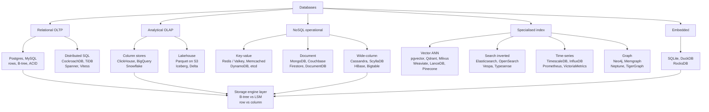

# Topic: databases

⏱ 29 min read · +62h 20m resources

Last updated: 2026-09-21 (the trailing dated write-up on learned query plans was folded into the body as a standing section; its page reference converted to a mention)

Outcome first: for almost everything you will build, Postgres is the correct default, Parquet on object storage queried by DuckDB or ClickHouse is the correct analytics layer, and Redis is the correct cache. Everything else on this page is a specific escape hatch you take once a measured workload proves the default wrong. A database is really three stacked choices: a **data model** (how you say what you mean), a **storage engine** (rows or columns, B-tree or LSM-tree), and a **distribution story** (replication, partitioning, and which consistency you are willing to pay for). Most product categories are the top layer plus one specialised index rather than a genuinely new kind of system, which is why "vector database" is best read as "an ANN (approximate nearest neighbour) index that someone sells separately". This page maps the families, compares them directly, and says which to reach for.

Why storage earns a topic of its own in an ML knowledge base: Andrew Ng's 2026 [AI Engineering Skills Map: software engineering fundamentals (Andrew Ng, 2026)](../swe-and-system-design/ai-engineering-skills-map.md) singles out data management as the one foundation that is *hard to change later*, and notes that if the data architecture is chosen poorly "the AI doesn't know what it doesn't know". Retrieval quality, agent memory, and feature freshness are all downstream of the choice made here, which is why it is worth spending real judgement on before the corpus is loaded rather than after.

### The map, briefly (7 min)

**Relational and OLTP (online transaction processing: many small, indexed, concurrent reads and writes, each touching a handful of rows and expected to be both fast and correct).** Postgres and MySQL: normalised tables, SQL, real constraints, **ACID** transactions (atomic, consistent, isolated, durable: a transaction either happens completely or not at all, cannot observe another's half-finished work, and survives a crash once committed), B-tree indexes over a row store. Optimised for many small reads and writes with strong correctness. A single modern node handles low tens of thousands of transactions per second and comfortably holds several terabytes, which is more than most products ever need. Postgres is also the extension platform: JSONB for documents, pgvector for embeddings, TimescaleDB for time-series, PostGIS for geometry, full-text search built in. That is why "just use Postgres" is a real engineering position rather than a joke.

**OLAP (online analytical processing: a few enormous queries that scan and aggregate huge numbers of rows), columnar, and the lakehouse.** Store each column contiguously, compress it hard, and read only the columns a query touches. That single change buys one to two orders of magnitude on aggregate scans and costs you cheap point updates. ClickHouse is the fast self-hosted end, BigQuery and Snowflake the managed separated-storage end, DuckDB the in-process end. The lakehouse is the same idea with the files exposed: Parquet on S3 plus a table format (Iceberg, Delta Lake, Hudi) that adds schema evolution, snapshot isolation, and time travel through an atomic metadata swap. The payoff is that Spark, Trino, DuckDB, ClickHouse, and Snowflake can all read the same bytes, which matters a great deal when the same corpus feeds training, evals, and a dashboard.

**Key-value.** Redis and Valkey are in-memory data-structure servers: strings, hashes, sorted sets, streams, with microsecond operations and optional weak durability. DynamoDB is the managed distributed version: single-digit millisecond access at effectively unbounded scale, priced per request, as long as every access path is designed into the key and the secondary indexes up front. Both punish you the moment you need a query you did not plan for. etcd is the odd one out in this family: a small Raft-replicated key-value store built for strongly consistent coordination metadata (it is where Kubernetes keeps cluster state) rather than for throughput, so it is the right answer for leader election and configuration and the wrong one for anything hot.

**Document.** MongoDB stores JSON documents with a flexible schema and a decent aggregation pipeline. The honest 2026 position: modern Postgres JSONB (JSON stored in a parsed binary form, so individual fields are addressable and indexable without reparsing the document) with **GIN (generalised inverted index)** indexes, which map each contained key or value back to the rows holding it, covers most document workloads while keeping joins, constraints, and one system to operate. Reach for a document database when shapes are genuinely heterogeneous and per-document locality is the dominant access pattern.

**Wide-column.** Cassandra, ScyllaDB (the C++ rewrite), HBase, and Bigtable. The model is a partition key plus clustering columns, and you design tables per query rather than normalising. LSM-tree storage plus leaderless quorum replication gives near-linear write scaling and multi-region availability, at the price of no joins, no ad hoc queries, and real operational weight. Below roughly a terabyte, this is almost always the wrong answer.

**Vector.** Approximate nearest neighbour search over embeddings, with metadata filtering. **ANN** here means you accept a tunable recall instead of a guarantee, because exact search in high dimensions degenerates to a full scan. pgvector puts the index inside Postgres as an extension. Among the standalone stores the differences are real: Qdrant is the Rust single-binary option with the strongest filtered-search implementation, evaluating the predicate during graph traversal rather than before or after it; Milvus is the heavyweight distributed system with pluggable index types and storage separated from compute; Weaviate bundles embedding and hybrid-retrieval modules with the store so you send text rather than vectors; LanceDB is embedded and file-based, an index over columnar files on object storage with no server at all; Vespa is a full retrieval engine that combines vectors, lexical scoring and learned ranking in one query; Turbopuffer keeps vectors on object storage behind an SSD cache, trading a few milliseconds of latency for roughly an order of magnitude less cost per stored vector. The important framing: **vector search is an index type, not a database category.** Recall is a tunable parameter rather than a guarantee, index build is the expensive operation, and filtered search ("nearest neighbours where tenant_id equals X") is where implementations actually differ.

**Graph.** Neo4j (the mature Cypher-speaking default), Memgraph (an in-memory Cypher-compatible rewrite aimed at continuously updating graphs), and the managed options store nodes and edges with **index-free adjacency**, meaning every node holds direct pointers to its neighbours, so a traversal is pointer chasing at constant cost per hop rather than an index lookup repeated per hop. This wins for variable-depth or unbounded-depth queries: path finding, fraud rings, entity graphs behind GraphRAG. For fixed two or three hop questions a SQL join, or a recursive CTE (common table expression: a named subquery allowed to refer to itself, which is how standard SQL expresses a bounded traversal), is faster to build and faster to run.

**Time-series.** Append-only timestamped measurements with labels, time-partitioned, compressed, downsampled, and expired. Prometheus is the metrics standard and is deliberately a single node with local storage, so long retention means putting a remote-storage layer behind it: VictoriaMetrics, a more compressive single-binary rewrite that still answers PromQL, or Thanos, Mimir and Cortex, which all ship Prometheus's immutable blocks into object storage and query them globally, differing mainly in whether they federate per-Prometheus sidecars or run one horizontally sharded cluster. TimescaleDB is Postgres with hypertables; InfluxDB v3 is now a Parquet and DataFusion engine. ClickHouse frequently beats a dedicated time-series database at its own job.

**Search.** Elasticsearch and OpenSearch invert an analysed text corpus and score with **BM25** (a bag-of-words relevance function that rewards a query term occurring often in a document, discounts terms that are common across the whole corpus, and saturates both effects so a long document repeating one word cannot dominate), adding facets, aggregations, and now dense vectors for hybrid retrieval. They are near-real-time and eventually consistent by construction, and reindexing is a normal operation, so treat them as a derived view over a system of record rather than the record itself.

**Embedded.** No server, just a library in your process: SQLite (rows, OLTP, the most deployed database on earth), DuckDB (columns, OLAP, SQLite's analytical counterpart), RocksDB and LMDB (raw key-value engines that other databases are built on top of). Zero network hop, zero operations, one writer.

**Distributed SQL and NewSQL.** CockroachDB, TiDB, YugabyteDB, and Spanner keep SQL and ACID while sharding writes across nodes with Raft or Paxos per range. Vitess is the different trick: sharded MySQL behind a proxy, which is how YouTube and Slack scaled. You buy horizontal write scaling and multi-region survivability, and you pay a higher latency floor plus expensive cross-shard transactions. Reach for it after a single Postgres has genuinely failed, not before.

### Cross-cutting axes (5 min)

- **OLTP vs OLAP.** Many small indexed reads and writes with transactions versus few enormous scans and aggregates. This split, not the vendor, decides row store or column store, and it is why analytics belongs on a replica or in a separate system rather than on your production primary.
- **Row vs column.** Row stores keep a whole record together, so a point lookup is one page read. Column stores keep each attribute together, so a scan reads only what it needs and compresses far better (run-length, dictionary, delta). Columnar updates mean rewriting large blocks, which is why OLAP systems are append-mostly.
- **B-tree vs LSM-tree.** B-trees update in place, giving predictable reads and lower read amplification: the OLTP default. LSM-trees buffer writes in memory and flush sorted files that are compacted later, giving much higher write throughput and better compression at the cost of read amplification and background compaction load. Postgres and MySQL are B-tree; Cassandra, RocksDB, and ClickHouse are LSM-shaped. Fully covered in the deep dive.
- **Normalisation vs denormalisation.** Normalise for write correctness (one fact in one place), denormalise for read speed (one row per query). Relational systems normalise then join; wide-column and OLAP systems denormalise then scan. The cost of denormalisation is not disk, it is the update anomaly you now own.
- **Indexing.** An index is a redundant, ordered copy of a subset of your data that turns a scan into a lookup. Every index makes writes slower and the planner's job harder. Know your cardinality and selectivity, prefer composite indexes ordered by equality then range, use covering indexes to avoid heap fetches, and remember that an index is useless if the predicate is not sargable.
- **Transactions and isolation.** ACID's hard part is the I. Read committed (the Postgres default) still allows non-repeatable reads, lost updates, and write skew; repeatable read and snapshot isolation stop most of that but not write skew; serialisable stops everything and costs retries or locks. Name the anomaly you are defending against, then pick the level. In practice: use serialisable for money and counters, and use explicit `SELECT ... FOR UPDATE` when you know exactly what you are protecting.
- **Replication and partitioning.** Replication is copies of the same data (single-leader with sync or async followers, multi-leader, or leaderless quorums) and buys availability and read scale. Partitioning, or sharding, splits different data across nodes (by hash for even spread, by range for range scans) and buys write scale plus capacity. They are orthogonal, you almost always need both, and the shard key is the decision you cannot cheaply reverse.
- **CAP and PACELC as they actually apply.** CAP only says something during a partition: stay consistent or stay available. The useful generalisation is PACELC: on Partition choose Availability or Consistency, Else choose Latency or Consistency. That "else" branch is the one you live in every day. Single-leader systems (Postgres, MongoDB) are CP-ish and fail over with a gap; Cassandra and DynamoDB let you dial it per query with quorums; Spanner buys strict consistency by paying commit-wait latency against TrueTime bounds. See [Topic: swe-and-system-design](../swe-and-system-design/summary.md) for the systems-design treatment.
- **The data lifecycle.** Retention, archival, and deletion are design decisions rather than cleanup tasks, and the cheapest moment to make them is when you design the schema. Privacy and compliance obligations attach exactly here: right to erasure, data residency, and audit retention are all lifecycle questions, and a store with no deletion path is a store you will eventually have to migrate off.

### How to actually choose (2 min)

The default needs no procedure: start with Postgres, and move off it only when a measured limit forces you. When something does force the question, five questions decide it, in this order.

1. **What are the access patterns?** Not what the data looks like, but which queries run, how often, and against what latency budget. Data shape is the wrong starting point because nearly any shape fits nearly any model; the queries are what a store is fast or slow at. A key-value store is only cheap if you always know the key, and wide-column is only fast if the partition key matches the query.
2. **What invariants must hold across rows?** If two rows must change together or not at all, you want real transactions, and you want them inside one store. This single question eliminates most of the table below for most business applications, and it is the one people defer until the reconciliation job appears.
3. **What is the write volume, and what shape is it?** Steady low thousands per second is one Postgres box with room to spare. Hundreds of thousands of appends per second across regions is Cassandra or a log. The peak and the hot partition decide this, not the average, so a bursty skewed workload is a different question from a large smooth one.
4. **How much do you know today?** Unknown future queries favour a normalised relational schema you can query new ways for free. Known, frozen access patterns are what license a denormalised store, and they are also exactly what you lose the first time the product changes.
5. **What can your team operate at 3am?** A database nobody on the rota can debug under load is the wrong database regardless of its benchmarks. Count the operational surface honestly: backups, restores actually tested, failover behaviour, version upgrades, and who gets paged.

### Comparison of the major types (5 min)

| Type | Representative systems | Data model | Consistency and scaling | Reach for it when | Avoid when |
| --- | --- | --- | --- | --- | --- |
| **Relational OLTP** | Postgres, MySQL, Aurora | Normalised relations, SQL, strict schema, row store on B-trees | Single-writer ACID up to serialisable; scale by bigger box plus read replicas; sharding is manual | You need joins, constraints, and transactions: app state, users, jobs, billing, metadata. The default | Query is a scan over billions of rows, or write volume genuinely exceeds one node |
| **Distributed SQL** | CockroachDB, TiDB, YugabyteDB, Spanner, Vitess | Relational and SQL, usually Postgres or MySQL wire compatible | Raft or Paxos per shard, horizontal writes, multi-region; cross-shard transactions are expensive | Single-node Postgres is genuinely exhausted, or you need regional data residency without losing SQL | You have not yet measured the Postgres ceiling; latency floor and ops cost are both real |
| **OLAP columnar** | ClickHouse, BigQuery, Snowflake, Redshift, DuckDB | Columnar relations, wide denormalised fact tables, vectorised execution | Append-mostly, weak or no cross-row transactions; compute scales separately from storage | Aggregates and scans: usage and cost analytics, eval results, log analytics, dashboards | Point updates, deletes by row, or high-concurrency single-row reads |
| **Lakehouse tables** | Iceberg, Delta Lake, Hudi over Parquet on S3 | Open columnar files plus a manifest and snapshot metadata layer | Snapshot isolation via atomic metadata commit; scales as far as object storage does | Training corpora, feature history, event archives that several engines must read without lock-in | You need sub-second interactive latency, or you generate millions of tiny files |
| **Key-value** | Redis, Valkey, DynamoDB, etcd | Opaque value per key, plus Redis data structures (sorted sets, streams, HLL) | Redis: single-threaded shard, async replication, gaps on failover. DynamoDB: per-item ACID, single-digit ms at any scale | Caches, rate limits, sessions, locks, idempotency keys, queues, hot feature lookups | The query cannot be expressed as a key, or this would be the only durable copy of the data |
| **Document** | MongoDB, Couchbase, Firestore, DocumentDB | JSON documents, flexible schema, aggregation pipeline, secondary indexes | Replica set with one primary, tunable read and write concern, sharded by shard key; multi-document transactions are a bolt-on | Shapes are genuinely heterogeneous or evolve fast, and reads are document-local | The data is relational: Postgres JSONB gives you documents plus real constraints and joins. Watch the slow failure too: schema flexibility becomes schema chaos once five versions of a document coexist, and "denormalise everything" collapses the moment a second access pattern arrives |
| **Wide-column** | Cassandra, ScyllaDB, HBase, Bigtable | Partition key plus clustering columns; one denormalised table per query | LSM-tree, leaderless quorums with tunable consistency, near-linear write scaling, active-active regions | Huge sustained write volume with known access patterns: telemetry, feeds, event history | You want ad hoc queries or joins, your data is under a terabyte, or partitions would be skewed. Note the irreversibility: **the partition key is a one-way door**, since changing it means rewriting every row, so this is the one choice here you cannot walk back cheaply |
| **Vector** | pgvector, Qdrant, Milvus, Weaviate, LanceDB, Vespa, Turbopuffer | Dense vectors plus payload metadata; ANN by cosine, inner product, or L2 | Sharded replicas, usually one writer per shard; recall is tuned, not guaranteed; index build dominates cost | RAG retrieval, semantic caching, dedup, recommendation candidate generation at scale | Under roughly 10M vectors, where pgvector next to your existing data wins on operational simplicity |
| **Graph** | Neo4j, Memgraph, Postgres with AGE or recursive CTEs | Property graph of nodes and edges, Cypher or GQL, index-free adjacency | Mostly single writer with read replicas; distributed graph traversal remains genuinely hard | Variable or unbounded depth traversal: path finding, fraud rings, GraphRAG entity graphs | Depth is fixed at two or three hops, which a SQL join does faster and with less machinery |
| **Time-series** | TimescaleDB, InfluxDB, Prometheus, VictoriaMetrics | Timestamped measurements with labels, time-partitioned, compressed, downsampled, expiring | Append-only with retention policies; Prometheus is single node by design, so long retention needs Thanos, Mimir, or VictoriaMetrics | Metrics and telemetry: GPU utilisation, token counters, latency histograms, anything with a time axis | You want a general-purpose store, or ClickHouse and Timescale would already do the job |
| **Search** | Elasticsearch, OpenSearch, Vespa, Typesense, Lucene | Inverted index over analysed text, BM25 scoring, facets, aggregations, plus dense vectors | Sharded with replicas, near-real-time refresh, eventually consistent; reindexing is routine | Keyword and hybrid retrieval, log search, faceted browse, anything needing lexical matching | You would treat it as the system of record: it is a derived view and should be rebuildable |
| **Embedded** | SQLite, DuckDB, RocksDB, LMDB, LanceDB | In-process library, no server. SQLite is rows and OLTP, DuckDB is columns and OLAP, RocksDB is a raw LSM engine | Consistency is your process's; one writer, one machine (libSQL and MotherDuck stretch this) | Local analytics on Parquet, notebooks, tests, on-device state, or an engine inside your own service | Multiple writers over a network need the same data concurrently |

### The ML and LLM angle (3 min)

**Postgres plus pgvector is the boring correct default for RAG.** Your chunks already need metadata, tenancy, permissions, provenance, and a delete path, which is a relational problem with a vector column attached rather than a vector problem. One system means one transaction, one backup, one failover story, and no dual-write skew between chunk text and chunk embedding. **HNSW (Hierarchical Navigable Small World)**, a layered proximity graph searched greedily from a sparse top layer down to a dense bottom one, runs inside pgvector and serves millions of vectors at single-digit millisecond latency, and Postgres full-text search gives you the lexical half of hybrid retrieval for free.

**A dedicated vector database earns its place** when at least one of these is true: you are past roughly 100M vectors, or filtered search dominates and you need a real filtered-ANN implementation rather than a post-filter that destroys recall; or you need per-tenant index isolation across thousands of tenants; or you need a strict p99 under 10 ms at high QPS; or you want to rebuild and hot-swap indexes independently of your OLTP database; or you need quantisation and disk-resident indexes to fit the corpus in a sane amount of RAM. Note that these are index and operations arguments, never data-model arguments. Cost model to hold: a float32 vector at 1536 dimensions is about 6 KB, so 100M vectors is roughly 600 GB before the index, which is why scalar or binary quantisation is the first lever and reduced embedding dimensions (Matryoshka) are the second.

**Feature stores** are a naming convention over two databases, not a new database. The offline store is columnar (Parquet, BigQuery, Snowflake) and answers point-in-time correct training queries; the online store is key-value (Redis, DynamoDB) and answers single-entity lookups in milliseconds at serving time. The entire value is guaranteeing that the same transformation produces both, which is what prevents training and serving skew. Feast and Tecton are orchestration over that pair.

**DuckDB is the analytics tool to reach for first.** It queries Parquet, CSV, JSON, Iceberg, and Delta in place, over local disk or S3, with full SQL and no server, and it will happily chew through tens of gigabytes on a laptop. For eval result analysis, training data profiling and dedup, filtering a corpus before a run, or debugging why a shard is malformed, `duckdb -c "select ... from 's3://bucket/*.parquet'"` beats a Spark cluster on time to answer. Pandas and Polars both interoperate with it zero-copy through Arrow.

**The rest of the ML data path in one line each.** Object storage plus Parquet is the substrate for training data, and the file layout (row group size, partitioning, sort order) matters more than the query engine. Kafka is the event backbone when three or more systems need the same usage and feedback events. Redis holds the semantic cache, per-tenant rate limits, and job state. ClickHouse holds token, latency, and cost analytics because those queries are aggregate scans over an append-only stream. Postgres holds everything else, including the eval registry and the run metadata, until it demonstrably cannot.

### Learned query plans: a 4B model against the Postgres planner (2 min)

Rohan Bansal trained Empero's Qwen 3.8 4B distillation to produce PostgreSQL query plans and beat the built-in planner on join-heavy analytic queries (Sep 16, 2026; 695 points on Hacker News). It is the first result in this knowledge base where a language model outperforms a mature cost-based optimiser on its own ground, and the numbers are specific enough to argue with.

**Results**, validated on the 113 queries of the Join Order Benchmark after training on roughly 13.6k queries from the Cardinality Estimation Benchmark:

- **1.81x geometric mean speedup** on best-of-three rollouts.
- **44.7% latency reduction** across join-heavy queries.
- **Zero regressions** when taking the best candidate of three attempts.
- Valid plans produced for queries where the untrained base model failed **72%** of the time.
**Why it works, and where it stops working.** A query optimiser picks a join order and access method from cardinality estimates, and those estimates are systematically wrong on correlated predicates, which is the oldest known weakness in the field. A model trained on measured outcomes is learning a correction to those estimates from data rather than from a statistical model of the data. The economics only close where the same analytic query runs repeatedly, because generating and measuring three candidate plans costs far more than the planner does; the optimisation has to amortise across repeated executions. For transactional traffic it makes no sense at all.

**The measurement discipline is the part to copy.** Four containerised Postgres instances, `shared_buffers` tuned to 2GB to keep the Linux page cache from dominating, and best-of-three reported explicitly rather than best-of-N hidden in a footnote. Query-plan benchmarking is notoriously easy to fake by accident through cache warming, and this protocol says what it did about it.

The training recipe, which is a clean worked example of frontier-distillation plus LoRA plus agentic RL at a scale one engineer can afford, is recorded on [Topic: llm-training-and-post-training](../llm-training-and-post-training/summary.md). [Write-up](https://rohanbansal.com/qorl) (30 min)

### Quick chooser (1 min)

- Need app state, users, jobs, metadata, billing: use **Postgres**. This is the right answer most of the time.
- Need RAG retrieval below roughly 10M chunks: use **Postgres with pgvector** and an HNSW index.
- Need RAG at 100M-plus vectors, heavy metadata filtering, or a hard p99 target: use **Qdrant, Milvus, Vespa, or Turbopuffer**.
- Need a cache, rate limiter, distributed lock, or hot counter: use **Redis or Valkey**.
- Need aggregate scans over events, logs, or eval runs: use **ClickHouse** self-hosted, or **BigQuery or Snowflake** managed.
- Need to query Parquet on a laptop or inside a job: use **DuckDB**.
- Need training corpora and feature history that several engines read: use **Parquet on object storage with Iceberg or Delta**.
- Need keyword or hybrid search: use **Elasticsearch or OpenSearch**, or Postgres full-text if the corpus is small.
- Need metrics, dashboards, and alerting: use **Prometheus**, plus VictoriaMetrics or Thanos for long retention.
- Need millions of writes per second on known access patterns: use **Cassandra or ScyllaDB**.
- Need horizontal write scaling without giving up SQL: use **CockroachDB, TiDB, or Spanner**.
- Need in-process or on-device storage: use **SQLite** for rows, **DuckDB** for columns, **RocksDB** to build on.
- Need variable-depth traversal over a graph: use **Neo4j**. Two hops is a join, not a graph problem.
- Need serving features to a model in milliseconds: use a **key-value online store** fed by the same transform as your offline columnar store.

### Deep dives (1 min)

| Page | What it covers |
| --- | --- |
| [Storage engines, indexes, and the physics of a query](storage-engines-and-indexes.md) (21 min read · +18h 10m resources) | B-tree vs LSM-tree and the RUM conjecture, write and read and space amplification, page cache and fsync and the WAL, index families (B-tree, hash, GIN, GiST, inverted, bitmap), ANN index families for vector search (HNSW, IVF, IVF-PQ, DiskANN, ScaNN) and their build, recall, and memory tradeoffs, query planning and why the planner goes wrong, and the latency numbers to memorise |
| [Caching: types, policies, and semantic caching](caching.md) (27 min read · +4h 15m resources) | Every cache layer from CPU to OS page cache to reverse proxy to CDN to Redis to the buffer pool and materialised views, write and read strategies, eviction policies including Redis's actual maxmemory menu, invalidation and the failure modes worth knowing by name, cost-weighted hit ratio as the metric that replaces raw hit ratio, and the three LLM caches: KV cache, prefix and provider prompt caching with their economics, and semantic caching with its thresholds and its false-hit rate |

### Related topics (1 min)

- [Topic: swe-and-system-design](../swe-and-system-design/summary.md): CAP, PACELC, consistency models, and the same taxonomy from the systems-design angle
- [Topic: rag-and-retrieval](../rag-and-retrieval/summary.md): vector search in context, chunking, hybrid retrieval, rerankers, and what actually moves retrieval quality
- [Topic: ml-infra-and-orchestration](../ml-infra-and-orchestration/summary.md): how these stores get deployed, backed up, and monitored alongside the training and serving stack
- [Topic: data-curation-and-datasets](../data-curation-and-datasets/summary.md): the Parquet and lakehouse layer as it is used for training corpora

### Best resources (topic-wide) (2 min)

- [Designing Data-Intensive Applications, 2nd ed.](https://dataintensive.net/) (book, ~15h) (Kleppmann and Riccomini, O'Reilly, March 2026): the anchor. Chapters on storage engines, replication, partitioning, and transactions are the canonical treatment, and the 2nd edition adds cloud-native storage and the lakehouse
- [Database Internals](https://www.databass.dev/) (book, ~9h 25m) (Alex Petrov, O'Reilly 2019): the level below DDIA. Part I is the clearest published explanation of B-trees, LSM-trees, and page layout
- [CMU 15-445 Intro to Database Systems](https://15445.courses.cs.cmu.edu/) (course, ~30h of lectures, plus the assignments) (Andy Pavlo): free lectures and assignments where you build a working storage engine, buffer pool, and query executor; 15-721 is the advanced in-memory and columnar sequel
- [Use The Index, Luke](https://use-the-index-luke.com/) (~4h) (Markus Winand): the practical indexing book. Composite index ordering, sargability, covering indexes, and why your query does a seq scan
- [Jepsen analyses](https://jepsen.io/analyses) (~3h for the systems you actually run): empirical testing of what databases actually do under partition versus what their docs claim. Read the ones for systems you use, then read the consistency models map
- [Just Use Postgres for Everything](https://www.amazingcto.com/postgres-for-everything/) (~10 min) (Stephan Schmidt): the short polemic for the default position on this page, and a useful list of what Postgres extensions replace
- [The Log: What every software engineer should know about real-time data's unifying abstraction](https://engineering.linkedin.com/distributed-systems/log-what-every-software-engineer-should-know-about-real-time-datas-unifying-abstraction) (~45 min) (Jay Kreps, LinkedIn 2013): why the append-only log sits underneath replication, change data capture, stream processing, and most of the rest of this page. Read it once and replication, event sourcing, and the lakehouse commit log stop looking like three separate ideas
- [Storage engines, indexes, and the physics of a query](storage-engines-and-indexes.md)
- [Caching: types, policies, and semantic caching](caching.md)
