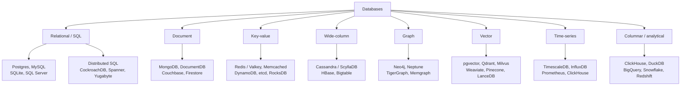

# Databases

*Created 2026-08-31, from Khalid's blog entry of 2026-08-27: "Add a 'databases' topic to technical knowledge base. It should include the top used database types and a comparison between them."*

The storage layer: what the main database families actually are, what each is good and bad at, and how to choose. A new topic rather than a section of swe-and-system-design because storage choice is a first-class decision with its own body of theory (data models, consistency, indexing, transactions) that the system-design page can only gesture at. Caching, the layer that sits in front of all of this, is [caching.md](caching.md).

Why it earns a place in an ML knowledge base: Andrew Ng's 2026 AI Engineering Skills Map singles out data management as the one foundation that is *hard to change later*, and notes that if the data architecture is chosen poorly "the AI doesn't know what it doesn't know". Retrieval quality, agent memory, and feature freshness are all downstream of this choice. See [../swe-and-system-design/ai-engineering-skills-map.md](../swe-and-system-design/ai-engineering-skills-map.md).

## Taxonomy

Diagram source (mermaid)

## The families, and what each is actually for

| Family | Data model | Reach for it when | The catch |
|---|---|---|---|
| **Relational** | Tables, fixed schema, joins, ACID transactions | Almost always, by default. Entities with relationships, anything needing multi-row invariants, anything you will query in ways you cannot predict today | Horizontal write scaling is genuinely hard; schema changes on huge tables need care |
| **Document** | Self-contained JSON-ish documents, flexible schema | The aggregate is read and written whole and rarely joined: user profiles, product catalogues, event payloads, CMS content | Schema flexibility becomes schema chaos; joins are your problem; "denormalise everything" collapses when the second access pattern arrives |
| **Key-value** | Opaque value under a key | You know the key every time: sessions, caches, feature flags, rate limiters, queues, coordination | No query language worth the name. Everything is a scan if you did not plan the key |
| **Wide-column** | Rows with dynamic column families, partition + clustering keys | Enormous write volume with known access patterns and multi-region writes: telemetry, feeds, messaging | The partition key is a one-way door; you design the table per query, and eventual consistency is real |
| **Graph** | Nodes and edges as first-class citizens | The *relationships* are the query: fraud rings, entity resolution, recommendations, GraphRAG knowledge graphs, dependency analysis | Small ecosystem, uneven operational maturity; many "graph problems" are fine as recursive CTEs in Postgres |
| **Vector** | Dense embeddings with ANN indexes (HNSW, IVF) | Semantic retrieval, RAG, dedup, semantic caching | ANN is approximate by construction; recall is a tuned parameter, not a guarantee. See [../rag-and-retrieval/](../rag-and-retrieval/summary.md) |
| **Time-series** | Timestamped points, heavy compression, retention and downsampling built in | Metrics, sensors, traces, anything append-only and queried by time window | Bad at anything that is not time-ordered; often a specialised view of a columnar engine |
| **Columnar / OLAP** | Column-oriented storage, vectorised execution | Aggregations over billions of rows: analytics, dashboards, offline feature computation, eval result crunching | Single-row updates and point lookups are awful. Not a transactional store |

## How to actually choose

The honest heuristic first: **start with Postgres and move off it only when a measured limit forces you.** Modern Postgres absorbs most of the table above: JSONB covers the document case, `hstore` and unlogged tables cover much of key-value, pgvector covers vector search, TimescaleDB covers time-series, recursive CTEs cover shallow graph traversal, and logical replication into ClickHouse or DuckDB covers analytics. One operational story, one backup story, one set of transactions across all of it. The polyglot-persistence pitch of the 2010s mostly produced systems where nobody could answer a question that spanned two stores.

When you do need to choose deliberately, the questions that actually decide it, in order:

1. **What are the access patterns?** Not "what is the data", but which queries run, how often, and with what latency budget. A key-value store is only cheap if you always know the key. Wide-column is only fast if the partition key matches the query.
2. **What invariants must hold across rows?** If two rows must change together or not at all, you want real transactions, and you want them in one store. This single question eliminates most of the table for most business applications.
3. **What is the write volume and its shape?** Steady low-thousands per second is a single Postgres box. Hundreds of thousands of appends per second across regions is Cassandra or a log.
4. **How much do you know today?** Unknown future queries favour a relational schema you can query new ways. Known, frozen access patterns license a denormalised store.
5. **What can you operate?** A database your team cannot debug at 3am is the wrong database regardless of its benchmarks.

## Concepts that cut across all of them

- **Normalisation vs denormalisation**: normalise until a measured read forces you to denormalise, then denormalise deliberately and own the update anomaly.
- **Indexing**: B-tree for ranges and equality, hash for equality, GIN/GiST for containment and full text, HNSW/IVF for vectors. Every index is a write-time tax paid for a read-time gain.
- **Transactions and isolation**: read-committed (most defaults), repeatable-read, serializable. Most "race condition" bugs are an isolation level nobody chose on purpose.
- **CAP, honestly**: partitions happen, so the real choice is what you do during one. Most systems want CP for money and AP for feeds.
- **Replication and sharding**: replicas buy read scale and availability, not write scale; sharding buys write scale at the cost of cross-shard queries and transactions.
- **The data lifecycle**: retention, archival, and deletion are design decisions, not cleanup tasks. Privacy and compliance obligations attach here.

## Files

- [caching.md](caching.md): the layer in front, including semantic caching for LLM calls.

## Where this connects to the rest of the KB

- [../rag-and-retrieval/](../rag-and-retrieval/summary.md): vector databases, embeddings, and hybrid search get their depth there; this page only places them in the family tree.
- [../swe-and-system-design/](../swe-and-system-design/summary.md): how storage choice interacts with service decomposition and scaling.
- [../ml-infra-and-orchestration/](../ml-infra-and-orchestration/summary.md): feature stores, experiment metadata, and the operational side.

## Best resources

- [Designing Data-Intensive Applications (Kleppmann)](https://dataintensive.net/): still the single best book on this material; chapters 2, 3, 5-7 cover the whole page above.
- [Use The Index, Luke](https://use-the-index-luke.com/): how indexes actually work, from the query planner's side.
- [Postgres is enough (gist)](https://gist.github.com/cpursley/c8fb81fe8a7e5df038158bdfe0f06dbb): the argument for the default above, with the extension list.
- [Jepsen analyses](https://jepsen.io/analyses): what distributed databases actually do under partition, as opposed to what their marketing says.
- [The Log (Jay Kreps)](https://engineering.linkedin.com/distributed-systems/log-what-every-software-engineer-should-know-about-real-time-datas-unifying-abstraction): why logs sit underneath replication, streams, and most of the rest.
