# Evaluation and LLM judges

⏱ 14 min read · +1h resources

*Last updated: 2026-08-31*

Methodology and tooling for evaluating LLMs and LLM-powered systems: how to measure, with what harness, judged by whom, and gated how. The datasets themselves live in [../benchmarks/](../benchmarks/summary.md); this topic is about how evaluation is done and where it breaks.

```mermaid
graph TD
    E[LLM Evaluation] --> T[Eval types]
    E --> H[Harnesses]
    E --> J[Judge patterns]
    E --> P[Production engineering]
    E --> G[Guardrails]
    E --> F[Failure modes]

    T --> T1[Static benchmarks<br/>loglikelihood / exact match]
    T --> T2[LLM-as-judge<br/>pointwise / pairwise / rubric]
    T --> T3[Human eval<br/>expert gold, Arena-style pref]
    T --> T4[Online A/B and<br/>shadow deployment]
    T --> T5[Regression gates<br/>golden sets in CI]

    H --> H1[lm-evaluation-harness<br/>academic standard]
    H --> H2[Inspect AISI<br/>agentic + sandboxed]
    H --> H3[lighteval HF]
    H --> H4[HELM maintenance mode]
    H --> H5[promptfoo / Braintrust<br/>app-level]

    J --> J1[Single judge + rubric]
    J --> J2[Juries / PoLL ensembles]
    J --> J3[Reward models]
    J --> J4[Agent-as-judge]
    J --> J5[Meta-evals:<br/>JudgeBench, RewardBench 2]

    P --> P1[Golden sets +<br/>promotion paths]
    P --> P2[Offline vs online metrics]
    P --> P3[Statistical rigour:<br/>paired tests, power analysis]
    P --> P4[Gold-label auditing]

    G --> G1[Pre-call input rails]
    G --> G2[During-call rails]
    G --> G3[Post-call output rails]

    F --> F1[Judge biases:<br/>position, verbosity, self-pref]
    F --> F2[Judge exploitation:<br/>null models, format tricks]
    F --> F3[Truncation and<br/>plumbing bugs]
    F --> F4[Contamination]
    F --> F5[Gold-label noise]
```

Diagram source (mermaid)

## Map of the space

- **Eval types.** Five layers, cheapest to most faithful: static benchmarks (deterministic scoring over fixed datasets), LLM-as-judge (scalable but biased proxy for human preference), human eval (the reference standard, expensive, itself noisy), regression gates (frozen golden sets wired into CI), and online measurement (shadow deploys, A/B tests, live metrics). Mature stacks run all five; each layer catches what the previous one cannot.
- **Harnesses.** All of these run a dataset through a model and score it; they differ in what they treat as the unit of work. **lm-evaluation-harness** (EleutherAI) is the reproducibility standard for model-level numbers: a task is declarative YAML (dataset, prompt template, output type, metrics, answer-extraction filters) and any backend works once it implements three methods, `loglikelihood`, `loglikelihood_rolling` and `generate_until`. That last split is the methodological fault line: loglikelihood scoring ranks the supplied options by probability, so it is cheap, deterministic and usable on base models but unavailable through an API with no logprobs, while `generate_until` samples free text and hands it to a regex, so every extraction failure reads silently as a wrong answer. Pick it when you need a number comparable with a model card. **Inspect** (UK AI Security Institute) instead models an eval as a program: a Task is a dataset plus a solver chain (system message, prompt template, generate, self-critique, or a full react agent loop) plus a scorer (exact match, model-graded QA, or arbitrary Python), with a first-class Docker sandbox so model-written code can execute safely and structured transcripts of every model and tool call. Pick it for anything agentic, sandboxed, multi-turn or safety-facing; it is what the AISIs, METR and Apollo run. **lighteval** (Hugging Face) has lm-eval-harness's shape but is native to the HF stack, with backends including nanotron, which makes it the one that runs inside a pretraining loop. **HELM** (Stanford CRFM) scored every scenario on seven axes at once (accuracy, calibration, robustness, fairness, bias, toxicity, efficiency) and is worth reading for that stance, but it entered maintenance mode in June 2026: read it, do not build on it. **promptfoo** (open source, YAML and CLI, local-first, with a red-team scanner) and **Braintrust** (commercial SDK plus dataset versioning, production tracing and online scoring) answer a different question entirely: not "is this checkpoint good" but "is this prompt, retrieval and tool configuration safe to ship".
- **Judge patterns.** An LLM judge is a measurement instrument that happens to be a model, and the grading mode fixes its bias profile. **Pointwise** scoring rates one output on an absolute scale; it is the only mode that yields a per-sample number without a baseline, and it drifts, so a 7 out of 10 today is not a 7 next month or under a different judge. Use few anchored levels, ideally binary, since scales stop being distinguishable past roughly four levels. **Pairwise** asks the judge to choose between two outputs; it agrees with humans better on open-ended quality and is the natural mode for a model-swap decision, but it costs O(n^2) to rank a field and it carries **position bias**, meaning the verdict depends measurably on which slot an answer occupied rather than on its content, so both orderings must be run and swap disagreements counted as ties. **Rubric or reference-guided** grading scores against an explicit checklist or a gold answer: the most reliable mode wherever references exist, and the only one that localises which criterion failed, which is what makes it useful for debugging rather than just ranking. **Juries (PoLL)** replace one large judge with several small judges drawn from different model families and aggregate them, correlating better with humans at roughly a seventh of the cost while washing out intra-family self-preference; aggregate with a median or trimmed mean, because one degraded juror drags a plain mean arbitrarily. **Meta-evals** are how you choose among all of that: **JudgeBench** grades judges on objectively verifiable hard pairs, where even frontier judges reach only about 64%, and **RewardBench 2** does the same for reward models used as best-of-N selectors. The design consequence: judge choice is an empirical per-task decision calibrated against a human gold slice, never a default.
- **Calibration.** No judge number means anything until it is checked against human labels, and that check has a specific shape. Build a gold slice of a few hundred items labelled by a domain expert making binary pass/fail calls with written critiques, then iterate the judge prompt until agreement plateaus. Report **Cohen's kappa** rather than raw agreement: kappa subtracts the agreement you would get by chance given the class balance, and an imbalanced golden set flatters raw accuracy badly. **Inter-annotator agreement**, how often two humans labelling the same items agree, is the ceiling of the whole exercise: on open-ended tasks it typically sits at 75 to 85%, so a judge agreeing 80% with your expert may be at ceiling rather than underperforming, and the last twenty points are label noise, not headroom. Judge-derived pass rates are biased estimators of the human pass rate, and the correction uses the judge's own true-positive and false-positive rates measured on that gold slice. Self-consistency certifies nothing on its own: judges can be highly reproducible and systematically wrong at the same time.
- **Failure modes.** Position, verbosity, and self-preference biases; format exploitation (null models hitting 86% win rates on AlpacaEval 2.0); sycophancy toward confident phrasing; silent plumbing bugs (truncated completions fed to the judge get scored as content failures); contaminated or mislabeled gold data (roughly 9% of MMLU is wrong). In practice most "model regressions" turn out to be eval bugs first, model changes second.

## Added 2026-08-31: double-blind evaluation, or contamination handled cryptographically

Google DeepMind ran what it calls the [first double-blind evaluation of a proprietary model](https://deepmind.google/blog/piloting-the-worlds-first-double-blind-ai-evaluations/) (~15 min) (Aug 27), with the Singapore AI Safety Institute, OpenMined, AVERI, and MLCommons. Both secrets go into the same hardware-encrypted enclave (Google Cloud Confidential Space): the lab's weights and the evaluator's benchmark prompts. The lab never sees the prompts, so they cannot enter a training set; the evaluator never sees the weights, so the lab does not have to hand over its model to be measured by an outsider. The pilot ran on Gemini Flash Lite, and the blog post publishes the mechanism rather than scores; methodology and findings are in the accompanying technical report.

The reason to care is structural, not about the numbers. Contamination is currently handled by contract and by trust: an evaluator promises not to leak the set, a lab promises not to train on it, and neither claim is verifiable after the fact, which is why held-out sets decay into training data and why every benchmark has a shelf life. This makes non-contamination a property of the execution environment instead of a promise, which is the first mechanism that could let the same private benchmark be reused across labs and across model generations without burning it. Caveats: it is a pilot on a small model, the enclave has to be trusted (and is Google's own infrastructure, which is awkward when Google is also the evaluated party here), and it does nothing about the *other* contamination path, which is the benchmark's questions leaking into the pretraining crawl from their original public source.

File under **Contamination** in the failure modes above, and alongside the SWE-Bench Pro audit in [../benchmarks/](../benchmarks/summary.md) as the two 2026 attempts to make benchmark integrity checkable rather than assumed.

## Added 2026-08-31: checklist grading makes small judges viable

This page's judge-pattern section already says that juries of small diverse judges (PoLL) beat a single large judge on cost and human agreement. Nothing here covered checklist-based judging until now. [RocketEval](https://arxiv.org/abs/2503.05142) (45 min) (ICLR 2025, now in ../papers/ as [RocketEval: Efficient Automated LLM Evaluation via Grading Checklist](../../papers/2025-03_rocketeval/summary.md)) makes a stronger version of the PoLL claim with a single small judge, and its diagnosis is the part to keep. Lightweight judges do not fail from a general reasoning deficit: they fail because they cannot hold a comprehensive analysis of a long response in one pass. The evidence is direct. Qwen2-1.5B scores *worse* with chain-of-thought (36.4% agreement) than with direct scoring (40.1%), because CoT asks it to do the one thing it cannot, yet handed GPT-4o's analysis and asked only to pass judgment it reaches 70.3%. So the fix is to stop asking small models to analyse: a frontier model compiles each query into 5 to 10 binary checklist questions once, and the small judge answers each one independently.

That reframing lands squarely on two things already catalogued here. On **cost**, the numbers are 1,000 WildBench tests for $27.70 with Gemma-2-2B against $3,400 with GPT-4o, at 0.965 Spearman with Arena Elo versus GPT-4o's 0.979 (Mistral-Nemo actually beats it at 0.986). That is the difference between a quarterly sweep and a per-merge gate, which is the constraint the production-eval-engineering deep dive keeps running into. On **bias**, this is a structural fix rather than a correction: because each checklist item is graded without seeing the other answers, position and anchoring bias have no channel to propagate, and because the score is read off the logits as `P(Yes)/(P(Yes)+P(No))` rather than from the sampled token, the small model's uncertainty is preserved as a number instead of being collapsed into a false verdict. Both belong in the llm-as-judge deep dive as a debiasing-by-construction pattern, distinct from the post-hoc corrections (swapping order, controlling for length) listed there now.

The caveat belongs with the meta-eval scepticism already on this page. The 0.965 is a *list-level* correlation; instance-level agreement for Gemma-2-2B is 57.9%, below GPT-4o's 66.6% and below the 64.7% human-to-human ceiling. Small checklist judges rank a field of models almost exactly right while still being unreliable on any single response, which is consistent with JudgeBench and RewardBench 2 putting even frontier judges at 60-70% on hard comparisons. The practical rule: use this shape for aggregate leaderboards, drift monitoring, and regression gates that trip on a distribution, and do not use it to adjudicate one item, gate one PR on one failing case, or generate preference labels. Note also the prerequisite, which cuts against the privacy argument for local judging: checklist creation still needs a frontier model to see every query, even though it never sees the responses.

## Deep dives

- [llm-as-judge.md](llm-as-judge.md) (11 min read · +9h 35m resources): judge design, biases, calibration against human gold, ensembles, meta-evals, known exploits.
- [eval-harnesses.md](eval-harnesses.md) (12 min read · +5h 5m resources): lm-eval-harness, Inspect, HELM, lighteval, promptfoo/Braintrust; when to use which; contribution entry points.
- [production-eval-engineering.md](production-eval-engineering.md) (11 min read · +4h 35m resources): regression gates, golden sets, shadow deploys, statistical rigour, gold-label auditing.
- [guardrails.md](guardrails.md) (10 min read · +2h 15m resources): pre/during/post-call guardrail stages, NeMo Guardrails, guard-model landscape (Llama Guard, Granite Guardian, Qwen3Guard).

## Related

- [../benchmarks/](../benchmarks/summary.md) for the datasets these harnesses run.
- [../llm-training-and-post-training/](../llm-training-and-post-training/summary.md) for reward models and reward hacking, the training-time mirror of judge exploitation.
