# Evaluation and LLM judges

*Last updated: 2026-08-24*

Methodology and tooling for evaluating LLMs and LLM-powered systems: how to measure, with what harness, judged by whom, and gated how. The datasets themselves live in [../benchmarks/](../benchmarks/summary.md); this topic is about how evaluation is done and where it breaks.

```mermaid
graph TD
    E[LLM Evaluation] --> T[Eval types]
    E --> H[Harnesses]
    E --> J[Judge patterns]
    E --> P[Production engineering]
    E --> G[Guardrails]
    E --> F[Failure modes]

    T --> T1[Static benchmarks<br/>loglikelihood / exact match]
    T --> T2[LLM-as-judge<br/>pointwise / pairwise / rubric]
    T --> T3[Human eval<br/>expert gold, Arena-style pref]
    T --> T4[Online A/B and<br/>shadow deployment]
    T --> T5[Regression gates<br/>golden sets in CI]

    H --> H1[lm-evaluation-harness<br/>academic standard]
    H --> H2[Inspect AISI<br/>agentic + sandboxed]
    H --> H3[lighteval HF]
    H --> H4[HELM maintenance mode]
    H --> H5[promptfoo / Braintrust<br/>app-level]

    J --> J1[Single judge + rubric]
    J --> J2[Juries / PoLL ensembles]
    J --> J3[Reward models]
    J --> J4[Agent-as-judge]
    J --> J5[Meta-evals:<br/>JudgeBench, RewardBench 2]

    P --> P1[Golden sets +<br/>promotion paths]
    P --> P2[Offline vs online metrics]
    P --> P3[Statistical rigour:<br/>paired tests, power analysis]
    P --> P4[Gold-label auditing]

    G --> G1[Pre-call input rails]
    G --> G2[During-call rails]
    G --> G3[Post-call output rails]

    F --> F1[Judge biases:<br/>position, verbosity, self-pref]
    F --> F2[Judge exploitation:<br/>null models, format tricks]
    F --> F3[Truncation and<br/>plumbing bugs]
    F --> F4[Contamination]
    F --> F5[Gold-label noise]
```

## Map of the space

- **Eval types.** Five layers, cheapest to most faithful: static benchmarks (deterministic scoring over fixed datasets), LLM-as-judge (scalable but biased proxy for human preference), human eval (the reference standard, expensive, itself noisy), regression gates (frozen golden sets wired into CI), and online measurement (shadow deploys, A/B tests, live metrics). Mature stacks run all five; each layer catches what the previous one cannot.
- **Harnesses.** lm-evaluation-harness is the academic reproducibility standard (YAML task configs; loglikelihood vs generate_until request types). Inspect (UK AISI) is the frontier-safety and agentic-eval standard (solvers, scorers, Docker sandboxing), adopted by AISIs, METR and Apollo. lighteval is HF's ecosystem-native option. HELM entered maintenance mode in June 2026 but remains the methodological reference. promptfoo and Braintrust cover app-level prompt/config evals rather than model benchmarking.
- **Judge patterns.** Pointwise rubric scoring, pairwise preference, and reference-guided grading have distinct bias profiles. Juries of small diverse judges (PoLL) beat single large judges on cost and human agreement. Meta-evals (JudgeBench, RewardBench 2) show even frontier judges hover at 60-70% on hard objective comparisons, so judge choice is an empirical, per-task decision calibrated against a human gold slice.
- **Failure modes.** Position, verbosity, and self-preference biases; format exploitation (null models hitting 86% win rates on AlpacaEval 2.0); sycophancy toward confident phrasing; silent plumbing bugs (truncated completions fed to the judge get scored as content failures); contaminated or mislabeled gold data (roughly 9% of MMLU is wrong). In practice most "model regressions" turn out to be eval bugs first, model changes second.

## Deep dives

- [llm-as-judge.md](llm-as-judge.md): judge design, biases, calibration against human gold, ensembles, meta-evals, known exploits.
- [eval-harnesses.md](eval-harnesses.md): lm-eval-harness, Inspect, HELM, lighteval, promptfoo/Braintrust; when to use which; contribution entry points.
- [production-eval-engineering.md](production-eval-engineering.md): regression gates, golden sets, shadow deploys, statistical rigour, gold-label auditing.
- [guardrails.md](guardrails.md): pre/during/post-call guardrail stages, NeMo Guardrails, guard-model landscape (Llama Guard, Granite Guardian, Qwen3Guard).

## Related

- [../benchmarks/](../benchmarks/summary.md) for the datasets these harnesses run.
- [../llm-training-and-post-training/](../llm-training-and-post-training/) for reward models and reward hacking, the training-time mirror of judge exploitation.
