```mermaid
graph TD
    E[LLM Evaluation] --> T[Eval types]
    E --> H[Harnesses]
    E --> J[Judge patterns]
    E --> P[Production engineering]
    E --> G[Guardrails]
    E --> F[Failure modes]

    T --> T1[Static benchmarks<br/>loglikelihood / exact match]
    T --> T2[LLM-as-judge<br/>pointwise / pairwise / rubric]
    T --> T3[Human eval<br/>expert gold, Arena-style pref]
    T --> T4[Online A/B and<br/>shadow deployment]
    T --> T5[Regression gates<br/>golden sets in CI]

    H --> H1[lm-evaluation-harness<br/>academic standard]
    H --> H2[Inspect AISI<br/>agentic + sandboxed]
    H --> H3[lighteval HF]
    H --> H4[HELM maintenance mode]
    H --> H5[promptfoo / Braintrust<br/>app-level]

    J --> J1[Single judge + rubric]
    J --> J2[Juries / PoLL ensembles]
    J --> J3[Reward models]
    J --> J4[Agent-as-judge]
    J --> J5[Meta-evals:<br/>JudgeBench, RewardBench 2]

    P --> P1[Golden sets +<br/>promotion paths]
    P --> P2[Offline vs online metrics]
    P --> P3[Statistical rigour:<br/>paired tests, power analysis]
    P --> P4[Gold-label auditing]

    G --> G1[Pre-call input rails]
    G --> G2[During-call rails]
    G --> G3[Post-call output rails]

    F --> F1[Judge biases:<br/>position, verbosity, self-pref]
    F --> F2[Judge exploitation:<br/>null models, format tricks]
    F --> F3[Truncation and<br/>plumbing bugs]
    F --> F4[Contamination]
    F --> F5[Gold-label noise]
```

# Topic: evaluation-and-llm-judges

⏱ 9 min read · +1h resources

Methodology and tooling for evaluating LLMs and LLM-powered systems: how to measure, with what harness, judged by whom, and gated how. The datasets themselves live in [Topic: benchmarks](../benchmarks/summary.md); this topic is about how evaluation is done and where it breaks.

### Map of the space

- **Eval types.** Five layers, cheapest to most faithful: static benchmarks (deterministic scoring over fixed datasets), LLM-as-judge (scalable but biased proxy for human preference), human eval (the reference standard, expensive, itself noisy), regression gates (frozen golden sets wired into CI), and online measurement (shadow deploys, A/B tests, live metrics). Mature stacks run all five; each layer catches what the previous one cannot.
- **Harnesses.** All of them run a dataset through a model and score it, and differ in what they treat as the unit of work: a declarative task (**lm-evaluation-harness**, the reproducibility standard for model-card numbers), a program with a sandbox (**Inspect**, what the AISIs, METR and Apollo run, and the default for anything agentic or safety-facing), a pretraining loop (**lighteval**), seven metrics at once (**HELM**, in maintenance mode since June 2026: read it, do not build on it), or an application config (**promptfoo**, **Braintrust**). The dividing question is whether you are asking "is this checkpoint good" or "is this prompt, retrieval and tool configuration safe to ship". Choosing between them, and the loglikelihood-against-generative fault line that makes their numbers incomparable: [Eval harnesses: lm-eval-harness, Inspect, HELM, lighteval, app-level tools](eval-harnesses.md).
- **Judge patterns.** An LLM judge is a measurement instrument that happens to be a model, and the grading mode fixes its bias profile: **pointwise** drifts, **pairwise** costs O(n^2) to rank a field and carries position bias, **rubric or reference-guided** grading is the most reliable wherever references exist and the only mode that localises which criterion failed. **Juries (PoLL)** of several small judges from different families beat one large judge on both cost and human agreement, and **meta-evals** (JudgeBench, RewardBench 2) are how you choose among all of it. The design consequence: judge choice is an empirical per-task decision calibrated against a human gold slice, never a default. Mode by mode, with the mitigations: [LLM-as-judge: design, biases, calibration, reliability](llm-as-judge.md).
- **Calibration.** No judge number means anything until it is checked against human labels, and the ceiling of that check is inter-annotator agreement, not 100%: on open-ended tasks two humans agree 75 to 85% of the time, so a judge agreeing 80% with your expert may be at ceiling rather than underperforming. Self-consistency certifies nothing on its own, because a judge can be highly reproducible and systematically wrong at once. The gold slice, Cohen's kappa and the true-positive/false-positive correction: [LLM-as-judge: design, biases, calibration, reliability](llm-as-judge.md).
- **Failure modes.** Position, verbosity and self-preference biases; format exploitation; sycophancy toward confident phrasing; silent plumbing bugs, where a truncated completion fed to the judge scores as a content failure; contaminated or mislabelled gold data. The load-bearing consequence is that most "model regressions" turn out to be eval bugs first and model changes second, so an observed delta has to be attributed to the model, the judge or the gold labels before anyone acts on it. In agentic systems the object being scored slips as well: MOLE found that a model's stated refusal did not predict whether it actually declined a harmful task, so grading the response string measures the wrong variable once the harm lives in the tool calls ([Guardrails: staged runtime safety for LLM systems](guardrails.md)). Contamination in particular is handled by contract rather than by mechanism, which is what the double-blind enclave pilot below attacks.

### Double-blind evaluation: contamination handled cryptographically

Google DeepMind ran what it calls the [first double-blind evaluation of a proprietary model](https://deepmind.google/blog/piloting-the-worlds-first-double-blind-ai-evaluations/) (~15 min) (Aug 2026), with the Singapore AI Safety Institute, OpenMined, AVERI, and MLCommons. Both secrets go into the same hardware-encrypted enclave (Google Cloud Confidential Space): the lab's weights and the evaluator's benchmark prompts. The lab never sees the prompts, so they cannot enter a training set; the evaluator never sees the weights, so the lab does not have to hand over its model to be measured by an outsider. The pilot ran on Gemini Flash Lite, and the blog post publishes the mechanism rather than scores; methodology and findings are in the accompanying technical report.

The reason to care is structural, not the numbers. Contamination is currently handled by contract and by trust: an evaluator promises not to leak the set, a lab promises not to train on it, neither claim is verifiable after the fact, and so held-out sets decay into training data and every benchmark has a shelf life. This makes non-contamination a property of the execution environment instead of a promise, the first mechanism that could let one private benchmark be reused across labs and model generations without burning it. Caveats: a pilot on a small model; the enclave has to be trusted and is Google's own infrastructure, which is awkward when Google is also the evaluated party; and it does nothing about the *other* contamination path, the benchmark's questions leaking into the pretraining crawl from their original public source.

What it costs in exchange is debuggability, since neither party can read the transcripts that normally explain a bad score, and that side of it is in [Eval harnesses: lm-eval-harness, Inspect, HELM, lighteval, app-level tools](eval-harnesses.md). It stands with the SWE-Bench Pro audit in [Topic: benchmarks](../benchmarks/summary.md) as the two 2026 attempts to make benchmark integrity checkable rather than assumed.

### Checklist grading makes small judges viable

The judge-pattern bullet holds that juries of small diverse judges (PoLL) beat a single large judge on cost and human agreement. [RocketEval](https://arxiv.org/abs/2503.05142) (45 min) (ICLR 2025, in [Papers](../../papers/INDEX.md) as [RocketEval: Efficient Automated LLM Evaluation via Grading Checklist](../../papers/2025-03_rocketeval/summary.md)) makes a stronger version of that claim with a single small judge, and its diagnosis is the part to keep: lightweight judges do not fail from a general reasoning deficit, they fail because they cannot hold a comprehensive analysis of a long response in one pass. So stop asking them to analyse. A frontier model compiles each query once into 5 to 10 binary checklist questions, and the small judge answers each one independently.

Two consequences land on this topic. It moves judge scoring from a quarterly sweep to a per-merge gate, which is the constraint [Production eval engineering: gates, golden sets, statistics, gold-label auditing](production-eval-engineering.md) keeps running into. And it debiases by construction rather than by correction: with no checklist item graded in sight of the others, position and anchoring bias have no channel to propagate, which is a different kind of fix from the post-hoc swapping and length-controlling catalogued in [LLM-as-judge: design, biases, calibration, reliability](llm-as-judge.md).

The caveat belongs with the meta-eval scepticism already on this page: the correlation is *list-level*. Small checklist judges rank a field of models almost exactly right while remaining unreliable on any single response, which is consistent with JudgeBench and RewardBench 2 putting even frontier judges at 60-70% on hard comparisons. Use this shape for aggregate leaderboards, drift monitoring and regression gates that trip on a distribution; never to adjudicate one item, gate one pull request on one failing case, or generate preference labels. Note also the prerequisite, which cuts against the privacy argument for local judging: checklist creation still needs a frontier model to see every query, though never the responses. Costs, correlations and the instance-level ceiling are in [LLM-as-judge: design, biases, calibration, reliability](llm-as-judge.md).

### Deep dives

- [LLM-as-judge: design, biases, calibration, reliability](llm-as-judge.md) (11 min read · +9h 35m resources): judge design, biases, calibration against human gold, ensembles, meta-evals, known exploits.
- [Eval harnesses: lm-eval-harness, Inspect, HELM, lighteval, app-level tools](eval-harnesses.md) (12 min read · +5h 5m resources): when to use which; contribution entry points.
- [Production eval engineering: gates, golden sets, statistics, gold-label auditing](production-eval-engineering.md) (11 min read · +4h 35m resources): regression gates, golden sets, shadow deploys, statistical rigour, gold-label auditing.
- [Guardrails: staged runtime safety for LLM systems](guardrails.md) (10 min read · +2h 15m resources): pre/during/post-call guardrail stages, NeMo Guardrails, guard-model landscape (Llama Guard, Granite Guardian, Qwen3Guard).

### Related

- [Topic: benchmarks](../benchmarks/summary.md) for the datasets these harnesses run.
- [Topic: llm-training-and-post-training](../llm-training-and-post-training/summary.md) for reward models and reward hacking, the training-time mirror of judge exploitation.
- [Eval harnesses: lm-eval-harness, Inspect, HELM, lighteval, app-level tools](eval-harnesses.md)
- [Guardrails: staged runtime safety for LLM systems](guardrails.md)
- [LLM-as-judge: design, biases, calibration, reliability](llm-as-judge.md)
- [Production eval engineering: gates, golden sets, statistics, gold-label auditing](production-eval-engineering.md)
