# Topic: generative-and-multimodal

⏱ 9 min read · +9h 10m resources

Last updated: 2026-09-21 (moved the September world-model and speech releases into their deep dives; folded in ChatGPT Images 2.5, TimesFM-3 and Qwen-Image-2.1)

Map of generative modelling families, the modalities they dominate, and how modalities

get fused into multimodal LLMs. Depth lives in the linked deep-dive pages below.

### Taxonomy

```mermaid
graph TD
    GM[Generative and multimodal]

    GM --> FAM[Generative families]
    FAM --> AR["Autoregressive<br/>next-token over discrete tokens"]
    FAM --> DIFF["Diffusion / flow matching<br/>iterative denoising, image-video default"]
    FAM --> VAE["VAE<br/>survives as latent compressor + tokenizer"]
    FAM --> GAN["GAN<br/>survives as loss term in decoders/vocoders"]
    FAM --> DIST["Consistency / distillation<br/>few-step samplers from diffusion teachers"]

    GM --> MOD[Modalities]
    MOD --> IMG["Image: FLUX.2, SD3.5, Qwen-Image,<br/>native LLM image gen"]
    MOD --> VID["Video: Veo 3.1, Kling 3, Seedance 2,<br/>Wan open weights"]
    MOD --> AUD["Audio/speech: Whisper-class ASR,<br/>codec-LM TTS, realtime voice"]
    MOD --> D3["3D / worlds: Genie-class interactive<br/>world models"]
    MOD --> TS["Time series (non-generative):<br/>TimesFM-3 zero-shot forecasting"]

    GM --> MMU[Multimodal understanding]
    MMU --> ENC["Vision encoders: ViT, CLIP,<br/>SigLIP 2, DINOv3, SAM"]
    MMU --> VLM["VLMs: encoder + projector + LLM,<br/>or native early fusion"]
    MMU --> OMNI["Omni / any-to-any:<br/>speech + vision in, speech + image out"]
```

### How families map to modalities (Sep 2026 snapshot)

- **Text**: autoregressive transformers dominate, predicting one token at a time left to right. **Diffusion language models** are the one real alternative: instead of sampling token by token, they start from a fully masked sequence and iteratively unmask many positions per forward pass, trading exact left-to-right conditioning for parallelism. **Mercury** (Inception Labs) is the commercial coding-oriented line, reporting roughly 1,000 tokens/s on a single GPU; **LLaDA** is the open 8B research line that first showed masked diffusion matching autoregressive baselines at that scale; **Gemini Diffusion** is DeepMind's experimental version. Real but niche: a speed play for latency-sensitive work, not a challenger at the reasoning frontier.
- **Image**: the default recipe stacks three ideas. **Latent diffusion** runs the denoising process inside the compressed latent space of a VAE (typically an 8x spatial downsample) rather than on pixels, cutting cost by one to two orders of magnitude. **DiT (Diffusion Transformer)** replaces the older U-Net denoiser with a plain transformer over latent patches conditioned on timestep and text, so the model scales with compute the way LLMs do. **Rectified flow** is the training objective: define a straight-line path between data and noise and regress the constant velocity along it, which removes the noise-schedule bookkeeping and, because the paths are straighter, needs fewer sampling steps. **FLUX.2** (Black Forest Labs) is the frontier open-weight model on this recipe, **SD3.5** (Stability) the mid-weight one with the permissive-ish licence, **Qwen-Image** the best open model at rendering readable text inside an image. Frontier LLMs also generate images natively, planning autoregressively and decoding through a diffusion head. **ChatGPT Images 2.5** (OpenAI, Sep 2026) is the current example of that line: it added a Sketch mode that turns a rough drawing into an image prompt, cut latency by up to 50%, and shipped two API variants, Flare and Sunburst, for region editing and reference preservation. **Qwen-Image-2.1** (Alibaba, Sep 2026) is the current open-weight state of the same line: a **7B single-stream diffusion transformer** with a Qwen3-VL 8B text encoder and a **64-channel RGBA autoencoder**, so transparency is native rather than matted afterwards, and one model now covers text to image, editing with up to ten reference images, transparent layer creation and subject extraction, consolidating what were separate models. It scores 60.28 on Qwen's own benchmark, seventh overall and ahead of Google's Nano Banana 2.0 at 59.82, first among open-weight models; speed is the headline claim, at 1.59 seconds for a 2K edit with ten reference inputs against 79.5 seconds for Qwen-Image-3.0 with three, with independent testers reporting roughly five seconds per megapixel on an RTX 4090. Day-zero support in Diffusers, ComfyUI, vLLM-Omni, SGLang and LightX2V. The licence is the catch and deserves more attention than the model: weights are public on Hugging Face and GitHub, but under the **Qwen Research License Agreement**, non-commercial only, defined as research or evaluation, with commercial deployment requiring a separate agreement from Alibaba at unpublished pricing. Alibaba's position in this knowledge base has been "the widest open family, Apache 2.0, and therefore the most fine-tuned base models in the ecosystem", and a research-only licence on a flagship image model is the first material qualification to that: worth watching deliberately rather than treating as a one-off, because one model does not change the characterisation and a second would. The same point is recorded on [Topic: llms](../llms/summary.md).
- **Video**: the same recipe scaled by compressing time as well as space, with a causal 3D VAE whose latents span a block of frames so the DiT attends over spatio-temporal patches. **Veo 3.1** (Google) leads on cinematic quality and generates native 48 kHz audio alongside the video; **Kling 3** (Kuaishou) and **Seedance 2.0** (ByteDance) top the general quality rankings; **Wan** (Alibaba) is the strongest open-weight line and the one you can actually fine-tune. **Sora 2** (OpenAI) was deprecated in April 2026. All of them lean hard on step distillation, because one denoising step here costs a whole clip's worth of compute.
- **Audio/speech**: the enabling primitive is the **neural audio codec**, an autoencoder built on **RVQ (residual vector quantisation)**, where a stack of quantisers each encodes the residual the previous one failed to capture, turning a waveform into a few parallel discrete token streams at a low frame rate. **EnCodec** (Meta) was the first LM-ready one; **Mimi** (Kyutai) is the current speech reference at 12.5 Hz frames, with its first quantiser level distilled from a self-supervised speech model so it carries semantic content while later levels carry acoustic detail. Once audio is tokens, generation is next-token prediction and the entire LLM stack transfers, which is why autoregressive codec LMs power both TTS and realtime voice. Diffusion and flow matching survive here in music generation and as a refinement stage over coarse tokens.
- **3D and worlds**: an interactive world model is an action-conditioned video generator, a model that predicts the next frame from the past frames plus a control input, so navigating it feels like a game engine without one being present. **Genie 3** (DeepMind) turns a text prompt into a navigable 720p world at 24 fps in real time, holding consistency for a few minutes by referencing its own generated history rather than any explicit 3D representation.
- **Time series**: a non-generative modality, named here because a time-series foundation model is a sequence foundation model over a non-text modality, which is what this axis tracks. **TimesFM-3** (Google, Sep 2026) is a 330M-parameter zero-shot forecasting foundation model trained on more than 1T time points, handling multivariate series without task-specific fine-tuning. It has no deep dive of its own: one model does not justify a topic page. [Google Research](https://research.google/blog/timesfm-3-a-zero-shot-foundation-model-for-multivariate-forecasting/) (6 min)
- **VAE and GAN** no longer ship as standalone generators, but both are load-bearing. A **VAE (variational autoencoder)** is an autoencoder whose encoder emits a distribution instead of a point, with a KL term in the loss pulling that distribution toward a standard normal; that term is what makes the latent space smooth enough to sample from, and what makes the VAE a well-behaved compressor. It sits under every latent diffusion model, and its quantised cousin **VQ-VAE** (latents snapped to a learned codebook, giving discrete tokens) is the tokenizer under autoregressive image and audio models. A **GAN (generative adversarial network)** trains a generator against a discriminator that tries to separate real from generated, a minimax game that is unstable and prone to mode collapse (the generator covering only a sliver of the distribution) but produces very sharp output. That sharpness is now bought as a component rather than a whole model: an adversarial loss term is what keeps VAE decoders, TTS vocoders, and one-to-four-step distilled samplers from looking blurry.

### Deep dives

| Page | What it covers |
| --- | --- |
| [Diffusion and Flow Models](diffusion-and-flow.md) (7 min read · +4h 55m resources) | DDPM to DDIM to latent diffusion to DiT to flow matching; CFG, samplers, few-step distillation; current image/video models |
| [VAEs and GANs: Review and Where They Survive](vaes-and-gans.md) (6 min read · +6h 40m resources) | AE vs VAE, reparameterisation, ELBO; GAN minimax, mode collapse; where both survive today |
| [Vision Encoders: ViT, CLIP, SigLIP, DINO, SAM](vision-encoders.md) (6 min read · +2h 40m resources) | ViT, CLIP, SigLIP 2, DINOv2/v3, SAM; what current VLMs use as eyes |
| [Multimodal LLM Architectures](multimodal-llms.md) (6 min read · +3h 10m resources) | Tools vs adapters vs unified; encoder + projector + backbone anatomy; current native-multimodal and open VLM landscape |
| [Speech and Audio Models](speech-and-audio.md) (6 min read · +11h 20m resources) | ASR, codec-LM TTS, neural audio codecs, speech LLMs and realtime voice, music models |
| [Text Diffusion and World Models](text-diffusion-and-world-models.md) (7 min read · +3h 2m resources) | Diffusion language models honestly assessed; Genie-class world models |

### Related papers

- [Denoising Diffusion Probabilistic Models (DDPM)](../../papers/2020-06_ddpm/summary.md) (2020) (45 min): the paper that made diffusion work in practice. Its simplification was to train the network to predict the noise that was added at a given step, with a plain MSE loss, rather than the previous cleaner image; the sampler then reconstructs each step from that prediction.
- [High-Resolution Image Synthesis with Latent Diffusion Models (LDM / Stable Diffusion)](../../papers/2021-12_latent-diffusion/summary.md) (2021) (45 min): moves the whole diffusion process into the latent space of a pretrained KL-regularised VAE instead of pixel space, so the expensive denoising network operates on an 8x-downsampled tensor. That single change made high-resolution generation affordable and is the Stable Diffusion recipe.
- [An Image is Worth 16x16 Words: Transformers for Image Recognition at Scale (ViT)](../../papers/2020-10_vit/summary.md) (2020) (45 min): cuts an image into fixed 16x16 patches, linearly projects each into a token, adds position embeddings and runs a standard transformer encoder. Dropping the convolutional inductive bias means it needs large-scale pretraining to beat CNNs, but it scales better and puts vision on the same toolchain as language.
- [Learning Transferable Visual Models From Natural Language Supervision (CLIP)](../../papers/2021-02_clip/summary.md) (2021) (45 min): trains an image tower and a text tower on 400M web pairs so that matching pairs score high and mismatched pairs low, via a symmetric contrastive loss over the batch. The output that mattered was not zero-shot classification but a language-aligned image embedding space, which is why CLIP-style towers became the default front-end for vision-language models.

### Best starting resources

- Lilian Weng, [What are Diffusion Models?](https://lilianweng.github.io/posts/2021-07-11-diffusion-models/) (45 min): the canonical derivation-level explainer.
- Meta AI, [Flow Matching Guide and Code](https://arxiv.org/abs/2412.06264) (~3h): the reference for the current training objective.
- Sebastian Raschka, [Understanding Multimodal LLMs](https://magazine.sebastianraschka.com/p/understanding-multimodal-llms) (~30 min): clearest tour of VLM architecture choices.
- Hugging Face, [Vision Language Models (better, faster, stronger)](https://huggingface.co/blog/vlms-2025) (~25 min): practical open-VLM landscape.
- Kyutai, [Moshi paper](https://arxiv.org/abs/2410.00037) (45 min): how codecs plus LMs become realtime voice.
- [Diffusion and Flow Models](diffusion-and-flow.md)
- [Multimodal LLM Architectures](multimodal-llms.md)
- [Speech and Audio Models](speech-and-audio.md)
- [Text Diffusion and World Models](text-diffusion-and-world-models.md)
- [VAEs and GANs: Review and Where They Survive](vaes-and-gans.md)
- [Vision Encoders: ViT, CLIP, SigLIP, DINO, SAM](vision-encoders.md)
