# Generative and Multimodal Models

Last updated: 2026-08-24

Map of generative modelling families, the modalities they dominate, and how modalities
get fused into multimodal LLMs. Depth lives in the child files below.

## Taxonomy

```mermaid
graph TD
    GM[Generative and multimodal]

    GM --> FAM[Generative families]
    FAM --> AR["Autoregressive<br/>next-token over discrete tokens"]
    FAM --> DIFF["Diffusion / flow matching<br/>iterative denoising, image-video default"]
    FAM --> VAE["VAE<br/>survives as latent compressor + tokenizer"]
    FAM --> GAN["GAN<br/>survives as loss term in decoders/vocoders"]
    FAM --> DIST["Consistency / distillation<br/>few-step samplers from diffusion teachers"]

    GM --> MOD[Modalities]
    MOD --> IMG["Image: FLUX.2, SD3.5, Qwen-Image,<br/>native LLM image gen"]
    MOD --> VID["Video: Veo 3.1, Kling 3, Seedance 2,<br/>Wan open weights"]
    MOD --> AUD["Audio/speech: Whisper-class ASR,<br/>codec-LM TTS, realtime voice"]
    MOD --> D3["3D / worlds: Genie-class interactive<br/>world models"]

    GM --> MMU[Multimodal understanding]
    MMU --> ENC["Vision encoders: ViT, CLIP,<br/>SigLIP 2, DINOv3, SAM"]
    MMU --> VLM["VLMs: encoder + projector + LLM,<br/>or native early fusion"]
    MMU --> OMNI["Omni / any-to-any:<br/>speech + vision in, speech + image out"]
```

Diagram source (mermaid)

## How families map to modalities (Aug 2026 snapshot)

- **Text**: autoregressive transformers dominate; diffusion LMs (Mercury, LLaDA, Gemini
  Diffusion) are a real but niche speed play.
- **Image**: latent diffusion with DiT backbones trained as rectified flow is the
  default (FLUX.2, SD3.5, Qwen-Image); frontier LLMs also generate images natively.
- **Video**: same recipe scaled with spatio-temporal latents; Veo 3.1, Kling 3, Seedance
  2.0 lead, Wan is the strongest open-weight line; Sora 2 was deprecated in April 2026.
- **Audio/speech**: autoregressive LMs over neural-codec tokens (EnCodec/Mimi) power TTS
  and realtime voice; diffusion/flow appears in music and refinement stages.
- **3D and worlds**: interactive world models (Genie 3) are action-conditioned
  autoregressive video generators.
- **VAE and GAN** no longer ship as standalone generators: the VAE is the compressor
  under every latent diffusion model and the tokenizer under AR image/audio models; GAN
  losses sharpen decoders, vocoders, and few-step distilled models.

## Deep dives

| File | What it covers |
|---|---|
| [diffusion-and-flow.md](diffusion-and-flow.md) | DDPM to DDIM to latent diffusion to DiT to flow matching; CFG, samplers, few-step distillation; current image/video models |
| [vaes-and-gans.md](vaes-and-gans.md) | AE vs VAE, reparameterisation, ELBO; GAN minimax, mode collapse; where both survive today |
| [vision-encoders.md](vision-encoders.md) | ViT, CLIP, SigLIP 2, DINOv2/v3, SAM; what current VLMs use as eyes |
| [multimodal-llms.md](multimodal-llms.md) | Tools vs adapters vs unified; encoder + projector + backbone anatomy; current native-multimodal and open VLM landscape |
| [speech-and-audio.md](speech-and-audio.md) | ASR, codec-LM TTS, neural audio codecs, speech LLMs and realtime voice, music models |
| [text-diffusion-and-world-models.md](text-diffusion-and-world-models.md) | Diffusion language models honestly assessed; Genie-class world models |

## Related papers in this repo

- [DDPM (2020)](../../papers/2020-06_ddpm/summary.md): the paper that made diffusion work.
- [Latent diffusion (2021)](../../papers/2021-12_latent-diffusion/summary.md): diffusion in a VAE latent space; the Stable Diffusion recipe.
- [ViT (2020)](../../papers/2020-10_vit/summary.md): transformers as vision backbones.
- [CLIP (2021)](../../papers/2021-02_clip/summary.md): contrastive vision-language pretraining.

## Best starting resources

- Lilian Weng, [What are Diffusion Models?](https://lilianweng.github.io/posts/2021-07-11-diffusion-models/): the canonical derivation-level explainer.
- Meta AI, [Flow Matching Guide and Code](https://arxiv.org/abs/2412.06264): the reference for the current training objective.
- Sebastian Raschka, [Understanding Multimodal LLMs](https://magazine.sebastianraschka.com/p/understanding-multimodal-llms): clearest tour of VLM architecture choices.
- Hugging Face, [Vision Language Models (better, faster, stronger)](https://huggingface.co/blog/vlms-2025): practical open-VLM landscape.
- Kyutai, [Moshi paper](https://arxiv.org/abs/2410.00037): how codecs plus LMs become realtime voice.
