# Topic: generative-and-multimodal

## Video

A narrated 7-minute explainer derived from this page. The page stays canonical: the video is a derived representation, and every figure it states comes from here.

[Topic: generative-and-multimodal: which modalities converged on one architecture, and which did not](https://prod-files-secure.s3.us-west-2.amazonaws.com/13e79c56-ebab-4528-83aa-967a204b1f04/1d45a81b-7b00-4658-9d10-967411d1705a/topic_generative_and_multimodal_overview.mp4)

⏱ 7 min read · +9h 10m resources

Map of generative modelling families, the modalities they dominate, and how modalities

get fused into multimodal LLMs. Depth lives in the deep dives below.

### Taxonomy

```mermaid
graph TD
    GM[Generative and multimodal]

    GM --> FAM[Generative families]
    FAM --> AR["Autoregressive<br/>next-token over discrete tokens"]
    FAM --> DIFF["Diffusion / flow matching<br/>iterative denoising, image-video default"]
    FAM --> VAE["VAE<br/>survives as latent compressor + tokenizer"]
    FAM --> GAN["GAN<br/>survives as loss term in decoders/vocoders"]
    FAM --> DIST["Consistency / distillation<br/>few-step samplers from diffusion teachers"]

    GM --> MOD[Modalities]
    MOD --> IMG["Image: FLUX.2, SD3.5, Qwen-Image,<br/>native LLM image gen"]
    MOD --> VID["Video: Veo 3.1, Kling 3, Seedance 2,<br/>Wan open weights"]
    MOD --> AUD["Audio/speech: Whisper-class ASR,<br/>codec-LM TTS, realtime voice"]
    MOD --> D3["3D / worlds: Genie-class interactive<br/>world models"]
    MOD --> TS["Time series (non-generative):<br/>TimesFM-3 zero-shot forecasting"]

    GM --> MMU[Multimodal understanding]
    MMU --> ENC["Vision encoders: ViT, CLIP,<br/>SigLIP 2, DINOv3, SAM"]
    MMU --> VLM["VLMs: encoder + projector + LLM,<br/>or native early fusion"]
    MMU --> OMNI["Omni / any-to-any:<br/>speech + vision in, speech + image out"]
    MMU --> DOC["Document parsing VLMs:<br/>Cohere Parse 5, Reducto r-1"]
```

### How families map to modalities

- **Text**: autoregressive transformers dominate. **Diffusion language models** are the one real alternative: starting from a fully masked sequence, they iteratively unmask many positions per forward pass, trading exact left-to-right conditioning for parallelism. Mercury (Inception Labs), the open LLaDA line and Gemini Diffusion are the examples. Real but niche: a speed play for latency-sensitive work, not a challenger at the reasoning frontier. [Text Diffusion and World Models](text-diffusion-and-world-models.md)
- **Image**: the default recipe is latent diffusion (denoising inside a VAE's compressed latent space) with a **DiT (diffusion transformer)** denoiser over latent patches and a rectified-flow objective; FLUX.2, SD3.5 and Qwen-Image are the open-weight leaders. [Diffusion and Flow Models](diffusion-and-flow.md) Frontier LLMs also generate images natively, planning autoregressively and decoding through a diffusion head. **ChatGPT Images 2.5** (OpenAI, Sep 2026) added a Sketch mode that turns a rough drawing into an image prompt, cut latency by up to 50%, and shipped two API variants, Flare and Sunburst, for region editing and reference preservation. **Qwen-Image-2.1** (Alibaba, Sep 2026) is the open-weight state of the same line: a **7B single-stream diffusion transformer** with a Qwen3-VL 8B text encoder and a **64-channel RGBA autoencoder**, so transparency is native rather than matted afterwards, and one model now covers text to image, editing with up to ten reference images, transparent layer creation and subject extraction, consolidating what were separate models. It scores 60.28 on Qwen's own benchmark, seventh overall, ahead of Google's Nano Banana 2.0 at 59.82 and first among open weights; speed is the headline claim, at 1.59 seconds for a 2K edit with ten reference inputs against 79.5 seconds for Qwen-Image-3.0 with three, and roughly five seconds per megapixel on an RTX 4090 in independent testing. The version numbers are not a sequence and the comparison is not backwards: Qwen-Image-3.0 is a separate closed, hosted line that shipped in July 2026 with no weights, while 2.1 is the open-weight line that followed it in September, so the digit marks which product family a release belongs to rather than when it shipped. Day-zero support in Diffusers, ComfyUI, vLLM-Omni, SGLang and LightX2V. The licence is the catch: the weights are public on Hugging Face and GitHub but under the **Qwen Research License Agreement**, non-commercial only, defined as research or evaluation, with commercial deployment requiring a separate agreement from Alibaba at unpublished pricing. That qualifies this base's characterisation of Alibaba as the widest open family, Apache 2.0 and therefore the most fine-tuned base models in the ecosystem: the image line now runs three licences at once, Apache 2.0 on the older releases, research-only on 2.1 and closed on 3.0, while the language models have not moved. Worth watching deliberately, because a language model on those terms would change the characterisation. The same point is recorded on [Topic: llms](../llms/summary.md).
- **Video**: the same recipe with time compressed as well as space, a causal 3D VAE whose latents span a block of frames so the DiT attends over spatio-temporal patches. Veo 3.1 leads on cinematic quality, Kling 3 and Seedance 2.0 top the general rankings, Wan is the open-weight line you can actually fine-tune, and Sora 2 is deprecated. All lean hard on step distillation, because one denoising step here costs a whole clip's worth of compute. [Diffusion and Flow Models](diffusion-and-flow.md)
- **Audio/speech**: the enabling primitive is the **neural audio codec**, an **RVQ (residual vector quantisation)** autoencoder that turns a waveform into a few parallel discrete token streams at a low frame rate (EnCodec, then Mimi). Once audio is tokens, generation is next-token prediction and the entire LLM stack transfers, which is why autoregressive codec LMs power both TTS and realtime voice. Diffusion and flow matching survive here in music generation and as a refinement stage over coarse tokens. [Speech and Audio Models](speech-and-audio.md)
- **3D and worlds**: an interactive world model is an action-conditioned video generator, predicting the next frame from the past frames plus a control input, so navigating it feels like a game engine without one being present. **Genie 3** (DeepMind) is the reference implementation. [Text Diffusion and World Models](text-diffusion-and-world-models.md)
- **Time series**: non-generative, named here because a time-series foundation model is a sequence foundation model over a non-text modality, which is what this axis tracks. **TimesFM-3** (Google, Sep 2026) is a 330M-parameter zero-shot forecasting foundation model trained on more than 1T time points, handling multivariate series without task-specific fine-tuning. No deep dive of its own: one model does not justify a topic page. [Google Research](https://research.google/blog/timesfm-3-a-zero-shot-foundation-model-for-multivariate-forecasting/) (6 min)
- **VAE and GAN** no longer ship as standalone generators, but both are load-bearing. The **VAE** is the compressor under every latent diffusion model, and its quantised cousin **VQ-VAE** (latents snapped to a learned codebook, giving discrete tokens) is the tokenizer under autoregressive image and audio models. The **GAN** survives as a component rather than a whole model: an adversarial loss term is what keeps VAE decoders, TTS vocoders, and one-to-four-step distilled samplers from looking blurry. [VAEs and GANs: Review and Where They Survive](vaes-and-gans.md)

### Deep dives

| Page | What it covers |
| --- | --- |
| [Diffusion and Flow Models](diffusion-and-flow.md) (7 min read · +4h 55m resources) | DDPM to DDIM to latent diffusion to DiT to flow matching; CFG, samplers, few-step distillation; current image/video models |
| [VAEs and GANs: Review and Where They Survive](vaes-and-gans.md) (6 min read · +6h 40m resources) | AE vs VAE, reparameterisation, ELBO; GAN minimax, mode collapse; where both survive today |
| [Vision Encoders: ViT, CLIP, SigLIP, DINO, SAM](vision-encoders.md) (7 min read · +2h 40m resources) | ViT, CLIP, SigLIP 2, DINOv2/v3, SAM; what current VLMs use as eyes; document parsing as the case where the encoder is the product |
| [Multimodal LLM Architectures](multimodal-llms.md) (6 min read · +3h 10m resources) | Tools vs adapters vs unified; encoder + projector + backbone anatomy; why natively multimodal became the default for open frontier releases |
| [Speech and Audio Models](speech-and-audio.md) (6 min read · +11h 20m resources) | ASR, codec-LM TTS, neural audio codecs, speech LLMs and realtime voice, music models |
| [Text Diffusion and World Models](text-diffusion-and-world-models.md) (7 min read · +3h 2m resources) | Diffusion language models honestly assessed; Genie-class world models |

### Related papers

- [Denoising Diffusion Probabilistic Models (DDPM)](../../papers/2020-06_ddpm/summary.md) (2020) (45 min): the paper that made diffusion work in practice, by training the network to predict the noise added at a given step with a plain MSE loss rather than the previous cleaner image.
- [High-Resolution Image Synthesis with Latent Diffusion Models (LDM / Stable Diffusion)](../../papers/2021-12_latent-diffusion/summary.md) (2021) (45 min): moves diffusion into the latent space of a pretrained KL-regularised VAE, so the denoising network operates on an 8x-downsampled tensor. That single change made high-resolution generation affordable and is the Stable Diffusion recipe.
- [An Image is Worth 16x16 Words: Transformers for Image Recognition at Scale (ViT)](../../papers/2020-10_vit/summary.md) (2020) (45 min): cuts an image into fixed 16x16 patches, linearly projects each into a token, adds position embeddings and runs a standard transformer encoder. Dropping the convolutional inductive bias costs it sample efficiency but buys the scaling behaviour and the LLM toolchain.
- [Learning Transferable Visual Models From Natural Language Supervision (CLIP)](../../papers/2021-02_clip/summary.md) (2021) (45 min): trains an image tower and a text tower on 400M web pairs with a symmetric contrastive loss over the batch. What mattered was not zero-shot classification but the language-aligned image embedding space, which is why CLIP-style towers became the default VLM front-end.

### Best starting resources

- Lilian Weng, [What are Diffusion Models?](https://lilianweng.github.io/posts/2021-07-11-diffusion-models/) (45 min): the canonical derivation-level explainer.
- Meta AI, [Flow Matching Guide and Code](https://arxiv.org/abs/2412.06264) (~3h): the reference for the current training objective.
- Sebastian Raschka, [Understanding Multimodal LLMs](https://magazine.sebastianraschka.com/p/understanding-multimodal-llms) (~30 min): clearest tour of VLM architecture choices.
- Hugging Face, [Vision Language Models (better, faster, stronger)](https://huggingface.co/blog/vlms-2025) (~25 min): practical open-VLM landscape.
- Kyutai, [Moshi paper](https://arxiv.org/abs/2410.00037) (45 min): how codecs plus LMs become realtime voice.
- [Diffusion and Flow Models](diffusion-and-flow.md)
- [Multimodal LLM Architectures](multimodal-llms.md)
- [Speech and Audio Models](speech-and-audio.md)
- [Text Diffusion and World Models](text-diffusion-and-world-models.md)
- [VAEs and GANs: Review and Where They Survive](vaes-and-gans.md)
- [Vision Encoders: ViT, CLIP, SigLIP, DINO, SAM](vision-encoders.md)
