# Generative and Multimodal Models

⏱ 8 min read · +8h 25m resources

Last updated: 2026-08-24

Map of generative modelling families, the modalities they dominate, and how modalities
get fused into multimodal LLMs. Depth lives in the child files below.

## Taxonomy

```mermaid
graph TD
    GM[Generative and multimodal]

    GM --> FAM[Generative families]
    FAM --> AR["Autoregressive<br/>next-token over discrete tokens"]
    FAM --> DIFF["Diffusion / flow matching<br/>iterative denoising, image-video default"]
    FAM --> VAE["VAE<br/>survives as latent compressor + tokenizer"]
    FAM --> GAN["GAN<br/>survives as loss term in decoders/vocoders"]
    FAM --> DIST["Consistency / distillation<br/>few-step samplers from diffusion teachers"]

    GM --> MOD[Modalities]
    MOD --> IMG["Image: FLUX.2, SD3.5, Qwen-Image,<br/>native LLM image gen"]
    MOD --> VID["Video: Veo 3.1, Kling 3, Seedance 2,<br/>Wan open weights"]
    MOD --> AUD["Audio/speech: Whisper-class ASR,<br/>codec-LM TTS, realtime voice"]
    MOD --> D3["3D / worlds: Genie-class interactive<br/>world models"]

    GM --> MMU[Multimodal understanding]
    MMU --> ENC["Vision encoders: ViT, CLIP,<br/>SigLIP 2, DINOv3, SAM"]
    MMU --> VLM["VLMs: encoder + projector + LLM,<br/>or native early fusion"]
    MMU --> OMNI["Omni / any-to-any:<br/>speech + vision in, speech + image out"]
```

Diagram source (mermaid)

## How families map to modalities (Aug 2026 snapshot)

- **Text**: autoregressive transformers dominate, predicting one token at a time left to
  right. **Diffusion language models** are the one real alternative: instead of sampling
  token by token, they start from a fully masked sequence and iteratively unmask many
  positions per forward pass, trading exact left-to-right conditioning for parallelism.
  **Mercury** (Inception Labs) is the commercial coding-oriented line, reporting roughly
  1,000 tokens/s on a single GPU; **LLaDA** is the open 8B research line that first
  showed masked diffusion matching autoregressive baselines at that scale; **Gemini
  Diffusion** is DeepMind's experimental version. Real but niche: a speed play for
  latency-sensitive work, not a challenger at the reasoning frontier.
- **Image**: the default recipe stacks three ideas. **Latent diffusion** runs the
  denoising process inside the compressed latent space of a VAE (typically an 8x spatial
  downsample) rather than on pixels, cutting cost by one to two orders of magnitude.
  **DiT (Diffusion Transformer)** replaces the older U-Net denoiser with a plain
  transformer over latent patches conditioned on timestep and text, so the model scales
  with compute the way LLMs do. **Rectified flow** is the training objective: define a
  straight-line path between data and noise and regress the constant velocity along it,
  which removes the noise-schedule bookkeeping and, because the paths are straighter,
  needs fewer sampling steps. **FLUX.2** (Black Forest Labs) is the frontier open-weight
  model on this recipe, **SD3.5** (Stability) the mid-weight one with the permissive-ish
  licence, **Qwen-Image** the best open model at rendering readable text inside an
  image. Frontier LLMs also generate images natively, planning autoregressively and
  decoding through a diffusion head.
- **Video**: the same recipe scaled by compressing time as well as space, with a causal
  3D VAE whose latents span a block of frames so the DiT attends over spatio-temporal
  patches. **Veo 3.1** (Google) leads on cinematic quality and generates native 48 kHz
  audio alongside the video; **Kling 3** (Kuaishou) and **Seedance 2.0** (ByteDance) top
  the general quality rankings; **Wan** (Alibaba) is the strongest open-weight line and
  the one you can actually fine-tune. **Sora 2** (OpenAI) was deprecated in April 2026.
  All of them lean hard on step distillation, because one denoising step here costs a
  whole clip's worth of compute.
- **Audio/speech**: the enabling primitive is the **neural audio codec**, an autoencoder
  built on **RVQ (residual vector quantisation)**, where a stack of quantisers each
  encodes the residual the previous one failed to capture, turning a waveform into a few
  parallel discrete token streams at a low frame rate. **EnCodec** (Meta) was the first
  LM-ready one; **Mimi** (Kyutai) is the current speech reference at 12.5 Hz frames,
  with its first quantiser level distilled from a self-supervised speech model so it
  carries semantic content while later levels carry acoustic detail. Once audio is
  tokens, generation is next-token prediction and the entire LLM stack transfers, which
  is why autoregressive codec LMs power both TTS and realtime voice. Diffusion and flow
  matching survive here in music generation and as a refinement stage over coarse
  tokens.
- **3D and worlds**: an interactive world model is an action-conditioned video
  generator, a model that predicts the next frame from the past frames plus a control
  input, so navigating it feels like a game engine without one being present. **Genie
  3** (DeepMind) turns a text prompt into a navigable 720p world at 24 fps in real time,
  holding consistency for a few minutes by referencing its own generated history rather
  than any explicit 3D representation.
- **VAE and GAN** no longer ship as standalone generators, but both are load-bearing. A
  **VAE (variational autoencoder)** is an autoencoder whose encoder emits a distribution
  instead of a point, with a KL term in the loss pulling that distribution toward a
  standard normal; that term is what makes the latent space smooth enough to sample
  from, and what makes the VAE a well-behaved compressor. It sits under every latent
  diffusion model, and its quantised cousin **VQ-VAE** (latents snapped to a learned
  codebook, giving discrete tokens) is the tokenizer under autoregressive image and
  audio models. A **GAN (generative adversarial network)** trains a generator against a
  discriminator that tries to separate real from generated, a minimax game that is
  unstable and prone to mode collapse (the generator covering only a sliver of the
  distribution) but produces very sharp output. That sharpness is now bought as a
  component rather than a whole model: an adversarial loss term is what keeps VAE
  decoders, TTS vocoders, and one-to-four-step distilled samplers from looking blurry.

## Deep dives

| File | What it covers |
|---|---|
| [diffusion-and-flow.md](diffusion-and-flow.md) (7 min read · +4h 55m resources) | DDPM to DDIM to latent diffusion to DiT to flow matching; CFG, samplers, few-step distillation; current image/video models |
| [vaes-and-gans.md](vaes-and-gans.md) (6 min read · +6h 40m resources) | AE vs VAE, reparameterisation, ELBO; GAN minimax, mode collapse; where both survive today |
| [vision-encoders.md](vision-encoders.md) (6 min read · +2h 40m resources) | ViT, CLIP, SigLIP 2, DINOv2/v3, SAM; what current VLMs use as eyes |
| [multimodal-llms.md](multimodal-llms.md) (6 min read · +3h 10m resources) | Tools vs adapters vs unified; encoder + projector + backbone anatomy; current native-multimodal and open VLM landscape |
| [speech-and-audio.md](speech-and-audio.md) (6 min read · +11h 20m resources) | ASR, codec-LM TTS, neural audio codecs, speech LLMs and realtime voice, music models |
| [text-diffusion-and-world-models.md](text-diffusion-and-world-models.md) (7 min read · +3h 2m resources) | Diffusion language models honestly assessed; Genie-class world models |

## Related papers in this repo

- **[DDPM, Denoising Diffusion Probabilistic Models (2020)](../../papers/2020-06_ddpm/summary.md)** (45 min): the paper that made
  diffusion work in practice. Its simplification was to train the network to predict the
  noise that was added at a given step, with a plain MSE loss, rather than the previous
  cleaner image; the sampler then reconstructs each step from that prediction.
- **[Latent diffusion (2021)](../../papers/2021-12_latent-diffusion/summary.md)** (45 min): moves the whole diffusion process into the
  latent space of a pretrained KL-regularised VAE instead of pixel space, so the
  expensive denoising network operates on an 8x-downsampled tensor. That single change
  made high-resolution generation affordable and is the Stable Diffusion recipe.
- **[ViT, Vision Transformer (2020)](../../papers/2020-10_vit/summary.md)** (45 min): cuts an image into fixed 16x16 patches,
  linearly projects each into a token, adds position embeddings and runs a standard
  transformer encoder. Dropping the convolutional inductive bias means it needs
  large-scale pretraining to beat CNNs, but it scales better and puts vision on the same
  toolchain as language.
- **[CLIP, Contrastive Language-Image Pretraining (2021)](../../papers/2021-02_clip/summary.md)** (45 min): trains an image tower and
  a text tower on 400M web pairs so that matching pairs score high and mismatched pairs
  low, via a symmetric contrastive loss over the batch. The output that mattered was not
  zero-shot classification but a language-aligned image embedding space, which is why
  CLIP-style towers became the default front-end for vision-language models.

## Best starting resources

- Lilian Weng, [What are Diffusion Models?](https://lilianweng.github.io/posts/2021-07-11-diffusion-models/) (45 min): the canonical derivation-level explainer.
- Meta AI, [Flow Matching Guide and Code](https://arxiv.org/abs/2412.06264) (~3h): the reference for the current training objective.
- Sebastian Raschka, [Understanding Multimodal LLMs](https://magazine.sebastianraschka.com/p/understanding-multimodal-llms) (~30 min): clearest tour of VLM architecture choices.
- Hugging Face, [Vision Language Models (better, faster, stronger)](https://huggingface.co/blog/vlms-2025) (~25 min): practical open-VLM landscape.
- Kyutai, [Moshi paper](https://arxiv.org/abs/2410.00037) (45 min): how codecs plus LMs become realtime voice.

## Added 2026-09-07

*Filed on the topic root because the natural home for the first three is the
world-models portion of **`text-diffusion-and-world-models.md`** and for the last one
**`speech-and-audio.md`**; move them there when this page is next revised.*

**World models became a coordinated push, and one of them is pointed at software.**
Three releases in four days.

- **Runway Solaris** (Sep 1) is the first world model aimed at software rather than at
  physics. It renders a working software interface **frame by frame in real time**, with
  no code generated underneath: what you interact with is a rolling prediction of what
  the next frame of that interface should look like given your input, not a program that
  was written and then executed. That inverts the assumption behind every
  code-generating tool, which is that the artifact is source. The question it raises here
  is the same one video world models raise, namely what "state" means when there is no
  state object, only a model conditioned on its own history, except that here the answer
  has to survive a user clicking things. Filed as a pointer rather than a synthesis: no
  technical report is available yet.
  [Runway](https://runway.com/news/research/introducing-solaris) (5 min),
  [The Decoder](https://the-decoder.com/runways-solaris-is-an-ai-system-that-generates-software-interfaces-in-real-time/) (6 min)
- **World Labs Atlas** (Sep 1) pretrains natively on text, image, video and 3D in a
  shared spatial context, and the claim worth testing is that it scales with compute the
  way language models do rather than plateauing the way earlier video models did. If
  that holds it is the more consequential of the three.
  [World Labs](https://www.worldlabs.ai/blog/atlas) (8 min)
- **Runway GWM Worlds 2** (Sep 4) generates real-time interactive environments at 720p
  and 24fps with audio. The reason to track it from this KB rather than as a graphics
  story is that a real-time interactive environment is a candidate training environment
  for agents, which is the same shortage `Terminal-Universe` addresses from the
  trajectory side. [Runway](https://runway.com/research/introducing-gwm-worlds-2) (5 min)

**Meta Muse Voice Transcribe** (Sep 2), a real-time multilingual transcription model
covering more than 25 languages, shipped alongside Muse Spark 1.3. Recorded as a release
only; no technical detail published.

**Google TimesFM-3** (Sep 4) is a 330M zero-shot forecasting foundation model trained on
more than 1T time points, handling multivariate series without task-specific
fine-tuning. Filed here for want of a better home: time-series foundation models own no
topic in this KB, which is noted as an open gap in the 2026-09-07 update.
[Google Research](https://research.google/blog/timesfm-3-a-zero-shot-foundation-model-for-multivariate-forecasting/) (6 min)

Added 2026-09-14: **full-duplex voice reached the API, and licensed audio reached the
model.** **GPT-Live-1** (OpenAI, Sep 10) listens and speaks simultaneously rather than
taking turns, which is the change that makes interruption work the way it does between
people, with 12 new real-time voices at $0.05 per minute for the voice layer over
WebRTC, WebSockets, telephony and SIP. **AuK** (Tencent Hunyuan, Sep 8, 217 Hugging Face
upvotes) is an open-source foundation model for speech generation **and editing**, the
editing half being the less common capability: modifying existing speech rather than
synthesising it from scratch. [arXiv 2609.08936](https://arxiv.org/abs/2609.08936)
(45 min). **Suno v6** (Sep 9) was built with Warner Music Group, BMG and Believe, with
participating repertoire entering the model on an opt-in basis and rightsholders
compensated, which makes it the first major generative-audio release to arrive with
licences rather than litigation attached; **Universal Music and ElevenLabs** signed a
comparable multi-year deal on Sep 10 for a licensed fan-remix platform. **ChatGPT
Images 2.5** (Sep 8) added a Sketch mode converting a rough drawing into an image
prompt, cut latency by up to 50%, and shipped two API variants, Flare and Sunburst, for
region editing and reference preservation. Speech items folded into
[speech-and-audio.md](speech-and-audio.md).
