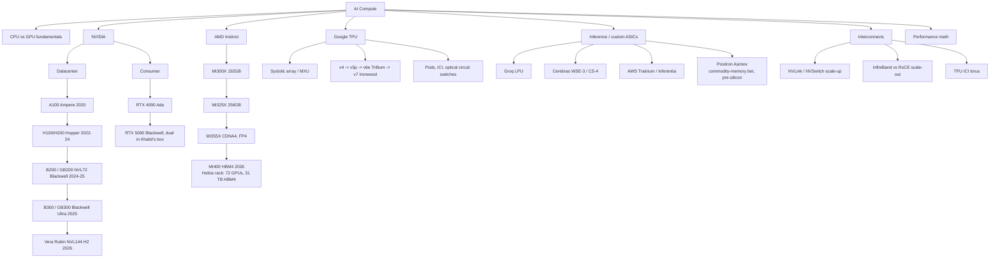

# Topic: hardware

⏱ 12 min read · +9h 13m resources

The compute landscape that everything else in this knowledge base runs on: GPU architectures from Ampere to Blackwell (and Rubin), TPUs, the non-GPU accelerators, the interconnects that make clusters possible, and the back-of-envelope math that tells you whether a workload is compute bound or bandwidth bound before you run it.

Last updated: 2026-09-21 (the trailing dated digest was folded into the body: the Vera Rubin NVL72 measurement, Huawei UnifiedBus and Cornelis now form a rack-scale section, and the September supply-and-grid items joined that section; page-name link converted to a mention).

### Taxonomy

### Map of the space

- **CPU vs GPU**: CPUs have a few complex, latency-optimised cores with deep branch prediction and big caches; GPUs have thousands of simple cores optimised for throughput on data-parallel work. Deep learning is dense linear algebra, which is exactly the regular, branch-free, massively parallel workload GPUs (and even more so TPUs) are built for. Details in [GPU architecture: Ampere to Blackwell](gpu-architecture.md).
- **NVIDIA datacenter line**: A100 (312 TFLOPS BF16, 2 TB/s HBM2e; **HBM** is High Bandwidth Memory, DRAM dies stacked vertically beside the GPU on a silicon interposer over a very wide, slow-clocked bus, which is how these parts reach terabytes per second where a normal DIMM bus reaches tens of gigabytes, and why advanced packaging capacity, not transistors, is the industry bottleneck) -> H100 (989 TFLOPS BF16, FP8, 3.35 TB/s HBM3) -> H200 (same compute, 141 GB at 4.8 TB/s) -> B200 (dual-die, FP4, 192 GB at 8 TB/s, NVLink 5) -> B300 Blackwell Ultra (288 GB, 15 PFLOPS dense FP4) -> Vera Rubin (HBM4, NVL144 racks, ramping H2 2026). The GB200/GB300 NVL72 rack, 72 GPUs in one **NVLink domain** (the set of GPUs wired together by NVLink and its NVSwitch chips so any one of them can read any other's memory at full link speed, which is what makes tensor parallelism across them affordable; step outside the domain and you are on InfiniBand or Ethernet at roughly a twentieth of that bandwidth), is the current unit of frontier training and inference. Nvidia's pitch for the Vera Rubin generation is data orchestration rather than FLOPS: the platform (Rubin GPUs, the Vera CPU, inference accelerators, storage and networking) is sold on how efficiently it feeds GPUs across a distributed system, with Nvidia's VP of storage technology citing "upwards of 3x improvement" on data-movement operations attributable to the Vera CPU removing memory bottlenecks (Aug 2026). Read alongside AMD's MI400 rack numbers below: both vendors have moved the unit of comparison from the card to the rack, and the differentiator each claims is system-level orchestration rather than peak per-chip throughput. [TechCrunch](https://techcrunch.com/2026/08/29/nvidias-ai-advantage-is-moving-beyond-the-gpu/) (~8 min)
- **Consumer**: RTX 4090 (Ada) and RTX 5090 (consumer Blackwell, 32 GB GDDR7 at 1.79 TB/s, native FP4). The 5090 is a serious local inference and fine-tuning card; its two real gaps vs datacenter parts are memory capacity and the lack of NVLink (PCIe only between the pair).
- **AMD**: MI300X made AMD credible on inference (192 GB when H100 had 80). MI325X (256 GB) and MI355X (CDNA4: 288 GB HBM3e, 8 TB/s, FP4/FP6, ROCm with upstream PyTorch) are competitive on paper and increasingly in MLPerf. MI400 with 432 GB HBM4 lands 2026 in the Helios rack, which AMD detailed at Hot Chips 2026 (Aug 24): 72 GPUs in one rack delivering 2.9 exaflops, 31 TB of HBM4 and 1.7 PB/s of aggregate HBM4 bandwidth, so roughly 430 GB per GPU at about 24 TB/s, ahead of the Vera Rubin NVL144 generation on memory capacity per GPU. The software gap with CUDA has narrowed for inference (vLLM, SGLang first-class) more than for training; ROCm 10.0 and its agent-skills channel are covered on [Topic: cuda-and-gpu-programming](../cuda-and-gpu-programming/summary.md).
- **TPUs**: systolic-array machines: weights stay pinned in a grid of MACs (multiply-accumulate cells) while activations stream through, so almost no energy goes to data movement. That grid is the **MXU (Matrix Multiply Unit)**, 128x128 MACs on v4 and v5, 256x256 from v6e, several per chip; chips reach their neighbours over **ICI (Inter-Chip Interconnect)**, dedicated soldered chip-to-chip links forming a 2-D or 3-D torus with no switches anywhere in the path, which is why a pod behaves like a single machine for ring collectives and why sharding on TPU is written as axes over a device mesh rather than as a wrapper class. Current generation is v7 Ironwood (4.6 PFLOPS FP8 per chip, 192 GB HBM3E, pods to 9,216 chips). Ironwood is also the first TPU generation Google sells for other companies' inference workloads rather than keeping for internal use, with Google claiming (Sep 8, 2026) up to 50% better performance per dollar than Nvidia's B200 and B300; whether anyone outside Google can reach that number depends on the software stack, and SemiAnalysis's system teardown of what externalising a decade of internal tooling requires is the test to read the claim against. [SemiAnalysis](https://inferencex.semianalysis.com/blog/tpu-inferencex-full-steam) (35 min). Hardware side in [TPUs: systolic arrays and pod-scale machines](tpus.md), software side in [Topic: jax-and-tpu](../jax-and-tpu/summary.md).
- **Inference ASICs** (application-specific integrated circuits: chips that give up general programmability so nearly every transistor serves one workload shape, buying large gains in performance per watt and per dollar). **Groq LPU (Language Processing Unit)** removes HBM entirely and holds the whole model in on-chip SRAM, roughly 230 MB per chip, fed by a compiler-scheduled, statically timed dataflow with no caches, no dynamic schedulers and no arbitration, so every instruction's timing is fixed at compile time and latency is deterministic to the cycle. What that buys is extreme single-stream tokens per second at batch 1, exactly the regime where a GPU is bandwidth bound; what it costs is that a model of any size must be spread across hundreds of chips, because each one holds so little. **Cerebras WSE-3 (Wafer Scale Engine 3)** goes the opposite way and declines to cut the wafer into chips at all: one die of roughly 46,000 mm2 carrying about 900,000 cores and 44 GB of on-wafer SRAM, so weights and activations travel over on-wafer wiring at petabytes per second instead of crossing a package boundary, which deletes the inter-chip network entirely for any model that fits and is where the 125 PFLOPS and the headline token rates come from; the price is wafer yield engineering, a bespoke compiler and toolchain, and capacity you buy in whole systems rather than in cards. It is now deployed by AWS and used by OpenAI for fast inference. The **CS-4** (announced Aug 19, 2026) puts three WSE-3 Turbo wafers in one system: 250 PFLOPS, 43.2 PB/s memory bandwidth, a claimed 30x GPU inference speed and over 1,000 tokens/s on 10T-plus parameter models, with first shipments in Q3 2026. [Cerebras](https://www.cerebras.ai/cs4) (~5 min). **AWS Trainium and Inferentia** are the hyperscaler cost play: conventional systolic-array accelerators (Trainium sized for training, Inferentia for serving) whose distinctive move is vertical integration rather than microarchitecture, since AWS owns the silicon, the NeuronLink interconnect, the Neuron SDK and the datacenter around them, and can therefore price FLOPs against Nvidia's margin instead of on top of it; Anthropic's Project Rainier is the largest deployment. The standing catch is software: Neuron trails CUDA by a wide margin, so the saving is real only for workloads worth porting. Qualcomm and Amazon announced co-designed custom inference silicon with optical connectivity for AWS on Sep 8, 2026, a second in-house line beside Trainium. Roughly a quarter of 2026 AI server shipments are ASIC-based systems. **Positron Asimov** is the funded bet against HBM itself: $875 million raised on Sep 10, 2026 at a $5 billion valuation, before the chip taped out, for inference silicon designed around commodity memory instead of high-bandwidth memory. It is worth tracking as a falsifiable claim against the arithmetic on this page: decode speed is bytes touched per token divided by memory bandwidth, and the industry has spent five years treating HBM bandwidth as the binding constraint. Positron's bet is that for inference specifically, capacity and cost per gigabyte matter more, which is plausible because of the KV-cache work on [Topic: inference-and-serving](../inference-and-serving/summary.md): if the cache is the thing that fills memory and it is increasingly tiered to SSD anyway, then a part with far more cheap memory and less peak bandwidth may serve more concurrent sequences per dollar. Unproven until silicon exists. [Converge Digest](https://convergedigest.com/positron-ai-raises-875m-asimov-inference-silicon/) (8 min)
- **CPUs and edge silicon**: **Arm Neoverse CSS N4** (Sep 8, 2026) is the conventional server counterpart to the ASICs: up to 128 cores per die at 3.8GHz on TSMC N3P, with LPDDR6 and PCIe 7, claiming 25% better efficiency and double the previous generation's performance on inference-heavy workloads. On device, **Apple's iPhone 18 Pro** ships a 2nm A20 Pro with dual 16-core Neural Engines, doubling on-device FP8 throughput.
- **Interconnects decide parallelism**: NVLink (1.8 TB/s per Blackwell GPU) inside the scale-up domain enables tensor parallelism; InfiniBand (a lossless, credit-flow-controlled fabric purpose-built for RDMA, where a NIC writes straight into a remote GPU's memory with no CPU in the path) or **RoCE (RDMA over Converged Ethernet)**, the same RDMA semantics carried over ordinary Ethernet made lossless by priority flow control and congestion notification, cheaper and multi-vendor but much more sensitive to tuning (400-800 Gb/s per NIC) across nodes carries data and pipeline parallelism. See [Interconnects and scaling: why the network picks your parallelism](interconnects-and-scaling.md).
- **Performance math**: 6ND FLOPs, bytes per parameter, KV-cache size, roofline, MFU, tokens/sec: [Performance math: the arithmetic before every run](performance-math.md). Do this arithmetic before every training run and serving deployment. One caveat at frontier scale: the roofline of a single accelerator increasingly under-predicts, because the binding constraint is getting bytes to the SMs across the fabric, which is the claim both Nvidia's Rubin pitch and AMD's Helios rack numbers rest on.

### Rack-scale competition: Vera Rubin measured, Huawei UnifiedBus, Cornelis

**Vera Rubin NVL72 against GB300 Blackwell, on agentic traffic** (SemiAnalysis, Sep 15, 2026). The map above carries Nvidia's own Vera Rubin pitch, which is about data orchestration rather than FLOPS; this is the first independent measurement behind it. Methodology first, because it decides how to read the numbers: the AgentX benchmark **replays real agentic traffic across a fleet of thousands of chips**, so the workload has multi-turn structure, long contexts, high prefix reuse and sub-agent bursts, which is a different shape from the single-turn traffic accelerator comparisons usually use.

- **Up to 7x better token throughput per megawatt** than GB300, on early pre-release software, against the 3x Nvidia claimed at GTC 2026.
- **1.4x to 3x better throughput per total cost of ownership** at realistic interactivity of 60 to 100 tokens per second. This is the number to use.
- Modelled economics at 75 tokens per second: $159.5B annual revenue and $149.9B modelled profit per all-in utility gigawatt, against GB300's $114.9B and $105.3B, roughly 39 to 42% higher.
- The headline "67x better performance per dollar" is an extreme operating point and should not be quoted.
The per-megawatt figure is the one that connects to the supply and grid section below: if energisation rather than fabrication is the 2027 constraint, then performance per megawatt is the metric that decides how much capability a fixed grid connection can actually host, and a 7x claim on that axis is worth more than any FLOPS comparison. Serving-side reading of the same evaluation on [Topic: inference-and-serving](../inference-and-serving/summary.md). [SemiAnalysis](https://newsletter.semianalysis.com/p/vera-rubin-nvl72-agentic-inference) (35 min)

**Huawei's Ascend 960 roadmap, and the argument that the interconnect is the product** (Reuters, Sep 17, 2026). The first substantial Chinese-silicon entry on this page, and Huawei's framing is the reason it belongs in the interconnect discussion rather than the accelerator list. Schedule, pulled forward on stated demand: **Ascend 960DT in Q1 2027** (three quarters earlier than the previous roadmap), **Ascend 960PR in Q3 2027** (one quarter earlier), then Ascend 970 in 2028 and Ascend 980 in 2029 on an annual cadence. Systems: **Atlas 860 SuperPoD** air-cooled in Q2 2027 and **Atlas 960 SuperPoD** liquid-cooled in Q3 2027. Splitting the 960 into training (DT) and inference (PR) variants is the same move Nvidia and AMD have both made.

**UnifiedBus** is the part that matters. It is Huawei's answer to NVLink, and the claim is that superclusters can link up to **a million** AI processors, with more than 1,000 supernodes already shipped to over 370 customers and 11 semiconductors built on the architecture. Read against the NVLink domain discussion in the map above: the reason an NVLink domain is the unit of frontier compute is that stepping outside it costs roughly a twentieth of the bandwidth, so a vendor constrained on per-chip performance can still compete at rack and cluster scale by making the domain bigger. That is the bet, and it reframes the export-control question from chips to systems.

**Cornelis Active Compute Fabric** (Sep 14 to 18, 2026), $205M led by IAG Capital Partners, with a Qualcomm collaboration announced at the AI Infra Summit. The Intel spinout is attacking Nvidia's **software** lock rather than its silicon: an open, GPU-agnostic scale-up fabric aimed at the fraction of GPU time spent waiting for data to arrive, letting accelerators compute and transmit at once. Already shipping, with a next generation due later in 2026. It belongs next to the NVLink and InfiniBand entries in the map above because it is the first well-funded open challenge to the **scale-up** domain specifically, as distinct from scale-out where RoCE already provides a multi-vendor alternative. Whether it works is an empirical question nobody has answered publicly yet. [TechCrunch](https://techcrunch.com/2026/09/14/ai-infrastructure-company-cornelis-raises-205m-to-chip-away-at-nvidias-dominance/) (8 min)

### Supply, demand and the grid

The demand denominator for every capacity and pricing claim in this KB is Nvidia's datacenter revenue. The Q2 FY27 print (Aug 26, 2026) was $96.2B total revenue (up 106% year on year), of which **$89.0B was datacenter** (up 117% year on year, up 18% sequentially) on the Blackwell Ultra ramp, with $108B guided for the following quarter. Hyperscaler revenue more than doubled year on year; the non-hyperscaler datacenter line (AI natives, enterprises, sovereigns) grew faster still at 138%. [CNBC](https://www.cnbc.com/2026/08/26/nvidia-nvda-earnings-report-q2-2027-live-updates.html) (~8 min)

That demand is visible in the memory market: DRAM prices were up roughly 500% in the twelve months to August 2026, with 128GB of DDR5 at $3,399, squeezed by AI datacenter demand. [Tom's Hardware](https://www.tomshardware.com/pc-components/ram/memory-prices-climb-500-percent-in-12-months-up-to-10x-the-lowest-ever-tracked-prices-128gb-of-ddr5-now-usd3-399) (~5 min). The industry's answer to HBM scarcity is a new tier: Hot Chips 2026 (Aug 24) coverage included **high-bandwidth flash (HBF)** as a capacity tier alongside HBM, which is the same direction Positron's commodity-memory bet and the SSD-tiered KV caches on [Topic: inference-and-serving](../inference-and-serving/summary.md) point. [Chips and Cheese](https://chipsandcheese.com/) (~15 min)

**Energisation, not fabrication, is the 2027 constraint.** Roughly 15GW of AI compute scheduled to come online in 2027 may sit dark because site-level infrastructure will not be ready: high-voltage transformers on 48 to 60 month lead times, backlogged North American grid interconnection queues, plus cooling, networking, permitting and turbine availability. Against an estimated 66GW of US data-center demand by 2027 that is a large fraction of planned capacity delayed after the chips exist. The claim originates with an Elon Musk post (Aug 29, 2026) and is directional rather than audited, but the transformer and interconnection bottlenecks are independently well documented, and it is the right frame for reading Nvidia's revenue growth: shipped is not the same as energised. [Crypto Briefing](https://cryptobriefing.com/musk-warns-15gw-ai-compute-stranded-2027/) (~5 min)

Supply is beginning to respond. **Samsung is expected to more than double HBM4 and HBM4E output in 2027** (reported Sep 20, 2026), the first sign of capacity answering the roughly 500% DRAM price rise above, with the usual multi-quarter lag before it reaches prices. On the demand side the cost of grid upgrades is being pushed onto developers: the **US House passed H.R. 9340 by 417 to 3** (Sep 16, 2026), requiring state utility regulators to charge data-centre sites above 100MW the full cost of the grid upgrades they trigger, with Senate action pending, the federal counterpart to Massachusetts Executive Order 658. **Nvidia and Google proposed a grid-stress framework** (Sep 16, 2026) built on shifting compute loads and paired generation during stress events, still theoretical with deployment testing next, and notable as the first utility-side proposal from the compute vendors rather than from regulators. Against all of that, SemiAnalysis mapped more than 300 local data-centre restrictions (Sep 15, 2026) and estimates only about **2.3GW** of US capacity is actually delayed by them, which is the number that keeps the moratorium story in proportion next to the energisation estimate above.

### Deep dives

- [GPU architecture: Ampere to Blackwell](gpu-architecture.md) (7 min read · +3h 25m resources): SMs, warps, tensor core generations, TMA/wgmma, HBM vs GDDR, 5090 vs H100.
- [TPUs: systolic arrays and pod-scale machines](tpus.md) (6 min read · +3h 15m resources): systolic arrays, MXU, SparseCore, generations v4 to Ironwood, pod and ICI architecture.
- [Interconnects and scaling: why the network picks your parallelism](interconnects-and-scaling.md) (6 min read · +3h resources): NVLink/NVSwitch, InfiniBand vs RoCE, rail-optimised fabrics, collectives in hardware.
- [Performance math: the arithmetic before every run](performance-math.md) (7 min read · +2h 40m resources): FLOPs per token, memory budgets, roofline, MFU, tokens per second, worked on 5090 and H100.

### Best resources for the topic

- [How To Scale Your Model](https://jax-ml.github.io/scaling-book/) (~6h for the full book) (Google DeepMind): the single best systems-for-LLMs text; TPU-centric with a GPU chapter
- [Modal GPU Glossary](https://modal.com/gpu-glossary/readme) (docs, ~30 min for the core pages): concise, accurate reference for every GPU term
- [SemiAnalysis](https://newsletter.semianalysis.com/) (newsletter, ~45 min per deep dive): the best reporting on datacenter hardware, networking, and accelerator economics
- [Chips and Cheese](https://chipsandcheese.com/) (~30 min per deep dive): microarchitecture deep dives on GPUs and accelerators
- [GPU architecture: Ampere to Blackwell](gpu-architecture.md)
- [Interconnects and scaling: why the network picks your parallelism](interconnects-and-scaling.md)
- [Performance math: the arithmetic before every run](performance-math.md)
- [TPUs: systolic arrays and pod-scale machines](tpus.md)
