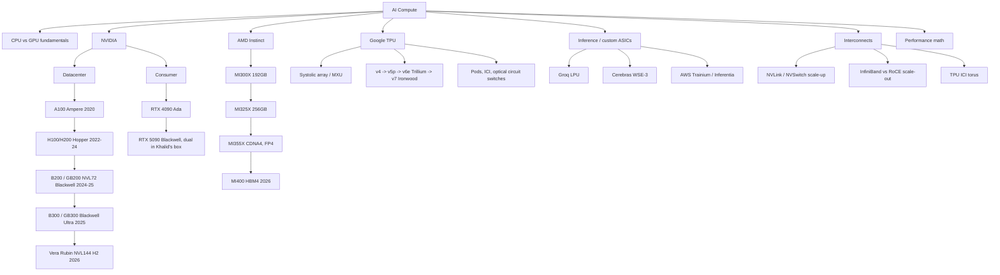

# Hardware for AI

⏱ 10 min read · +8h 30m resources

The compute landscape that everything else in this knowledge base runs on: GPU
architectures from Ampere to Blackwell (and Rubin), TPUs, the non-GPU accelerators,
the interconnects that make clusters possible, and the back-of-envelope math that
tells you whether a workload is compute bound or bandwidth bound before you run it.

Last updated: 2026-08-24.

## Taxonomy

Diagram source (mermaid)

## Map of the space

- **CPU vs GPU**: CPUs have a few complex, latency-optimised cores with deep branch
  prediction and big caches; GPUs have thousands of simple cores optimised for
  throughput on data-parallel work. Deep learning is dense linear algebra, which is
  exactly the regular, branch-free, massively parallel workload GPUs (and even more
  so TPUs) are built for. Details in [gpu-architecture.md](gpu-architecture.md).
- **NVIDIA datacenter line**: A100 (312 TFLOPS BF16, 2 TB/s HBM2e; **HBM** is High
  Bandwidth Memory, DRAM dies stacked vertically beside the GPU on a silicon interposer
  over a very wide, slow-clocked bus, which is how these parts reach terabytes per second
  where a normal DIMM bus reaches tens of gigabytes, and why advanced packaging capacity,
  not transistors, is the industry bottleneck) -> H100 (989 TFLOPS BF16, FP8, 3.35 TB/s
  HBM3) -> H200 (same compute, 141 GB at 4.8 TB/s) -> B200 (dual-die, FP4, 192 GB at
  8 TB/s, NVLink 5) -> B300 Blackwell Ultra (288 GB, 15 PFLOPS dense FP4) -> Vera Rubin
  (HBM4, NVL144 racks, ramping H2 2026). The GB200/GB300 NVL72 rack, 72 GPUs in one
  **NVLink domain** (the set of GPUs wired together by NVLink and its NVSwitch chips so
  any one of them can read any other's memory at full link speed, which is what makes
  tensor parallelism across them affordable; step outside the domain and you are on
  InfiniBand or Ethernet at roughly a twentieth of that bandwidth), is the current unit
  of frontier training and inference.
- **Consumer**: RTX 4090 (Ada) and RTX 5090 (consumer Blackwell, 32 GB GDDR7 at
  1.79 TB/s, native FP4). The 5090 is a serious local inference and fine-tuning
  card; its two real gaps vs datacenter parts are memory capacity and the lack of
  NVLink (PCIe only between the pair).
- **AMD**: MI300X made AMD credible on inference (192 GB when H100 had 80).
  MI325X (256 GB) and MI355X (CDNA4: 288 GB HBM3e, 8 TB/s, FP4/FP6, ROCm 7 with
  upstream PyTorch) are competitive on paper and increasingly in MLPerf; MI400 with
  432 GB HBM4 lands 2026 in the Helios rack. The software gap with CUDA has
  narrowed for inference (vLLM, SGLang first-class) more than for training.
- **TPUs**: systolic-array machines: weights stay pinned in a grid of MACs
  (multiply-accumulate cells) while activations stream through, so almost no energy goes
  to data movement. That grid is the **MXU (Matrix Multiply Unit)**, 128x128 MACs on v4
  and v5, 256x256 from v6e, several per chip; chips reach their neighbours over **ICI
  (Inter-Chip Interconnect)**, dedicated soldered chip-to-chip links forming a 2-D or 3-D
  torus with no switches anywhere in the path, which is why a pod behaves like a single
  machine for ring collectives and why sharding on TPU is written as axes over a device
  mesh rather than as a wrapper class. Current generation is v7 Ironwood (4.6 PFLOPS FP8
  per chip, 192 GB HBM3E, pods to 9,216 chips). Hardware side in [tpus.md](tpus.md),
  software side in [../jax-and-tpu/](../jax-and-tpu/summary.md).
- **Inference ASICs** (application-specific integrated circuits: chips that give up
  general programmability so nearly every transistor serves one workload shape, buying
  large gains in performance per watt and per dollar). **Groq LPU (Language Processing
  Unit)** removes HBM entirely and holds the whole model in on-chip SRAM, roughly 230 MB
  per chip, fed by a compiler-scheduled, statically timed dataflow with no caches, no
  dynamic schedulers and no arbitration, so every instruction's timing is fixed at
  compile time and latency is deterministic to the cycle. What that buys is extreme
  single-stream tokens per second at batch 1, exactly the regime where a GPU is
  bandwidth bound; what it costs is that a model of any size must be spread across
  hundreds of chips, because each one holds so little. **Cerebras WSE-3 (Wafer Scale
  Engine 3)** goes the opposite way and declines to cut the wafer into chips at all: one
  die of roughly 46,000 mm2 carrying about 900,000 cores and 44 GB of on-wafer SRAM, so
  weights and activations travel over on-wafer wiring at petabytes per second instead of
  crossing a package boundary, which deletes the inter-chip network entirely for any
  model that fits and is where the 125 PFLOPS and the headline token rates come from;
  the price is wafer yield engineering, a bespoke compiler and toolchain, and capacity
  you buy in whole systems rather than in cards. It is now deployed by AWS and used by
  OpenAI for fast inference. **AWS Trainium and Inferentia** are the hyperscaler cost
  play: conventional systolic-array accelerators (Trainium sized for training,
  Inferentia for serving) whose distinctive move is vertical integration rather than
  microarchitecture, since AWS owns the silicon, the NeuronLink interconnect, the Neuron
  SDK and the datacenter around them, and can therefore price FLOPs against Nvidia's
  margin instead of on top of it; Anthropic's Project Rainier is the largest deployment.
  The standing catch is software: Neuron trails CUDA by a wide margin, so the saving is
  real only for workloads worth porting. Roughly a quarter of 2026 AI server shipments
  are ASIC-based systems.
  - Added 2026-08-24: Cerebras announced the CS-4 (Aug 19): three WSE-3 Turbo wafers per
    system, 250 PFLOPS, 43.2 PB/s memory bandwidth, claimed 30x GPU inference speed and
    over 1,000 tokens/s on 10T+ parameter models; first shipments this quarter.
    [Cerebras](https://www.cerebras.ai/cs4) (~5 min)
- Added 2026-08-24: memory prices are up roughly 500% in 12 months, with 128GB of DDR5
  now at $3,399, squeezed by AI datacenter demand.
  [Tom's Hardware](https://www.tomshardware.com/pc-components/ram/memory-prices-climb-500-percent-in-12-months-up-to-10x-the-lowest-ever-tracked-prices-128gb-of-ddr5-now-usd3-399) (~5 min)
- Added 2026-08-24: at Hot Chips 2026 (Aug 24), standout coverage includes
  high-bandwidth flash (HBF) as a capacity tier alongside HBM.
  [Chips and Cheese](https://chipsandcheese.com) (~15 min)
- Added 2026-08-31: AMD detailed the **MI400** rack at Hot Chips 2026: 72 GPUs in one
  Helios rack delivering 2.9 exaflops, 31 TB of HBM4, and 1.7 PB/s of aggregate HBM4
  bandwidth. Per-GPU that is roughly 430 GB of HBM4 at about 24 TB/s, which puts it ahead
  of the Vera Rubin NVL144 generation on memory capacity per GPU and makes the rack, not
  the card, the unit of comparison on both sides now. The gating factor stays software:
  ROCm is first-class for inference (vLLM, SGLang) and still trails CUDA for training.
  Update the MI400 line in the taxonomy above accordingly.
- Added 2026-08-31: Nvidia's Q2 FY27 print (Aug 26) is the clearest demand read
  available: $96.2B total revenue (up 106% year on year), of which **$89.0B was
  datacenter** (up 117% year on year, up 18% sequentially) on the Blackwell Ultra ramp,
  with $108B guided for the current quarter. Hyperscaler revenue more than doubled year
  on year; the non-hyperscaler datacenter line (AI natives, enterprises, sovereigns) grew
  faster still at 138%. Useful as the denominator when reading capacity and pricing
  claims elsewhere in this KB.
  [CNBC](https://www.cnbc.com/2026/08/26/nvidia-nvda-earnings-report-q2-2027-live-updates.html) (~8 min)
- Added 2026-08-31 (news backfill): **the Vera Rubin generation's pitch is data
  orchestration, not FLOPS.** Nvidia is selling the platform (Rubin GPUs plus the Vera
  CPU, inference accelerators, storage and networking) on how efficiently it feeds GPUs
  across a distributed system, with Nvidia's VP of storage technology citing "upwards of
  3x improvement" on data-movement operations attributable to the Vera CPU removing
  memory bottlenecks. Read alongside the MI400 rack numbers above: both vendors have
  moved the unit of comparison from the card to the rack, and the differentiator each
  claims is system-level orchestration rather than peak per-chip throughput. Practical
  consequence for the performance math on this KB: for frontier-scale deployments,
  roofline on a single accelerator increasingly under-predicts, because the binding
  constraint is getting bytes to the SMs across the fabric.
  [TechCrunch](https://techcrunch.com/2026/08/29/nvidias-ai-advantage-is-moving-beyond-the-gpu/) (~8 min)
- Added 2026-08-31 (news backfill): **energisation, not fabrication, is the 2027
  constraint.** Roughly 15GW of AI compute scheduled to come online in 2027 may sit dark
  because site-level infrastructure will not be ready: high-voltage transformers on 48
  to 60 month lead times, backlogged North American grid interconnection queues, plus
  cooling, networking, permitting and turbine availability. Against an estimated 66GW of
  US data-center demand by 2027 that is a large fraction of planned capacity delayed
  after the chips exist. The claim originates with an Elon Musk post (Aug 29) and is
  directional rather than audited, but the transformer and interconnection bottlenecks
  are independently well documented, and it is the right frame for reading Nvidia's
  revenue growth: shipped is not the same as energised.
  [Crypto Briefing](https://cryptobriefing.com/musk-warns-15gw-ai-compute-stranded-2027/) (~5 min)
- **Interconnects decide parallelism**: NVLink (1.8 TB/s per Blackwell GPU) inside
  the scale-up domain enables tensor parallelism; InfiniBand (a lossless,
  credit-flow-controlled fabric purpose-built for RDMA, where a NIC writes straight into
  a remote GPU's memory with no CPU in the path) or **RoCE (RDMA over Converged
  Ethernet)**, the same RDMA semantics carried over ordinary Ethernet made lossless by
  priority flow control and congestion notification, cheaper and multi-vendor but much
  more sensitive to tuning (400-800 Gb/s per NIC) across nodes carries data and pipeline
  parallelism. See [interconnects-and-scaling.md](interconnects-and-scaling.md).
- **Performance math**: 6ND FLOPs, bytes per parameter, KV-cache size, roofline,
  MFU, tokens/sec: [performance-math.md](performance-math.md). Do this arithmetic
  before every training run and serving deployment.

## Deep dives

| File | Contents |
|---|---|
| [gpu-architecture.md](gpu-architecture.md) | SMs, warps, tensor core generations (Ampere -> Hopper -> Blackwell), TMA/wgmma, HBM vs GDDR, 5090 vs H100 |
| [tpus.md](tpus.md) | Systolic arrays, MXU, SparseCore, generations v4 -> Ironwood, pod/ICI architecture |
| [interconnects-and-scaling.md](interconnects-and-scaling.md) | NVLink/NVSwitch, InfiniBand vs RoCE, rail-optimised fabrics, collectives in hardware |
| [performance-math.md](performance-math.md) | FLOPs/token, memory budgets, roofline, MFU, tokens/sec worked examples on 5090 and H100 |

### The same deep dives as KB pages, with rolled-up cost

- [GPU architecture: Ampere to Blackwell](gpu-architecture.md) (7 min read · +3h 25m resources)
- [Interconnects and scaling: why the network picks your parallelism](interconnects-and-scaling.md) (6 min read · +3h resources)
- [Performance math: the arithmetic before every run](performance-math.md) (7 min read · +2h 40m resources)
- [TPUs: systolic arrays and pod-scale machines](tpus.md) (6 min read · +3h 15m resources)

## Best resources for the topic

- [How To Scale Your Model](https://jax-ml.github.io/scaling-book/) (~6h for the full book) (Google DeepMind): the single best systems-for-LLMs text; TPU-centric with a GPU chapter
- [Modal GPU Glossary](https://modal.com/gpu-glossary/readme) (docs, ~30 min for the core pages): concise, accurate reference for every GPU term
- [SemiAnalysis](https://newsletter.semianalysis.com/) (newsletter, ~45 min per deep dive): the best reporting on datacenter hardware, networking, and accelerator economics
- [Chips and Cheese](https://chipsandcheese.com/) (~30 min per deep dive): microarchitecture deep dives on GPUs and accelerators

Added 2026-09-14: **a funded bet against HBM, a TPU generation sold to outsiders, and an
Arm inference server part.** **Positron** raised $875 million at a $5 billion valuation
on Sep 10 for **Asimov**, inference silicon designed around **commodity memory instead
of high-bandwidth memory**, and raised it before the chip taped out. That is worth
tracking here because it is a falsifiable claim against the arithmetic on this page:
decode speed is bytes touched per token divided by memory bandwidth, and the industry
has spent five years treating HBM bandwidth as the binding constraint. Positron's bet is
that for inference specifically, capacity and cost per gigabyte matter more, which is
plausible precisely because of the KV-cache work on
[Topic: inference-and-serving](../inference-and-serving/summary.md): if the cache is the
thing that fills memory and it is increasingly tiered to SSD anyway, then a part with far
more cheap memory and less peak bandwidth may serve more concurrent sequences per dollar.
Unproven until silicon exists.
[Converge Digest](https://convergedigest.com/positron-ai-raises-875m-asimov-inference-silicon/) (8 min)

**Google's TPUv7 Ironwood** (Sep 8) reports up to **50% better performance per dollar
than Nvidia's B200 and B300**, and is the first TPU generation Google is selling for
other companies' inference workloads rather than keeping for internal use. The
perf-per-dollar figure is the headline; the software stack is what decides whether
anyone outside Google can reach it, and SemiAnalysis published a full system teardown of
exactly that, covering what externalising a decade of internal tooling actually
requires. Read it as the test of whether this is a competitive threat to Nvidia's
inference position or an internal accounting win that does not travel.
[SemiAnalysis](https://inferencex.semianalysis.com/blog/tpu-inferencex-full-steam) (35 min)

**Arm Neoverse CSS N4** (Sep 8) is the conventional counterpart: up to 128 cores per die
at 3.8GHz on TSMC N3P, with LPDDR6 and PCIe 7, claiming 25% better efficiency and double
the previous generation's performance on inference-heavy workloads. **Qualcomm and
Amazon** announced co-designed custom inference silicon with optical connectivity for
AWS the same day, and **Apple's iPhone 18 Pro** ships a 2nm A20 Pro with dual 16-core
Neural Engines, doubling on-device FP8 throughput.
