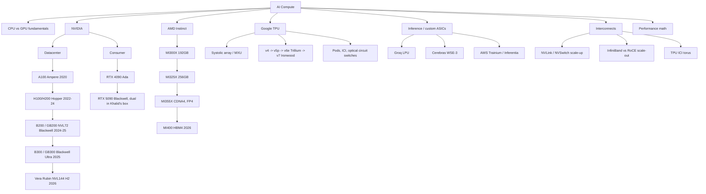

# Hardware for AI

The compute landscape that everything else in this knowledge base runs on: GPU
architectures from Ampere to Blackwell (and Rubin), TPUs, the non-GPU accelerators,
the interconnects that make clusters possible, and the back-of-envelope math that
tells you whether a workload is compute bound or bandwidth bound before you run it.

Last updated: 2026-08-24.

## Taxonomy

Diagram source (mermaid)

## Map of the space

- **CPU vs GPU**: CPUs have a few complex, latency-optimised cores with deep branch
  prediction and big caches; GPUs have thousands of simple cores optimised for
  throughput on data-parallel work. Deep learning is dense linear algebra, which is
  exactly the regular, branch-free, massively parallel workload GPUs (and even more
  so TPUs) are built for. Details in [gpu-architecture.md](gpu-architecture.md).
- **NVIDIA datacenter line**: A100 (312 TFLOPS BF16, 2 TB/s HBM2e) -> H100 (989
  TFLOPS BF16, FP8, 3.35 TB/s HBM3) -> H200 (same compute, 141 GB at 4.8 TB/s) ->
  B200 (dual-die, FP4, 192 GB at 8 TB/s, NVLink 5) -> B300 Blackwell Ultra (288 GB,
  15 PFLOPS dense FP4) -> Vera Rubin (HBM4, NVL144 racks, ramping H2 2026). The
  GB200/GB300 NVL72 rack, 72 GPUs in one NVLink domain, is the current unit of
  frontier training and inference.
- **Consumer**: RTX 4090 (Ada) and RTX 5090 (consumer Blackwell, 32 GB GDDR7 at
  1.79 TB/s, native FP4). The 5090 is a serious local inference and fine-tuning
  card; its two real gaps vs datacenter parts are memory capacity and the lack of
  NVLink (PCIe only between the pair).
- **AMD**: MI300X made AMD credible on inference (192 GB when H100 had 80).
  MI325X (256 GB) and MI355X (CDNA4: 288 GB HBM3e, 8 TB/s, FP4/FP6, ROCm 7 with
  upstream PyTorch) are competitive on paper and increasingly in MLPerf; MI400 with
  432 GB HBM4 lands 2026 in the Helios rack. The software gap with CUDA has
  narrowed for inference (vLLM, SGLang first-class) more than for training.
- **TPUs**: systolic-array machines: weights stay pinned in a grid of MACs while
  activations stream through, so almost no energy goes to data movement. Current
  generation is v7 Ironwood (4.6 PFLOPS FP8 per chip, 192 GB HBM3E, pods to 9,216
  chips). Hardware side in [tpus.md](tpus.md), software side in
  [../jax-and-tpu/](../jax-and-tpu/summary.md).
- **Inference ASICs**: Groq LPU (deterministic SRAM-only dataflow, extreme
  single-stream tokens/sec), Cerebras WSE-3 (wafer-scale, 125 PFLOPS, now deployed
  by AWS and used by OpenAI for fast inference), AWS Trainium3/Inferentia
  (hyperscaler cost play, Anthropic's Project Rainier). Roughly a quarter of 2026
  AI server shipments are ASIC-based systems.
- **Interconnects decide parallelism**: NVLink (1.8 TB/s per Blackwell GPU) inside
  the scale-up domain enables tensor parallelism; InfiniBand/RoCE (400-800 Gb/s
  per NIC) across nodes carries data and pipeline parallelism. See
  [interconnects-and-scaling.md](interconnects-and-scaling.md).
- **Performance math**: 6ND FLOPs, bytes per parameter, KV-cache size, roofline,
  MFU, tokens/sec: [performance-math.md](performance-math.md). Do this arithmetic
  before every training run and serving deployment.

## Deep dives

| File | Contents |
|---|---|
| [gpu-architecture.md](gpu-architecture.md) | SMs, warps, tensor core generations (Ampere -> Hopper -> Blackwell), TMA/wgmma, HBM vs GDDR, 5090 vs H100 |
| [tpus.md](tpus.md) | Systolic arrays, MXU, SparseCore, generations v4 -> Ironwood, pod/ICI architecture |
| [interconnects-and-scaling.md](interconnects-and-scaling.md) | NVLink/NVSwitch, InfiniBand vs RoCE, rail-optimised fabrics, collectives in hardware |
| [performance-math.md](performance-math.md) | FLOPs/token, memory budgets, roofline, MFU, tokens/sec worked examples on 5090 and H100 |

## Best resources for the topic

- [How To Scale Your Model](https://jax-ml.github.io/scaling-book/) (Google DeepMind): the single best systems-for-LLMs text; TPU-centric with a GPU chapter
- [Modal GPU Glossary](https://modal.com/gpu-glossary/readme): concise, accurate reference for every GPU term
- [SemiAnalysis](https://newsletter.semianalysis.com/): the best reporting on datacenter hardware, networking, and accelerator economics
- [Chips and Cheese](https://chipsandcheese.com/): microarchitecture deep dives on GPUs and accelerators
