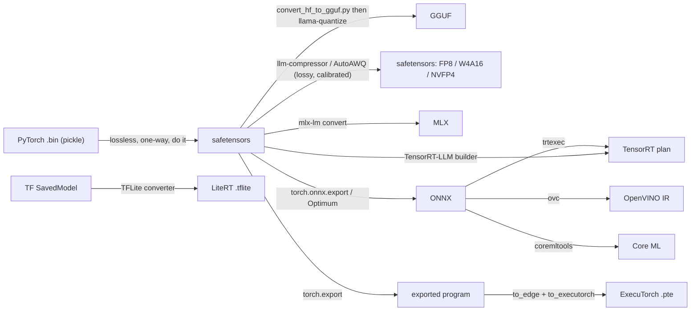

# Model formats: GGUF, safetensors, ONNX, and the rest

⏱ 17 min read · +2h 5m resources

Last updated: 2026-08-31

A model format answers three questions: how tensors are laid out on disk, what metadata travels alongside them, and whether loading the file can execute code. Most confusion here comes from conflating three different things: the **container** (how bytes are stored), the **quantisation scheme** (how numbers are compressed), and the **compiled artifact** (a build output for one GPU and one config). GGUF is unusual precisely because it merges the first two; a TensorRT plan is not really a model format at all.

## Best resources

- [GGUF specification](https://github.com/ggml-org/ggml/blob/master/docs/gguf.md) (20 min): the actual format, short and readable.
- [safetensors repo](https://github.com/huggingface/safetensors) (repo, ~20 min for the entry path): the format, and more importantly the threat model it was built for.
- [CVE-2025-32434 advisory](https://github.com/advisories/GHSA-53q9-r3pm-6pq6) (10 min): `torch.load` RCE even with `weights_only=True`, CVSS 9.3, fixed in PyTorch 2.6. The concrete reason the ecosystem moved.
- [ONNX versioning and opsets](https://github.com/onnx/onnx/blob/main/docs/Versioning.md) (15 min): what an opset number actually pins.
- [Introducing ExecuTorch 1.0 (PyTorch, 2025)](https://pytorch.org/blog/introducing-executorch-1-0/) (15 min): the current shape of on-device PyTorch.
- [fastsafetensors (arXiv 2505.23072)](https://arxiv.org/abs/2505.23072) (45 min): what the loading path costs and how GPU-direct reads change it.

## The comparison

| Format | Owner / ecosystem | What is in the file | Quantisation support | Runtime(s) | Zero-copy / mmap | Reach for it when |
|---|---|---|---|---|---|---|
| **GGUF** | ggml / llama.cpp | Everything: tensors, tokenizer, chat template, architecture hyperparameters, as typed key-value metadata | The format **is** the scheme: per-tensor K-quants, I-quants, MXFP4, ternary TQ | llama.cpp, Ollama, LM Studio, KoboldCpp | Yes, mmap is the normal load path | Local and edge inference, CPU or split CPU/GPU, aggressive low-bit, one-file distribution |
| **safetensors** | Hugging Face | Tensors only, plus a JSON header of names, dtypes, shapes, offsets, and a string-to-string `__metadata__` | None of its own: it stores whatever the quantiser produced, described in `config.json` | PyTorch, vLLM, SGLang, TensorRT-LLM, JAX, MLX | Yes, by design; the point of the layout | The default for distributing and serving weights anywhere in the HF/PyTorch world |
| **PyTorch `.bin` / `.pt` / `.ckpt`** | PyTorch (Python pickle) | A pickled object graph: a state dict, but arbitrary Python objects are representable | None | PyTorch | No, deserialisation is a full parse | Legacy checkpoints only. Treat an untrusted one as an executable, not as data |
| **ONNX** | Linux Foundation, cross-vendor | A protobuf **computation graph** plus initialisers (weights), pinned to an opset version | QDQ nodes, or int8/int4 tensor types via ORT quantisation tools | ONNX Runtime, OpenVINO, TensorRT, mobile and NPU stacks | Partly: external-data files can be mmapped, the graph is parsed | Portability across vendors and languages; classic ML and small models; CPU, NPU, non-NVIDIA accelerators |
| **TensorRT engine (`.plan` / `.engine`)** | NVIDIA | A serialised, compiled execution plan: selected kernels, fused layers, chosen tactics, baked weights | Baked in at build time (fp8, fp4, int8, int4) | TensorRT, TensorRT-LLM, Triton | Yes, but only on the machine it was built for | Peak NVIDIA throughput on a fixed deployment you control and can rebuild |
| **ExecuTorch `.pte`** | PyTorch (Meta) | A flatbuffer program: lowered ATen graph, delegate blobs per backend, and weights | Via torchao / XNNPACK / delegate-specific int4 and int8 | ExecuTorch runtime (C++), iOS, Android, MCUs | Yes, weights can be mmapped, and can be split into a separate `.ptd` | On-device PyTorch where you want one export path across CPU, GPU, and NPU delegates |
| **Core ML `.mlpackage`** | Apple | A directory bundle: a compiled model spec plus weight blobs and a manifest | Palettisation, linear quant, 4-bit and 8-bit, sparsity | Core ML on iOS/macOS, dispatching to CPU, GPU, and the Neural Engine | Compiled to `.mlmodelc` on device; effectively yes after that | Shipping in an Apple app, and the only way to reach the Neural Engine |
| **MLX** | Apple ML Research | Safetensors files plus MLX-specific quantisation metadata in `config.json` | Its own group-wise 2/3/4/6/8-bit | mlx-lm, LM Studio on Apple silicon | Yes, and unified memory means no host-to-device copy at all | Apple silicon, where it generally beats llama.cpp Metal on tokens per second |
| **OpenVINO IR** | Intel | A pair: `.xml` topology plus `.bin` weights | NNCF int8, int4 weight compression | OpenVINO runtime on Intel CPU, iGPU, Arc, NPU | Yes, weights are mmapped from the `.bin` | Intel CPU/NPU deployment, AI PCs, and Intel-heavy edge fleets |
| **TF SavedModel / `.keras`** | Google / Keras | SavedModel is a directory: protobuf graph, variables, assets, signatures. `.keras` is a zip of config JSON plus an HDF5 weights file | Via TF quantisation-aware training or post-training conversion | TensorFlow, TF Serving, Keras 3 (also with JAX and PyTorch backends) | No meaningful zero-copy path | An existing TensorFlow deployment. Not where new LLM work starts |
| **TFLite / LiteRT `.tflite`** | Google (renamed LiteRT in 2024) | A flatbuffer graph with quantised tensors inline | First-class: int8, int4, float16, dynamic-range, selective | LiteRT on Android, iOS, microcontrollers, Coral, GPU/NNAPI delegates | Yes, flatbuffers are read in place | Mobile and embedded, especially non-LLM vision and audio models |
| **HF Hub repo layout** | Hugging Face | Not one file: sharded `model-00001-of-0000N.safetensors` plus an index JSON, `config.json`, tokenizer files, `generation_config.json`, `chat_template.jinja` | Declared in `config.json` under `quantization_config` | transformers, vLLM, SGLang, and nearly everything else | Inherits safetensors' mmap per shard | This is the source of truth. Every other format on this list is downstream of it |

## Why safetensors exists

A PyTorch `.bin` is a **pickle**, and unpickling is by construction a small virtual machine: the `REDUCE` opcode calls an arbitrary callable with arbitrary arguments. Loading a checkpoint therefore ran whatever the person who saved it wanted to run, on your machine, with your credentials. The standard mitigation was `torch.load(..., weights_only=True)`, and **that mitigation failed**: CVE-2025-32434 (CVSS 9.3, fixed in PyTorch 2.6) was exactly a bypass of it, so for two years the recommended-safe path was not safe. That is why `transformers` now refuses to load `.bin` weights on older torch versions rather than warning.

safetensors removes the class of bug rather than patching it. The layout is deliberately dumb: **8 bytes** of little-endian u64 giving the header length, then that many bytes of UTF-8 JSON mapping each tensor name to its `dtype`, `shape`, and `data_offsets` pair, then one contiguous raw byte buffer. Nothing in that grammar can express a callable. There is no code path to exploit because there is no code path.

The layout also happens to be fast, which is why it won on merit and not only on safety. Because tensor bytes are contiguous, correctly typed, and offset-addressed, a loader can `mmap` the file and hand slices straight to the framework with **no parse and no copy**: the OS pages weights in on demand, and a distributed job can load only the shards its rank owns. HF's own headline figure was a BLOOM load dropping from about 10 minutes to 45 seconds across eight GPUs. The header is capped at 100 MB so a malicious file cannot force a huge allocation. Newer work (fastsafetensors) pushes further by reading straight into GPU memory with GPUDirect Storage, skipping the host bounce entirely.

The one thing to remember: **safetensors is a tensor container, not a model.** It carries no architecture, no tokenizer, no chat template. Those live in the sibling files of the Hub repo, which is why the repo layout is a row in the table above and why a safetensors file on its own is not runnable.

## GGUF in detail

GGUF goes the other way: **one file, everything in it.** Tensors, the tokenizer (vocabulary, merges, special-token ids), the chat template, and the architecture hyperparameters all live in the same file, the last three as a typed key-value metadata block at the head. Keys are namespaced strings such as `general.architecture`, `llama.attention.head_count`, `tokenizer.ggml.tokens`, and `tokenizer.chat_template`, with values in a small type system that includes arrays and nested types.

That self-containment is the property that matters, and it is worth being precise about why. It means distribution is a single artifact with no version-skew surface: no Python environment, no `config.json` that can disagree with the weights, no separately-downloaded tokenizer that silently changes tokenisation, no chat template drift between the uploader and you. `ollama run` works because the file already knows how to talk to itself. Against a Hub repo, where weights, config, tokenizer, and generation settings are four artifacts that must stay in sync, this is a real reduction in failure modes, and it is most of why GGUF won local distribution.

Two more structural properties. It is **mmap-friendly**: tensor data is aligned and offset-addressed, so the runtime maps the file and lets the OS page in what it needs, which is how llama.cpp starts a 40 GB model in under a second. And it is **per-tensor typed**: one file can hold some tensors at `Q4_K`, others at `Q6_K`, and the output head at `F16`. That per-tensor mixing is not an incidental feature, it is the entire basis of the K-quant S/M/L recipes.

**Sharding.** Files above a hosting limit (the Hub caps at 50 GB) are split with `llama-gguf-split` into `name-00001-of-00003.gguf`, `name-00002-of-00003.gguf`, and so on. Point the runtime at the first shard and it discovers the rest from the split metadata keys; there is no separate index file as there is on the safetensors side, and you do not need to merge them back first.

**Relationship to GGML.** GGUF (Aug 2023) replaced the older GGML file format, which is why the older `.bin` llama.cpp files and the `ggml-model-q4_0.bin` naming are dead. The problem with GGML was that it had no extensible metadata: hyperparameters were positional, so every new architecture broke the loader and every old file broke on upgrade. GGUF's contribution is the key-value block plus versioning, which made the format forward-compatible. The library is still called ggml; only the file format was renamed.

**The cost.** GGUF is tied to the ggml ecosystem. New architectures need explicit support written into `convert_hf_to_gguf.py`, so there is a lag of days to months between a model's release and a working GGUF, and conversion is one-way in practice.

## ONNX, and why frontier LLM serving does not use it

ONNX is an **interchange graph**: a protobuf description of operators, their connections, and their initialiser weights, with an **opset version** pinning the exact semantics of every operator used. That versioning is the point. An opset-17 `LayerNormalization` means one specific thing forever, so a graph exported today runs on a runtime written later, and the same file dispatches to ONNX Runtime on CPU, OpenVINO on an Intel NPU, or a vendor SDK on an accelerator.

Where it genuinely earns its place: **classic ML** (scikit-learn, XGBoost, and gradient boosting via ONNX's ML opset), **CPU and edge inference**, **embedding and reranker models** in production search stacks, and **non-NVIDIA accelerators**, where ONNX is often the only supported ingestion path. If you are shipping a BERT-sized encoder to a fleet of mixed hardware, ONNX is the right answer.

Where it fails for a frontier decoder, and the reasons are structural rather than a matter of missing effort:

- **Dynamic shapes everywhere.** Batch size, sequence length, and KV-cache length all vary per step and per request. ONNX supports dynamic axes, but every runtime optimisation wants them fixed, so you end up either re-specialising constantly or leaving performance on the table.
- **The KV cache is stateful, and a graph is not.** Expressing an incrementally-grown cache means threading it in and out as graph inputs and outputs per layer, which produces a huge graph and forces cache copies the serving engines specifically exist to avoid. PagedAttention's whole design is a memory allocator; there is no ONNX operator for it.
- **Custom attention kernels.** FlashAttention variants, paged attention, MLA, sliding-window and sink attention, chunked prefill: the actual performance of a modern engine lives in hand-written kernels and their scheduling, none of which survive a graph round-trip. You would export to ONNX and then replace the attention subgraph with a custom op, at which point portability, the only reason to use ONNX, is gone.
- **Continuous batching is a scheduler, not a graph.** The engine's value is in what it does between forward passes.

Net: ONNX for encoders, classic ML, and heterogeneous edge. For frontier LLM serving, the ecosystem converged on safetensors plus a Python-level engine that owns the scheduling.

## Compiled engine formats

A **TensorRT engine plan** is a build output, not a distribution format, and treating it as one is a recurring operational mistake. The builder profiles many kernel implementations on the actual machine, picks tactics, fuses layers, chooses memory formats, and serialises the result along with the weights. The plan is therefore valid only for the **GPU architecture** it was built on (an SM90 plan will not load on SM120), and in practice only for the same TensorRT version, the same CUDA and driver generation, and the batch-size and sequence-length profiles you gave the builder. Anything outside those optimisation profiles either falls back or fails. Every upgrade means a rebuild, so a serious TensorRT deployment has engine-building in CI with the plans treated as cache artifacts keyed on (model, GPU, version, profile), never checked into a model registry as if they were weights.

Worth knowing: **TensorRT-LLM moved to a PyTorch-runtime-first architecture**, so the ahead-of-time compiled-engine workflow is no longer the default path. You increasingly point it at safetensors and get NVIDIA's kernels without owning a build artifact, which removes most of the operational pain that made teams avoid it. Engine plans remain for the last few percent and for fixed-shape production. Details on [NVIDIA Triton Inference Server, TensorRT-LLM, and Dynamo](triton-and-tensorrt.md).

## The conversion map

Rules that matter more than the arrows:

- **Lossless**: pickle to safetensors (a pure re-serialisation), safetensors to GGUF **at F16 or BF16** (a repack, not a requantisation). Both preserve the numbers exactly.
- **Lossy**: anything that changes numeric precision. `llama-quantize` to any Q or IQ type, llm-compressor to fp8 or W4A16, a TensorRT build with int8/fp8/fp4 enabled, Core ML palettisation. Always quantise **from the full-precision original**, never from an already-quantised file: the errors compound and there is no way to recover them.
- **One-way in practice**: everything except the first hop. There is a `gguf-to-hf` direction and various community scripts, but a de-quantised GGUF is not the original model, only its rounded shadow. If you need both a GGUF and a served fp8 checkpoint, produce both from the safetensors original.
- **Lossy in a second, sneakier sense**: graph exports lose things that are not numbers. A `torch.onnx.export` of a generative model bakes in tracing decisions and drops the tokenizer, the chat template, and the generation config. Round-tripping loses your sampling behaviour even when every weight is bit-identical.
- **The practical routes**: HF safetensors to GGUF is `python convert_hf_to_gguf.py path/ --outtype bf16` then `llama-quantize model-bf16.gguf model-Q4_K_M.gguf Q4_K_M`, optionally with `--imatrix`. Safetensors to a served quant is llm-compressor. Safetensors to TensorRT is the TensorRT-LLM builder directly, not via ONNX, for LLMs. PyTorch to ONNX to a vendor runtime is still the route for encoders and vision models.

## Quick chooser

- Serving on NVIDIA with concurrency: **safetensors plus vLLM** (fp8 on Hopper and Blackwell).
- Interactive local chat on the 5090s, or anything that must run partly on CPU: **GGUF plus llama.cpp or Ollama**.
- Distributing a model to non-technical users: **GGUF**, because it is one file that carries its own tokenizer and chat template.
- Publishing a model you trained: **safetensors in a standard Hub repo layout**, and let others convert.
- Peak throughput on a fixed NVIDIA deployment you rebuild on every upgrade: **TensorRT-LLM**, engine plan optional now.
- A BERT-class encoder or classic ML model across mixed hardware: **ONNX**.
- Inside an iOS or macOS app, needing the Neural Engine: **Core ML**. Doing research or local inference on a Mac: **MLX**.
- Android, embedded, or microcontroller: **LiteRT**, or **ExecuTorch** if the model and tooling are PyTorch-native.
- Intel CPU, iGPU, or NPU fleet: **OpenVINO IR**.
- Someone hands you a `.bin` or `.ckpt` from a random repo: **do not load it.** Convert it in a sandbox, or find the safetensors version.

## See also

- Reading a quantisation name (`Q4_K_M`, `IQ4_XS`, `W4A16`, `FP8-dynamic`), the block structures, effective bits per weight, and the imatrix: [Quantization and Precision](../llm-training-and-post-training/quantization-and-precision.md). That page also has the underlying methods (GPTQ, AWQ, SmoothQuant, QAT, NVFP4).
- Running GGUF locally, llama.cpp and Ollama specifics, and the dual-5090 fit arithmetic: [Ollama, llama.cpp, and local serving](ollama-and-local.md).
- Loading safetensors at serving time, and quantised serving in general: [vLLM](vllm.md).
