```mermaid
graph TD
    A[Inference stack] --> B[Engines]
    A --> C[Servers / orchestration]
    A --> D[Local runners]
    A --> E[Core techniques]

    B --> B1[vLLM<br/>default OSS engine]
    B --> B2[SGLang<br/>prefix-heavy + structured]
    B --> B3[TensorRT-LLM<br/>NVIDIA kernels + compiled engines]
    B --> B4[TGI<br/>archived 2026]
    B --> B5[llama.cpp<br/>C/C++ GGUF anywhere]
    B --> B6[MLX<br/>Apple silicon]

    C --> C1[NVIDIA Dynamo<br/>datacenter-scale disagg]
    C --> C2[llm-d<br/>K8s-native, CNCF]
    C --> C3[Triton Inference Server<br/>multi-framework]
    C --> C4[Ray Serve<br/>Python microservices]
    C --> C5[KServe<br/>K8s CRD serving]

    D --> D1[Ollama<br/>llama.cpp++ UX]
    D --> D2[LM Studio<br/>GUI runner]

    E --> E1[KV caching + PagedAttention]
    E --> E2[Continuous batching]
    E --> E3[Prefix caching / RadixAttention]
    E --> E4[Speculative decoding]
    E --> E5[Chunked prefill + P/D disaggregation]
    E --> E6[Quantised serving FP8/INT4]
```

# Inference and Serving

⏱ 15 min read · +6h 25m resources

Last updated: 2026-08-31

The stack that turns model weights into tokens per second. Three layers matter: the
**engine** (owns the GPU: batching, KV cache, kernels), the **server/orchestration**
layer (routes requests across engines and nodes), and the **techniques** that both
layers implement (PagedAttention, continuous batching, speculative decoding, ...).

Diagram source (mermaid)

## The map, briefly

**Engines** (single-replica token factories):

| Engine | One-liner | Reach for it when |
|---|---|---|
| vLLM | The default OSS serving engine; PagedAttention, continuous batching, huge model/hardware coverage | General production serving, batch inference, RL rollouts; broadest ecosystem |
| SGLang | RadixAttention prefix caching, fastest structured output; powers xAI's Grok | Agent loops, RAG, multi-turn chat with heavy shared prefixes, JSON-constrained output |
| TensorRT-LLM | NVIDIA's kernel-optimised engine (now PyTorch-runtime-first, not only compiled engines) | Squeezing peak perf from NVIDIA GPUs, FP4 on Blackwell, NVIDIA-supported stack |
| TGI | Hugging Face's engine; maintenance mode Dec 2025, repo archived Mar 2026 | Do not start new projects on it; migrate to vLLM or SGLang |
| llama.cpp | Dependency-free C/C++ engine for GGUF quants; CPU, CUDA, Metal, Vulkan | Local, edge, consumer GPUs, aggressive low-bit quantisation |
| MLX | Apple's array framework with an LLM stack (mlx-lm) | Serving on Apple silicon unified memory |

**Servers / orchestration** (multi-model, multi-node, routing):

- **NVIDIA Dynamo**: open "inference OS", 1.0 in March 2026. Disaggregated prefill/decode
  across GPU pools, KV-aware smart routing, KV offload to storage tiers. Engine-agnostic:
  runs vLLM, SGLang, or TensorRT-LLM underneath. See [triton-and-tensorrt.md](triton-and-tensorrt.md).
- **llm-d**: Kubernetes-native disaggregated serving built around vLLM (Red Hat, Google,
  et al.), donated to CNCF March 2026. Gateway API Inference Extension for cache-aware
  routing, P/D disaggregation, KV offload.
- **Triton Inference Server**: the veteran multi-framework server (ONNX, PyTorch, TF,
  TensorRT, Python backends), ensembles, dynamic batching. Still the workhorse for mixed
  classic-ML + LLM fleets; for pure LLM serving the centre of gravity moved to Dynamo.
- **Ray Serve**: Python-first serving on Ray; good for composing LLM engines with
  business logic and autoscaling; common inside RLHF/rollout stacks.
- **KServe**: CRD-based model serving on Kubernetes; integrates vLLM as a runtime.

**Local runners**: Ollama (llama.cpp-derived engine, model
registry, OpenAI-compatible API, optional cloud offload) and LM Studio (GUI, MLX +
llama.cpp backends). Right answer for laptops and Khalid's dual RTX 5090 box when
convenience beats throughput; vLLM/SGLang win once you care about concurrent load.

**Techniques**: the shared vocabulary underneath every engine, worked out in full in [inference-techniques.md](inference-techniques.md) (8 min read · +4h 5m resources). What each one actually does:

**KV caching** stores every layer's keys and values for the tokens already seen, so a decode step computes projections for one new token and attends over the cache instead of recomputing the whole history. It turns O(n) work per step into O(1), and pays for it in VRAM that grows linearly with context and batch, which is why KV memory, not weights, is what caps batch size.

**Continuous batching** (also called in-flight batching) schedules at the iteration level rather than the request level: finished sequences leave the batch and waiting ones join at every decode step, instead of a fixed batch being held hostage by its slowest member. On length-variable traffic that is worth roughly an order of magnitude in throughput, and it is the precondition for everything below.

**PagedAttention** manages the KV cache the way an OS manages memory: fixed-size blocks (16 to 64 tokens) allocated on demand, a per-sequence block table, and attention kernels that gather through that table. It removes the 60-80% waste of preallocating contiguous per-sequence buffers, and makes copy-on-write sharing and preemption cheap. The cost is an indirection in the hottest kernel in the system.

**Prefix caching** reuses those blocks *across* requests rather than within one: an identical system prompt, few-shot block, RAG document or chat history is matched on arrival (block hashes in vLLM, a radix tree in SGLang's RadixAttention) and only the novel suffix is prefilled. On agentic and multi-turn traffic, where 60-90% of input tokens are shared, it is the single largest time-to-first-token win available, and it scales out via cache-aware routing that sends a request to the replica already holding its prefix.

**Speculative decoding** spends decode's idle FLOPs: a cheap proposer guesses k tokens, the target model verifies all k in one forward pass, and rejection sampling keeps the accepted output distribution exactly the target's, so the speedup is mathematically lossless rather than an approximation. **EAGLE-3** does the proposing with a one-layer head that autoregresses on the target model's own hidden features, reaching acceptance rates above 0.8; **MTP (multi-token prediction)** instead uses extra heads pretrained alongside the model, which is why frontier MoE models ship with it built in. The catch is that the gains shrink as batch size grows, because other sequences claim the idle FLOPs, so schedulers now vary draft length with load.

**Chunked prefill** splits a long prompt into pieces and co-schedules them with ongoing decodes inside a single per-step token budget, so one 100K-token prompt no longer stalls everyone else's inter-token latency. It costs a little prefill efficiency and buys a smooth ITL; vLLM V1 has it on by default.

**P/D disaggregation** (prefill/decode disaggregation) takes the same problem further apart: run the compute-bound prefill stage and the bandwidth-bound decode stage on *separate* GPU pools with their own parallelism, shipping the KV cache between them over RDMA. Interference disappears, the two stages scale independently, and you can meet a TTFT target and an ITL target at once instead of trading one against the other. The price is a cluster-scale system with a KV transfer path in it, which is why this is a datacenter technique and not a single-node one.

**Quantised serving** at FP8 or INT4 cuts the bytes streamed per token, which is exactly what decode speed is limited by, and frees KV budget for larger batches. FP8 (W8A8) is near-lossless and native on Hopper, Ada and Blackwell; INT4 weight-only (AWQ, GPTQ) is a fit-and-decode-speed play that leaves prefill compute at higher precision. The cost is accuracy, and it is workload-dependent enough that it has to be measured, not assumed.

**MLA (Multi-head Latent Attention)** compresses keys and values into a single low-rank latent vector per token per layer instead of caching them per head, shrinking the cache by roughly 10-30x against multi-head attention and converting decode from bandwidth-starved to compute-rich. That is why DeepSeek can serve long context cheaply, and why MLA-aware kernels became table stakes in every engine. It costs a decompression, which is fused into the attention kernel (FlashMLA) so it lands mostly free.

Underneath all of it is one piece of arithmetic: single-stream decode speed is roughly HBM bandwidth divided by bytes touched per token. Every technique above is either "move fewer bytes" or "amortise the same bytes over more tokens".

## Added 2026-08-31: diffusion drafting arrives in speculative decoding

**DFlash2** (z-lab, released as [incoai/Qwen3.8-27B-DFlash2](https://huggingface.co/incoai/Qwen3.8-27B-DFlash2), model card, 10 min) is a drafter, not a model: it plugs into vLLM or SGLang as the draft stage for Qwen3.8-27B and reports up to **3.43x output throughput** over plain autoregressive decoding, with MLX support so it also runs on Apple silicon.

The mechanism is the interesting part, and it is the first production-shaped use of text diffusion in the serving stack. Instead of drafting one token at a time (EAGLE-style) or reusing the target's own MTP heads, DFlash2 does **block-diffusion drafting**: it predicts an entire block of tokens in a single forward pass, keeps the top candidates at every position in the block, and runs a lightweight selector over that lattice to trace one coherent path to verify. Two-tap dynamic convolutions counter the usual failure of block methods, where draft quality decays toward the end of the block because later positions are conditioned on less settled context. Verification is unchanged, so decoding stays **mathematically lossless**: greedy sampling reproduces the target model's output exactly, and the sampled distribution is preserved.

Why this matters beyond one model: it separates the two things DiffusionGemma bundled together. DiffusionGemma (see [papers/2026-08_diffusiongemma](../../papers/2026-08_diffusiongemma/summary.md)) argued diffusion LMs can be fast but pay a real quality tax; DFlash2 takes the parallel-block generation and discards the quality question entirely by making diffusion a *proposal* mechanism behind an exact verifier. Expect drafters, not standalone diffusion LMs, to be where block-parallel decoding lands in production. Folded into the speculative-decoding section of [inference-techniques.md](inference-techniques.md).

## Added 2026-08-31 (news backfill): vLLM v0.28.0

584 commits from 270 contributors (76 new). The release is a good snapshot of where the engine's effort actually goes now, which is almost entirely sparse-attention MoEs and speculative decoding.

- **Kimi-K3 stack-wide push**: decode context parallel support and fused FlashKDA kernels for Kimi Delta Attention, plus combined all-gathers reporting 1.5-3x kernel-level speedup. Linear-attention models needed engine-side work, and this is it.
- **DeepSeek-V4 sparse MLA end to end** for plain decode, MTP and DSpark, including AMD Quark NVFP4. Sparse attention is no longer a special path.
- **Speculative decoding** gains DFlash2 (the block-diffusion drafter described above) and DSpark confidence-scheduled verification, with an adaptive speculative token budget worth roughly 60% better DSpark TTFT. Note this lands DFlash2 in the engine itself, not just as a model card.
- **Model Runner V2** matures: E/P/D disaggregation (encode as well as prefill and decode) and weight offloading.
- **Tiered KV cache offloading** now reaches disk, with custom tier managers. The KV hierarchy is becoming a first-class storage problem.
- Hardware: ROCm enablement for DeepSeek-V4 and Kimi-K3, Intel XPU torch linear backend with blockwise GEMM, FlashInfer XQA decode on SM12x, a CPU MLA backend.
- **Defaults and breakages worth knowing before upgrading**: `max_num_batched_tokens` doubles from 8192 to 16384, which changes memory footprint and TTFT/throughput balance on existing deployments; bitsandbytes moves to an out-of-tree plugin; Transformers is bumped to 5.15.0; `calculate_kv_scales` and `override_attention_dtype` are removed.

[Release notes](https://github.com/vllm-project/vllm/releases/tag/v0.28.0) (20 min). Fold the technique-level detail into [inference-techniques.md](inference-techniques.md) and the engine detail into [vllm.md](vllm.md).

Related, same window: **DeepSeek-V4-Pro-0813-NVFP4**, Nvidia's NVFP4 quantisation of DeepSeek-V4-Pro-0813 produced with TensorRT Model Optimizer and cleared for commercial use, with AMD publishing its own NVFP4 build of the same base. The pattern to note is that vendor NVFP4 checkpoints of open frontier MoEs now ship close behind the originals, so serving a new open model at 4-bit is increasingly a download rather than a quantisation project. [Hugging Face](https://huggingface.co/nvidia/DeepSeek-V4-Pro-NVFP4) (model card, 5 min)

## Added 2026-09-07: context compression, and the distinction between algorithmic and systems-realisable savings

Added from Khalid's research into long-input short-output QA, not from the weekly sweep. This page has covered every way to make a KV cache cheaper (PagedAttention, prefix caching, MLA, IndexPool, tiered offload) but not the option of **not putting the tokens in the decoder at all**.

There are two families. **KV cache compression** prefills normally and then evicts entries by heuristic: SnapKV scores by aggregated query attention, KVzip uses teacher-forced context reconstruction as a proxy objective, Expected Attention approximates the distribution of future queries in closed form. **Soft-token compression** instead runs a small encoder over the raw input, pools its hidden states into a much shorter sequence of continuous latents, and hands those to the decoder in place of the tokens.

The practical argument for the second family is a systems argument rather than a quality one, and it is worth carrying as a general lesson. KV cache compression must materialise the full cache before it can evict from it, so the expensive prefill still happens; several methods evict non-uniformly across heads and layers, which means they cannot shrink the sequence dimension at all and instead mask evicted positions, forfeiting exactly the memory and throughput benefit a paged-attention engine would give them; and most are unsupported in vLLM and SGLang. Soft-token compression shortens the sequence before the decoder ever sees it, so a higher compression ratio directly reduces decoder work, and the KV layout stays standard so paged attention and prefix caching still apply. **Distinguish algorithmic cache reduction from systems-realisable cache reduction** when reading any paper in this area: a method evaluated by masking entries of a full cache has demonstrated the quality of a compressed cache and nothing about wall-clock or memory.

**LCLM** is the current state of the art and the reason the second family is worth taking seriously again: a 0.6B encoder feeding a 4B decoder, trained end to end on 350B tokens, beating KV cache compression by 5 to 9x on time to first token at equal accuracy, with peak memory flat from 128K to 512K where every KV baseline runs out of memory on a 141GB H200. Its architecture search is the practical guide if you ever build one: mean pooling over special-token pooling, an encoder window of 1024 rather than one aligned to the compression block, causal encoder attention, and a plain MLP adapter. **REFRAG** is the narrower RAG-shaped sibling, where chunk embeddings are precomputed once at index time and an RL policy decides which chunks to expand, reporting 30.75x TTFT acceleration without perplexity loss. Full summary in [End-to-End Context Compression at Scale (LCLM)](../../papers/2026-06_lclm/summary.md) (9 min read · +3h 45m resources).

## Quick chooser

- Production API on NVIDIA GPUs, one node: **vLLM** (default) or **SGLang** (prefix-heavy, structured output).
- Multi-node, disaggregated, datacenter scale: **Dynamo** or **llm-d** on top of the above.
- Mixed model zoo (XGBoost + BERT + LLM) behind one endpoint: **Triton Inference Server**.
- Absolute peak NVIDIA perf, enterprise support: **TensorRT-LLM** (often via Dynamo).
- Laptop / consumer GPU / edge: **Ollama** for convenience, **llama.cpp server** for control, **vLLM** if you need real concurrency on the 5090s.

## Files

- [vllm.md](vllm.md) (8 min read · +4h 25m resources): architecture (PagedAttention, continuous batching, V1 engine), features, how to contribute.
- [sglang.md](sglang.md) (7 min read · +3h 35m resources): RadixAttention, structured generation, vLLM comparison, adoption.
- [ollama-and-local.md](ollama-and-local.md) (7 min read · +2h 15m resources): Ollama, llama.cpp, GGUF quants, dual-RTX-5090 guidance.
- [triton-and-tensorrt.md](triton-and-tensorrt.md) (7 min read · +2h 40m resources): Triton Inference Server vs TensorRT-LLM vs Dynamo; not OpenAI Triton.
- [inference-techniques.md](inference-techniques.md) (8 min read · +4h 5m resources): every technique that makes serving fast, with the math.
- [Model formats: GGUF, safetensors, ONNX, and the rest](model-formats.md) (17 min read · +2h 5m resources): the format comparison table (GGUF, safetensors, ONNX, TensorRT plans, ExecuTorch, Core ML, MLX, OpenVINO, LiteRT, the Hub repo layout), why safetensors replaced pickle, and the conversion map. Added 2026-08-31.

## Best resources: a learning path (added 2026-08-31)

*A curated list by Paolo Perrone. The ordering is the useful part: most people jump straight to the optimisation techniques and then wonder why none of it sticks, because every technique in stage 4 is a response to a constraint introduced in stages 1-3.*

1. **Foundations**: the path every call takes, tokenization, forward pass, autoregressive generation, prefill and decode, KV cache, TTFT and ITL, throughput versus latency. [What is inference](https://theaiengineer.substack.com/p/what-is-inference) (15 min), [Why is inference slow and expensive](https://theaiengineer.substack.com/p/why-is-inference-slow-and-expensive) (15 min).
2. **Transformer internals**, only as deep as the computations the engines optimise: the block, embeddings, self-attention, QKV. [bbycroft.net/llm](https://bbycroft.net/llm) (interactive, ~30 min), the 3D walkthrough of a running model.
3. **GPU and hardware**, because most inference bottlenecks are hardware bottlenecks: SMs, HBM versus SRAM, memory bandwidth, FLOPS, and the compute-bound versus memory-bound distinction that explains everything else. [What is a GPU](https://theaiengineer.substack.com/p/what-is-a-gpu) (12 min), [Why does AI need a GPU](https://theaiengineer.substack.com/p/why-does-ai-need-a-gpu) (12 min), [H100 vs H200 vs B200](https://theaiengineer.substack.com/p/h100-vs-h200-vs-b200) (12 min), [Why your multi-GPU training job keeps failing](https://theaiengineer.substack.com/p/why-your-multi-gpu-training-job-keeps) (12 min), and Horace He's [Making Deep Learning Go Brrrr From First Principles](https://horace.io/brrr_intro.html) (25 min), still the best single explanation of the memory-bandwidth wall.
4. **Optimisation techniques**: quantization, PagedAttention, FlashAttention, chunked prefill, speculative decoding, prompt caching, continuous batching. Covered in depth in [inference-techniques.md](inference-techniques.md) (8 min read · +4h 5m resources); the quantization pair is [What is quantization](https://theaiengineer.substack.com/p/what-is-quantization) (15 min) and [GPTQ vs AWQ](https://theaiengineer.substack.com/p/quantization-in-practice-gptq-vs-awq) (15 min).
5. **Engines**, and matching one to a workload: vLLM for throughput, SGLang when requests share context, llama.cpp for CPU and edge, TensorRT-LLM for peak NVIDIA. [vLLM vs Ollama vs SGLang vs TensorRT](https://theaiengineer.substack.com/p/vllm-vs-ollama-vs-sglang-vs-tensorrt) (15 min), [Should you self-host inference](https://theaiengineer.substack.com/p/should-you-self-host-inference) (12 min), [What breaks when you self-host](https://theaiengineer.substack.com/p/what-breaks-when-you-self-host-an) (10 min), and Aleksa Gordić's [Inside vLLM](https://aleksagordic.com/blog/vllm) (1h), the best code-level tour of a modern engine.

## Papers

- [vLLM / PagedAttention (SOSP 2023)](../../papers/2023-09_vllm-pagedattention/summary.md) (45 min)
- [FlashAttention (2022)](../../papers/2022-05_flashattention/summary.md) (45 min)

## Related topics

- Kernels and the OpenAI Triton language: [../cuda-and-gpu-programming/](../cuda-and-gpu-programming/summary.md)
- Quantisation methods themselves: [../llm-training-and-post-training/](../llm-training-and-post-training/summary.md)
- GPU memory-bandwidth specs: [../hardware/](../hardware/summary.md)

## Added 2026-09-07

*A procedural note first, because it is the more useful finding. This topic looked empty for the window on release feeds alone: vLLM's newest release remains v0.28.0 (Aug 26), and SGLang, PyTorch, TensorRT-LLM, transformers and llama.cpp shipped nothing. The two items below came from Khalid's subscribed newsletters instead. A topic can look empty on release feeds and not be empty.*

**Baseten: the efficient frontier of LLM inference.** The framing is the contribution. Latency, throughput and quality are treated as one frontier rather than three knobs, and the piece then separates the techniques that move a given deployment **along** that frontier (batching policy, quantisation choice, speculative decoding settings, the latency-throughput trade you pick at a given load) from the techniques that push the frontier itself **outward** (better kernels, better KV management, a genuinely better serving architecture). That distinction is the one most inference write-ups blur, and it is the right spine for deciding whether a proposed change is a real win or a repositioning. [Baseten](https://www.baseten.co/blog/the-efficient-frontier-of-llm-inference/) (25 min)

**GLM-5.3-Flash, and what a 1M-token context actually costs.** The model itself is covered on `Topic: llms`; the serving engineering is the part that belongs here, and it only became public this week. Two choices carry the cost. A **hybrid linear plus sparse attention** stack cuts attention compute to roughly one third of GLM-5.3. An **IndexPool** step averages every four lookup vectors before selection, which cuts the KV cache to **under a quarter** of its size at 1M context. Together those are what make the advertised million-token window affordable to serve rather than merely available, and the result is visible in the price: 57 on the Artificial Analysis Intelligence Index at about $0.09 per task, against roughly $2.03 for a comparably placed closed model. Read next to the DeepSeek MLA line already on this page: MLA compresses what you cache, IndexPool reduces what you look up, and the two attack the same bill from different ends. This is now the clearest open-weight example of KV-cache economics deciding what context length a vendor can actually offer. (Source: The Batch, Sep 4, with [Z.ai](http://Z.ai)'s own release notes.)

## Added 2026-09-14

**DeepSeek V4.1-Flash, and KV-cache economics as the headline of a release.** The model is covered on `Topic: llms`; what belongs here is that the KV cache lands at roughly **a quarter of the HBM and an eighth of the SSD footprint** of V4-Flash, and the vendor led with that rather than with a capability score. Four mechanisms are named: grouped-query attention, dynamic head pruning, selective layer caching, and adaptive cache compression. Read next to the two entries above it. DeepSeek's **MLA** compresses what you cache; GLM-5.3-Flash's **IndexPool** reduces what you look up; V4.1-Flash prunes and tiers what you keep, and pushes the cold part to SSD, which is the same tiered-KV direction vLLM v0.28.0 took with disk-reaching offload. Three vendors in three weeks have now made the KV hierarchy the visible product decision rather than an implementation detail, which is the strongest signal yet that context length is priced by cache management and not by attention arithmetic. Pricing bears it out: $0.30 and $1.20 per million at peak, half off-peak, cache hits from $0.006. [DeepSeek API changelog](https://api-docs.deepseek.com/updates/) (10 min)

**Cohere's decode megakernel, and the full serving system around it** (Sep 9). One of the few public end-to-end accounts of a megakernel serving engine rather than a kernel microbenchmark: a single fused decode kernel reaching **292 tokens per second at batch size 1**, which Cohere puts at **62% of speed-of-light** for the part and **1.58x faster than vLLM**, holding through 256K context, wrapped in continuous batching, paged attention, ragged sequence handling and an OpenAI-compatible endpoint. The reason it earns a place next to the entries above: almost every other technique on this page attacks bytes touched per token, and the megakernel attacks kernel launch and scheduling overhead instead. That overhead is negligible at high batch size and dominant at batch size 1, which is exactly the regime interactive single-user serving runs in and the regime the throughput-oriented literature under-serves. Read against the Cerebras entry below: both are answers for the low-batch interactive case, one by removing per-kernel overhead in software, the other by changing the memory system in hardware. [Cohere](https://cohere.com/blog/megakernels) (30 min)

**Random Attention** (Salesforce AI Research). Keeping a **uniformly sampled** subset of KV-cache entries matches or beats learned-importance eviction methods, at lower overhead. This is a negative result about machinery that several serving stacks have already adopted: if random selection is competitive with a learned importance signal, the learned signal is not carrying the weight its complexity implies. It is cheap to test, because the baseline is one line of code, and it is the kind of finding that quietly invalidates a component already in production. Treat it as a control to run against whatever eviction policy you are using rather than as a recommendation to switch. [GitHub](https://github.com/SalesforceAIResearch/Random-Attention) (20 min)

**Phi-Bench, the first measurement of whether models can do the work on this page.** 85 open-ended tasks across nine categories including training systems, inference and serving, compression, kernel optimisation, I/O efficiency and hardware adaptation, in three formats: 55 single-file kernel completions, 20 multi-file repository implementations, and 10 end-to-end optimisations where the model must locate the bottleneck itself. The best model, Claude Opus 5, resolves **36.53%**; Kimi K3 28.12%, Qwen3.8-Max 27.73%; Hardware and Edge is worst at 5.4%. Repository-scale work is much harder than kernels, and longer reasoning budgets do not reliably help. Two behavioural findings are directly usable: the strongest models set up cheap validation before submitting, and they isolate variables and control noise when measuring, which is the discipline any human doing this work needs too. Full summary in [Phi-Bench](https://arxiv.org/abs/2609.10226) under Papers (5 min read, +1h resources).

**Cerebras serving Qwen3.8-27B at roughly 1,500 to 1,850 tokens per second** (Sep 4, one day outside this window and missed by the previous issue, recorded rather than dropped). This is the current ceiling for single-stream decode on an open model, and the reason it belongs on this page is the arithmetic at the bottom of the map above: single-stream decode speed is memory bandwidth divided by bytes touched per token, and a wafer-scale part with weights in on-chip SRAM changes the numerator by an order of magnitude rather than the denominator. Every technique on this page attacks the denominator. This is the only current production answer that attacks the other side. [AlphaSignal](https://alphasignal.ai/news/cerebras-runs-alibaba-s-qwen-3-8-27b-at-1-850-tokens-per-second) (5 min)

**Release feeds, checked and empty, second week running.** vLLM's newest release remains v0.28.0 (Aug 26). SGLang, PyTorch, TensorRT-LLM, transformers and llama.cpp produced nothing in the window. Recorded so a later reader can tell a quiet fortnight from an incomplete sweep.
