```mermaid
graph TD
    A[Inference stack] --> B[Engines]
    A --> C[Servers / orchestration]
    A --> D[Local runners]
    A --> E[Core techniques]

    B --> B1[vLLM<br/>default OSS engine]
    B --> B2[SGLang<br/>prefix-heavy + structured]
    B --> B3[TensorRT-LLM<br/>NVIDIA kernels + compiled engines]
    B --> B4[TGI<br/>archived 2026]
    B --> B5[llama.cpp<br/>C/C++ GGUF anywhere]
    B --> B6[MLX<br/>Apple silicon]

    C --> C1[NVIDIA Dynamo<br/>datacenter-scale disagg]
    C --> C2[llm-d<br/>K8s-native, CNCF]
    C --> C3[Triton Inference Server<br/>multi-framework]
    C --> C4[Ray Serve<br/>Python microservices]
    C --> C5[KServe<br/>K8s CRD serving]

    D --> D1[Ollama<br/>llama.cpp++ UX]
    D --> D2[LM Studio<br/>GUI runner]

    E --> E1[KV caching + PagedAttention]
    E --> E2[Continuous batching]
    E --> E3[Prefix caching / RadixAttention]
    E --> E4[Speculative decoding]
    E --> E5[Chunked prefill + P/D disaggregation]
    E --> E6[Quantised serving FP8/INT4]
```

# Inference and Serving

Last updated: 2026-08-24

The stack that turns model weights into tokens per second. Three layers matter: the
**engine** (owns the GPU: batching, KV cache, kernels), the **server/orchestration**
layer (routes requests across engines and nodes), and the **techniques** that both
layers implement (PagedAttention, continuous batching, speculative decoding, ...).

Diagram source (mermaid)

## The map, briefly

**Engines** (single-replica token factories):

| Engine | One-liner | Reach for it when |
|---|---|---|
| [vLLM](vllm.md) | The default OSS serving engine; PagedAttention, continuous batching, huge model/hardware coverage | General production serving, batch inference, RL rollouts; broadest ecosystem |
| [SGLang](sglang.md) | RadixAttention prefix caching, fastest structured output; powers xAI's Grok | Agent loops, RAG, multi-turn chat with heavy shared prefixes, JSON-constrained output |
| [TensorRT-LLM](triton-and-tensorrt.md) | NVIDIA's kernel-optimised engine (now PyTorch-runtime-first, not only compiled engines) | Squeezing peak perf from NVIDIA GPUs, FP4 on Blackwell, NVIDIA-supported stack |
| TGI | Hugging Face's engine; maintenance mode Dec 2025, repo archived Mar 2026 | Do not start new projects on it; migrate to vLLM or SGLang |
| [llama.cpp](ollama-and-local.md) | Dependency-free C/C++ engine for GGUF quants; CPU, CUDA, Metal, Vulkan | Local, edge, consumer GPUs, aggressive low-bit quantisation |
| MLX | Apple's array framework with an LLM stack (mlx-lm) | Serving on Apple silicon unified memory |

**Servers / orchestration** (multi-model, multi-node, routing):

- **NVIDIA Dynamo**: open "inference OS", 1.0 in March 2026. Disaggregated prefill/decode
  across GPU pools, KV-aware smart routing, KV offload to storage tiers. Engine-agnostic:
  runs vLLM, SGLang, or TensorRT-LLM underneath. See [triton-and-tensorrt.md](triton-and-tensorrt.md).
- **llm-d**: Kubernetes-native disaggregated serving built around vLLM (Red Hat, Google,
  et al.), donated to CNCF March 2026. Gateway API Inference Extension for cache-aware
  routing, P/D disaggregation, KV offload.
- **Triton Inference Server**: the veteran multi-framework server (ONNX, PyTorch, TF,
  TensorRT, Python backends), ensembles, dynamic batching. Still the workhorse for mixed
  classic-ML + LLM fleets; for pure LLM serving the centre of gravity moved to Dynamo.
- **Ray Serve**: Python-first serving on Ray; good for composing LLM engines with
  business logic and autoscaling; common inside RLHF/rollout stacks.
- **KServe**: CRD-based model serving on Kubernetes; integrates vLLM as a runtime.

**Local runners**: [Ollama](ollama-and-local.md) (llama.cpp-derived engine, model
registry, OpenAI-compatible API, optional cloud offload) and LM Studio (GUI, MLX +
llama.cpp backends). Right answer for laptops and Khalid's dual RTX 5090 box when
convenience beats throughput; vLLM/SGLang win once you care about concurrent load.

**Techniques**: the shared vocabulary underneath every engine, in
[inference-techniques.md](inference-techniques.md): KV caching, continuous batching,
PagedAttention, prefix caching, speculative decoding (EAGLE-3, MTP), chunked prefill,
prefill/decode disaggregation, FP8/INT4 quantised serving, MLA, and the
memory-bandwidth arithmetic that explains all of it.

## Quick chooser

- Production API on NVIDIA GPUs, one node: **vLLM** (default) or **SGLang** (prefix-heavy, structured output).
- Multi-node, disaggregated, datacenter scale: **Dynamo** or **llm-d** on top of the above.
- Mixed model zoo (XGBoost + BERT + LLM) behind one endpoint: **Triton Inference Server**.
- Absolute peak NVIDIA perf, enterprise support: **TensorRT-LLM** (often via Dynamo).
- Laptop / consumer GPU / edge: **Ollama** for convenience, **llama.cpp server** for control, **vLLM** if you need real concurrency on the 5090s.

## Files

- [vllm.md](vllm.md): architecture (PagedAttention, continuous batching, V1 engine), features, how to contribute.
- [sglang.md](sglang.md): RadixAttention, structured generation, vLLM comparison, adoption.
- [ollama-and-local.md](ollama-and-local.md): Ollama, llama.cpp, GGUF quants, dual-RTX-5090 guidance.
- [triton-and-tensorrt.md](triton-and-tensorrt.md): Triton Inference Server vs TensorRT-LLM vs Dynamo; not OpenAI Triton.
- [inference-techniques.md](inference-techniques.md): every technique that makes serving fast, with the math.

## Papers

- [vLLM / PagedAttention (SOSP 2023)](../../papers/2023-09_vllm-pagedattention/summary.md)
- [FlashAttention (2022)](../../papers/2022-05_flashattention/summary.md)

## Related topics

- Kernels and the OpenAI Triton language: [../cuda-and-gpu-programming/](../cuda-and-gpu-programming/)
- Quantisation methods themselves: [../llm-training-and-post-training/](../llm-training-and-post-training/)
- GPU memory-bandwidth specs: [../hardware/](../hardware/)
