# Topic: inference-and-serving

⏱ 19 min read · +7h 30m resources

Last updated: 2026-09-21 (dated tail folded into the map and technique sections; DFlash2 mechanism moved to the techniques deep dive and vLLM v0.28.0 engine detail to the vLLM page)

The stack that turns model weights into tokens per second. Three layers matter: the **engine** (owns the GPU: batching, KV cache, kernels), the **server/orchestration** layer (routes requests across engines and nodes), and the **techniques** that both layers implement (PagedAttention, continuous batching, speculative decoding, ...).

```mermaid
graph TD
    A[Inference stack] --> B[Engines]
    A --> C[Servers / orchestration]
    A --> D[Local runners]
    A --> E[Core techniques]

    B --> B1[vLLM<br/>default OSS engine]
    B --> B2[SGLang<br/>prefix-heavy + structured]
    B --> B3[TensorRT-LLM<br/>NVIDIA kernels + compiled engines]
    B --> B4[TGI<br/>archived 2026]
    B --> B5[llama.cpp<br/>C/C++ GGUF anywhere]
    B --> B6[MLX<br/>Apple silicon]

    C --> C1[NVIDIA Dynamo<br/>datacenter-scale disagg]
    C --> C2[llm-d<br/>K8s-native, CNCF]
    C --> C3[Triton Inference Server<br/>multi-framework]
    C --> C4[Ray Serve<br/>Python microservices]
    C --> C5[KServe<br/>K8s CRD serving]

    D --> D1[Ollama<br/>llama.cpp++ UX]
    D --> D2[LM Studio<br/>GUI runner]

    E --> E1[KV caching + PagedAttention]
    E --> E2[Continuous batching]
    E --> E3[Prefix caching / RadixAttention]
    E --> E4[Speculative decoding]
    E --> E5[Chunked prefill + P/D disaggregation]
    E --> E6[Quantised serving FP8/INT4]
```

### The map, briefly

**Engines** (single-replica token factories):

| Engine | One-liner | Reach for it when |
| --- | --- | --- |
| vLLM | The default OSS serving engine; PagedAttention, continuous batching, huge model/hardware coverage | General production serving, batch inference, RL rollouts; broadest ecosystem |
| SGLang | RadixAttention prefix caching, fastest structured output; powers xAI's Grok | Agent loops, RAG, multi-turn chat with heavy shared prefixes, JSON-constrained output |
| TensorRT-LLM | NVIDIA's kernel-optimised engine (now PyTorch-runtime-first, not only compiled engines) | Squeezing peak perf from NVIDIA GPUs, FP4 on Blackwell, NVIDIA-supported stack |
| TGI | Hugging Face's engine; maintenance mode Dec 2025, repo archived Mar 2026 | Do not start new projects on it; migrate to vLLM or SGLang |
| llama.cpp | Dependency-free C/C++ engine for GGUF quants; CPU, CUDA, Metal, Vulkan | Local, edge, consumer GPUs, aggressive low-bit quantisation |
| MLX | Apple's array framework with an LLM stack (mlx-lm) | Serving on Apple silicon unified memory |

**Servers / orchestration** (multi-model, multi-node, routing):

- **NVIDIA Dynamo**: open "inference OS", 1.0 in March 2026. Disaggregated prefill/decode across GPU pools, KV-aware smart routing, KV offload to storage tiers. Engine-agnostic: runs vLLM, SGLang, or TensorRT-LLM underneath. See [NVIDIA Triton Inference Server, TensorRT-LLM, and Dynamo](triton-and-tensorrt.md).
- **llm-d**: Kubernetes-native disaggregated serving built around vLLM (Red Hat, Google, et al.), donated to CNCF March 2026. Gateway API Inference Extension for cache-aware routing, P/D disaggregation, KV offload.
- **Triton Inference Server**: the veteran multi-framework server (ONNX, PyTorch, TF, TensorRT, Python backends), ensembles, dynamic batching. Still the workhorse for mixed classic-ML + LLM fleets; for pure LLM serving the centre of gravity moved to Dynamo.
- **Ray Serve**: Python-first serving on Ray; good for composing LLM engines with business logic and autoscaling; common inside RLHF/rollout stacks.
- **KServe**: CRD-based model serving on Kubernetes; integrates vLLM as a runtime.
**Local runners**: Ollama (llama.cpp-derived engine, model registry, OpenAI-compatible API, optional cloud offload) and LM Studio (GUI, MLX + llama.cpp backends). Right answer for laptops and Khalid's dual RTX 5090 box when convenience beats throughput; vLLM/SGLang win once you care about concurrent load.

**Techniques**: the shared vocabulary underneath every engine, worked out in full in [Inference techniques: what actually makes serving fast](inference-techniques.md) (8 min read · +4h 5m resources). What each one actually does:

**KV caching** stores every layer's keys and values for the tokens already seen, so a decode step computes projections for one new token and attends over the cache instead of recomputing the whole history. It turns O(n) work per step into O(1), and pays for it in VRAM that grows linearly with context and batch, which is why KV memory, not weights, is what caps batch size.

**Continuous batching** (also called in-flight batching) schedules at the iteration level rather than the request level: finished sequences leave the batch and waiting ones join at every decode step, instead of a fixed batch being held hostage by its slowest member. On length-variable traffic that is worth roughly an order of magnitude in throughput, and it is the precondition for everything below.

**PagedAttention** manages the KV cache the way an OS manages memory: fixed-size blocks (16 to 64 tokens) allocated on demand, a per-sequence block table, and attention kernels that gather through that table. It removes the 60-80% waste of preallocating contiguous per-sequence buffers, and makes copy-on-write sharing and preemption cheap. The cost is an indirection in the hottest kernel in the system.

**Prefix caching** reuses those blocks *across* requests rather than within one: an identical system prompt, few-shot block, RAG document or chat history is matched on arrival (block hashes in vLLM, a radix tree in SGLang's RadixAttention) and only the novel suffix is prefilled. On agentic and multi-turn traffic, where 60-90% of input tokens are shared, it is the single largest time-to-first-token win available, and it scales out via cache-aware routing that sends a request to the replica already holding its prefix.

**Speculative decoding** spends decode's idle FLOPs: a cheap proposer guesses k tokens, the target model verifies all k in one forward pass, and rejection sampling keeps the accepted output distribution exactly the target's, so the speedup is mathematically lossless rather than an approximation. **EAGLE-3** does the proposing with a one-layer head that autoregresses on the target model's own hidden features, reaching acceptance rates above 0.8; **MTP (multi-token prediction)** instead uses extra heads pretrained alongside the model, which is why frontier MoE models ship with it built in; **block-diffusion drafting** (DFlash2, below) proposes a whole block per forward pass. The catch is that the gains shrink as batch size grows, because other sequences claim the idle FLOPs, so schedulers now vary draft length with load.

**Chunked prefill** splits a long prompt into pieces and co-schedules them with ongoing decodes inside a single per-step token budget, so one 100K-token prompt no longer stalls everyone else's inter-token latency. It costs a little prefill efficiency and buys a smooth ITL; vLLM V1 has it on by default.

**P/D disaggregation** (prefill/decode disaggregation) takes the same problem further apart: run the compute-bound prefill stage and the bandwidth-bound decode stage on *separate* GPU pools with their own parallelism, shipping the KV cache between them over RDMA. Interference disappears, the two stages scale independently, and you can meet a TTFT target and an ITL target at once instead of trading one against the other. The price is a cluster-scale system with a KV transfer path in it, which is why this is a datacenter technique and not a single-node one.

**Quantised serving** at FP8 or INT4 cuts the bytes streamed per token, which is exactly what decode speed is limited by, and frees KV budget for larger batches. FP8 (W8A8) is near-lossless and native on Hopper, Ada and Blackwell; INT4 weight-only (AWQ, GPTQ) is a fit-and-decode-speed play that leaves prefill compute at higher precision. The cost is accuracy, and it is workload-dependent enough that it has to be measured, not assumed. Vendor 4-bit checkpoints of open frontier MoEs now ship close behind the originals, Nvidia's **DeepSeek-V4-Pro-0813-NVFP4** being the pattern case: produced with TensorRT Model Optimizer and cleared for commercial use, with AMD publishing its own NVFP4 build of the same base. Serving a new open model at 4 bit is increasingly a download rather than a quantisation project. [Hugging Face](https://huggingface.co/nvidia/DeepSeek-V4-Pro-NVFP4) (model card, 5 min)

**MLA (Multi-head Latent Attention)** compresses keys and values into a single low-rank latent vector per token per layer instead of caching them per head, shrinking the cache by roughly 10-30x against multi-head attention and converting decode from bandwidth-starved to compute-rich. That is why DeepSeek can serve long context cheaply, and why MLA-aware kernels became table stakes in every engine. It costs a decompression, which is fused into the attention kernel (FlashMLA) so it lands mostly free.

**Cache economics decide what context length a vendor can actually offer**, and as of September 2026 three open-weight releases have made that the visible product decision rather than an implementation detail. MLA compresses what you cache. **GLM-5.3-Flash** reduces what you look up: an **IndexPool** step averages every four lookup vectors before selection, cutting the KV cache to **under a quarter** of its size at 1M context, on top of a **hybrid linear plus sparse attention** stack that cuts attention compute to roughly a third of GLM-5.3. Together those are what make its advertised million-token window affordable to serve rather than merely available, and the result is visible in the price: 57 on the Artificial Analysis Intelligence Index at about $0.09 per task, against roughly $2.03 for a comparably placed closed model. (Source: The Batch, 2026-09-04, with [Z.ai](http://z.ai/)'s own release notes.) **DeepSeek V4.1-Flash** prunes and tiers what it keeps and pushes the cold part to SSD, which is the same direction vLLM took with disk-reaching KV offload; it has its own section below. The models themselves are covered on [Topic: llms](../llms/summary.md); what belongs here is that context length is priced by cache management, not by attention arithmetic.

Underneath all of it is one piece of arithmetic: single-stream decode speed is roughly HBM bandwidth divided by bytes touched per token. Every technique above is either "move fewer bytes" or "amortise the same bytes over more tokens".

One framing is worth carrying while reading any of it. Baseten's **efficient frontier** treats latency, throughput and quality as a single frontier rather than three independent knobs, then separates the techniques that move a given deployment *along* that frontier (batching policy, quantisation choice, speculative-decoding settings, the latency-throughput trade you pick at a given load) from the techniques that push the frontier itself *outward* (better kernels, better KV management, a genuinely better serving architecture). That distinction is the one most inference write-ups blur, and it is the right test for whether a proposed change is a real win or a repositioning. [Baseten](https://www.baseten.co/blog/the-efficient-frontier-of-llm-inference/) (25 min)

**The batch-size-1 interactive regime has its own two answers**, and both sit outside the bytes-per-token framing. In software, a **decode megakernel** attacks kernel launch and scheduling overhead instead of bytes moved. Cohere's (2026-09-09) is one of the few public end-to-end accounts of a megakernel serving engine rather than a kernel microbenchmark: a single fused decode kernel reaching **292 tokens per second at batch size 1**, which Cohere puts at **62% of speed-of-light** for the part and **1.58x faster than vLLM**, holding through 256K context, wrapped in continuous batching, paged attention, ragged sequence handling and an OpenAI-compatible endpoint. That overhead is negligible at high batch size and dominant at batch size 1, which is exactly the regime interactive single-user serving runs in and the regime the throughput-oriented literature under-serves. [Cohere](https://cohere.com/blog/megakernels) (30 min). In hardware, **Cerebras serves Qwen3.8-27B at roughly 1,500 to 1,850 tokens per second** (2026-09-04), the current ceiling for single-stream decode on an open model: a wafer-scale part with weights in on-chip SRAM changes the bandwidth numerator by an order of magnitude, where every technique on this page attacks the denominator. [AlphaSignal](https://alphasignal.ai/news/cerebras-runs-alibaba-s-qwen-3-8-27b-at-1-850-tokens-per-second) (5 min)

### Block-diffusion drafting in speculative decoding

**DFlash2** (z-lab, released as [incoai/Qwen3.8-27B-DFlash2](https://huggingface.co/incoai/Qwen3.8-27B-DFlash2), model card, 10 min) is a drafter, not a model: it plugs into vLLM or SGLang as the draft stage for Qwen3.8-27B and reports up to **3.43x output throughput** over plain autoregressive decoding, with MLX support so it also runs on Apple silicon.

The mechanism is the first production-shaped use of text diffusion in the serving stack, and it is worked out in the speculative-decoding section of [Inference techniques: what actually makes serving fast](inference-techniques.md): a whole block of tokens predicted in one forward pass, top candidates kept at every position, a lightweight selector tracing one coherent path through that lattice, two-tap dynamic convolutions against block-end quality decay, and an unchanged verifier that keeps decoding mathematically lossless.

Why it matters beyond one model: it separates the two things DiffusionGemma bundled together. DiffusionGemma (see [Papers](../../papers/INDEX.md)) argued diffusion LMs can be fast but pay a real quality tax; DFlash2 takes the parallel-block generation and discards the quality question entirely by making diffusion a *proposal* mechanism behind an exact verifier. Expect drafters, not standalone diffusion LMs, to be where block-parallel decoding lands in production.

### Context compression, and the distinction between algorithmic and systems-realisable savings

This page has covered every way to make a KV cache cheaper (PagedAttention, prefix caching, MLA, IndexPool, tiered offload) but not the option of **not putting the tokens in the decoder at all**.

There are two families. **KV cache compression** prefills normally and then evicts entries by heuristic: SnapKV scores by aggregated query attention, KVzip uses teacher-forced context reconstruction as a proxy objective, Expected Attention approximates the distribution of future queries in closed form. **Soft-token compression** instead runs a small encoder over the raw input, pools its hidden states into a much shorter sequence of continuous latents, and hands those to the decoder in place of the tokens.

The practical argument for the second family is a systems argument rather than a quality one, and it is worth carrying as a general lesson. KV cache compression must materialise the full cache before it can evict from it, so the expensive prefill still happens; several methods evict non-uniformly across heads and layers, which means they cannot shrink the sequence dimension at all and instead mask evicted positions, forfeiting exactly the memory and throughput benefit a paged-attention engine would give them; and most are unsupported in vLLM and SGLang. Soft-token compression shortens the sequence before the decoder ever sees it, so a higher compression ratio directly reduces decoder work, and the KV layout stays standard so paged attention and prefix caching still apply. **Distinguish algorithmic cache reduction from systems-realisable cache reduction** when reading any paper in this area: a method evaluated by masking entries of a full cache has demonstrated the quality of a compressed cache and nothing about wall-clock or memory.

Before adopting any eviction policy at all, run the cheap control. **Random Attention** (Salesforce AI Research) finds that keeping a **uniformly sampled** subset of KV-cache entries matches or beats learned-importance eviction methods, at lower overhead. That is a negative result about machinery several serving stacks have already adopted: if random selection is competitive with a learned importance signal, the learned signal is not carrying the weight its complexity implies. The baseline is one line of code, which makes it the kind of finding that quietly invalidates a component already in production. Treat it as a control to run against whatever eviction policy you are using rather than as a recommendation to switch. [GitHub](https://github.com/SalesforceAIResearch/Random-Attention) (20 min)

**LCLM** is the current state of the art and the reason the second family is worth taking seriously again: a 0.6B encoder feeding a 4B decoder, trained end to end on 350B tokens, beating KV cache compression by 5 to 9x on time to first token at equal accuracy, with peak memory flat from 128K to 512K where every KV baseline runs out of memory on a 141GB H200. Its architecture search is the practical guide if you ever build one: mean pooling over special-token pooling, an encoder window of 1024 rather than one aligned to the compression block, causal encoder attention, and a plain MLP adapter. **REFRAG** is the narrower RAG-shaped sibling, where chunk embeddings are precomputed once at index time and an RL policy decides which chunks to expand, reporting 30.75x TTFT acceleration without perplexity loss. Full summary in [End-to-End Context Compression at Scale (Latent Context Language Models)](../../papers/2026-06_lclm/summary.md) (9 min read · +3h 45m resources).

### Engine releases: where the effort is actually going

**vLLM v0.28.0** (Aug 2026) was the sparse-attention-MoE and speculative-decoding release: DFlash2 block-diffusion drafting and DSpark confidence-scheduled verification in the engine itself, an adaptive speculative token budget, Kimi-K3 decode context parallel with fused FlashKDA kernels, DeepSeek-V4 sparse MLA end to end, Model Runner V2 with E/P/D disaggregation, and tiered KV offload reaching disk. It also doubles the `max_num_batched_tokens` default, so read the upgrade notes before moving an existing deployment. Technique-level detail lives in [Inference techniques: what actually makes serving fast](inference-techniques.md), engine detail and breaking changes in [vLLM](vllm.md). [Release notes](https://github.com/vllm-project/vllm/releases/tag/v0.28.0) (20 min)

**vLLM v0.29.0**: 594 commits from 277 contributors, 91 of them new. **Model Runner V2 is now the default for all models**, completing the rollout that began with pooling model support, and Model Runner V1 is deprecated with removal targeted for v0.32. Two features are not yet supported on V2, **sequence parallelism and dual-batch overlap**, with the team expecting to close the gap in two to three weeks, so a deployment relying on either should pin V1 until then. Performance work concentrates where this page already says the effort goes, on sparse-attention mixtures of experts and speculative decoding: for Kimi-K3, fused MXFP4 top-k finalisation cutting latency by roughly 5% and a 6.6x to 7.6x kernel speedup on Mamba metadata handling; for DeepSeek V4, fused expert operations and adaptive selection. Five new model families including **Hy4-preview** (770B with sparse attention) and **Qwen3.8-Flash-Next** in several quantisation formats. Speculative decoding gains per-request acceptance statistics in OpenAI API responses and adaptive verification extended to logprobs, which makes acceptance rate an observable rather than something to infer. Breaking changes worth knowing before upgrading: ten deprecated model architectures removed, several models migrated to the Transformers backend, and the PyAV video decoder dropped in favour of OpenCV or Torchcodec. [Release notes](https://github.com/vllm-project/vllm/releases/tag/v0.29.0) (20 min)

**SGLang v0.5.18**: 710 pull requests from 212 contributors. New models include Muse Glimmer, Intern-S2-Mobius, SANA-Video, LingBot-Video-MoE, LTX-2.5 and Cosmos3. The engineering item worth carrying is **overlapped checkpoint staging at startup, cutting startup time by 2.38x**, which matters more than it sounds: startup time is what sets how cheaply a fleet can scale a replica in or roll one back, and it has been the quietly ignored number in every engine comparison. Plus a TP LMHead optimisation and FlashInfer improvements, on PyTorch 2.13.0 with Triton 3.7.1.

### BITCOS, and why the 1.585-bit floor was never the floor

Ternary weights take three values, so information theory puts them at 1.585 bits each, and the standard five-trit packing rounds that up to 1.625 bits by treating the three symbols as equally likely. Across 29 ternary models they are not: **zeros reach up to 51.5% of all weights**. BITCOS (Georganas, Heinecke and Dubey, 2026-09-14) encodes a dense presence bitmap plus a compacted sign vector, costing **2 minus z bits per weight** where z is zero density, which beats five-trit packing on 26 of the 29 models and reaches **1.485 bits** on the sparsest. Matrix-vector kernels run up to 1.28x faster, end-to-end inference 1.18x faster on CPUs and 1.27x on GPUs across five platforms, with optimised unpacking for AVX-512, AVX2 and Intel Xe2.

The reason it belongs next to the quantised-serving entry rather than in a paper list: the arithmetic in the map on this page says decode speed is bytes touched per token divided by memory bandwidth, and every technique here either moves fewer bytes or amortises the same bytes. BITCOS moves fewer bytes by exploiting a **distributional property of the weights that nobody was measuring**, without changing the model at all. It is also the packing layer under [Topic: llms](../llms/summary.md)'s Bonsai 2 27B entry, which ships a ternary Qwen3.8 27B at 1.76 effective bits per weight in 5.9GB at 98.2% of full-precision benchmark performance: a production ternary model and a better ternary encoding arrived in the same window, and applying the second to the first is a cheap measurable experiment. [arXiv 2609.16338](https://arxiv.org/abs/2609.16338) (30 min)

### DeepSeek-V4.1 Flash, and the KV cache as the headline of a release

DeepSeek led the V4.1-Flash release with cache footprint rather than with a capability score, which is itself the signal worth recording. The KV cache lands at roughly **a quarter of the HBM and an eighth of the SSD footprint** of V4-Flash, by four named mechanisms: grouped-query attention, dynamic head pruning, selective layer caching, and adaptive cache compression. Pricing bears the economics out: $0.30 and $1.20 per million at peak, half off-peak, cache hits from $0.006. [DeepSeek API changelog](https://api-docs.deepseek.com/updates/) (10 min)

An independent architecture breakdown (2026-09-17) puts an absolute number on the thing this page treats as the binding constraint: **890 bytes of KV cache per token**. The mechanisms stack rather than compete. A causal encoder-decoder split, **cross-layer sparse attention with index reuse** so the selection computed once is shared down the stack, hierarchical retrieval, an Engram memory, and FP4 storage for the cache itself. The 40-layer design activates **8B parameters during prefill and 16B during decoding**, which is the opposite asymmetry from the usual and is chosen deliberately: prefill is compute-bound and decode is memory-bound, so spending more activated parameters where bandwidth already dominates costs less than it looks.

The stated target is long-horizon agent workloads, and the optimisation is explicitly across HBM, SSD and compute cost together rather than for peak tokens per second. That is the same argument the AgentX section below makes from the hardware side, arrived at from the model architecture side: once the workload is agentic, cache footprint per token is the variable that decides how many concurrent sessions a fixed amount of memory will hold, and therefore what the serving actually costs. Read it next to the BITCOS entry above, which shrinks weights rather than cache: the two halves of bytes touched per token are now both moving. The model itself is covered on [Topic: llms](../llms/summary.md). [zartbot](https://zartbot.github.io/blog/model_arch/dsv41flash_arch/en.html) (146 min)

### AgentX, and measuring accelerators on the workload agents actually produce

SemiAnalysis's Vera Rubin NVL72 evaluation (2026-09-15) is covered as hardware on [Topic: hardware](../hardware/summary.md); the **methodology** is what belongs here. AgentX replays real agentic traffic across a fleet of thousands of chips, so the workload carries multi-turn structure, long contexts, high prefix reuse and sub-agent bursts. That is a materially different shape from the single-turn chatbot traffic most accelerator comparisons use, and every technique on this page is sensitive to exactly those properties: prefix caching pays off in proportion to reuse, chunked prefill and P/D disaggregation matter in proportion to prompt length variance, and sub-agent bursts are the thing continuous batching exists to absorb. An accelerator comparison run on single-turn traffic is therefore measuring a stack with its most valuable features switched off.

The usable numbers, stated with their caveat: **1.4x to 3x better throughput per total cost of ownership against GB300 Blackwell at realistic interactivity of 60 to 100 tokens per second**, and **up to 7x better token throughput per megawatt** on early pre-release software, against the 3x Nvidia claimed at GTC 2026. The headline "67x better performance per dollar" is an extreme operating point and should not be quoted. [SemiAnalysis](https://newsletter.semianalysis.com/p/vera-rubin-nvl72-agentic-inference) (35 min)

### Quick chooser

- Production API on NVIDIA GPUs, one node: **vLLM** (default) or **SGLang** (prefix-heavy, structured output).
- Multi-node, disaggregated, datacenter scale: **Dynamo** or **llm-d** on top of the above.
- Mixed model zoo (XGBoost + BERT + LLM) behind one endpoint: **Triton Inference Server**.
- Absolute peak NVIDIA perf, enterprise support: **TensorRT-LLM** (often via Dynamo).
- Laptop / consumer GPU / edge: **Ollama** for convenience, **llama.cpp server** for control, **vLLM** if you need real concurrency on the 5090s.
- Interactive, batch size 1, latency above all: a megakernel decode path or a wafer-scale part; see the batch-size-1 paragraph in the map above.

### Deep dives

- [vLLM](vllm.md) (8 min read · +4h 25m resources): architecture (PagedAttention, continuous batching, V1 engine), features, upgrade notes, how to contribute.
- [SGLang](sglang.md) (7 min read · +3h 35m resources): RadixAttention, structured generation, vLLM comparison, adoption.
- [Ollama, llama.cpp, and local serving](ollama-and-local.md) (7 min read · +2h 15m resources): Ollama, llama.cpp, GGUF quants, dual-RTX-5090 guidance.
- [NVIDIA Triton Inference Server, TensorRT-LLM, and Dynamo](triton-and-tensorrt.md) (7 min read · +2h 40m resources): Triton Inference Server vs TensorRT-LLM vs Dynamo; not OpenAI Triton.
- [Inference techniques: what actually makes serving fast](inference-techniques.md) (8 min read · +4h 5m resources): every technique that makes serving fast, with the math.
- [Model formats: GGUF, safetensors, ONNX, and the rest](model-formats.md) (17 min read · +2h 5m resources): the format comparison table (GGUF, safetensors, ONNX, TensorRT plans, ExecuTorch, Core ML, MLX, OpenVINO, LiteRT, the Hub repo layout), why safetensors replaced pickle, and the conversion map.

### Best resources: a learning path

*A curated list by Paolo Perrone. The ordering is the useful part: most people jump straight to the optimisation techniques and then wonder why none of it sticks, because every technique in stage 4 is a response to a constraint introduced in stages 1-3.*

1. **Foundations**: the path every call takes, tokenization, forward pass, autoregressive generation, prefill and decode, KV cache, TTFT and ITL, throughput versus latency. [What is inference](https://theaiengineer.substack.com/p/what-is-inference) (15 min), [Why is inference slow and expensive](https://theaiengineer.substack.com/p/why-is-inference-slow-and-expensive) (15 min).
2. **Transformer internals**, only as deep as the computations the engines optimise: the block, embeddings, self-attention, QKV. [bbycroft.net/llm](https://bbycroft.net/llm) (interactive, ~30 min), the 3D walkthrough of a running model.
3. **GPU and hardware**, because most inference bottlenecks are hardware bottlenecks: SMs, HBM versus SRAM, memory bandwidth, FLOPS, and the compute-bound versus memory-bound distinction that explains everything else. [What is a GPU](https://theaiengineer.substack.com/p/what-is-a-gpu) (12 min), [Why does AI need a GPU](https://theaiengineer.substack.com/p/why-does-ai-need-a-gpu) (12 min), [H100 vs H200 vs B200](https://theaiengineer.substack.com/p/h100-vs-h200-vs-b200) (12 min), [Why your multi-GPU training job keeps failing](https://theaiengineer.substack.com/p/why-your-multi-gpu-training-job-keeps) (12 min), and Horace He's [Making Deep Learning Go Brrrr From First Principles](https://horace.io/brrr_intro.html) (25 min), still the best single explanation of the memory-bandwidth wall.
4. **Optimisation techniques**: quantization, PagedAttention, FlashAttention, chunked prefill, speculative decoding, prompt caching, continuous batching. Covered in depth in [Inference techniques: what actually makes serving fast](inference-techniques.md) (8 min read · +4h 5m resources); the quantization pair is [What is quantization](https://theaiengineer.substack.com/p/what-is-quantization) (15 min) and [GPTQ vs AWQ](https://theaiengineer.substack.com/p/quantization-in-practice-gptq-vs-awq) (15 min).
5. **Engines**, and matching one to a workload: vLLM for throughput, SGLang when requests share context, llama.cpp for CPU and edge, TensorRT-LLM for peak NVIDIA. [vLLM vs Ollama vs SGLang vs TensorRT](https://theaiengineer.substack.com/p/vllm-vs-ollama-vs-sglang-vs-tensorrt) (15 min), [Should you self-host inference](https://theaiengineer.substack.com/p/should-you-self-host-inference) (12 min), [What breaks when you self-host](https://theaiengineer.substack.com/p/what-breaks-when-you-self-host-an) (10 min), and Aleksa Gordić's [Inside vLLM](https://aleksagordic.com/blog/vllm) (1h), the best code-level tour of a modern engine.

### Papers

- [Efficient Memory Management for Large Language Model Serving with PagedAttention](../../papers/2023-09_vllm-pagedattention/summary.md) (45 min)
- [FlashAttention: Fast and Memory-Efficient Exact Attention with IO-Awareness](../../papers/2022-05_flashattention/summary.md) (45 min)
- [Φ-Bench: Can Large Language Models Engineer the Infrastructure That Powers Them?](../../papers/2026-09_phi-bench/summary.md) (5 min read · +1h resources): the first measurement of whether models can do the work on this page. 85 open-ended tasks across nine categories including training systems, inference and serving, compression, kernel optimisation, I/O efficiency and hardware adaptation, in three formats: 55 single-file kernel completions, 20 multi-file repository implementations, and 10 end-to-end optimisations where the model must locate the bottleneck itself. The best model, Claude Opus 5, resolves **36.53%**; Kimi K3 28.12%, Qwen3.8-Max 27.73%; Hardware and Edge is worst at 5.4%. Repository-scale work is much harder than kernels, and longer reasoning budgets do not reliably help. Two behavioural findings are directly usable: the strongest models set up cheap validation before submitting, and they isolate variables and control noise when measuring, which is the discipline any human doing this work needs too. [arXiv 2609.10226](https://arxiv.org/abs/2609.10226)

### Related topics

- Kernels and the OpenAI Triton language: [Topic: cuda-and-gpu-programming](../cuda-and-gpu-programming/summary.md)
- Quantisation methods themselves: [Topic: llm-training-and-post-training](../llm-training-and-post-training/summary.md)
- GPU memory-bandwidth specs: [Topic: hardware](../hardware/summary.md)
- [Inference techniques: what actually makes serving fast](inference-techniques.md)
- [Ollama, llama.cpp, and local serving](ollama-and-local.md)
- [SGLang](sglang.md)
- [NVIDIA Triton Inference Server, TensorRT-LLM, and Dynamo](triton-and-tensorrt.md)
- [vLLM](vllm.md)
- [Model formats: GGUF, safetensors, ONNX, and the rest](model-formats.md)
