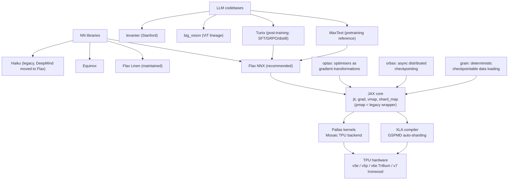

# Topic: jax-and-tpu

⏱ 9 min read · +9h 15m resources

The Google-side stack: JAX (functional array programming compiled through XLA), the

neural-net libraries on top of it, and the TPU hardware it targets. This topic is framed

as a PyTorch-to-JAX translation track: everything you know from PyTorch/FSDP has a JAX

equivalent, usually more explicit and more compiler-driven. Goal state: port a small

PyTorch LM to Flax NNX and train it on a TPU.

Last verified: 2026-08-24. JAX 0.11.1, Flax NNX is the recommended API, TPU v7

(Ironwood) is GA on Google Cloud.

### Taxonomy

### Map of the space

- **JAX core**: numpy-alike (`jax.numpy`) plus composable transformations: `jit`
  (traces the function into a small intermediate program, a jaxpr, and compiles it with **XLA**, the Accelerated Linear Algebra compiler, which fuses the whole graph into a handful of kernels), `grad` (reverse-mode autodiff by source-to-source rewriting of a pure function, so gradients arrive as a returned value with the same pytree shape as the parameters rather than accumulating in a `.grad` attribute), `vmap`

  (auto-vectorisation: write the per-example function and get the batched one for free, which is also how per-example gradients and model ensembles are expressed), `shard_map` (**SPMD**, single program multiple data: the function body sees only this device's shard and you write the collectives yourself). `pmap` still exists but since

  JAX 0.8-0.10 it is just a wrapper over `jit` + `shard_map`; treat it as legacy. The

  price of all this: functions must be pure, state (params, optimiser, RNG) is threaded

  explicitly. See [JAX core: the functional model](jax-core.md).

- **Neural-net layer**: Flax NNX is the current recommended API (Pythonic, stateful
  modules, feels close to `nn.Module`); Linen is the older functional API most existing

  code uses; Equinox is a minimal "models are pytrees" library popular in research;

  Haiku is legacy, an `hk.transform` wrapper that converted an impure module definition into the pure init/apply pair Flax now gives you directly, worth reading only for old DeepMind repos. What actually separates them: NNX keeps parameters as attributes on a live Python object and lifts JAX's transforms to work on it, so you get PyTorch ergonomics with JAX semantics; Linen keeps modules stateless and hands you a params dict from `.init()` that you thread through `.apply()`, more ceremony but what most existing code looks like; Equinox skips the framework altogether by making the model itself a pytree, so plain `jax.grad` applies to it once a filter separates array leaves from static fields. See [Flax NNX, optax, orbax: the training stack](flax-and-optax.md).

- **Optimisers and training state**: optax expresses optimisers as chainable pure
  gradient transformations (`optax.adamw`, `optax.chain`, schedules as functions of

  step), so an optimiser is a pair of pure functions rather than an object owning state, and everything that would be a subclass or a config flag elsewhere (gradient clipping, EMA, gradient accumulation, per-parameter masks that exempt norms and biases from weight decay, Lion, Muon) is just another link in the chain. orbax handles async, sharded, multi-host checkpointing: each host writes its own shards with no gather to rank 0, and restore targets a sharding layout directly, which is what makes checkpointing a whole pod slice practical rather than heroic. grain gives

  deterministic, checkpointable input pipelines, meaning the iterator's position is part of the checkpoint, so a preempted run resumes mid-epoch on exactly the samples it had left. Same page as above.

- **Scaling**: XLA's **GSPMD (General and Scalable Parallelization for ML Computation Graphs)** does the heavy lifting: it is a partitioner that takes your single-device program plus layout annotations and rewrites it into an SPMD program, inserting all-gathers, reduce-scatters and all-reduces wherever two annotations disagree. You declare a device `Mesh` (the physical accelerators arranged as a named logical grid, say 8x4 with axes called `data` and `model`) and
  attach a `NamedSharding` to each array, which is that `Mesh` plus a `PartitionSpec` stating, per array dimension, which mesh axis splits it and which are replicated; the compiler derives everything else. Data

  parallel, FSDP-style, and tensor parallel are all just different PartitionSpecs.

  `shard_map` is the escape hatch for hand-written per-device code. See

  [Sharding and scale: GSPMD, Mesh, shard_map](sharding-and-scale.md).

- **TPU stack**: the **MXU (Matrix Multiply Unit)** is a systolic array, a 128x128 or 256x256 grid of multiply-accumulate cells that holds weights still while activations pulse through it, so partial sums travel micrometres of wire instead of round-tripping to memory; **HBM (High Bandwidth Memory)** is the stacked off-chip DRAM behind it, staged through VMEM, a large software-managed scratchpad the compiler schedules explicitly because there is no hardware cache hierarchy to fall back on; **ICI (Inter-Chip Interconnect)** wires each chip straight to its neighbours in a 2-D or 3-D torus with no switches in the path, which makes ring and torus collectives very cheap and distant point-to-point traffic multi-hop; a pod is the resulting fabric of hundreds to thousands of chips that one job can treat as a single machine. Pallas is
  the Triton-analogue for writing TPU (and GPU) kernels: you write a Python function over references to tiles already resident in fast memory, describe how each grid step maps into the HBM arrays, and Pallas generates the double-buffered HBM-to-VMEM pipeline for you, lowering through **Mosaic**, the TPU backend compiler that turns those tile programs into the VLIW machine code the core runs.

  Hardware-first view lives in [TPUs: systolic arrays and pod-scale machines](../hardware/tpus.md); programming

  view in [TPU architecture and Pallas](tpu-architecture-and-pallas.md).

- **LLM codebases to read**: **MaxText** is Google's pure-JAX LLM pretraining stack and the reference for
  what good sharded JAX looks like; its distinctive move is `logical_axis_rules`, which name the model's own axes (`embed`, `mlp`, `heads`) in config and map them onto mesh axes, so sharding decisions never leak into model code. **Tunix** is the post-training counterpart, covering supervised fine-tuning, preference tuning,

  distillation, and RL trainers: **PPO (Proximal Policy Optimization)**, the classic actor-critic method that keeps updates small with a clipped importance ratio; **GRPO (Group Relative Policy Optimization)**, which deletes the value network and instead normalises rewards within a sampled group of completions for the same prompt, cutting memory and complexity enough that it became the standard recipe for training reasoning on verifiable answers; and **GSPO (Group Sequence Policy Optimization)**, its sequence-level variant that forms the importance ratio over the whole sequence rather than per token, which is what stabilises long-generation MoE training. **big_vision** is the ViT lineage written in Linen and the cleanest example of the older functional style. **levanter** is Stanford's non-Google

  perspective, built on Equinox, with an emphasis on bitwise-reproducible training that resumes identically after preemption.

### Learning path (recommended order)

1. [JAX core: the functional model](jax-core.md): the functional model, jit/grad/vmap, PRNG, pytrees.
   Do the official JAX tutorial notebooks alongside.

2. [Flax NNX, optax, orbax: the training stack](flax-and-optax.md): build and train an MLP then a tiny
   transformer with NNX + optax on CPU/GPU; add orbax checkpointing.

3. Port the small PyTorch LM to Flax NNX; verify loss curves match on CPU.
4. [Sharding and scale: GSPMD, Mesh, shard_map](sharding-and-scale.md) plus chapters 1-5 and 10 of the
   scaling book; shard the LM with a Mesh (data first, then FSDP-style).

5. [TPU architecture and Pallas](tpu-architecture-and-pallas.md): run on a real TPU
   (Colab v5e, Kaggle v5e-8, then TRC), profile, optionally write one Pallas kernel.

6. Read MaxText's decoder and train step end to end; skim Tunix's GRPO trainer.

### Deep dives

| Page | Contents |
| --- | --- |
| [JAX core: the functional model](jax-core.md) | Pure functions, PRNG keys, jit tracing rules, lax control flow, grad, vmap, pytrees, PyTorch-user footguns |
| [Flax NNX, optax, orbax: the training stack](flax-and-optax.md) | Flax NNX vs Linen, optax, orbax, full training-loop skeleton vs PyTorch line by line |
| [Sharding and scale: GSPMD, Mesh, shard_map](sharding-and-scale.md) | Mesh, NamedSharding, GSPMD, shard_map, DP/FSDP/TP as PartitionSpecs, multi-host |
| [TPU architecture and Pallas](tpu-architecture-and-pallas.md) | TPU generations, MXU/HBM/ICI, pods, Pallas kernels, cheap TPU access |

### Best resources (topic-level)

- [How to Scale Your Model](https://jax-ml.github.io/scaling-book/) (~3h 30m for ch. 1-5 and 10; ~6h for the full book) (DeepMind, 2025,
  still the canonical text): rooflines, TPUs, sharded matmuls, transformer scaling math,

  JAX parallelism, plus a bonus GPU chapter. Read chapters 1-5 and 10 minimum.

- [JAX documentation](https://docs.jax.dev/) (docs, ~2h for the tutorial set): the tutorials (Thinking in JAX, sharded
  computation, stateful computations) are excellent and current.

- [Flax NNX docs](https://flax.readthedocs.io/) (docs, ~1h 30m for the core pages): NNX basics plus the Linen-to-NNX
  migration guide (useful in reverse as a reading-Linen-code guide).

- [MaxText](https://github.com/AI-Hypercomputer/maxtext) (repo, ~1h 30m for the decoder and train step) and
  [Tunix](https://github.com/google/tunix) (repo, ~45 min for the GRPO trainer): production JAX LLM code to imitate.

### Cross-links

- Hardware view of TPUs: [TPUs: systolic arrays and pod-scale machines](../hardware/tpus.md)
- General distributed training (DP/TP/PP/ZeRO/FSDP concepts): [Distributed Training](../llm-training-and-post-training/distributed-training.md)
- CUDA/Triton counterpart to Pallas: [Topic: cuda-and-gpu-programming](../cuda-and-gpu-programming/summary.md)
- [JAX core: the functional model](jax-core.md)
- [Flax NNX, optax, orbax: the training stack](flax-and-optax.md)
- [Sharding and scale: GSPMD, Mesh, shard_map](sharding-and-scale.md)
- [TPU architecture and Pallas](tpu-architecture-and-pallas.md)
