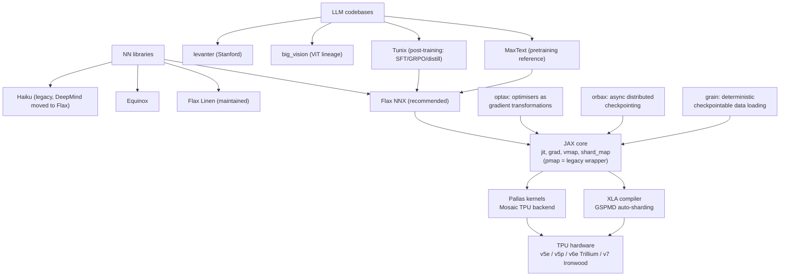

# JAX and TPU

The Google-side stack: JAX (functional array programming compiled through XLA), the
neural-net libraries on top of it, and the TPU hardware it targets. This topic is framed
as a PyTorch-to-JAX translation track: everything you know from PyTorch/FSDP has a JAX
equivalent, usually more explicit and more compiler-driven. Goal state: port a small
PyTorch LM to Flax NNX and train it on a TPU.

*Last verified: 2026-08-24. JAX 0.11.1, Flax NNX is the recommended API, TPU v7
(Ironwood) is GA on Google Cloud.*

## Taxonomy

Diagram source (mermaid)

## Map of the space

- **JAX core**: numpy-alike (`jax.numpy`) plus composable transformations: `jit`
  (trace-and-compile via XLA), `grad` (autodiff on pure functions), `vmap`
  (auto-vectorisation), `shard_map` (per-device SPMD code). `pmap` still exists but since
  JAX 0.8-0.10 it is just a wrapper over `jit` + `shard_map`; treat it as legacy. The
  price of all this: functions must be pure, state (params, optimiser, RNG) is threaded
  explicitly. See [jax-core.md](jax-core.md).
- **Neural-net layer**: Flax NNX is the current recommended API (Pythonic, stateful
  modules, feels close to `nn.Module`); Linen is the older functional API most existing
  code uses; Equinox is a minimal "models are pytrees" library popular in research;
  Haiku is legacy. See [flax-and-optax.md](flax-and-optax.md).
- **Optimisers and training state**: optax expresses optimisers as chainable pure
  gradient transformations (`optax.adamw`, `optax.chain`, schedules as functions of
  step). orbax handles async, sharded, multi-host checkpointing; grain gives
  deterministic, checkpointable input pipelines. Same file as above.
- **Scaling**: XLA's GSPMD does the heavy lifting: you declare a device `Mesh` and
  `NamedSharding`/`PartitionSpec` on arrays, and the compiler inserts collectives. Data
  parallel, FSDP-style, and tensor parallel are all just different PartitionSpecs.
  `shard_map` is the escape hatch for hand-written per-device code. See
  [sharding-and-scale.md](sharding-and-scale.md).
- **TPU stack**: systolic-array MXUs, large HBM, ICI torus interconnect, pods. Pallas is
  the Triton-analogue for writing TPU (and GPU) kernels, lowered through Mosaic.
  Hardware-first view lives in [../hardware/tpus.md](../hardware/tpus.md); programming
  view in [tpu-architecture-and-pallas.md](tpu-architecture-and-pallas.md).
- **LLM codebases to read**: MaxText (pure-JAX LLM pretraining, the reference for
  what good sharded JAX looks like), Tunix (post-training: SFT, preference tuning,
  distillation, PPO/GRPO/GSPO), big_vision (ViT-era Linen), levanter (non-Google
  perspective, Equinox-based).

## Learning path (recommended order)

1. [jax-core.md](jax-core.md): the functional model, jit/grad/vmap, PRNG, pytrees.
   Do the official JAX tutorial notebooks alongside.
2. [flax-and-optax.md](flax-and-optax.md): build and train an MLP then a tiny
   transformer with NNX + optax on CPU/GPU; add orbax checkpointing.
3. Port the small PyTorch LM to Flax NNX; verify loss curves match on CPU.
4. [sharding-and-scale.md](sharding-and-scale.md) plus chapters 1-5 and 10 of the
   scaling book; shard the LM with a Mesh (data first, then FSDP-style).
5. [tpu-architecture-and-pallas.md](tpu-architecture-and-pallas.md): run on a real TPU
   (Colab v5e, Kaggle v5e-8, then TRC), profile, optionally write one Pallas kernel.
6. Read MaxText's decoder and train step end to end; skim Tunix's GRPO trainer.

## Deep-dive files

| File | Contents |
|---|---|
| [jax-core.md](jax-core.md) | Pure functions, PRNG keys, jit tracing rules, lax control flow, grad, vmap, pytrees, PyTorch-user footguns |
| [flax-and-optax.md](flax-and-optax.md) | Flax NNX vs Linen, optax, orbax, full training-loop skeleton vs PyTorch line by line |
| [sharding-and-scale.md](sharding-and-scale.md) | Mesh, NamedSharding, GSPMD, shard_map, DP/FSDP/TP as PartitionSpecs, multi-host |
| [tpu-architecture-and-pallas.md](tpu-architecture-and-pallas.md) | TPU generations, MXU/HBM/ICI, pods, Pallas kernels, cheap TPU access |

## Best resources (topic-level)

- [How to Scale Your Model](https://jax-ml.github.io/scaling-book/) (DeepMind, 2025,
  still the canonical text): rooflines, TPUs, sharded matmuls, transformer scaling math,
  JAX parallelism, plus a bonus GPU chapter. Read chapters 1-5 and 10 minimum.
- [JAX documentation](https://docs.jax.dev/): the tutorials (Thinking in JAX, sharded
  computation, stateful computations) are excellent and current.
- [Flax NNX docs](https://flax.readthedocs.io/): NNX basics plus the Linen-to-NNX
  migration guide (useful in reverse as a reading-Linen-code guide).
- [MaxText](https://github.com/AI-Hypercomputer/maxtext) and
  [Tunix](https://github.com/google/tunix): production JAX LLM code to imitate.

## Cross-links

- Hardware view of TPUs: [../hardware/tpus.md](../hardware/tpus.md)
- General distributed training (DP/TP/PP/ZeRO/FSDP concepts):
  [../llm-training-and-post-training/distributed-training.md](../llm-training-and-post-training/distributed-training.md)
- CUDA/Triton counterpart to Pallas: [../cuda-and-gpu-programming/](../cuda-and-gpu-programming/)
