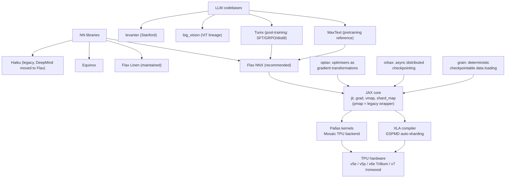

# Topic: jax-and-tpu

## Video

A narrated 7-minute explainer derived from this page. The page stays canonical: the video is a derived representation, and every figure it states comes from here.

[Topic: jax-and-tpu: purity is the price; a compiler that shards a pod is the payoff](https://prod-files-secure.s3.us-west-2.amazonaws.com/13e79c56-ebab-4528-83aa-967a204b1f04/23160a67-8423-40cf-b753-eb4eb4d7c28a/topic_jax_and_tpu_overview.mp4)

⏱ 6 min read · +9h 15m resources

The Google-side stack: JAX (functional array programming compiled through XLA), the

neural-net libraries on top of it, and the TPU hardware it targets. This topic is framed

as a PyTorch-to-JAX translation track: everything you know from PyTorch/FSDP has a JAX

equivalent, usually more explicit and more compiler-driven. Goal state: port a small

PyTorch LM to Flax NNX and train it on a TPU.

### Taxonomy

### Map of the space

- **JAX core**: `jax.numpy` plus composable transformations: `jit`
  (traces the function into a jaxpr and compiles it with **XLA**, the Accelerated Linear Algebra compiler), `grad` (reverse-mode autodiff of a pure function, so gradients come back as a value with the same pytree shape as the parameters, a pytree being any nested container of arrays), `vmap` (auto-vectorisation), and `shard_map` (**SPMD**, single program multiple data: the body sees only this device's shard and you write the collectives). `pmap` is legacy. The

  price: functions must be pure, and state (params, optimiser, RNG) is threaded

  explicitly. See [JAX core: the functional model](jax-core.md).

- **Neural-net layer**: Flax NNX is the current recommended API (Pythonic, stateful
  modules, feels close to `nn.Module`); Linen is the older functional API most existing

  code uses; Equinox is a minimal "models are pytrees" library popular in research;

  Haiku is legacy, worth reading only for old DeepMind repos. See [Flax NNX, optax, orbax: the training stack](flax-and-optax.md).

- **Optimisers and training state**: optax expresses optimisers as chainable pure
  gradient transformations (`optax.adamw`, `optax.chain`, schedules as functions of

  step), so clipping, EMA, accumulation, per-parameter masks, Lion and Muon are links in a chain rather than subclasses. orbax handles async, sharded, multi-host checkpointing, which is what makes checkpointing a whole pod slice practical rather than heroic. grain gives

  deterministic, checkpointable input pipelines, so a preempted run resumes mid-epoch. Same page as above.

- **Scaling**: XLA's **GSPMD (General and Scalable Parallelization for ML Computation Graphs)** partitioner takes your single-device program plus layout annotations and inserts the collectives wherever two annotations disagree. You declare a device `Mesh` and
  attach a `NamedSharding` (that `Mesh` plus a `PartitionSpec`) to each array. Data

  parallel, FSDP-style, and tensor parallel are all just different PartitionSpecs, and

  `shard_map` is the escape hatch for hand-written per-device code. See

  [Sharding and scale: GSPMD, Mesh, shard_map](sharding-and-scale.md).

- **TPU stack**: the **MXU (Matrix Multiply Unit)** systolic array (128x128, or 256x256 on some generations), **HBM (High Bandwidth Memory)** staged through the software-managed **VMEM** scratchpad, and **ICI (Inter-Chip Interconnect)** wiring each chip straight to its neighbours in a 2-D or 3-D torus with no switches in the path, so ring and torus collectives are cheap and distant point-to-point traffic is multi-hop; a pod is the resulting fabric of hundreds to thousands of chips that one job can treat as a single machine. **Pallas** is
  the Triton-analogue for writing TPU (and GPU) kernels, lowering through **Mosaic**, the TPU backend compiler.

  Hardware-first view lives in [TPUs: systolic arrays and pod-scale machines](../hardware/tpus.md); programming

  view in [TPU architecture and Pallas](tpu-architecture-and-pallas.md).

- **LLM codebases to read**: **MaxText** is Google's pure-JAX LLM pretraining stack and the reference for
  what good sharded JAX looks like. **Tunix** is the post-training counterpart, covering supervised fine-tuning, preference tuning,

  distillation, and RL trainers: **PPO (Proximal Policy Optimization)**, the classic actor-critic method that keeps updates small with a clipped importance ratio; **GRPO (Group Relative Policy Optimization)**, which deletes the value network and instead normalises rewards within a sampled group of completions for the same prompt, cutting memory and complexity enough that it became the standard recipe for training reasoning on verifiable answers; and **GSPO (Group Sequence Policy Optimization)**, its sequence-level variant that forms the importance ratio over the whole sequence rather than per token, which is what stabilises long-generation MoE training. **big_vision** is the ViT lineage written in Linen and the cleanest example of the older functional style. **levanter** is Stanford's non-Google

  perspective, built on Equinox, with an emphasis on bitwise-reproducible training that resumes identically after preemption.

### Learning path (recommended order)

1. [JAX core: the functional model](jax-core.md): the functional model, jit/grad/vmap, PRNG, pytrees.
   Do the official JAX tutorial notebooks alongside.

2. [Flax NNX, optax, orbax: the training stack](flax-and-optax.md): build and train an MLP then a tiny
   transformer with NNX + optax on CPU/GPU; add orbax checkpointing.

3. Port the small PyTorch LM to Flax NNX; verify loss curves match on CPU.
4. [Sharding and scale: GSPMD, Mesh, shard_map](sharding-and-scale.md) plus chapters 1-5 and 10 of the
   scaling book; shard the LM with a Mesh (data first, then FSDP-style).

5. [TPU architecture and Pallas](tpu-architecture-and-pallas.md): run on a real TPU
   (Colab v5e, Kaggle v5e-8, then TRC, the TPU Research Cloud), profile, optionally write one Pallas kernel.

6. Read MaxText's decoder and train step end to end; skim Tunix's GRPO trainer.

### Deep dives

| Page | Contents |
| --- | --- |
| [JAX core: the functional model](jax-core.md) | Pure functions, PRNG keys, jit tracing rules, lax control flow, grad, vmap, pytrees, PyTorch-user footguns |
| [Flax NNX, optax, orbax: the training stack](flax-and-optax.md) | Flax NNX vs Linen, optax, orbax, full training-loop skeleton vs PyTorch line by line |
| [Sharding and scale: GSPMD, Mesh, shard_map](sharding-and-scale.md) | Mesh, NamedSharding, GSPMD, shard_map, DP/FSDP/TP as PartitionSpecs, multi-host |
| [TPU architecture and Pallas](tpu-architecture-and-pallas.md) | TPU generations, MXU/HBM/ICI, pods, Pallas kernels, cheap TPU access |

### Best resources (topic-level)

- [How to Scale Your Model](https://jax-ml.github.io/scaling-book/) (~3h 30m for ch. 1-5 and 10; ~6h for the full book) (DeepMind, 2025,
  still the canonical text): rooflines, TPUs, sharded matmuls, transformer scaling math,

  JAX parallelism, plus a bonus GPU chapter. Read chapters 1-5 and 10 minimum.

- [JAX documentation](https://docs.jax.dev/) (docs, ~2h for the tutorial set): the tutorials (Thinking in JAX, sharded
  computation, stateful computations) are excellent and current.

- [Flax NNX docs](https://flax.readthedocs.io/) (docs, ~1h 30m for the core pages): NNX basics plus the Linen-to-NNX
  migration guide (useful in reverse as a reading-Linen-code guide).

- [MaxText](https://github.com/AI-Hypercomputer/maxtext) (repo, ~1h 30m for the decoder and train step) and
  [Tunix](https://github.com/google/tunix) (repo, ~45 min for the GRPO trainer): production JAX LLM code to imitate.

### Cross-links

- Hardware view of TPUs: [TPUs: systolic arrays and pod-scale machines](../hardware/tpus.md)
- General distributed training (DP/TP/PP/ZeRO/FSDP concepts): [Distributed Training](../llm-training-and-post-training/distributed-training.md)
- CUDA/Triton counterpart to Pallas: [Topic: cuda-and-gpu-programming](../cuda-and-gpu-programming/summary.md)
- [JAX core: the functional model](jax-core.md)
- [Flax NNX, optax, orbax: the training stack](flax-and-optax.md)
- [Sharding and scale: GSPMD, Mesh, shard_map](sharding-and-scale.md)
- [TPU architecture and Pallas](tpu-architecture-and-pallas.md)
