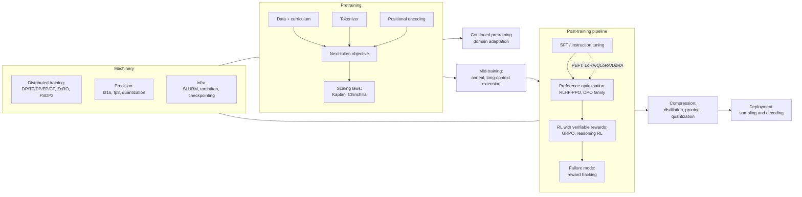

# LLM Training and Post-Training

⏱ 8 min read · +16h 45m resources

The full lifecycle of building a language model: pretraining at scale, the machinery
that makes it possible (distributed training, precision, infra), the components that
shape the model (tokenizers, positional encodings), and the post-training pipeline
that turns a base model into a useful assistant (SFT, preference optimisation, RL,
distillation), plus what can go wrong (reward hacking) and how the model is used at
inference time (sampling and decoding). Seeded 2026-08-24 from Khalid's own notes
plus current sources.

## Taxonomy

Diagram source (mermaid)

## Map of the space

**Pretraining** is now well understood in the open. The **Chinchilla** result (2022) corrected an artefact in Kaplan's earlier scaling laws and showed that at a fixed compute budget model size and token count should scale together, roughly 20 tokens per parameter; in practice everyone now trains far past that point, because inference cost rather than training cost dominates a model's lifetime economics and a smaller model trained longer is cheaper to serve. Data is multi-stage rather than one homogeneous pass: bulk filtered web and code for most tokens, then a **high-quality anneal** (curated math, code, and instruction-like text up-weighted as the learning rate decays, which is where an outsized share of the benchmark gain appears), then a long-context extension phase. Fully open recipes now exist end to end: **OLMo 2/3** (Ai2) publishes data, code, intermediate checkpoints and training logs; **SmolLM3** (HuggingFace) publishes an entire 3B engineering blueprint including its architecture ablations and data mixture; and the **nanoGPT speedrun** lineage, a community leaderboard racing to GPT-2 quality on 8 GPUs, is where **Muon** came from, an optimiser that orthogonalises the momentum update of each 2D weight matrix (approximately steepest descent under the spectral norm) and has since graduated to frontier-scale runs.

**Distributed training** is a composition problem rather than a single choice. **FSDP2**, PyTorch's per-parameter DTensor implementation of **ZeRO-3**, shards parameters, gradients and optimiser states across the data-parallel group and all-gathers each layer's weights just in time before freeing them again, trading roughly 1.5x DDP communication for memory that scales as 1/N; **HSDP** shards inside a node and replicates across nodes so the heavy all-gather traffic stays on NVLink and only gradient all-reduce crosses the fabric. **TP (tensor parallelism)** splits individual weight matrices across GPUs and pays an all-reduce inside every layer, which is why it must stay within a node; **PP (pipeline parallelism)** splits the model into stages of consecutive layers and passes only activations across stage boundaries, cheap enough for cross-node use once microbatching hides the idle bubble; **EP (expert parallelism)** distributes MoE experts across GPUs and routes tokens between them by all-to-all; **CP (context parallelism)** shards the sequence dimension itself, which is what makes 128k-token training fit. The HuggingFace **Ultra-Scale Playbook**, 4000+ benchmarked runs distilled into an interactive book, is the canonical modern reference for picking among them.

**Post-training** converged on a standard flow. **SFT (supervised fine-tuning)** trains on (prompt, response) pairs with the loss taken only on the response tokens, so the model answers instructions instead of continuing text, and it is what fixes format, persona and chat template. Preference optimisation then comes in two shapes. **RLHF with PPO** trains a reward model on human preference pairs, then optimises the policy against it with a clipped policy-gradient objective plus a per-token KL penalty to a frozen reference model, which is powerful but keeps four large models in memory. The **DPO family** skips both the reward model and the RL loop: the KL-constrained RLHF objective has a closed form whose implied reward is the log-ratio of policy to reference, so substituting it into the preference model collapses the whole pipeline into a contrastive loss on chosen/rejected pairs (**IPO** bounds that loss against overfitting deterministic preferences, **KTO** works from unpaired thumbs up/down instead of pairs, **ORPO** drops the reference model and folds alignment into SFT as one stage). Finally **RLVR (RL with verifiable rewards)** replaces the learned reward model with a programmatic checker, unit tests or answer matching, so there is no reward-model bias to exploit; **GRPO** is its workhorse algorithm, PPO with the critic deleted and the mean reward of a sampled group of responses per prompt used as the baseline instead. **Reward hacking**, where the policy keeps climbing the proxy while the true objective stalls or degrades, is the central failure mode of every step above and the reason KL penalties, reward ensembles and hidden test splits exist.

**Efficiency** spans three axes. **PEFT** freezes the base model and trains a small set of new parameters: **LoRA** reparameterises the weight update as a low-rank product that merges back into the base afterwards for zero inference overhead, and matches full fine-tuning on typical post-training datasets provided it is applied to all weight matrices rather than attention alone; **QLoRA** puts a 4-bit NF4-quantised frozen base underneath it so a 65B model fine-tunes on a single 48GB GPU. **Precision** moved from bf16 as the training default (fp32's exponent range with fewer mantissa bits, so no loss scaling is needed) to fp8 in the mainstream, with **NVFP4** and **MXFP4**, 4-bit formats carrying a shared scale per small block that Blackwell tensor cores execute natively, now arriving for training rather than just storage. **Distillation** trains a small student to imitate a large teacher, either by fine-tuning on the teacher's sampled outputs (simple and API-compatible, but off-policy, so the student never sees its own mistakes) or by supervising the student's own samples with the teacher's per-token distribution (on-policy, and far more compute-efficient for teaching reasoning); it is the main reason the 1-8B tier is genuinely capable now.

## Deep dives

| File | What it covers |
|---|---|
| [pretraining.md](pretraining.md) | Objectives, scaling laws, curricula, open recipes, Ultra-Scale Playbook |
| [distributed-training.md](distributed-training.md) | DP/DDP, TP, PP, EP, CP, ZeRO, FSDP2, hybrid sharding |
| [tokenizers.md](tokenizers.md) | Word/char/subword, BPE, WordPiece, SentencePiece, Unigram |
| [positional-encodings.md](positional-encodings.md) | Sinusoidal to RoPE, ALiBi, YaRN, NoPE, long context |
| [peft.md](peft.md) | Adapters, soft prompts, LoRA, QLoRA, DoRA, when PEFT suffices |
| [alignment-and-rlhf.md](alignment-and-rlhf.md) | SFT, reward models, PPO, DPO family, GRPO, RLAIF, RLVR |
| [reward-hacking.md](reward-hacking.md) | Patterns, detection, mitigations, inoculation prompting |
| [quantization-and-precision.md](quantization-and-precision.md) | PTQ/QAT, mixed precision, fp8, GPTQ/AWQ, MXFP4/NVFP4 |
| [distillation-and-small-lms.md](distillation-and-small-lms.md) | Logit vs sequence distillation, pruning, small-model landscape |
| [sampling-and-decoding.md](sampling-and-decoding.md) | Greedy, beam, temperature, top-k/p, min-p, constrained decoding |
| [continued-pretraining.md](continued-pretraining.md) | Domain adaptation, CMR scaling law, forgetting, replay |
| [training-infra.md](training-infra.md) | SLURM, HyperPod, NeMo, Megatron, torchtitan, fault tolerance |

## Key papers (central papers/)

- [Scaling Laws (Kaplan 2020)](../../papers/2020-01_scaling-laws/summary.md) and
  [Chinchilla (2022)](../../papers/2022-03_chinchilla/summary.md): compute-optimal training.
- [T5 (2019)](../../papers/2019-10_t5/summary.md): the controlled comparison the rest of this topic rests on, holding one pipeline fixed and moving objective, architecture, corpus, fine-tuning scheme and multi-task mixture one axis at a time; its lasting results are mostly negatives (denoising variants barely differ, corruption rate barely matters, multi-task training alone underperforms pretrain-then-fine-tune, though multi-task pretraining followed by fine-tuning matches it).
- [ZeRO (2019)](../../papers/2019-10_zero/summary.md) and
  [Megatron-LM (2019)](../../papers/2019-09_megatron-lm/summary.md): sharding and tensor parallelism.
- [LoRA (2021)](../../papers/2021-06_lora/summary.md) and
  [QLoRA (2023)](../../papers/2023-05_qlora/summary.md): PEFT.
- [InstructGPT (2022)](../../papers/2022-03_instructgpt/summary.md),
  [DPO (2023)](../../papers/2023-05_dpo/summary.md),
  [DeepSeekMath/GRPO (2024)](../../papers/2024-02_deepseekmath-grpo/summary.md),
  [Constitutional AI (2022)](../../papers/2022-12_constitutional-ai/summary.md): the alignment lineage.
- [RoFormer/RoPE (2021)](../../papers/2021-04_roformer-rope/summary.md): the default positional encoding; rotating query and key vectors by an angle proportional to position makes the attention dot product depend only on relative distance, with no extra parameters.
- [Switch Transformer (2021)](../../papers/2021-01_switch-transformer/summary.md): expert parallelism origins; routing each token to a single expert lets parameter count grow without a proportional rise in FLOPs per token.
- [FlashAttention (2022)](../../papers/2022-05_flashattention/summary.md): IO-aware attention that tiles the computation to stay in SRAM and never materialises the full attention matrix, giving both large training speedups and linear rather than quadratic activation memory.
- [OLMo 2 (2025)](../../papers/2025-01_olmo-2/summary.md) and
  [Llama 3 (2024)](../../papers/2024-07_llama-3/summary.md): full open and semi-open training reports.

## Best starting resources

- [HuggingFace Ultra-Scale Playbook](https://huggingface.co/spaces/nanotron/ultrascale-playbook) (~8h): 4000+ scaling experiments distilled; the modern distributed-training bible.
- [RLHF Book (Nathan Lambert)](https://rlhfbook.com/) (~6h): free, current, covers the whole post-training pipeline.
- [Karpathy, "Let's build the GPT Tokenizer"](https://www.youtube.com/watch?v=zduSFxRajkE) (2h 15m): BPE from scratch.
- [OLMo 2 report](https://allenai.org/blog/olmo2) (~30 min): the most complete open pretraining recipe.

## Added 2026-09-07

**AI Research Preference Models** (Meta FAIR, Sep 6) move the selection problem upstream of the GPU. The premise is that an autonomous research agent's dominant cost is not running an experiment but running the wrong one, so the highest-leverage intervention is ranking candidate experiments **before** any compute is spent. RPMs do this with frozen pretrained language models comparing candidates pairwise in a knockout tournament, in two variants: an inference-only judge that reads the proposals, and an agentic variant that runs small-scale pilot experiments and judges from their outcomes. Average normalised score rises from 0.684 for random selection to 0.729 for the agentic variant, and both variants reach the random-selection baseline's final result in about 15 hours instead of 24, a 1.5 to 1.6x wall-clock speedup, with reported new bests on WinoGrande at 94.1% and SVAMP at 95.7%. Filed with a caution: the margins are narrow, the headline benchmarks are old enough that a new best on them is weak evidence, and pairwise LLM judging carries the same positional and verbosity biases documented on `Topic: evaluation-and-llm-judges`, now applied to experiment proposals rather than answers. The idea is worth more than this instance of it. Linked rather than promoted to Papers. [arXiv 2608.13940](https://arxiv.org/abs/2608.13940) (45 min), [MarkTechPost](https://www.marktechpost.com/2026/09/06/meta-fair-introduces-ai-research-preference-models-rpms-ranking-ml-experiments-before-spending-gpu-hours/) (10 min)

**Two worked examples of taking an open base somewhere specific**, both from the newsletter sweep rather than the paper feeds, and both filling a gap this page has carried: the KB documents the techniques but has had no end-to-end instance with real numbers attached.

- **A 397B RL post-training recipe, written out in full.** Mercor with SkyRL trained Qwen3.5-397B-A17B with reinforcement learning on 1,928 expert knowledge-work tasks and reports a 70% relative improvement in APEX-Agents Pass@1. What makes it worth the read is that the unglamorous parts are included rather than elided: exact token accounting, asynchronous RL, environment robustness and harness design, with the explicit argument that those decide the outcome as much as the algorithm does. Read alongside `Terminal-Universe` in Papers, which industrialises the environment supply this recipe says is decisive, and cross-listed to `Topic: rl`. [Mercor](https://www.mercor.com/blog/training-frontier-knowledge-work-agents-a-397b-rl-training-guide-with-skyrl/) (25 min)
- **A 397B domain model for $40M in three months.** Thomson Reuters mid-trained on top of Qwen3.5: 200B curated tokens selected from a 19T pool with DatologyAI, DPO alignment against an open-source constitution, GSPO for context compaction and document caching, and a 35B open-weights sibling released alongside. The coincidence of parameter count with the item above is just a coincidence; the reason to file them together is that between them they price the two main paths (post-train for behaviour, mid-train for domain) with a budget and a timeline attached, which is the thing practitioners never publish. Treat the $40M as a reported figure, not an audited one. (Reported in The Batch, Sep 4.)

## Added 2026-09-14

**Cognition SWE-2: a reasoning-effort dial trained in one RL run.** Cognition took Kimi K3, Moonshot's 2.8T open model, and RL post-trained it into a coding agent, reporting 5 to 6 points over the base on many benchmarks. The headline result is that it matches Fable 5.1 on FrontierCode 1.1 Main (50.0% against 50.9%) at a claimed 64% lower cost. Two training details are the transferable part. First, **selectable reasoning-effort levels were all trained in a single RL run using slope-matched cost penalties**, rather than training a checkpoint per tier or bolting a budget parameter onto a finished model. That is a cheaper answer to the effort-dial problem than the two the KB already documents, Anthropic's caller-set token budget applied at inference and OpenAI's learned router applied per request, and unlike both it makes the cost-quality trade an explicit term in the training objective. Second, the efficiency gain is in **turns, not tokens**: SWE-2 medium used 58% fewer turns and cost 81% less than SWE-1.7 on the same FrontierCode tasks, which is where agent economics actually live once per-token price is competitive. The caveat to carry: Terminal-Bench 2.1 at 92.8% against Terminal-Bench 4 at 27.3%, roughly 30 points behind competitors on the newer version, so the cost claim rests partly on a benchmark that is a version behind. No open weights, no standalone API, runs only inside Devin Desktop and CLI. [Cognition](https://cognition.com/blog/swe-2) (15 min)

**NeoHorse-1: the serving router as curriculum signal.** [arXiv 2609.08183](https://arxiv.org/abs/2609.08183) (45 min) (Sep 8) makes post-training data a function of production traffic rather than of an offline curation pass. A router over a heterogeneous model pool predicts each request's capability demand; those predictions order a three-stage supervised curriculum; served interactions become training examples through structural validation, a six-dimensional semantic evaluation and subscene-level labelling, which is finer-grained than per-conversation labelling and is what makes partial-trajectory supervision work; teacher models supervise students under progressive difficulty; and evaluation feedback converts directly into training-mixture decisions. Macro-average across 11 agent, tool-use, coding and instruction benchmarks: 4B from 58.94 to 64.87, 9B from 65.60 to 69.04, with the post-trained 4B closing most of the gap to the base 9B. The claim to test rather than accept is that this generalises past 9B; the mechanism is demonstrated, the scaling is not. Full summary under Papers.

**Magic reports a pretraining recipe more than 10x more compute-efficient than leading open-weight base models** (Sep 9), published with the recipe and the long-context work described rather than as a benchmark table. It is vendor-reported and not independently reproduced, so the multiple is a claim and not a measurement, but it is the relevant playbook for a small lab pretraining without frontier compute, and it belongs next to the Chinchilla and WSM material above as a practical counterweight to allocation rules derived at scale. [Magic](https://magic.dev/blog/pretraining) (25 min)

**Data improvements contributed 3.24x more compute-efficiency gain than model improvements between 2019 and 2025, and the two are largely independent** (Dwarkesh Patel, Sep 9). A quantified decomposition of where pretraining progress actually came from, which reverses the architecture-first priority ordering most of this page's early material assumes. The sub-finding is the actionable one: **small models gain most from data quality**, which makes this the single most relevant analysis of the week for anyone pretraining a small model on a curated corpus rather than scaling one. Read against Chinchilla, which fixed the allocation between parameters and tokens but said nothing about the quality of those tokens. [Dwarkesh](https://www.dwarkesh.com/p/pretraining-progress-is-mostly-data) (25 min)
