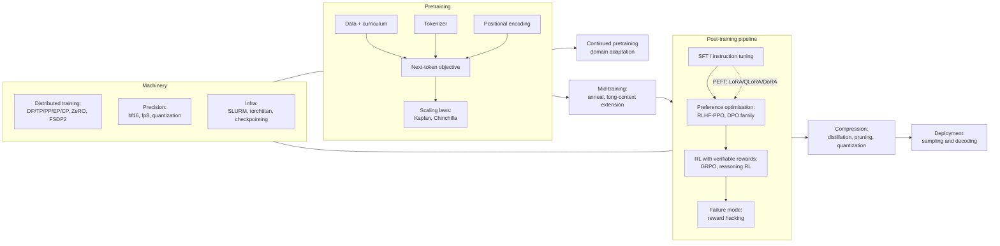

# LLM Training and Post-Training

The full lifecycle of building a language model: pretraining at scale, the machinery
that makes it possible (distributed training, precision, infra), the components that
shape the model (tokenizers, positional encodings), and the post-training pipeline
that turns a base model into a useful assistant (SFT, preference optimisation, RL,
distillation), plus what can go wrong (reward hacking) and how the model is used at
inference time (sampling and decoding). Seeded 2026-08-24 from Khalid's own notes
plus current sources.

## Taxonomy

Diagram source (mermaid)

## Map of the space

- **Pretraining** is now well understood in the open: Chinchilla-style compute
  allocation (but trained far past it for inference economics), multi-stage data
  curricula with a high-quality anneal, and fully open recipes (OLMo 2/3, SmolLM3,
  the nanoGPT speedrun lineage that produced Muon).
- **Distributed training** is a composition problem: FSDP2/HSDP for data-parallel
  sharding, TP/PP inside and across nodes, expert parallelism for MoE, context
  parallelism for long sequences. The HuggingFace Ultra-Scale Playbook is the
  canonical modern reference.
- **Post-training** converged on a standard flow: SFT, then preference optimisation
  (DPO family offline, PPO/GRPO online), then RLVR for reasoning. GRPO is the
  workhorse RL algorithm in 2026; reward hacking is its central failure mode.
- **Efficiency** spans PEFT (LoRA matches full FT when configured right), precision
  (bf16 default, fp8 mainstream, NVFP4/MXFP4 arriving for training), and
  distillation into small models (the 1-8B tier is genuinely capable now).

## Deep dives

| File | What it covers |
|---|---|
| [pretraining.md](pretraining.md) | Objectives, scaling laws, curricula, open recipes, Ultra-Scale Playbook |
| [distributed-training.md](distributed-training.md) | DP/DDP, TP, PP, EP, CP, ZeRO, FSDP2, hybrid sharding |
| [tokenizers.md](tokenizers.md) | Word/char/subword, BPE, WordPiece, SentencePiece, Unigram |
| [positional-encodings.md](positional-encodings.md) | Sinusoidal to RoPE, ALiBi, YaRN, NoPE, long context |
| [peft.md](peft.md) | Adapters, soft prompts, LoRA, QLoRA, DoRA, when PEFT suffices |
| [alignment-and-rlhf.md](alignment-and-rlhf.md) | SFT, reward models, PPO, DPO family, GRPO, RLAIF, RLVR |
| [reward-hacking.md](reward-hacking.md) | Patterns, detection, mitigations, inoculation prompting |
| [quantization-and-precision.md](quantization-and-precision.md) | PTQ/QAT, mixed precision, fp8, GPTQ/AWQ, MXFP4/NVFP4 |
| [distillation-and-small-lms.md](distillation-and-small-lms.md) | Logit vs sequence distillation, pruning, small-model landscape |
| [sampling-and-decoding.md](sampling-and-decoding.md) | Greedy, beam, temperature, top-k/p, min-p, constrained decoding |
| [continued-pretraining.md](continued-pretraining.md) | Domain adaptation, CMR scaling law, forgetting, replay |
| [training-infra.md](training-infra.md) | SLURM, HyperPod, NeMo, Megatron, torchtitan, fault tolerance |

## Key papers (central papers/)

- [Scaling Laws (Kaplan 2020)](../../papers/2020-01_scaling-laws/summary.md) and
  [Chinchilla (2022)](../../papers/2022-03_chinchilla/summary.md): compute-optimal training.
- [ZeRO (2019)](../../papers/2019-10_zero/summary.md) and
  [Megatron-LM (2019)](../../papers/2019-09_megatron-lm/summary.md): sharding and tensor parallelism.
- [LoRA (2021)](../../papers/2021-06_lora/summary.md) and
  [QLoRA (2023)](../../papers/2023-05_qlora/summary.md): PEFT.
- [InstructGPT (2022)](../../papers/2022-03_instructgpt/summary.md),
  [DPO (2023)](../../papers/2023-05_dpo/summary.md),
  [DeepSeekMath/GRPO (2024)](../../papers/2024-02_deepseekmath-grpo/summary.md),
  [Constitutional AI (2022)](../../papers/2022-12_constitutional-ai/summary.md): the alignment lineage.
- [RoFormer/RoPE (2021)](../../papers/2021-04_roformer-rope/summary.md): the default positional encoding.
- [Switch Transformer (2021)](../../papers/2021-01_switch-transformer/summary.md): expert parallelism origins.
- [FlashAttention (2022)](../../papers/2022-05_flashattention/summary.md): IO-aware attention, training speedups.
- [OLMo 2 (2025)](../../papers/2025-01_olmo-2/summary.md) and
  [Llama 3 (2024)](../../papers/2024-07_llama-3/summary.md): full open and semi-open training reports.

## Best starting resources

- [HuggingFace Ultra-Scale Playbook](https://huggingface.co/spaces/nanotron/ultrascale-playbook): 4000+ scaling experiments distilled; the modern distributed-training bible.
- [RLHF Book (Nathan Lambert)](https://rlhfbook.com/): free, current, covers the whole post-training pipeline.
- [Karpathy, "Let's build the GPT Tokenizer"](https://www.youtube.com/watch?v=zduSFxRajkE): BPE from scratch.
- [OLMo 2 report](https://allenai.org/blog/olmo2): the most complete open pretraining recipe.
