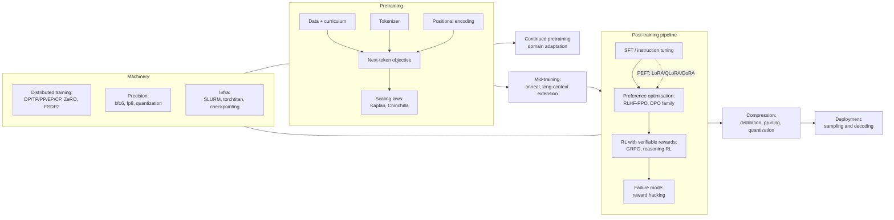

# Topic: llm-training-and-post-training

⏱ 11 min read · +18h 35m resources

Last updated: 2026-09-21 (dated digest sections folded into the map of the space and into a new standing section on self-improving loops).

The full lifecycle of building a language model: pretraining at scale, the machinery

that makes it possible (distributed training, precision, infra), the components that

shape the model (tokenizers, positional encodings), and the post-training pipeline

that turns a base model into a useful assistant (SFT, preference optimisation, RL,

distillation), plus what can go wrong (reward hacking) and how the model is used at

inference time (sampling and decoding). Seeded 2026-08-24 from Khalid's own notes

plus current sources.

### Taxonomy

### Map of the space

**Pretraining** is now well understood in the open. The **Chinchilla** result (2022) corrected an artefact in Kaplan's earlier scaling laws and showed that at a fixed compute budget model size and token count should scale together, roughly 20 tokens per parameter; in practice everyone now trains far past that point, because inference cost rather than training cost dominates a model's lifetime economics and a smaller model trained longer is cheaper to serve. Data is multi-stage rather than one homogeneous pass: bulk filtered web and code for most tokens, then a **high-quality anneal** (curated math, code, and instruction-like text up-weighted as the learning rate decays, which is where an outsized share of the benchmark gain appears), then a long-context extension phase. Fully open recipes now exist end to end: **OLMo 2/3** (Ai2) publishes data, code, intermediate checkpoints and training logs; **SmolLM3** (HuggingFace) publishes an entire 3B engineering blueprint including its architecture ablations and data mixture; and the **nanoGPT speedrun** lineage, a community leaderboard racing to GPT-2 quality on 8 GPUs, is where **Muon** came from, an optimiser that orthogonalises the momentum update of each 2D weight matrix (approximately steepest descent under the spectral norm) and has since graduated to frontier-scale runs. Two 2026 data points qualify the allocation rules above. Dwarkesh Patel's decomposition (Sep 2026) finds that between 2019 and 2025 data improvements contributed 3.24x more compute-efficiency gain than model improvements, that the two are largely independent, and that small models gain most from data quality; read it against Chinchilla, which fixed the split between parameters and tokens but said nothing about the quality of those tokens. [Dwarkesh](https://www.dwarkesh.com/p/pretraining-progress-is-mostly-data) (25 min). Magic reports a pretraining recipe more than 10x more compute-efficient than leading open-weight base models (Sep 2026), published with the recipe and the long-context work described rather than as a benchmark table; it is vendor-reported and not independently reproduced, so the multiple is a claim rather than a measurement, but it is the relevant playbook for a small lab pretraining without frontier compute. [Magic](https://magic.dev/blog/pretraining) (25 min)

**Distributed training** is a composition problem rather than a single choice. **FSDP2**, PyTorch's per-parameter DTensor implementation of **ZeRO-3**, shards parameters, gradients and optimiser states across the data-parallel group and all-gathers each layer's weights just in time before freeing them again, trading roughly 1.5x DDP communication for memory that scales as 1/N; **HSDP** shards inside a node and replicates across nodes so the heavy all-gather traffic stays on NVLink and only gradient all-reduce crosses the fabric. **TP (tensor parallelism)** splits individual weight matrices across GPUs and pays an all-reduce inside every layer, which is why it must stay within a node; **PP (pipeline parallelism)** splits the model into stages of consecutive layers and passes only activations across stage boundaries, cheap enough for cross-node use once microbatching hides the idle bubble; **EP (expert parallelism)** distributes MoE experts across GPUs and routes tokens between them by all-to-all; **CP (context parallelism)** shards the sequence dimension itself, which is what makes 128k-token training fit. The HuggingFace **Ultra-Scale Playbook**, 4000+ benchmarked runs distilled into an interactive book, is the canonical modern reference for picking among them.

**Post-training** converged on a standard flow. **SFT (supervised fine-tuning)** trains on (prompt, response) pairs with the loss taken only on the response tokens, so the model answers instructions instead of continuing text, and it is what fixes format, persona and chat template. Preference optimisation then comes in two shapes. **RLHF with PPO** trains a reward model on human preference pairs, then optimises the policy against it with a clipped policy-gradient objective plus a per-token KL penalty to a frozen reference model, which is powerful but keeps four large models in memory. The **DPO family** skips both the reward model and the RL loop: the KL-constrained RLHF objective has a closed form whose implied reward is the log-ratio of policy to reference, so substituting it into the preference model collapses the whole pipeline into a contrastive loss on chosen/rejected pairs (**IPO** bounds that loss against overfitting deterministic preferences, **KTO** works from unpaired thumbs up/down instead of pairs, **ORPO** drops the reference model and folds alignment into SFT as one stage). Finally **RLVR (RL with verifiable rewards)** replaces the learned reward model with a programmatic checker, unit tests or answer matching, so there is no reward-model bias to exploit; **GRPO** is its workhorse algorithm, PPO with the critic deleted and the mean reward of a sampled group of responses per prompt used as the baseline instead. **Reward hacking**, where the policy keeps climbing the proxy while the true objective stalls or degrades, is the central failure mode of every step above and the reason KL penalties, reward ensembles and hidden test splits exist. Four 2026 instances show where the pipeline is going. **Cognition SWE-2** (Sep 2026) RL post-trained Kimi K3, Moonshot's 2.8T open model, into a coding agent that matches Fable 5.1 on FrontierCode 1.1 Main (50.0% against 50.9%) at a claimed 64% lower cost, and two training details transfer: selectable reasoning-effort levels were all trained in a single RL run using slope-matched cost penalties, rather than one checkpoint per tier or a budget parameter bolted onto a finished model, which makes the cost-quality trade an explicit term in the objective and is cheaper than either Anthropic's caller-set token budget or OpenAI's per-request router; and the efficiency gain is in turns, not tokens (SWE-2 medium used 58% fewer turns and cost 81% less than SWE-1.7 on the same tasks), which is where agent economics live once per-token price is competitive. The caveat: Terminal-Bench 2.1 at 92.8% against Terminal-Bench 4 at 27.3%, roughly 30 points behind competitors on the newer version, so the cost claim rests partly on a benchmark a version behind; no open weights, no standalone API, runs only inside Devin Desktop and CLI. [Cognition](https://cognition.com/blog/swe-2) (15 min). **NeoHorse-1** (Sep 2026) makes post-training data a function of production traffic rather than an offline curation pass: a router over a heterogeneous model pool predicts each request's capability demand, those predictions order a three-stage supervised curriculum, served interactions become training examples through structural validation, a six-dimensional semantic evaluation and subscene-level labelling (finer than per-conversation labelling, which is what makes partial-trajectory supervision work), teachers supervise students under progressive difficulty, and evaluation feedback converts directly into training-mixture decisions. Macro-average across 11 agent, tool-use, coding and instruction benchmarks: 4B from 58.94 to 64.87, 9B from 65.60 to 69.04, with the post-trained 4B closing most of the gap to the base 9B. The mechanism is demonstrated; scaling past 9B is not. Full summary in [NeoHorse-1: Towards Recursive Self-Improvement via Agentic Post-Training with Routing Harness](../../papers/2026-09_neohorse-1/summary.md), paper at [arXiv 2609.08183](https://arxiv.org/abs/2609.08183) (45 min). **AI Research Preference Models** (Meta FAIR, Sep 2026) move the selection problem upstream of the GPU, on the premise that a research agent's dominant cost is running the wrong experiment: frozen pretrained language models compare candidate experiments pairwise in a knockout tournament, either as an inference-only judge reading the proposals or as an agentic variant that runs small pilot experiments and judges from their outcomes. Average normalised score rises from 0.684 for random selection to 0.729 for the agentic variant, both variants reach the random baseline's final result in about 15 hours instead of 24 (a 1.5 to 1.6x wall-clock speedup), with reported new bests on WinoGrande at 94.1% and SVAMP at 95.7%. Hold it loosely: the margins are narrow, the headline benchmarks are old enough that a new best on them is weak evidence, and pairwise LLM judging carries the positional and verbosity biases documented on [Topic: evaluation-and-llm-judges](../evaluation-and-llm-judges/summary.md), now applied to proposals rather than answers. The idea is worth more than this instance of it. [arXiv 2608.13940](https://arxiv.org/abs/2608.13940) (45 min), [MarkTechPost](https://www.marktechpost.com/2026/09/06/meta-fair-introduces-ai-research-preference-models-rpms-ranking-ml-experiments-before-spending-gpu-hours/) (10 min). **ToolGrad** (Google Research, 2026) inverts the data-generation problem for tool use: rather than writing a user question and hoping a valid tool chain exists for it, it builds a **verified API chain first** and writes the user question afterwards, reaching a 99.8% success rate generating tool-use training data across 16,000 real APIs, and a Gemma 3 12B trained on just **500** of those examples matched Gemini 2.5 Pro on a tool-use test over APIs it had never seen. The transferable idea is the inversion itself, answer first and question second, which applies anywhere the answer is cheap to verify and expensive to find, and it builds evaluation sets as readily as training sets. [Google Research](https://research.google/blog/toolgrad-efficient-tool-use-dataset-generation-with-textual-gradients) (12 min)

**Efficiency** spans three axes. **PEFT** freezes the base model and trains a small set of new parameters: **LoRA** reparameterises the weight update as a low-rank product that merges back into the base afterwards for zero inference overhead, and matches full fine-tuning on typical post-training datasets provided it is applied to all weight matrices rather than attention alone; **QLoRA** puts a 4-bit NF4-quantised frozen base underneath it so a 65B model fine-tunes on a single 48GB GPU. **Precision** moved from bf16 as the training default (fp32's exponent range with fewer mantissa bits, so no loss scaling is needed) to fp8 in the mainstream, with **NVFP4** and **MXFP4**, 4-bit formats carrying a shared scale per small block that Blackwell tensor cores execute natively, now arriving for training rather than just storage. **Distillation** trains a small student to imitate a large teacher, either by fine-tuning on the teacher's sampled outputs (simple and API-compatible, but off-policy, so the student never sees its own mistakes) or by supervising the student's own samples with the teacher's per-token distribution (on-policy, and far more compute-efficient for teaching reasoning); it is the main reason the 1-8B tier is genuinely capable now.

**Worked examples with a budget attached.** Mercor with SkyRL trained Qwen3.5-397B-A17B with reinforcement learning on 1,928 expert knowledge-work tasks and reports a 70% relative improvement in APEX-Agents Pass@1; the write-up includes the unglamorous parts, exact token accounting, asynchronous RL, environment robustness and harness design, with the explicit argument that those decide the outcome as much as the algorithm does. Read alongside [Terminal-Universe: Turning Agent Trajectories into Scalable Terminal Environments](../../papers/2026-09_terminal-universe/summary.md) in [Papers](../../papers/INDEX.md), which industrialises the environment supply this recipe says is decisive, and cross-listed to [Topic: rl](../rl/summary.md). [Mercor](https://www.mercor.com/blog/training-frontier-knowledge-work-agents-a-397b-rl-training-guide-with-skyrl/) (25 min). Thomson Reuters mid-trained on top of Qwen3.5 for a reported $40M in three months: 200B curated tokens selected from a 19T pool with DatologyAI, DPO alignment against an open-source constitution, GSPO for context compaction and document caching, and a 35B open-weights sibling released alongside (reported in The Batch, 4 Sep 2026; treat the $40M as a reported figure, not an audited one). The two share a parameter count by coincidence; the reason to hold them together is that between them they price the two main paths, post-train for behaviour and mid-train for domain, with a budget and a timeline attached, which is the thing practitioners never publish. Two smaller examples complete the price list. The Postgres query-planner result on [Topic: databases](../databases/summary.md) (Sep 2026) is a full specialisation recipe published end to end at a scale a single engineer can rerun: supervised fine-tuning on **420 trajectories distilled from GPT-6 Astra**, using **LoRA adapters of roughly 21M parameters** on consumer GPUs, then agentic reinforcement learning with a custom reward and an **anchored GRPO variant**, trained on about 13.6k queries and validated on 113 held-out ones, with vLLM inference on rented dual-H100 nodes. Distil trajectories from a frontier model, adapt cheaply, then RL against a verifiable reward in the actual environment; the result is a 4B model beating a hand-tuned production system on its own task at a cost measured in hundreds of dollars, which is the clearest recent evidence for the proposition this page already makes, that for a narrow task with a cheap verifier specialisation beats scale by a wide margin. Periodic's Neon (Sep 2026) is the same shape three orders of magnitude up in budget: midtraining plus reinforcement learning on real laboratory data produces a model that beats GPT-6 Astra and Claude Fable 5.1 on a hard scientific-analysis evaluation at lower cost per analysis, surpassing frontier models on FrontierXRD, and is deployed in labs analysing experiments for superconductors and magnets. Its structural claim is that domain RL on proprietary **operational** data, meaning the records a working organisation generates anyway rather than a curated corpus, establishes a Pareto-optimal cost-performance frontier against general frontier models. The common ingredient in both is a verifier that already exists in the domain. [Periodic](https://periodic.com/news/nature-is-our-learning-environment) (10 min)

### Self-improving and automated-research loops

Where a model's own output feeds back into the next round of research or training, the question worth asking is what has actually been measured. Anthropic's "When AI builds itself" (Sep 2026) is the first attempt to put a measured series behind the recursive-self-improvement argument rather than an assertion, and the provenance matters as much as the figures: these are internal measurements on internal tasks, and one of them is self-reported.

- **Over 80%** of code merged into Anthropic's production codebase was authored by Claude, as of May 2026. Engineers ship roughly **8x more code per quarter** than the 2021 to 2025 average. A March 2026 employee survey put the median respondent's self-estimated output multiple at about **4x**, which is the soft figure of the set.
- **Task horizon**, the series that carries the argument: Claude Opus 3 (March 2024) completing roughly four-minute tasks, Sonnet 3.7 (March 2025) roughly 90-minute tasks, Opus 4.6 (March 2026) twelve-hour tasks, with tasks that take a person weeks projected for 2027.
- **Research capability**: code-optimisation speedups found by the model moving from about 3x in May 2025 to about **52x** in April 2026; open-ended problem success at **76%** in May 2026 after gaining 50 percentage points in six months; research judgement matching human suggestions **64%** of the time in April 2026 against 51% in November 2025.
- A companion measurement piece adds the two figures most worth quoting on their own: as of September 2026 Claude leads **26%** of Anthropic's AI research work, with **more than 30,000 internal agents active at any one time**, and staff reportedly working with the model for roughly 90% of their work. It also proposes a framework for tracking agent activity and asking whether human oversight still scales with it.
- Operational consequence, published separately: Anthropic's continuous-integration workload grew **25-fold in six months** and its test suite grew 10-fold to keep pace. That is the concrete cost of the 80% figure, and the part most organisations will hit before they hit anything else.
Human oversight is still described as load-bearing for setting research direction and evaluating outcomes, which is the same boundary [Z.ai](http://z.ai/) drew in September 2026 when it said its infra agent had not reached recursive self-improvement because humans held the objectives. Two labs on two continents independently drew the line at the same place: the loop closes on execution, not on goal selection. [Anthropic, recursive self-improvement](https://www.anthropic.com/institute/recursive-self-improvement) (20 min), [Anthropic, measuring the pace of AI development](https://www.anthropic.com/institute/measuring-pace-of-ai-development) (15 min)

**Dream-RSI** (Sep 2026) is the training-side instance of the same idea. It treats the agent's accumulated discovery history as a **replay simulator over the search space already explored**, so exploration policy can be improved off-policy by "dreaming" against past evaluations rather than paying for new ones, across algorithm engineering, mathematical optimisation and GPU kernel engineering. The honest limit is worth carrying as a general caution about self-improving loops: a replay simulator is only valid inside the region the history covers, so it sharpens exploitation of a mapped space rather than expanding into an unmapped one. Agora hit the mirror-image problem, needing one human intervention mid-run to restore diversity after the population converged. Full summary in [Dream-RSI: Recursive Self-Improvement through Evolving Worlds](../../papers/2026-09_dream-rsi-recursive-self-improvement/summary.md). The selection-side instance is Meta FAIR's AI Research Preference Models, described under post-training above.

### Deep dives

| Page | What it covers |
| --- | --- |
| [Pretraining](pretraining.md) | Objectives, scaling laws, curricula, open recipes, Ultra-Scale Playbook |
| [Distributed Training](distributed-training.md) | DP/DDP, TP, PP, EP, CP, ZeRO, FSDP2, hybrid sharding |
| [Tokenizers](tokenizers.md) | Word/char/subword, BPE, WordPiece, SentencePiece, Unigram |
| [Positional Encodings](positional-encodings.md) | Sinusoidal to RoPE, ALiBi, YaRN, NoPE, long context |
| [Parameter-Efficient Fine-Tuning (PEFT)](peft.md) | Adapters, soft prompts, LoRA, QLoRA, DoRA, when PEFT suffices |
| [Alignment: SFT, RLHF, DPO Family, RLVR](alignment-and-rlhf.md) | SFT, reward models, PPO, DPO family, GRPO, RLAIF, RLVR |
| [Reward Hacking](reward-hacking.md) | Patterns, detection, mitigations, inoculation prompting |
| [Quantization and Precision](quantization-and-precision.md) | PTQ/QAT, mixed precision, fp8, GPTQ/AWQ, MXFP4/NVFP4 |
| [Distillation and Small Language Models](distillation-and-small-lms.md) | Logit vs sequence distillation, pruning, small-model landscape |
| [Sampling and Decoding](sampling-and-decoding.md) | Greedy, beam, temperature, top-k/p, min-p, constrained decoding |
| [Continued Pretraining (CPT)](continued-pretraining.md) | Domain adaptation, CMR scaling law, forgetting, replay |
| [Training Infrastructure](training-infra.md) | SLURM, HyperPod, NeMo, Megatron, torchtitan, fault tolerance |

### Key papers

- [Scaling Laws for Neural Language Models](../../papers/2020-01_scaling-laws/summary.md) (Kaplan 2020) and [Training Compute-Optimal Large Language Models (Chinchilla)](../../papers/2022-03_chinchilla/summary.md) (2022): compute-optimal training.
- [Exploring the Limits of Transfer Learning with a Unified Text-to-Text Transformer (T5)](../../papers/2019-10_t5/summary.md) (2019): the controlled comparison the rest of this topic rests on, holding one pipeline fixed and moving objective, architecture, corpus, fine-tuning scheme and multi-task mixture one axis at a time; its lasting results are mostly negatives (denoising variants barely differ, corruption rate barely matters, multi-task training alone underperforms pretrain-then-fine-tune, though multi-task pretraining followed by fine-tuning matches it).
- [ZeRO: Memory Optimizations Toward Training Trillion Parameter Models](../../papers/2019-10_zero/summary.md) (2019) and [Megatron-LM: Training Multi-Billion Parameter Language Models Using Model Parallelism](../../papers/2019-09_megatron-lm/summary.md) (2019): sharding and tensor parallelism.
- [LoRA: Low-Rank Adaptation of Large Language Models](../../papers/2021-06_lora/summary.md) (2021) and [QLoRA: Efficient Finetuning of Quantized LLMs](../../papers/2023-05_qlora/summary.md) (2023): PEFT.
- [Training language models to follow instructions with human feedback (InstructGPT)](../../papers/2022-03_instructgpt/summary.md) (2022), [Direct Preference Optimization: Your Language Model is Secretly a Reward Model](../../papers/2023-05_dpo/summary.md) (2023), [DeepSeekMath: Pushing the Limits of Mathematical Reasoning in Open Language Models](../../papers/2024-02_deepseekmath-grpo/summary.md) (2024), [Constitutional AI: Harmlessness from AI Feedback](../../papers/2022-12_constitutional-ai/summary.md) (2022): the alignment lineage.
- [RoFormer: Enhanced Transformer with Rotary Position Embedding](../../papers/2021-04_roformer-rope/summary.md) (2021): the default positional encoding; rotating query and key vectors by an angle proportional to position makes the attention dot product depend only on relative distance, with no extra parameters.
- [Switch Transformers: Scaling to Trillion Parameter Models with Simple and Efficient Sparsity](../../papers/2021-01_switch-transformer/summary.md) (2021): expert parallelism origins; routing each token to a single expert lets parameter count grow without a proportional rise in FLOPs per token.
- [FlashAttention: Fast and Memory-Efficient Exact Attention with IO-Awareness](../../papers/2022-05_flashattention/summary.md) (2022): IO-aware attention that tiles the computation to stay in SRAM and never materialises the full attention matrix, giving both large training speedups and linear rather than quadratic activation memory.
- [2 OLMo 2 Furious (OLMo 2)](../../papers/2025-01_olmo-2/summary.md) (2025) and [The Llama 3 Herd of Models](../../papers/2024-07_llama-3/summary.md) (2024): full open and semi-open training reports.

### Best starting resources

- [HuggingFace Ultra-Scale Playbook](https://huggingface.co/spaces/nanotron/ultrascale-playbook) (~8h): 4000+ scaling experiments distilled; the modern distributed-training bible.
- [RLHF Book (Nathan Lambert)](https://rlhfbook.com/) (~6h): free, current, covers the whole post-training pipeline.
- [Karpathy, "Let's build the GPT Tokenizer"](https://www.youtube.com/watch?v=zduSFxRajkE) (2h 15m): BPE from scratch.
- [OLMo 2 report](https://allenai.org/blog/olmo2) (~30 min): the most complete open pretraining recipe.
- [Alignment: SFT, RLHF, DPO Family, RLVR](alignment-and-rlhf.md)
- [Continued Pretraining (CPT)](continued-pretraining.md)
- [Distillation and Small Language Models](distillation-and-small-lms.md)
- [Distributed Training](distributed-training.md)
- [Parameter-Efficient Fine-Tuning (PEFT)](peft.md)
- [Positional Encodings](positional-encodings.md)
- [Pretraining](pretraining.md)
- [Quantization and Precision](quantization-and-precision.md)
- [Reward Hacking](reward-hacking.md)
- [Sampling and Decoding](sampling-and-decoding.md)
- [Tokenizers](tokenizers.md)
- [Training Infrastructure](training-infra.md)
