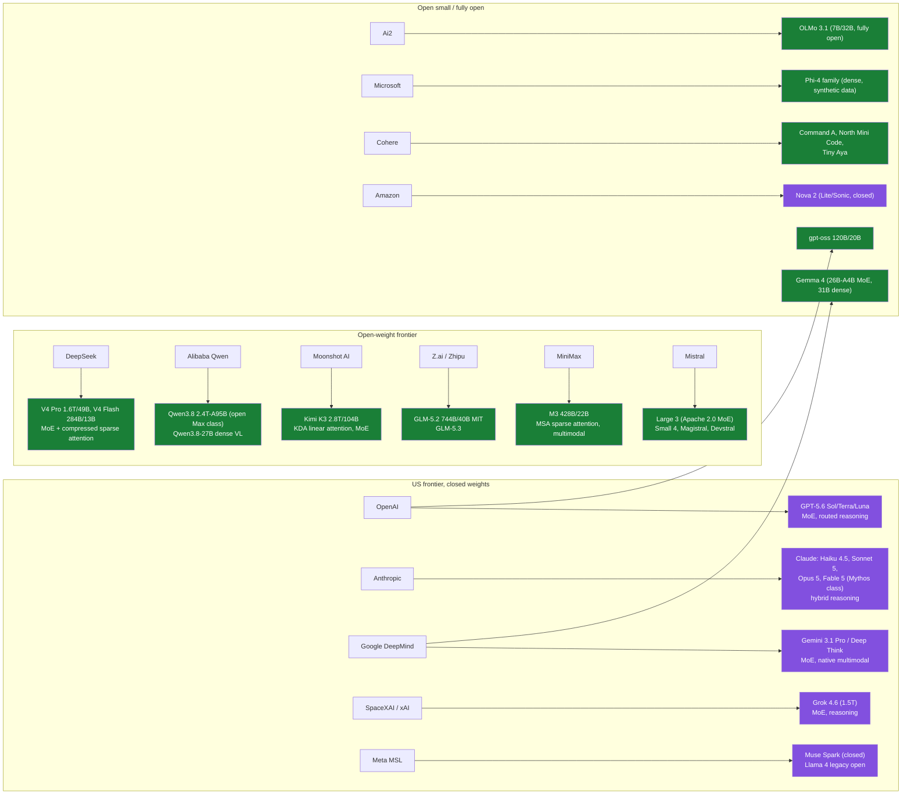

# LLMs: taxonomy of the major model landscape

Last updated: 2026-08-24. This page is the map of who builds what; per-family depth lives in
the subfolders, cross-model material in `_comparisons/`, and thematic deep dives in
`reasoning-models.md` and `moe-models.md`. Per-model files will be added in later sessions.

## State of play, August 2026, in five sentences

The frontier is crowded and close: Claude Opus 5, Claude Fable 5, GPT-5.6, Gemini 3.1 Pro,
and Grok 4.6 trade the lead by task, with Kimi K3 as the first open-weight model inside that
pack. Sparse MoE is the default architecture everywhere; dense models survive only at small
scale. Every flagship is now a reasoning ("thinking") model with an adjustable or routed
test-time compute budget, so the standalone reasoning-model category has dissolved into the
mainline. Open weights are led from China (DeepSeek, Qwen, Moonshot, Zhipu, MiniMax), with
Mistral and Ai2 the main Western counterweights after Meta retreated from open frontier
releases. 1M-token context is table stakes at the frontier, driving a wave of sparse and
linear attention designs (DSA/CSA, MSA, Kimi Delta Attention).

## Taxonomy

Diagram source (mermaid)

Green = open weights, purple = closed. Nearly everything at scale is sparse MoE with a
reasoning mode; dense survives in Qwen3.8-27B, Gemma 4 31B, Phi-4, OLMo, and other
sub-40B models.

## Families at a glance

| Family | One-line characterisation | Folder |
|---|---|---|
| OpenAI GPT | Closed frontier; GPT-5.x unifies fast + reasoning behind a router (Sol/Terra/Luna tiers); gpt-oss is the open offshoot | [openai/](openai/overview.md) |
| Anthropic Claude | Closed frontier; four tiers (Haiku, Sonnet, Opus, plus the new Mythos-class Fable); extended-thinking pioneer, best-regarded for agentic coding | [anthropic/](anthropic/overview.md) |
| Google Gemini + Gemma | Natively multimodal, TPU-trained, long-context pioneer; Gemma is the open distillate | [google-gemini/](google-gemini/overview.md) |
| Meta Llama / MSL | Former open-weights standard bearer; post-reorg Meta Superintelligence Labs went closed with Muse Spark | [meta-llama/](meta-llama/overview.md) |
| DeepSeek | Efficiency-obsessed open MoE line (MLA, FP8, aux-loss-free balancing, sparse attention); R1 started the open reasoning era | [deepseek/](deepseek/overview.md) |
| Qwen (Alibaba) | The widest open family (sub-1B to 2.4T), Apache 2.0, most-finetuned base models in the ecosystem | [qwen/](qwen/overview.md) |
| Mistral | European champion; Apache 2.0 flagship MoE (Large 3) plus a long tail of specialised small models | [mistral/](mistral/overview.md) |
| xAI Grok (SpaceXAI) | Compute-maximalist closed line (Colossus cluster); merged into SpaceX in Feb 2026 | [xai-grok/](xai-grok/overview.md) |
| Moonshot Kimi | Open trillion-scale MoE with novel attention (KDA) and optimizer (Muon) research; K3 leads open weights | [moonshot-kimi/](moonshot-kimi/overview.md) |
| Zhipu GLM (Z.ai) | MIT-licensed agentic-coding value leader; GLM-5.2 tops open-weight indices | [zhipu-glm/](zhipu-glm/overview.md) |
| MiniMax | Attention-efficiency experimenters (lightning, then MSA sparse); M3 is the cheapest capable open frontier model | [minimax/](minimax/overview.md) |
| Ai2 OLMo | Fully open (data, code, checkpoints, logs); OLMo 3 Think was the first fully open 32B reasoning model | [ai2-olmo/](ai2-olmo/overview.md) |
| Microsoft Phi, Amazon Nova, Cohere, NVIDIA, IBM, others | Small-model specialists, enterprise plays, hybrid-architecture research lines | [other-providers/](other-providers/overview.md) |

## Deep dives and comparisons

- [reasoning-models.md](reasoning-models.md): test-time compute, o-series to R1 to hybrid
  thinking, current adaptive-reasoning state.
- [moe-models.md](moe-models.md): gating, load balancing, expert parallelism, and the
  modern high-sparsity MoE landscape.
- [_comparisons/llm-architecture-gallery.md](_comparisons/llm-architecture-gallery.md):
  Sebastian Raschka's side-by-side architecture gallery; attention/MoE/norm/positional
  deltas across open models.

## Related papers (central papers/ folder)

- [GPT-3 (2020)](../../papers/2020-05_gpt-3/summary.md): in-context learning, the scaling bet.
- [Switch Transformer (2021)](../../papers/2021-01_switch-transformer/summary.md): top-1 MoE at scale.
- [Mixtral (2024)](../../papers/2024-01_mixtral/summary.md): the open MoE that mainstreamed 8x7B.
- [Llama 3 (2024)](../../papers/2024-07_llama-3/summary.md): dense 405B, the open-weights high-water mark of its era.
- [DeepSeek-V3 (2024)](../../papers/2024-12_deepseek-v3/summary.md): MLA + fine-grained MoE + FP8, the modern open template.
- [DeepSeek-R1 (2025)](../../papers/2025-01_deepseek-r1/summary.md): reasoning via pure RL (GRPO).
- [OLMo 2 (2025)](../../papers/2025-01_olmo-2/summary.md): fully open training science.
- [Qwen3 (2025)](../../papers/2025-05_qwen3/summary.md): hybrid thinking modes, dense + MoE ladder.
- [Mamba (2023)](../../papers/2023-12_mamba/summary.md): the SSM line now appearing in hybrid production models.

## Best resources for the landscape as a whole

- [Sebastian Raschka: The Big LLM Architecture Comparison](https://magazine.sebastianraschka.com/p/the-big-llm-architecture-comparison): the canonical architecture survey.
- [LLM Architecture Gallery](https://sebastianraschka.com/llm-architecture-gallery/) ([repo](https://github.com/rasbt/llm-architecture-gallery)): living per-model fact sheets.
- [Artificial Analysis](https://artificialanalysis.ai/): independent intelligence/price/speed index, the de facto scoreboard.
- [LMArena](https://lmarena.ai/): human-preference Elo across text, vision, and code arenas.
- [Interconnects (Nathan Lambert)](https://www.interconnects.ai/): best running commentary on open vs closed model politics and training.
- [AI Release Tracker](https://aireleasetracker.com/): dated timeline of every notable release.
