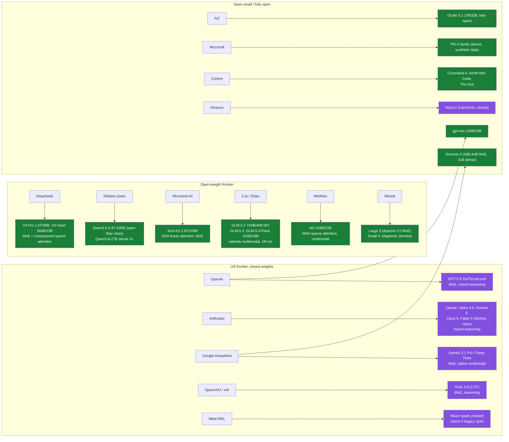

# LLMs: taxonomy of the major model landscape

⏱ 22 min read · +4h 47m resources. **Whole llms subtree: 2h 53m read · +52h 17m resources.**

Last updated: 2026-09-07. This page is the map of who builds what; per-family depth lives in
the subfolders, cross-model material in `_comparisons/`, and thematic deep dives in
`reasoning-models.md` and `moe-models.md`. Per-model files will be added in later sessions.

## State of play, August 2026, in five sentences

The frontier is crowded and close: Claude Opus 5, Claude Fable 5, GPT-5.6, Gemini 3.1 Pro,
and Grok 4.6 trade the lead by task, with Kimi K3 as the first open-weight model inside that
pack. Sparse MoE is the default architecture everywhere; dense models survive only at small
scale. Every flagship is now a reasoning ("thinking") model with an adjustable or routed
test-time compute budget, so the standalone reasoning-model category has dissolved into the
mainline. Open weights are led from China (DeepSeek, Qwen, Moonshot, Zhipu, MiniMax), with
Mistral and Ai2 the main Western counterweights after Meta retreated from open frontier
releases. 1M-token context is table stakes at the frontier, driving a wave of sparse and
linear attention designs (DSA/CSA, MSA, Kimi Delta Attention).

## Taxonomy

Diagram source (mermaid)

Green = open weights, purple = closed. Nearly everything at scale is sparse MoE with a
reasoning mode; dense survives in Qwen3.8-27B, Gemma 4 31B, Phi-4, OLMo, and other
sub-40B models.

Added 2026-08-31: **GLM-5.3-Flash** (Z.ai, Aug 26) is the first natively multimodal model in the GLM-5 line and the first open-weight model to put frontier-adjacent multimodality at a flash-tier price: 320B total / 18B active MoE, a 1,048,576-token context, image and video input, MIT licence, weights on Hugging Face. Z.ai claims it beats GLM-5.2 across its own evaluations at roughly one tenth the cost; list API pricing is $0.15 / $0.50 per million tokens (a $0.075 input promo ran to Sep 9). It is the same model that appeared on evaluation platforms the week before as the stealth entry **Ox Alpha**, which the 2026-08-24 news issue flagged as unattributed. Detail on the [Z.ai (Zhipu): GLM](zhipu-glm/overview.md) page. [Announcement](https://docs.z.ai/release-notes/new-released), [SiliconANGLE](https://siliconangle.com/2026/08/26/z-ai-open-sources-ox-alpha-model-as-glm-5-3-flash/)

Added 2026-08-31: **Qwen3.8-Flash-Next** (Alibaba, Aug 26) is an open-weight preview of the **Qwen4 architecture**, released early and explicitly so the ecosystem can adapt before the full Qwen4 family lands. 125B total / 6B active MoE (a sparsity ratio of about 21x, the most aggressive in the open frontier), causal LM plus a vision encoder, 262,144-token native context extensible to 1M. The architectural change worth knowing: the Gated DeltaNet plus Gated Attention hybrid of Qwen3.x becomes **Gated DeltaNet plus Qwen Sparse Attention (QSA)**, where QSA selects at micro-block rather than individual-token granularity, cutting long-context latency because block selection is hardware-friendly in a way token-level selection is not. That puts the whole open frontier on some form of trainable sparse or linear attention: DeepSeek DSA/CSA, Kimi KDA, MiniMax MSA, and now Qwen QSA. Weights on [Hugging Face](https://huggingface.co/Qwen/Qwen3.8-Flash-Next), detail on the [Alibaba: Qwen](qwen/overview.md) page. [Qwen blog](https://qwen.ai/blog?id=qwen3.8-flash-next), [TechNode](https://technode.com/2026/08/26/alibabas-qwen-to-open-source-qwen3-8-flash-next-previewing-qwen4-architecture/)

Both releases land the same week and point the same way: the open-weight frontier is now competing on active-parameter efficiency and attention sparsity rather than on total parameter count, and both shipped natively multimodal.

Added 2026-08-31 (news backfill): **Tencent Hy4 preview** (Aug 28) makes it three open-weight frontier releases in one week, from a lab that was not previously in this pack. 770B total / 49B active MoE, context window above 1M tokens, two reasoning levels with high on by default and a `no_think` switch, roughly 1.56TB of weights on Hugging Face. Tencent positions it on real-world productivity rather than benchmark maxima: an internal blind evaluation with 163 experts across 203 engineering tasks scored it 2.99/4.00 against GLM-5.3 at 2.92 and Kimi K3 at 2.94, which is inside the noise but is the right order of magnitude of claim. Two things to carry: the sparsity ratio (about 16x) is conservative next to Qwen3.8-Flash-Next's 21x, so the week's three releases span the whole current sparsity range; and Tencent says the model took part in the automated optimisation of its own training methods, with autonomous infrastructure work producing a 31.8% throughput gain, which is the same claim shape as Anthropic's recursive-self-improvement report published the same week. Add a Tencent Hunyuan/Hy line to the taxonomy and a row to the families table when this page is next revised. [Tencent](https://www.tencent.com/tencent-releases-and-open-sources-tencent-hy4-preview/)

Superseded 2026-09-07: GPT-6 Astra recorded as an unconfirmed leak

Added 2026-08-31 (news backfill), unconfirmed: first public outputs attributed to OpenAI's **GPT-6 "Astra"** surfaced Aug 29 from an expanded internal test tagged `mozaik-alpha-fdm`, showing zero-shot complex frontend and visual software generation. There is no announcement, model card or availability, so treat this as a leak and not a release; recorded only so the GPT line's dating is not silently a quarter behind. [TestingCatalog](https://www.testingcatalog.com/first-outputs-from-gpt-6-astra-model-from-openai/)

Added 2026-09-07: **GPT-6 Astra** (OpenAI, Sep 3) is released, which supersedes the leak note above. Trained on more than 100,000 GPUs at the Stargate site in Texas, priced at $10 and $50 per million input and output tokens with a Fast mode at double price for double speed, and available through ChatGPT Plus, Pro, Business and Enterprise, the OpenAI API, Azure and AWS Bedrock. OpenAI has published no parameter count, no architecture and no context window, which is the continuation of the GPT-5.x pattern of hiding the machinery behind the product. It is also the first model OpenAI classifies as **Critical** for cybersecurity capability under its Preparedness Framework, and the system card notes the model is better at controlling its own chain of thought and could in principle evade a monitor adversarially. The two things worth carrying are both about how it reasons rather than how big it is.

The first is **recurrent depth**, also called **opaque recurrence**: instead of emitting all of its deliberation as chain-of-thought tokens, the model loops activations back through its own layers, so some test-time compute is spent in latent space and never becomes text. This is a genuinely different way to spend a test-time budget from the two the KB already documents. Anthropic's exposed thinking budget spends it in visible tokens the caller pays for and can read; Gemini Deep Think spends it in parallel branches that are still token traces; recurrent depth spends it in activations that leave no trace at all. Three consequences follow, and they are the reason this belongs on a model page rather than only in the news. Monitoring: Buck Shlegeris warned that scaling opaque recurrence up could "totally destroy CoT monitorability", and Ryan Greenblatt named the endpoint where a model reasons entirely in latent space; OpenAI says Astra's use is limited and chain-of-thought visibility is preserved. Evaluation: a harness can no longer reconstruct the model's working state from the transcript. Serving: the recurrent state has to persist between requests or be recomputed, which is why the vendor now ships a harness that keeps it. Architecturally Sebastian Raschka reads it as a looped transformer, where layer reuse buys capacity without parameters, and argues that the looping is not by itself the reason the model is good; that is the useful sceptical counterweight to the safety framing, and it also names the serving cost, since a reused layer is cheaper to host and more expensive to serve. [OpenAI](https://openai.com/index/gpt-6-astra/) (10 min), [TechCrunch](https://techcrunch.com/2026/09/02/openais-new-reasoning-technique-alarms-ai-safety-experts/) (8 min), [Raschka](https://sebastianraschka.com/blog/2026/openai-astra-looped-transformers.html) (12 min)

The second is that **Astra's headline benchmark number is a harness number**. OpenAI's card reports 99.9% on ARC-AGI-3, 98% on FrontierMath Tier 4, 100% on ExploitBench against 78.5% for the prior model, 72.6% on OSWorld 2.0, 57.9% on Terminal-Bench 4.0 and 96.0% on GPQA Diamond. ARC Prize then reported the same model at 62.7% through its standard provider-agnostic harness and 99.9% through a new Provider Adapter that preserves opaque reasoning state between requests and compacts long conversations, with the adapter run 3.66x faster and 49% cheaper in tokens. Same weights, 37 points apart, and the higher score is the cheaper run. See `Topic: benchmarks` for what this does to ARC-AGI-3 reporting and `Topic: agentic-harnesses` for where it sits in the harness-scaling line. [ARC Prize](https://arcprize.org/blog/astra) (15 min)

Added 2026-09-07: **Claude Fable 5.1 and Mythos 5.1** (Anthropic, Sep 1). One underlying model shipped in two safeguard configurations, which is a new packaging idea worth naming: Fable 5.1 is generally available with production safeguards, Mythos 5.1 is the same model under more permissive ones, restricted to vetted cybersecurity and life-sciences organisations. The capability jump is concentrated in long-horizon agentic work: Terminal-Bench-Science 0.1 from 24.7% to 52.6%, Terminal-Bench 4.0 from 42.0% to 55.8%, AutomationBench from 17.1% to 31.4%, CursorBench 3.2.0 at 73.4%. The commercially significant change is a 75% cut to cached input, from $1.00 to $0.25 per million against $10 standard input, which is the line item that dominates any agent re-reading a large prefix every turn. A new Enterprise Frontier Safeguards architecture gives customers custody of their own data. Detail on the [Anthropic: Claude family](anthropic/overview.md) page. [Anthropic](https://www.anthropic.com/claude-fable-and-mythos-5-1) (6 min), [VentureBeat](https://venturebeat.com/technology/anthropics-claude-fable-5-1-and-mythos-5-1-arrive-with-a-75-cost-reduction-for-fable-cache-reads) (8 min)

Added 2026-09-07: **Gemini 3.8 Flash and Flash Cyber** (Google, Sep 2). 59 on the Artificial Analysis Intelligence Index, up 3 from 3.7 Flash and level with GPT-5.6 Sol and Grok 4.6, while beating most larger frontier models on long-horizon software engineering. The interesting part is how the gain was bought: Google says the model "works harder", taking more reasoning steps and calling tools more iteratively for the same question, so cost per task rose about 40% over 3.7 Flash even though the per-token price did not. That is a flash-tier model choosing to spend more test-time compute by default, which blurs the tier distinction the price list implies. Introductory pricing $0.75 and $3.75 per million, doubling in the new year, at roughly $0.58 per Intelligence Index task. Flash Cyber is a vulnerability-detection and remediation variant distributed through the Fairwind Program to governments, critical infrastructure and software maintainers. [Google](https://blog.google/innovation-and-ai/models-and-research/gemini-models/3-8-flash-and-3-8-flash-cyber/) (5 min), [The Register](https://www.theregister.com/ai-and-ml/2026/09/02/with-gemini-38-flash-google-reminds-everyone-its-still-in-the-race/5294049) (6 min)

Added 2026-09-07: **Muse Spark 1.3** (Meta, Sep 2) puts Meta back in the frontier band, at 61 on the Intelligence Index at xhigh reasoning and 62 at a max tier available only in limited preview, third among labs on the reranked v4.2 index. 1M-token context, text, image and video input, $1.25 and $4.25 per million with cache hits at $0.15, and at $0.55 per task the cheapest model scoring 59 or above. The claim worth testing is agentic efficiency rather than raw score: roughly 20% fewer tool calls and 25% fewer tokens than Muse Spark 1.2 for the same work, which is the metric that decides agent economics once capability is close. Weights are closed; first-party API and Muse Code only. Note the reporting caveat: the top numbers come from the max tier developers cannot broadly use. **This qualifies the "Meta retreated from open frontier releases" line in the state-of-play paragraph above and the Meta row of the families table.** Meta left the *open* frontier; it has not left the frontier. Detail on the [Meta: Llama and Meta Superintelligence Labs](meta-llama/overview.md) page. [Meta](https://research.meta.ai/blog/introducing-muse-spark-1-3) (5 min), [Artificial Analysis](https://artificialanalysis.ai/articles/muse-spark-1-3) (10 min)

Added 2026-09-07: **Qwen3.8-Max-0902** (Alibaba, Sep 2) is a post-trained snapshot of the 2.4T flagship rather than a new version: 1M-token context, further post-trained on coding and Cowork agentic data. The release convention is the thing to internalise rather than the model. Alibaba is now shipping dated snapshots of a flagship instead of incrementing version numbers, so "Qwen3.8-Max" is no longer a single artifact and any reproducible result has to pin the snapshot id. Detail on the [Alibaba: Qwen](qwen/overview.md) page. [TechNode](https://technode.com/2026/09/02/alibaba-upgrades-qwen38-max-with-new-0902-snapshot/) (5 min)

Added 2026-09-07: **K2 Horizon** (Institute of Foundation Models, Abu Dhabi, Sep 3) is the structurally important release of the week, because it puts a second lab in the **fully open** category rather than the open-weight one. Six models under Apache 2.0, at 0.9B, 3.7B, 7B, 32B, a 36B sparse variant and 375B, published with weights, training code, training data and methodology. Until now Ai2's OLMo was the only line releasing the corpus and recipe, which is the precondition for contamination auditing, data ablations and training-dynamics research; there are now two, from different funders on different continents. Architecturally the fleet shares two ideas: **diffusion distillation**, which generates a block of tokens in parallel rather than one at a time for a claimed 3x speedup and connects this line to the text-diffusion work on `Topic: generative-and-multimodal`, and a **mixture of value attention** design aimed at reasoning. IFM claims state of the art at 0.9B, 3.7B and 7B and open-weight competitiveness at 375B, which should be read as a vendor claim until independently rerun. On Hugging Face with vLLM and SGLang support, plus API access via Compass, Cerebras and Nebius. Add an IFM / K2 line to the taxonomy's open-research group and a row to the families table when this page is next revised. [IFM](https://ifm.ai/k2/press-release/) (8 min)

Added 2026-09-07: **GLM-5.3-Flash, the engineering behind the release noted above.** The Aug 26 entry recorded what shipped; the architecture detail only became public in the following week, and it is the more useful half. The model is a 320B total / 18B active MoE activating 8 of 288 experts per token, trained on 30T multimodal tokens with multi-token prediction, and it is served entirely on Chinese-made accelerators. Two design choices carry the cost story. A **hybrid linear plus sparse attention** stack cuts attention compute to roughly one third of GLM-5.3. An **IndexPool** step averages every four lookup vectors before selection, which cuts the KV cache to under a quarter of its size at 1M context, and that is what makes the advertised million-token window affordable rather than merely available. The resulting economics: 57 on the Artificial Analysis Intelligence Index at about $0.09 per task, against roughly $2.03 for a comparably placed closed model. This is the clearest current example of the pattern named at the end of this section, that the open frontier now competes on active-parameter efficiency and attention sparsity rather than parameter count. KV-cache and attention detail also filed on `Topic: inference-and-serving`.

## What each family actually is (9 min)

The table below is a quick index. This section is the part worth reading: what each lab is actually doing differently, because the differences are real and they explain the model behaviour you see.

**OpenAI (GPT)** runs the widest product surface and hides the most machinery behind it. The structural choice that matters in GPT-5.x is the **router**: rather than exposing one model, a classifier decides per request whether to answer immediately or spend test-time compute on a reasoning trace, and the Sol/Terra/Luna tiers are cost bands rather than distinct architectures. This makes latency and cost hard to predict per call and makes evaluation harder, because two identical prompts can be served by different amounts of compute. **gpt-oss** (120B and 20B) is the open offshoot, and it is genuinely open-weight rather than a demo: MoE with MXFP4-quantised experts so the 120B fits on a single 80GB card.

**Anthropic (Claude)** made the opposite bet on reasoning control. Instead of routing invisibly, extended thinking is exposed as a **caller-set token budget**, so the application decides how much the model deliberates and the cost is predictable. Four tiers (Haiku for cheap high-volume work, Sonnet as the workhorse, Opus at the frontier, Fable in the newer Mythos class) plus a training emphasis on long-horizon agentic coding is why Claude tends to lead harness-based benchmarks like SWE-bench and Terminal-Bench rather than raw knowledge tests. **Constitutional AI** is the distinctive alignment method: the model critiques and revises its own outputs against a written set of principles, so preference data is generated by a model against an explicit spec rather than collected from human raters at scale.

**Google DeepMind (Gemini, Gemma)** is the only frontier lab training end to end off NVIDIA, on TPUs via JAX and Pathways. That is a strategic hedge on supply and cost, not just a hardware detail. Gemini was the long-context pioneer, and the reason million-token context is affordable rather than merely advertised is the combination of sparse MoE (only a fraction of parameters run per token) with native multimodality (images, audio and video enter as tokens rather than through a bolted-on encoder). **Deep Think** spends test-time compute in parallel, exploring several reasoning paths and selecting among them, which is a different trade from one long serial trace: better on problems with a verifiable answer, more expensive per query. **Gemma** is the open distillate, notable for a 5:1 ratio of local sliding-window to global attention layers, which cuts KV cache cost sharply while keeping enough global layers for long-range recall.

**Meta (Llama, MSL)** is the cautionary story of the era. Llama 2 and 3 were the open-weights standard, and Llama 3 was deliberately trained far past the **Chinchilla** compute-optimal point (Chinchilla says that for a fixed training budget you should scale parameters and tokens together; Meta overshot on tokens because the cost that matters in deployment is inference, not training). Llama 4's reception collapsed over benchmark-presentation issues, and after the reorganisation into Meta Superintelligence Labs the frontier line (Muse Spark) went closed. The open crown moved to China.

**DeepSeek** is the efficiency lab, and nearly every contribution is one idea applied at a different layer: make a frontier model cheap to serve. **MLA (Multi-head Latent Attention)** compresses keys and values into a shared low-rank latent vector instead of caching them per head, shrinking the KV cache by roughly an order of magnitude at the cost of a projection per attention call. **Aux-loss-free load balancing** removes the auxiliary loss that normally forces even expert usage (and quietly degrades quality by fighting the real objective), replacing it with a per-expert bias nudged during training, so balance costs nothing in the gradient. **FP8 training** worked end to end at frontier scale, roughly halving memory traffic. **DSA and the V4 compressed sparse attention** learn which parts of a long context to attend to rather than attending to all of it. **R1** showed that reasoning could be trained by pure RL against verifiable answers using **GRPO** (Group Relative Policy Optimisation, which drops PPO's learned value network and instead scores each sample against the mean of its own sampled group), with no supervised reasoning traces required. That is what made the open reasoning era possible rather than merely announced.

**Alibaba (Qwen)** competes on breadth rather than a single flagship: a complete ladder from sub-1B to 2.4T, Apache 2.0, which is why Qwen checkpoints are the most fine-tuned base models in the ecosystem and the default starting point for anyone training a specialist. Architecturally the current line pairs **Gated DeltaNet** (a linear-attention variant with a delta update rule, giving a fixed-size recurrent state instead of a KV cache that grows with sequence length) with **QSA (Qwen Sparse Attention)**, which selects context at micro-block rather than per-token granularity because block selection maps onto GPU memory access patterns in a way token-level selection does not.

**Moonshot (Kimi)** does the most distinctive systems research in the open frontier. **Muon** is an optimiser that flattens the spectrum of each weight update via a Newton-Schulz iteration rather than tracking per-coordinate second moments like AdamW, which trains more efficiently but needed a fix (qk-clip) to stop attention logits exploding. **KDA (Kimi Delta Attention)** is its linear-attention design, hybridised with full attention layers because pure linear attention loses exact recall. K3 is currently the strongest open-weight model.

**Z.ai / Zhipu (GLM)** is the value play: MIT licence, aggressive pricing, and a deliberate focus on agentic coding rather than benchmark maxima. It also runs the interesting release tactic of shipping models anonymously to evaluation platforms first (GLM-5.3-Flash appeared as "Ox Alpha") to collect uncontaminated third-party numbers before claiming them.

**MiniMax** is the attention-efficiency lab, and its trajectory is instructive: it went hard on linear attention (lightning attention, an IO-aware tiled implementation), then partially reversed for reasoning and agentic workloads, which turn out to need the exact recall that a fixed-size recurrent state cannot provide. Its current **MSA** is block-sparse selection instead.

**Mistral** is the European champion and the main Western open-weight counterweight, with an Apache 2.0 MoE flagship (Large 3) plus a long tail of small specialists (code, vision, speech, guardrails). **Ai2 (OLMo)** is the only lab releasing genuinely everything: corpus, data mixture and ordering, training code, intermediate checkpoints, and logs. That is what makes contamination auditing, data ablations and training-dynamics research possible at all, and it costs them the capability frontier. **xAI/SpaceXAI (Grok)** is the compute-maximalist line, built on the Colossus cluster, where the differentiator is cluster coherence at scale rather than any published architectural idea. **Microsoft Phi** bets on synthetic textbook-quality data to get strong benchmark numbers from small dense models, with the known weakness that the gains are partly benchmark-shaped.

The pattern across all of them, as of August 2026: everything at scale is sparse MoE with a reasoning mode; the competition has moved from total parameter count to **active**-parameter efficiency and to trainable attention sparsity, because both determine serving cost; and every lab has now shipped some form of learned sparse or linear attention because quadratic attention over a million tokens is not affordable at any parameter count.

## Families at a glance (quick index)

| Family | One-line characterisation | Folder |
|---|---|---|
| OpenAI GPT | Closed frontier; GPT-5.x unifies fast + reasoning behind a router (Sol/Terra/Luna tiers); gpt-oss is the open offshoot | [openai/](openai/overview.md) |
| Anthropic Claude | Closed frontier; four tiers (Haiku, Sonnet, Opus, plus the new Mythos-class Fable); extended-thinking pioneer, best-regarded for agentic coding | [anthropic/](anthropic/overview.md) |
| Google Gemini + Gemma | Natively multimodal, TPU-trained, long-context pioneer; Gemma is the open distillate | [google-gemini/](google-gemini/overview.md) |
| Meta Llama / MSL | Former open-weights standard bearer; post-reorg Meta Superintelligence Labs went closed with Muse Spark | [meta-llama/](meta-llama/overview.md) |
| DeepSeek | Efficiency-obsessed open MoE line (MLA, FP8, aux-loss-free balancing, sparse attention); R1 started the open reasoning era | [deepseek/](deepseek/overview.md) |
| Qwen (Alibaba) | The widest open family (sub-1B to 2.4T), Apache 2.0, most-finetuned base models in the ecosystem | [qwen/](qwen/overview.md) |
| Mistral | European champion; Apache 2.0 flagship MoE (Large 3) plus a long tail of specialised small models | [mistral/](mistral/overview.md) |
| xAI Grok (SpaceXAI) | Compute-maximalist closed line (Colossus cluster); merged into SpaceX in Feb 2026 | [xai-grok/](xai-grok/overview.md) |
| Moonshot Kimi | Open trillion-scale MoE with novel attention (KDA) and optimizer (Muon) research; K3 leads open weights | [moonshot-kimi/](moonshot-kimi/overview.md) |
| Zhipu GLM (Z.ai) | MIT-licensed agentic-coding value leader; GLM-5.2 tops open-weight indices | [zhipu-glm/](zhipu-glm/overview.md) |
| MiniMax | Attention-efficiency experimenters (lightning, then MSA sparse); M3 is the cheapest capable open frontier model | [minimax/](minimax/overview.md) |
| Ai2 OLMo | Fully open (data, code, checkpoints, logs); OLMo 3 Think was the first fully open 32B reasoning model | [ai2-olmo/](ai2-olmo/overview.md) |
| Microsoft Phi, Amazon Nova, Cohere, NVIDIA, IBM, others | Small-model specialists, enterprise plays, hybrid-architecture research lines | [other-providers/](other-providers/overview.md) |

## Deep dives and comparisons

- [reasoning-models.md](reasoning-models.md): test-time compute, o-series to R1 to hybrid
  thinking, current adaptive-reasoning state. **(16 min read · +4h 15m resources)**
- [moe-models.md](moe-models.md): gating, load balancing, expert parallelism, and the
  modern high-sparsity MoE landscape. **(17 min read · +3h 25m resources)**
- [_comparisons/llm-architecture-gallery.md](_comparisons/llm-architecture-gallery.md):
  Sebastian Raschka's side-by-side architecture gallery; attention/MoE/norm/positional
  deltas across open models. **(10 min read · +2h resources)**

## Related papers (central papers/ folder)

Each has a full summary page under **Papers**, with a bracketed cost on the index there.

- T5 (2019): the fork in the road this whole page sits downstream of. It framed every task as text in, text out and then measured, at matched compute, that an encoder-decoder with a denoising objective beat the decoder-only prefix LM on understanding tasks. The field went decoder-only regardless, and the reasons are worth holding because none of them are quality: in-context learning arrived with GPT-3 a year later and rewarded a single causal stack, and serving one stack with one KV cache and no separate encoder pass is simply cheaper. Every family in the table above is a decoder, which is a choice the evidence of the time argued against.
- Encoder-Decoder Gemma and T5Gemma 2 (2025-2026): the modern rerun of that fork, adapting decoder-only Gemma checkpoints into encoder-decoder models rather than pretraining from scratch, and the only open encoder-decoder LLMs currently shipped by a frontier lab; the asymmetric 9B-2B and T5Gemma 2's long-context results are the parts that generalise beyond Gemma.
- [GPT-3 (2020)](../../papers/2020-05_gpt-3/summary.md): showed that scaling a dense transformer far enough makes task adaptation happen in the prompt itself, with no gradient update, which is the result the entire prompting era rests on.
- [Switch Transformer (2021)](../../papers/2021-01_switch-transformer/summary.md): simplified MoE routing to a single expert per token, proving you can grow parameter count without growing per-token compute, and naming the load-balancing and instability problems every later MoE has had to solve.
- [Mixtral (2024)](../../papers/2024-01_mixtral/summary.md): the first open MoE good enough to deploy, 8 experts of 7B with 2 active per token, which made "total versus active parameters" a distinction practitioners had to internalise.
- [Llama 3 (2024)](../../papers/2024-07_llama-3/summary.md): a dense 405B trained far past compute-optimal on purpose, plus a training report detailing 4D parallelism and the failure rates of a 16k-GPU cluster, which is the most useful part for anyone running large jobs.
- [DeepSeek-V3 (2024)](../../papers/2024-12_deepseek-v3/summary.md): the template every open frontier model now follows, combining MLA's compressed KV cache, fine-grained plus shared experts, aux-loss-free balancing, and end-to-end FP8 training.
- [DeepSeek-R1 (2025)](../../papers/2025-01_deepseek-r1/summary.md): reasoning behaviour emerging from RL against verifiable answers alone, using GRPO, with no supervised reasoning traces, which is why the open reasoning era started here.
- [OLMo 2 (2025)](../../papers/2025-01_olmo-2/summary.md): full disclosure of corpus, mixture, code, checkpoints and logs, which is what makes independent study of training dynamics and contamination possible.
- [Qwen3 (2025)](../../papers/2025-05_qwen3/summary.md): a single checkpoint serving both a fast mode and a deliberating mode under a caller-set thinking budget, shipped across a full dense and MoE size ladder.
- [Mamba (2023)](../../papers/2023-12_mamba/summary.md): a selective state-space model with a fixed-size recurrent state and linear-time sequence scaling, now surviving mainly as the linear half of hybrid architectures, because pure recurrence loses exact recall.

## Best resources for the landscape as a whole

- [Sebastian Raschka: The Big LLM Architecture Comparison](https://magazine.sebastianraschka.com/p/the-big-llm-architecture-comparison): the canonical architecture survey, the single best place to see what actually differs between open models rather than what their announcements claim. (1h 15m)
- [LLM Architecture Gallery](https://sebastianraschka.com/llm-architecture-gallery/) ([repo](https://github.com/rasbt/llm-architecture-gallery)): living per-model fact sheets, updated as models ship, useful as a lookup rather than a read. (~30 min to skim, more per model)
- [Artificial Analysis](https://artificialanalysis.ai/): independent index scoring intelligence against price and tokens per second, the de facto scoreboard for deciding what to actually deploy. (~20 min)
- [LMArena](https://lmarena.ai/): human-preference Elo from blind pairwise votes, which measures what people prefer rather than what is correct, so read it alongside a capability benchmark. (~15 min)
- [Interconnects (Nathan Lambert)](https://www.interconnects.ai/): Nathan Lambert's newsletter, the best running commentary on open versus closed model politics and on post-training practice. (~40 min per deep post, ongoing)
- [AI Release Tracker](https://aireleasetracker.com/): dated timeline of every notable release, the fastest way to reconstruct what shipped in a given window. (~10 min)

## Added 2026-09-14

**DeepSeek V4.1-Flash** (Sep 10) is the first frontier-scale open model to ship as an **encoder-decoder**, and that is the reason it belongs on this page rather than only in the serving one. 552B total parameters with 8B active during prefill and 16B during decode, a 40-layer transformer split into a 20-layer causal encoder and a 20-layer decoder, a 1,048,576-token context, native vision, a reasoning-effort dial from 1 to 100, MIT licence, 48 safetensors shards on Hugging Face. Reported figures: Terminal-Bench 2.1 at 90.6, Codeforces 3471, GPQA Diamond 90.9, with DeepSeek noting performance holds up better on shorter agent loops than on the longest-horizon evaluations. Pricing is $0.30 and $1.20 per million at peak and half that off-peak, with cache hits from $0.006; the API id is `deepseek-flash`, and from Sep 14 at noon Beijing time `deepseek-v4-pro` routes here at Flash pricing until V4.1 Pro ships. Two things to carry. The **architecture choice**: every family in the table above is a decoder, a choice the T5 evidence argued against at the time and which the KB records under `Papers` as a serving-economics decision rather than a quality one, and DeepSeek has now reversed it at 552B, with the KV-cache savings as the stated reason. The **cost target**: the KV cache falls to roughly a quarter of the HBM and an eighth of the SSD footprint of V4-Flash, via grouped-query attention, dynamic head pruning, selective layer caching and adaptive cache compression, so this generation bought serving cost rather than capability headroom. Serving detail on `Topic: inference-and-serving`; read next to LCLM under Papers, which argued the encoder-decoder case for context compression on exactly this systems ground. [DeepSeek API changelog](https://api-docs.deepseek.com/updates/) (10 min)

**Recurrent Looped Transformer (RLT)**, the first published specification of the architecture family the GPT-6 Astra entry above describes. Yifan Zhang (Princeton, Sep 13) pairs a causal encoder that builds a global KV memory with a decoder that carries its **entire state**, final output and layerwise sliding-window attention cache included, across every token, with no reset at the prompt and response boundary. In a standard decoder-only LLM nothing computed at the last layer of token t reaches the first layer of token t+1; RLT closes that loop, and does it over the prompt as well as the response. The reference configuration is 48 encoder and 48 decoder layers with compatible attention and FFN weights shared between them, so 96 logical blocks per token, and after t tokens the state path has traversed 48t decoder blocks: unbounded temporal depth at fixed per-token compute. The caveat is decisive and stated by the author: this is a design specification with **no trained weights, no efficiency measurements, no reasoning-quality results and no scaling results**, only architecture and illustrative reference code. File it as the vocabulary for talking precisely about recurrent depth, not as evidence that it works. Sebastian Raschka's survey of the same family (Sep 10) is the better entry point and adds the consequence that matters beyond architecture: recurrent depth buys compute without parameter memory, and the shorter visible reasoning traces that come with it are a real cost to chain-of-thought monitorability. [Project page](https://yifanzhang-pro.github.io/recurrent-looped-tranformer/) (25 min), [Raschka](https://magazine.sebastianraschka.com/p/gpt-6-astra-looped-transformers-and) (20 min), [MarkTechPost](https://www.marktechpost.com/2026/09/13/a-princeton-researcher-proposes-recurrent-looped-transformer-rlt/) (8 min)

**Sakana Fugu Max and Fugu Ultra v2** (Sep 10 to 11) are not models in the sense the rest of this page uses the word, and that is why they are here. Fugu is a **learned orchestrator**: it reads an incoming query, builds an agentic scaffold for it on the fly, and routes the work across a pool of other models behind one OpenAI-compatible API. It was trained by combining fine-tuning, evolutionary search and reinforcement learning, drawing on two ICLR 2026 papers, **TRINITY**, which assigns participating models Thinker, Worker or Verifier roles, and **The Conductor**, which learns coordination strategies by RL rather than having them specified. Fugu Max is the cost-optimised configuration at $2 and $6 per million, claimed 40 to 60% cheaper than comparable models and on the cost-performance Pareto frontier for 7 of 10 benchmarks; Fugu Ultra v2 targets hard reasoning, reporting Chartography at 48.3 against Claude Opus 5's 27.3 and DeepSWE at 74.3, best or joint-best on 5 of 8 benchmarks. Closed weights, no EU or EEA availability. The reason to track it: if a routed ensemble sold as one endpoint holds the Pareto frontier, then "which model" stops being the question a deployment answers and "which orchestrator" replaces it, which is the same boundary shift the ARC-AGI-3 Provider Adapter produced from the benchmark side. Cross-filed to `Topic: agentic-harnesses`. [Sakana](https://sakana.ai/fugu-max-release/) (10 min)

**One-liners.** **Cohere North Small Translate** (Sep 9 to 10), a 218B total and 25B active MoE built only for translation, 128 experts with 8 per token, 4096-token sliding-window attention and 16K context, reporting 83.6 on WMT26 across 50 languages against DeepL NextGen's 81.37 and Google Translate's 68.20 on Cohere's own evaluation with GPT-5.6-Sol as judge, free on the Cohere API to rate limits and non-commercial for self-hosting, with a 4-bit checkpoint that runs on one B200 or two H100s. A dedicated 218B translation model is a reminder that single-task specialists at MoE scale are still economically viable against generalists. **OpenBMB MiniCPM5-2B** (Sep 7), a dense 2.5B Apache-2.0 on-device model averaging 53.9 across 34 benchmarks. **inclusionAI Ling 3.0 Flash VL** (Sep 10), a flash-tier vision-language model, free on OpenRouter at launch. [Cohere blog](https://docs.cohere.com/docs/north-small-translate-1.0) (8 min)

*Placement note: this run appended the dated additions as a section at the end of the page rather than inline before "What each family actually is", because the exact inline anchor could not be confirmed without re-reading the page in full. Move it inline when convenient; nothing above was altered.*
