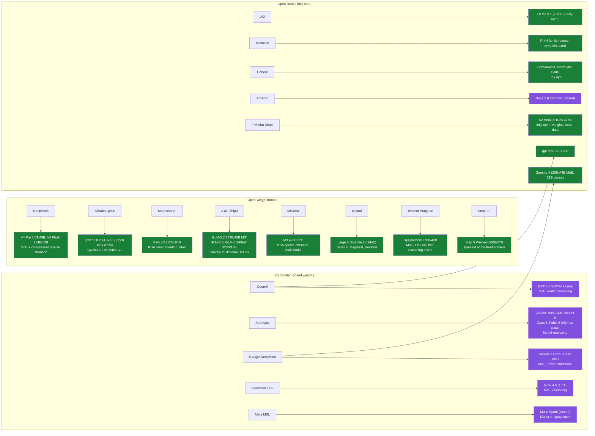

# Topic: llms

⏱ 27 min read · +6h 8m resources. **Whole llms subtree: 2h 58m read · +53h 38m resources.**

Last updated: 2026-09-21 (dated release entries integrated into the taxonomy, the families table and the family pages; two deferral notes cleared). This page is the map of who builds what. Per-family depth lives in the model-family pages listed at the end of this page, and thematic deep dives in [Reasoning models and test-time compute](reasoning-models.md) and [Mixture-of-Experts (MoE) models](moe-models.md). Add dedicated model pages when the material warrants them.

### State of play, September 2026, in six sentences

The frontier is crowded and close: Claude Fable 5.1 and Opus 5, GPT-6 Astra, Gemini 3.8 Flash, Muse Spark 1.3 and Grok 4.6 trade the lead by task, with Kimi K3 the strongest open-weight model inside that pack. Sparse MoE is the default architecture everywhere, and dense models survive only at small scale. Every flagship is now a reasoning ("thinking") model with an adjustable or routed test-time compute budget, so the standalone reasoning-model category has dissolved into the mainline, and GPT-6 Astra extended that budget into latent space through recurrent depth, which is deliberation a monitor cannot read. Open weights are led from China (DeepSeek, Qwen, Moonshot, Zhipu, MiniMax, and now Tencent), with Mistral, Ai2 and the Institute of Foundation Models the main counterweights; Meta left the *open* frontier but Muse Spark 1.3 put it back in the frontier band without returning to open weights. 1M-token context is table stakes, which drove every lab onto some form of trainable sparse or linear attention (DeepSeek DSA and CSA, MiniMax MSA, Kimi Delta Attention, Qwen QSA) and made KV-cache economics the visible product decision rather than an implementation detail. DeepSeek V4.1-Flash then reversed the field's decoder-only consensus at 552B, shipping the first frontier-scale open encoder-decoder for exactly that serving reason.

### Taxonomy

Green = open weights, purple = closed. Nearly everything at scale is sparse MoE with a

reasoning mode; dense survives in Qwen3.8-27B, Gemma 4 31B, Phi-4, OLMo, and other

sub-40B models.

**GLM-5.3-Flash** ([Z.ai](http://z.ai/), Aug 26) is the first natively multimodal model in the GLM-5 line and the first open-weight model to put frontier-adjacent multimodality at a flash-tier price: 320B total / 18B active MoE, a 1,048,576-token context, image and video input, MIT licence, weights on Hugging Face. [Z.ai](http://z.ai/) claims it beats GLM-5.2 across its own evaluations at roughly one tenth the cost; list API pricing is $0.15 / $0.50 per million tokens (a $0.075 input promo ran to Sep 9). It is the same model that appeared on evaluation platforms the week before as the stealth entry **Ox Alpha**, which the 2026-08-24 news issue flagged as unattributed. The architecture became public a week after launch and is what makes the price possible: 8 of 288 experts active per token, 30T multimodal training tokens with multi-token prediction, a **hybrid linear plus sparse attention** stack that cuts attention compute to roughly one third of GLM-5.3, and an **IndexPool** step that averages every four lookup vectors before selection and so cuts the KV cache to under a quarter of its size at 1M context. That last choice is what makes the advertised million-token window affordable to serve rather than merely available, and it lands the model at 57 on the Artificial Analysis Intelligence Index for about $0.09 per task against roughly $2.03 for a comparably placed closed model. It is served entirely on Chinese-made accelerators. Family detail on [Z.ai (Zhipu): GLM](zhipu-glm/overview.md), serving detail on [Topic: inference-and-serving](../inference-and-serving/summary.md). [Announcement](https://docs.z.ai/release-notes/new-released), [SiliconANGLE](https://siliconangle.com/2026/08/26/z-ai-open-sources-ox-alpha-model-as-glm-5-3-flash/)

**Qwen3.8-Flash-Next** (Alibaba, Aug 26) is an open-weight preview of the **Qwen4 architecture**, released early and explicitly so the ecosystem can adapt before the full Qwen4 family lands. 125B total / 6B active MoE (a sparsity ratio of about 21x, the most aggressive in the open frontier), causal LM plus a vision encoder, 262,144-token native context extensible to 1M. The architectural change worth knowing: the Gated DeltaNet plus Gated Attention hybrid of Qwen3.x becomes **Gated DeltaNet plus Qwen Sparse Attention (QSA)**, where QSA selects at micro-block rather than individual-token granularity, cutting long-context latency because block selection is hardware-friendly in a way token-level selection is not. That puts the whole open frontier on some form of trainable sparse or linear attention: DeepSeek DSA/CSA, Kimi KDA, MiniMax MSA, and now Qwen QSA. Weights on [Hugging Face](https://huggingface.co/Qwen/Qwen3.8-Flash-Next), detail on [Alibaba: Qwen](qwen/overview.md). [Qwen blog](https://qwen.ai/blog?id=qwen3.8-flash-next), [TechNode](https://technode.com/2026/08/26/alibabas-qwen-to-open-source-qwen3-8-flash-next-previewing-qwen4-architecture/)

Both releases land the same week and point the same way: the open-weight frontier is now competing on active-parameter efficiency and attention sparsity rather than on total parameter count, and both shipped natively multimodal.

**Tencent Hy4 preview** (Aug 28) makes it three open-weight frontier releases in one week, from a lab that was not previously in this pack. 770B total / 49B active MoE, context window above 1M tokens, two reasoning levels with high on by default and a `no_think` switch, roughly 1.56TB of weights on Hugging Face. Tencent positions it on real-world productivity rather than benchmark maxima: an internal blind evaluation with 163 experts across 203 engineering tasks scored it 2.99/4.00 against GLM-5.3 at 2.92 and Kimi K3 at 2.94, which is inside the noise but is the right order of magnitude of claim. Two things to carry: the sparsity ratio (about 16x) is conservative next to Qwen3.8-Flash-Next's 21x, so the week's three releases span the whole current sparsity range; and Tencent says the model took part in the automated optimisation of its own training methods, with autonomous infrastructure work producing a 31.8% throughput gain, which is the same claim shape as Anthropic's recursive-self-improvement report published the same week. [Tencent](https://www.tencent.com/tencent-releases-and-open-sources-tencent-hy4-preview/)

Superseded 2026-09-07: GPT-6 Astra recorded as an unconfirmed leak

Recorded 2026-08-31 and unconfirmed at the time: first public outputs attributed to OpenAI's **GPT-6 "Astra"** surfaced Aug 29 from an expanded internal test tagged `mozaik-alpha-fdm`, showing zero-shot complex frontend and visual software generation. There is no announcement, model card or availability, so treat this as a leak and not a release; recorded only so the GPT line's dating is not silently a quarter behind. [TestingCatalog](https://www.testingcatalog.com/first-outputs-from-gpt-6-astra-model-from-openai/)

**GPT-6 Astra** (OpenAI, Sep 3) is released, which supersedes the leak note above. Trained on more than 100,000 GPUs at the Stargate site in Texas, priced at $10 and $50 per million input and output tokens with a Fast mode at double price for double speed, and available through ChatGPT Plus, Pro, Business and Enterprise, the OpenAI API, Azure and AWS Bedrock. OpenAI has published no parameter count, no architecture and no context window, which is the continuation of the GPT-5.x pattern of hiding the machinery behind the product. It is also the first model OpenAI classifies as **Critical** for cybersecurity capability under its Preparedness Framework, and the system card notes the model is better at controlling its own chain of thought and could in principle evade a monitor adversarially. The two things worth carrying are both about how it reasons rather than how big it is.

The first is **recurrent depth**, also called **opaque recurrence**: instead of emitting all of its deliberation as chain-of-thought tokens, the model loops activations back through its own layers, so some test-time compute is spent in latent space and never becomes text. This is a genuinely different way to spend a test-time budget from the two the KB already documents. Anthropic's exposed thinking budget spends it in visible tokens the caller pays for and can read; Gemini Deep Think spends it in parallel branches that are still token traces; recurrent depth spends it in activations that leave no trace at all. Three consequences follow, and they are the reason this belongs on a model page rather than only in the news. Monitoring: Buck Shlegeris warned that scaling opaque recurrence up could "totally destroy CoT monitorability", and Ryan Greenblatt named the endpoint where a model reasons entirely in latent space; OpenAI says Astra's use is limited and chain-of-thought visibility is preserved. Evaluation: a harness can no longer reconstruct the model's working state from the transcript. Serving: the recurrent state has to persist between requests or be recomputed, which is why the vendor now ships a harness that keeps it. Architecturally Sebastian Raschka reads it as a looped transformer, where layer reuse buys capacity without parameters, and argues that the looping is not by itself the reason the model is good; that is the useful sceptical counterweight to the safety framing, and it also names the serving cost, since a reused layer is cheaper to host and more expensive to serve. The **Recurrent Looped Transformer (RLT)** (Yifan Zhang, Princeton, Sep 13) is the first published specification of this architecture family, and it is the vocabulary for talking about recurrent depth precisely rather than evidence that it works. It pairs a causal encoder building a global KV memory with a decoder that carries its entire state, final output and layerwise sliding-window attention cache included, across every token with no reset at the prompt and response boundary; in a standard decoder-only model nothing computed at the last layer of token t reaches the first layer of token t+1, and RLT closes that loop over the prompt as well as the response. The reference configuration is 48 encoder and 48 decoder layers with compatible attention and feed-forward weights shared between them, so 96 logical blocks per token, and after t tokens the state path has traversed 48t decoder blocks: unbounded temporal depth at fixed per-token compute. Raschka's survey of the same family is the better entry point and adds the consequence that matters beyond architecture: recurrent depth buys compute without parameter memory, and the shorter visible reasoning traces that come with it are a real cost to chain-of-thought monitorability. The caveat is decisive and stated by the author, that there are **no trained weights, no efficiency measurements, no reasoning-quality results and no scaling results**, only architecture and illustrative reference code. [Project page](https://yifanzhang-pro.github.io/recurrent-looped-tranformer/) (25 min), [Raschka's survey](https://magazine.sebastianraschka.com/p/gpt-6-astra-looped-transformers-and) (20 min), [MarkTechPost](https://www.marktechpost.com/2026/09/13/a-princeton-researcher-proposes-recurrent-looped-transformer-rlt/) (8 min). Sources for Astra itself: [OpenAI](https://openai.com/index/gpt-6-astra/) (10 min), [TechCrunch](https://techcrunch.com/2026/09/02/openais-new-reasoning-technique-alarms-ai-safety-experts/) (8 min), [Raschka](https://sebastianraschka.com/blog/2026/openai-astra-looped-transformers.html) (12 min)

The second is that **Astra's headline benchmark number is a harness number**. OpenAI's card reports 99.9% on ARC-AGI-3, 98% on FrontierMath Tier 4, 100% on ExploitBench against 78.5% for the prior model, 72.6% on OSWorld 2.0, 57.9% on Terminal-Bench 4.0 and 96.0% on GPQA Diamond. ARC Prize then reported the same model at 62.7% through its standard provider-agnostic harness and 99.9% through a new Provider Adapter that preserves opaque reasoning state between requests and compacts long conversations, with the adapter run 3.66x faster and 49% cheaper in tokens. Same weights, 37 points apart, and the higher score is the cheaper run. See [Topic: benchmarks](../benchmarks/summary.md) for what this does to ARC-AGI-3 reporting and [Topic: agentic-harnesses](../agentic-harnesses/summary.md) for where it sits in the harness-scaling line. [ARC Prize](https://arcprize.org/blog/astra) (15 min)

**Claude Fable 5.1 and Mythos 5.1** (Anthropic, Sep 1). One underlying model shipped in two safeguard configurations, which is a new packaging idea worth naming: Fable 5.1 is generally available with production safeguards, Mythos 5.1 is the same model under more permissive ones, restricted to vetted cybersecurity and life-sciences organisations. The capability jump is concentrated in long-horizon agentic work: Terminal-Bench-Science 0.1 from 24.7% to 52.6%, Terminal-Bench 4.0 from 42.0% to 55.8%, AutomationBench from 17.1% to 31.4%, CursorBench 3.2.0 at 73.4%. The commercially significant change is a 75% cut to cached input, from $1.00 to $0.25 per million against $10 standard input, which is the line item that dominates any agent re-reading a large prefix every turn. A new Enterprise Frontier Safeguards architecture gives customers custody of their own data. Detail on [Anthropic: Claude family](anthropic/overview.md). [Anthropic](https://www.anthropic.com/claude-fable-and-mythos-5-1) (6 min), [VentureBeat](https://venturebeat.com/technology/anthropics-claude-fable-5-1-and-mythos-5-1-arrive-with-a-75-cost-reduction-for-fable-cache-reads) (8 min)

**Gemini 3.8 Flash and Flash Cyber** (Google, Sep 2). 59 on the Artificial Analysis Intelligence Index, up 3 from 3.7 Flash and level with GPT-5.6 Sol and Grok 4.6, while beating most larger frontier models on long-horizon software engineering. The interesting part is how the gain was bought: Google says the model "works harder", taking more reasoning steps and calling tools more iteratively for the same question, so cost per task rose about 40% over 3.7 Flash even though the per-token price did not. That is a flash-tier model choosing to spend more test-time compute by default, which blurs the tier distinction the price list implies. Introductory pricing $0.75 and $3.75 per million, doubling in the new year, at roughly $0.58 per Intelligence Index task. Flash Cyber is a vulnerability-detection and remediation variant distributed through the Fairwind Program to governments, critical infrastructure and software maintainers. [Google](https://blog.google/innovation-and-ai/models-and-research/gemini-models/3-8-flash-and-3-8-flash-cyber/) (5 min), [The Register](https://www.theregister.com/ai-and-ml/2026/09/02/with-gemini-38-flash-google-reminds-everyone-its-still-in-the-race/5294049) (6 min)

**Muse Spark 1.3** (Meta, Sep 2) puts Meta back in the frontier band, at 61 on the Intelligence Index at xhigh reasoning and 62 at a max tier available only in limited preview, third among labs on the reranked v4.2 index. 1M-token context, text, image and video input, $1.25 and $4.25 per million with cache hits at $0.15, and at $0.55 per task the cheapest model scoring 59 or above. The claim worth testing is agentic efficiency rather than raw score: roughly 20% fewer tool calls and 25% fewer tokens than Muse Spark 1.2 for the same work, which is the metric that decides agent economics once capability is close. Weights are closed; first-party API and Muse Code only. Note the reporting caveat: the top numbers come from the max tier developers cannot broadly use. Detail on [Meta: Llama and Meta Superintelligence Labs](meta-llama/overview.md). [Meta](https://research.meta.ai/blog/introducing-muse-spark-1-3) (5 min), [Artificial Analysis](https://artificialanalysis.ai/articles/muse-spark-1-3) (10 min)

**Qwen3.8-Max-0902** (Alibaba, Sep 2) is a post-trained snapshot of the 2.4T flagship rather than a new version: 1M-token context, further post-trained on coding and Cowork agentic data. The release convention is the thing to internalise rather than the model. Alibaba is now shipping dated snapshots of a flagship instead of incrementing version numbers, so "Qwen3.8-Max" is no longer a single artifact and any reproducible result has to pin the snapshot id. Detail on [Alibaba: Qwen](qwen/overview.md). [TechNode](https://technode.com/2026/09/02/alibaba-upgrades-qwen38-max-with-new-0902-snapshot/) (5 min)

**K2 Horizon** (Institute of Foundation Models, Abu Dhabi, Sep 3) is the structurally important release of the week, because it puts a second lab in the **fully open** category rather than the open-weight one. Six models under Apache 2.0, at 0.9B, 3.7B, 7B, 32B, a 36B sparse variant and 375B, published with weights, training code, training data and methodology. Until now Ai2's OLMo was the only line releasing the corpus and recipe, which is the precondition for contamination auditing, data ablations and training-dynamics research; there are now two, from different funders on different continents. Architecturally the fleet shares two ideas: **diffusion distillation**, which generates a block of tokens in parallel rather than one at a time for a claimed 3x speedup and connects this line to the text-diffusion work on [Topic: generative-and-multimodal](../generative-and-multimodal/summary.md), and a **mixture of value attention** design aimed at reasoning. IFM claims state of the art at 0.9B, 3.7B and 7B and open-weight competitiveness at 375B, which should be read as a vendor claim until independently rerun. On Hugging Face with vLLM and SGLang support, plus API access via Compass, Cerebras and Nebius. [IFM](https://ifm.ai/k2/press-release/) (8 min)

### What each family actually is (9 min)

The table below is a quick index. This section is the part worth reading: what each lab is actually doing differently, because the differences are real and they explain the model behaviour you see.

**OpenAI (GPT)** runs the widest product surface and hides the most machinery behind it. The structural choice that matters in GPT-5.x is the **router**: rather than exposing one model, a classifier decides per request whether to answer immediately or spend test-time compute on a reasoning trace, and the Sol/Terra/Luna tiers are cost bands rather than distinct architectures. This makes latency and cost hard to predict per call and makes evaluation harder, because two identical prompts can be served by different amounts of compute. **gpt-oss** (120B and 20B) is the open offshoot, and it is genuinely open-weight rather than a demo: MoE with MXFP4-quantised experts so the 120B fits on a single 80GB card.

**Anthropic (Claude)** made the opposite bet on reasoning control. Instead of routing invisibly, extended thinking is exposed as a **caller-set token budget**, so the application decides how much the model deliberates and the cost is predictable. Four tiers (Haiku for cheap high-volume work, Sonnet as the workhorse, Opus at the frontier, Fable in the newer Mythos class) plus a training emphasis on long-horizon agentic coding is why Claude tends to lead harness-based benchmarks like SWE-bench and Terminal-Bench rather than raw knowledge tests. **Constitutional AI** is the distinctive alignment method: the model critiques and revises its own outputs against a written set of principles, so preference data is generated by a model against an explicit spec rather than collected from human raters at scale.

**Google DeepMind (Gemini, Gemma)** is the only frontier lab training end to end off NVIDIA, on TPUs via JAX and Pathways. That is a strategic hedge on supply and cost, not just a hardware detail. Gemini was the long-context pioneer, and the reason million-token context is affordable rather than merely advertised is the combination of sparse MoE (only a fraction of parameters run per token) with native multimodality (images, audio and video enter as tokens rather than through a bolted-on encoder). **Deep Think** spends test-time compute in parallel, exploring several reasoning paths and selecting among them, which is a different trade from one long serial trace: better on problems with a verifiable answer, more expensive per query. **Gemma** is the open distillate, notable for a 5:1 ratio of local sliding-window to global attention layers, which cuts KV cache cost sharply while keeping enough global layers for long-range recall. The **3.8 Live** line (Sep 2026) is a voice-agent model rather than a general flagship, and its design idea belongs here even though the audio detail sits on [Topic: generative-and-multimodal](../generative-and-multimodal/summary.md): Live Extended Thinking **reasons and speaks at the same time**, filling with verbal cues like "Let me check that" while tool calls run instead of going silent. Every other approach to test-time compute on this page spends the budget and makes the caller wait; this one spends it and covers the latency with speech, which is a product answer to a systems constraint and the first shipped one. It is first on Artificial Analysis' speech-to-speech index at 82.6, across 97 languages with automatic detection. [Google](https://blog.google/innovation-and-ai/models-and-research/gemini-models/gemini-3-8-live-gemini-3-8-live-extended-thinking/) (8 min)

**Meta (Llama, MSL)** is the cautionary story of the era. Llama 2 and 3 were the open-weights standard, and Llama 3 was deliberately trained far past the **Chinchilla** compute-optimal point (Chinchilla says that for a fixed training budget you should scale parameters and tokens together; Meta overshot on tokens because the cost that matters in deployment is inference, not training). Llama 4's reception collapsed over benchmark-presentation issues, and after the reorganisation into Meta Superintelligence Labs the frontier line (Muse Spark) went closed. The open crown moved to China.

**DeepSeek** is the efficiency lab, and nearly every contribution is one idea applied at a different layer: make a frontier model cheap to serve. **MLA (Multi-head Latent Attention)** compresses keys and values into a shared low-rank latent vector instead of caching them per head, shrinking the KV cache by roughly an order of magnitude at the cost of a projection per attention call. **Aux-loss-free load balancing** removes the auxiliary loss that normally forces even expert usage (and quietly degrades quality by fighting the real objective), replacing it with a per-expert bias nudged during training, so balance costs nothing in the gradient. **FP8 training** worked end to end at frontier scale, roughly halving memory traffic. **DSA and the V4 compressed sparse attention** learn which parts of a long context to attend to rather than attending to all of it. **R1** showed that reasoning could be trained by pure RL against verifiable answers using **GRPO** (Group Relative Policy Optimisation, which drops PPO's learned value network and instead scores each sample against the mean of its own sampled group), with no supervised reasoning traces required. That is what made the open reasoning era possible rather than merely announced. In September 2026 DeepSeek applied the same logic to the stack itself: **V4.1-Flash** is the first frontier-scale open model to ship as an **encoder-decoder**, 552B total with 8B active during prefill and 16B during decode, a 40-layer transformer split into a 20-layer causal encoder and a 20-layer decoder, 1M context, native vision, a reasoning-effort dial from 1 to 100, MIT licence. Every other family in the table below is a decoder, a choice the T5 evidence argued against at the time and which this knowledge base records as a serving-economics decision rather than a quality one; DeepSeek reversed it, and the stated reason is the KV cache, which falls to roughly a quarter of the HBM and an eighth of the SSD footprint of V4-Flash via grouped-query attention, dynamic head pruning, selective layer caching and adaptive cache compression. Reported figures: Terminal-Bench 2.1 at 90.6, Codeforces 3471, GPQA Diamond 90.9, holding up better on shorter agent loops than on the longest-horizon evaluations. Pricing $0.30 and $1.20 per million at peak and half that off-peak, cache hits from $0.006, API id `deepseek-flash`, 48 safetensors shards on Hugging Face, and from Sep 14 at noon Beijing time `deepseek-v4-pro` routes here at Flash pricing until V4.1 Pro ships. This generation bought serving cost rather than capability headroom. Read it next to [End-to-End Context Compression at Scale (Latent Context Language Models)](../../papers/2026-06_lclm/summary.md), which argued the encoder-decoder case for context compression on exactly this systems ground. [DeepSeek API changelog](https://api-docs.deepseek.com/updates/) (10 min)

**Alibaba (Qwen)** competes on breadth rather than a single flagship: a complete ladder from sub-1B to 2.4T, Apache 2.0, which is why Qwen checkpoints are the most fine-tuned base models in the ecosystem and the default starting point for anyone training a specialist. That characterisation acquired its first material qualification in September 2026, when **Qwen-Image-2.1** shipped under a research-only licence rather than Apache 2.0. One image model does not settle it and a second would, so it is worth watching deliberately rather than treating the Apache default as permanent. Detail on [Topic: generative-and-multimodal](../generative-and-multimodal/summary.md). Architecturally the current line pairs **Gated DeltaNet** (a linear-attention variant with a delta update rule, giving a fixed-size recurrent state instead of a KV cache that grows with sequence length) with **QSA (Qwen Sparse Attention)**, which selects context at micro-block rather than per-token granularity because block selection maps onto GPU memory access patterns in a way token-level selection does not.

**Moonshot (Kimi)** does the most distinctive systems research in the open frontier. **Muon** is an optimiser that flattens the spectrum of each weight update via a Newton-Schulz iteration rather than tracking per-coordinate second moments like AdamW, which trains more efficiently but needed a fix (qk-clip) to stop attention logits exploding. **KDA (Kimi Delta Attention)** is its linear-attention design, hybridised with full attention layers because pure linear attention loses exact recall. K3 is currently the strongest open-weight model.

[**Z.ai**](http://z.ai/)** / Zhipu (GLM)** is the value play: MIT licence, aggressive pricing, and a deliberate focus on agentic coding rather than benchmark maxima. It also runs the interesting release tactic of shipping models anonymously to evaluation platforms first (GLM-5.3-Flash appeared as "Ox Alpha") to collect uncontaminated third-party numbers before claiming them. Its base models have also become other labs' starting point, which is the shape worth noticing: **Atria Dawn Preview** (Shanghai AI Laboratory, weights Sep 11 to 12, paper Sep 14) is a 744B agentic MoE under MIT licence built as a **post-training layer over GLM-5.2** rather than trained from scratch, so a national laboratory shipped a frontier-scale model by specialising someone else's open base, and could do it with no announcement. Its method is a Verifiable Experience Pipeline connecting tool-mediated interactions to executable environments and externally verified outcomes, with a human collaboration study of 769 task records from 56 participants, about a third of whom rated their task infeasible without AI. It claims the highest reported score on five of sixteen benchmarks without naming them, which is not checkable as published; the number to carry is the gap, 59.6% coding against Claude's 74.7% on SWE-bench Pro. No hosted API, and self-hosting means 756GB to 1.5TB of weights. All figures vendor-reported.

**MiniMax** is the attention-efficiency lab, and its trajectory is instructive: it went hard on linear attention (lightning attention, an IO-aware tiled implementation), then partially reversed for reasoning and agentic workloads, which turn out to need the exact recall that a fixed-size recurrent state cannot provide. Its current **MSA** is block-sparse selection instead.

**Mistral** is the European champion and the main Western open-weight counterweight, with an Apache 2.0 MoE flagship (Large 3) plus a long tail of small specialists (code, vision, speech, guardrails). **Ai2 (OLMo)** is the only lab releasing genuinely everything: corpus, data mixture and ordering, training code, intermediate checkpoints, and logs. That is what makes contamination auditing, data ablations and training-dynamics research possible at all, and it costs them the capability frontier. **xAI/SpaceXAI (Grok)** is the compute-maximalist line, built on the Colossus cluster, where the differentiator is cluster coherence at scale rather than any published architectural idea. **Microsoft Phi** bets on synthetic textbook-quality data to get strong benchmark numbers from small dense models, with the known weakness that the gains are partly benchmark-shaped.

The pattern across all of them, as of September 2026: everything at scale is sparse MoE with a reasoning mode; the competition has moved from total parameter count to **active**-parameter efficiency and to trainable attention sparsity, because both determine serving cost; and every lab has now shipped some form of learned sparse or linear attention because quadratic attention over a million tokens is not affordable at any parameter count.

Two September releases mark where that competition currently stands. **Step 5 Preview** (StepFun, Sep 20) is the sparsest model yet shipped in the frontier band, 600B total with **27B active**, plus a 1M-token context, text, image and video input and up to 64k output tokens. Pricing is the argument: $2.70 per million output, $1.00 input on a cache miss and $0.05 on a hit, roughly 18% of Kimi K3's output price. On StepFun's own table it sits with GLM-5.3 and Kimi K3 on most metrics and behind GPT-6 Astra and Claude Opus 5 on the hardest coding work, notably DeepSWE v1.1 at 67.7% against 74.0 to 74.1%, with claimed strength on finance and long-horizon autonomous tasks. Open weights are promised for Oct 15 with **no licence named**, and as of release there were no weights on Hugging Face and no technical report, so treat it as an API product until that changes.

**Bonsai 2 27B** (Prism ML, Sep 17) runs at the problem from the other side and is the more immediately useful release for local work. It is a **ternary** compression of Qwen3.8 27B, meaning weights drawn from {-1, 0, +1} with FP16 group-wise scaling across the whole language model at **1.76 effective bits per weight**, giving a 5.9GB footprint, nine times smaller than full precision, while retaining **98.2%** of aggregate benchmark performance (83.9 overall; maths 96.57, instruction following 82.66, coding 81.58). 262K context, text and image input, agentic tool use, Apache 2.0, on Hugging Face and GitHub, running on CUDA and MLX at up to 143 tokens per second on an RTX 5090 and 46.8 on an M5 Max. The two compose: the open frontier buys serving cost by activating fewer parameters, and this buys it by making each parameter smaller. Packing arithmetic for ternary weights is on [Topic: inference-and-serving](../inference-and-serving/summary.md). [Prism ML](https://prismml.com/news/bonsai-2-27b) (10 min)

### Families at a glance (quick index)

| Family | One-line characterisation | Page |
| --- | --- | --- |
| OpenAI GPT | Closed frontier; GPT-5.x unifies fast + reasoning behind a router (Sol/Terra/Luna tiers); gpt-oss is the open offshoot | [OpenAI: GPT family](openai/overview.md) |
| Anthropic Claude | Closed frontier; four tiers (Haiku, Sonnet, Opus, plus the new Mythos-class Fable); extended-thinking pioneer, best-regarded for agentic coding | [Anthropic: Claude family](anthropic/overview.md) |
| Google Gemini + Gemma | Natively multimodal, TPU-trained, long-context pioneer; Gemma is the open distillate | [Google DeepMind: Gemini and Gemma](google-gemini/overview.md) |
| Meta Llama / MSL | Former open-weights standard bearer; Meta Superintelligence Labs went closed with Muse Spark, and Muse Spark 1.3 returned Meta to the frontier band in Sep 2026 without returning to open weights | [Meta: Llama and Meta Superintelligence Labs](meta-llama/overview.md) |
| DeepSeek | Efficiency-obsessed open MoE line (MLA, FP8, aux-loss-free balancing, sparse attention); R1 started the open reasoning era | [DeepSeek](deepseek/overview.md) |
| Qwen (Alibaba) | The widest open family (sub-1B to 2.4T), Apache 2.0, most-finetuned base models in the ecosystem | [Alibaba: Qwen](qwen/overview.md) |
| Mistral | European champion; Apache 2.0 flagship MoE (Large 3) plus a long tail of specialised small models | [Mistral AI](mistral/overview.md) |
| xAI Grok (SpaceXAI) | Compute-maximalist closed line (Colossus cluster); merged into SpaceX in Feb 2026 | [xAI / SpaceXAI: Grok](xai-grok/overview.md) |
| Moonshot Kimi | Open trillion-scale MoE with novel attention (KDA) and optimizer (Muon) research; K3 leads open weights | [Moonshot AI: Kimi](moonshot-kimi/overview.md) |
| Zhipu GLM ([Z.ai](http://z.ai/)) | MIT-licensed agentic-coding value leader; GLM-5.2 tops open-weight indices | [Z.ai (Zhipu): GLM](zhipu-glm/overview.md) |
| MiniMax | Attention-efficiency experimenters (lightning, then MSA sparse); M3 is the cheapest capable open frontier model | [MiniMax](minimax/overview.md) |
| Ai2 OLMo | Fully open (data, code, checkpoints, logs); OLMo 3 Think was the first fully open 32B reasoning model | [Ai2: OLMo (fully open models)](ai2-olmo/overview.md) |
| Tencent Hunyuan | Open-weight frontier entrant since the Hy4 preview (Aug 2026); 770B/49B MoE at a conservative 16x sparsity, pitched on real-world productivity rather than benchmark maxima | [Other notable providers](other-providers/overview.md) |
| IFM K2 (Abu Dhabi) | The second lab in the fully open category alongside Ai2: six Apache 2.0 models from 0.9B to 375B with weights, training code, training data and methodology; diffusion distillation and mixture of value attention | No dedicated page yet; covered in the open-research section above |
| Microsoft Phi, Amazon Nova, Cohere, NVIDIA, IBM, others | Small-model specialists, enterprise plays, hybrid-architecture research lines | [Other notable providers](other-providers/overview.md) |

### Not a model family: orchestrators and structured-decision models (3 min)

One 2026 product category does not fit the table above and is worth naming because it moves the question a deployment answers. **Sakana Fugu Max and Fugu Ultra v2** (Sep 10 to 11) are sold as models and are not models in the sense this page uses the word: Fugu is a **learned orchestrator** that reads an incoming query, builds an agentic scaffold for it on the fly, and routes the work across a pool of other models behind one OpenAI-compatible API. It was trained by combining fine-tuning, evolutionary search and reinforcement learning, drawing on two ICLR 2026 papers, **TRINITY**, which assigns participating models Thinker, Worker or Verifier roles, and **The Conductor**, which learns coordination strategies by RL rather than having them specified. Fugu Max is the cost-optimised configuration at $2 and $6 per million, claimed 40 to 60% cheaper than comparable models and on the cost-performance Pareto frontier for 7 of 10 benchmarks; Fugu Ultra v2 targets hard reasoning, reporting Chartography at 48.3 against Claude Opus 5's 27.3 and DeepSWE at 74.3, best or joint-best on 5 of 8 benchmarks. Closed weights, no EU or EEA availability. The reason to track it: if a routed ensemble sold as one endpoint holds the Pareto frontier, then "which model" stops being the question a deployment answers and "which orchestrator" replaces it, which is the same boundary shift the ARC-AGI-3 Provider Adapter produced from the benchmark side. Cross-filed to [Topic: agentic-harnesses](../agentic-harnesses/summary.md), where the scaffold rather than the checkpoint is the subject. [Sakana](https://sakana.ai/fugu-max-release/) (10 min)

**Jev and the "System One model" category** (TypeSafe AI, early access Sep 15) belongs here for the same reason: it is sold as a model and it is not one in the sense this page uses the word. Jev does not generate prose. It takes unstructured state and returns **type-safe structured values with calibrated confidence scores**, sampling outputs in parallel rather than autoregressively, so a type error is impossible by construction rather than caught by validation. The claims are 40x to 200x faster than frontier models on comparable tasks, 70 to 500ms against 3 to 329 seconds, input at $0.042 per million with output free. The training method is the part worth tracking: **Reinforcement Learning for Calibrated Decisions**, optimising for epistemically honest probability estimates on structured decisions rather than for human preference, which is a different objective from both RLHF and RLVR. Founded by Diogo Almeida, formerly of OpenAI. Everything is vendor-reported with no independent evaluation, and a 1,282-point Hacker News thread the same week claimed prior art on non-autoregressive decision models trained with RL, so the category novelty is contested. The reason to carry it regardless: if a large share of production model calls are really structured-decision calls wearing a text interface, this is a different product shape rather than a smaller model. [TypeSafe](https://typesafe.ai/blog/introducing-system-one-models-and-jev) (15 min)

### Deep dives and comparisons

- [Reasoning models and test-time compute](reasoning-models.md): test-time compute, o-series to R1 to hybrid thinking, current adaptive-reasoning state. **(16 min read · +4h 15m resources)**
- [Mixture-of-Experts (MoE) models](moe-models.md): gating, load balancing, expert parallelism, and the modern high-sparsity MoE landscape. **(17 min read · +3h 25m resources)**
- [LLM Architecture Gallery (rasbt) and the architectural deltas that matter](_comparisons/llm-architecture-gallery.md): Sebastian Raschka's side-by-side architecture gallery; attention/MoE/norm/positional deltas across open models. **(10 min read · +2h resources)**

### Related papers

Each has a full summary page under [Papers](../../papers/INDEX.md).

- [Exploring the Limits of Transfer Learning with a Unified Text-to-Text Transformer (T5)](../../papers/2019-10_t5/summary.md) (2019): the fork in the road this whole page sits downstream of. It framed every task as text in, text out and then measured, at matched compute, that an encoder-decoder with a denoising objective beat the decoder-only prefix LM on understanding tasks. The field went decoder-only regardless, and the reasons are worth holding because none of them are quality: in-context learning arrived with GPT-3 a year later and rewarded a single causal stack, and serving one stack with one KV cache and no separate encoder pass is simply cheaper. Every family in the table above is a decoder, which is a choice the evidence of the time argued against.
- [Encoder-Decoder Gemma and T5Gemma 2](../../papers/2025-04_t5gemma/summary.md) (2025-2026): the modern rerun of that fork, adapting decoder-only Gemma checkpoints into encoder-decoder models rather than pretraining from scratch, and the only open encoder-decoder LLMs currently shipped by a frontier lab; the asymmetric 9B-2B and T5Gemma 2's long-context results are the parts that generalise beyond Gemma.
- [Language Models are Few-Shot Learners (GPT-3)](../../papers/2020-05_gpt-3/summary.md) (2020): showed that scaling a dense transformer far enough makes task adaptation happen in the prompt itself, with no gradient update, which is the result the entire prompting era rests on.
- [Switch Transformers: Scaling to Trillion Parameter Models with Simple and Efficient Sparsity](../../papers/2021-01_switch-transformer/summary.md) (2021): simplified MoE routing to a single expert per token, proving you can grow parameter count without growing per-token compute, and naming the load-balancing and instability problems every later MoE has had to solve.
- [Mixtral of Experts](../../papers/2024-01_mixtral/summary.md) (2024): the first open MoE good enough to deploy, 8 experts of 7B with 2 active per token, which made "total versus active parameters" a distinction practitioners had to internalise.
- [The Llama 3 Herd of Models](../../papers/2024-07_llama-3/summary.md) (2024): a dense 405B trained far past compute-optimal on purpose, plus a training report detailing 4D parallelism and the failure rates of a 16k-GPU cluster, which is the most useful part for anyone running large jobs.
- [DeepSeek-V3 Technical Report](../../papers/2024-12_deepseek-v3/summary.md) (2024): the template every open frontier model now follows, combining MLA's compressed KV cache, fine-grained plus shared experts, aux-loss-free balancing, and end-to-end FP8 training.
- [DeepSeek-R1: Incentivizing Reasoning Capability in LLMs via Reinforcement Learning](../../papers/2025-01_deepseek-r1/summary.md) (2025): reasoning behaviour emerging from RL against verifiable answers alone, using GRPO, with no supervised reasoning traces, which is why the open reasoning era started here.
- [2 OLMo 2 Furious (OLMo 2)](../../papers/2025-01_olmo-2/summary.md) (2025): full disclosure of corpus, mixture, code, checkpoints and logs, which is what makes independent study of training dynamics and contamination possible.
- [Qwen3 Technical Report](../../papers/2025-05_qwen3/summary.md) (2025): a single checkpoint serving both a fast mode and a deliberating mode under a caller-set thinking budget, shipped across a full dense and MoE size ladder.
- [Mamba: Linear-Time Sequence Modeling with Selective State Spaces](../../papers/2023-12_mamba/summary.md) (2023): a selective state-space model with a fixed-size recurrent state and linear-time sequence scaling, now surviving mainly as the linear half of hybrid architectures, because pure recurrence loses exact recall.

### Best resources for the landscape as a whole

- [Sebastian Raschka: The Big LLM Architecture Comparison](https://magazine.sebastianraschka.com/p/the-big-llm-architecture-comparison): the canonical architecture survey, the single best place to see what actually differs between open models rather than what their announcements claim. (1h 15m)
- [LLM Architecture Gallery](https://sebastianraschka.com/llm-architecture-gallery/) ([repo](https://github.com/rasbt/llm-architecture-gallery)): living per-model fact sheets, updated as models ship, useful as a lookup rather than a read. (~30 min to skim, more per model)
- [Artificial Analysis](https://artificialanalysis.ai/): independent index scoring intelligence against price and tokens per second, the de facto scoreboard for deciding what to actually deploy. (~20 min)
- [LMArena](https://lmarena.ai/): human-preference Elo from blind pairwise votes, which measures what people prefer rather than what is correct, so read it alongside a capability benchmark. (~15 min)
- [Interconnects (Nathan Lambert)](https://www.interconnects.ai/): Nathan Lambert's newsletter, the best running commentary on open versus closed model politics and on post-training practice. (~40 min per deep post, ongoing)
- [AI Release Tracker](https://aireleasetracker.com/): dated timeline of every notable release, the fastest way to reconstruct what shipped in a given window. (~10 min)
- [Ai2: OLMo (fully open models)](ai2-olmo/overview.md)
- [Anthropic: Claude family](anthropic/overview.md)
- [LLM Architecture Gallery (rasbt) and the architectural deltas that matter](_comparisons/llm-architecture-gallery.md)
- [DeepSeek](deepseek/overview.md)
- [Google DeepMind: Gemini and Gemma](google-gemini/overview.md)
- [Meta: Llama and Meta Superintelligence Labs](meta-llama/overview.md)
- [MiniMax](minimax/overview.md)
- [Mistral AI](mistral/overview.md)
- [Mixture-of-Experts (MoE) models](moe-models.md)
- [Moonshot AI: Kimi](moonshot-kimi/overview.md)
- [OpenAI: GPT family](openai/overview.md)
- [Other notable providers](other-providers/overview.md)
- [Alibaba: Qwen](qwen/overview.md)
- [Reasoning models and test-time compute](reasoning-models.md)
- [xAI / SpaceXAI: Grok](xai-grok/overview.md)
- [Z.ai (Zhipu): GLM](zhipu-glm/overview.md)
