# Math for ML

Refresh-and-reference map of the mathematics behind ML: linear algebra, probability and statistics, calculus and optimisation, information theory. Depth lives in the child files; this page is the index. Written 2026-08-24.

```mermaid
graph TD
    M[Math for ML]

    M --> LA[Linear algebra]
    LA --> LA1[Vector spaces, norms, rank]
    LA --> LA2[Decompositions: eigen, SVD, QR, Cholesky]
    LA --> LA3[Low-rank approximation, LoRA link]
    LA --> LA4[Matrix calculus layout, Jacobians, einsum]

    M --> PS[Probability and statistics]
    PS --> PS1[Bernoulli to BCE, categorical to softmax CE]
    PS --> PS2[Gaussian to MSE, Poisson]
    PS --> PS3[MLE vs MAP vs Bayesian]
    PS --> PS4[Bias-variance, tests, CLT, concentration]

    M --> CO[Calculus and optimisation]
    CO --> CO1[Cost-function gradients worked out]
    CO --> CO2[Chain rule as VJPs, backprop]
    CO --> CO3[Second order: Hessians, Newton, XGBoost]
    CO --> CO4[Convexity, Lagrange multipliers]

    M --> IT[Information theory]
    IT --> IT1[Entropy, cross-entropy, KL]
    IT --> IT2[Mutual information, InfoNCE]
    IT --> IT3[Perplexity, bits-per-byte]
```

Diagram source (mermaid)

## Map of the files

| File | Covers | Read when you need |
|---|---|---|
| [linear-algebra.md](linear-algebra.md) | Vector spaces, norms, the four decompositions ML actually uses, Eckart-Young and LoRA, matrix calculus conventions (numerator vs denominator layout), Jacobians/Hessians, einsum thinking | Any derivation with matrices in it; reading papers that state gradients without derivation |
| [probability-and-statistics.md](probability-and-statistics.md) | Independent vs dependent variables (both meanings), Bernoulli and why BCE is its MLE, categorical/softmax, Gaussian/MSE, Poisson, MLE vs MAP vs Bayesian, bias-variance, p-values and paired tests for model comparison, CLT and concentration | Why losses look the way they do; comparing two models honestly |
| [calculus-and-optimisation.md](calculus-and-optimisation.md) | Gradients of MSE, BCE+sigmoid, CE+softmax worked out (all collapse to p - y), backprop as VJPs, Hessians and why second derivatives matter (Newton, XGBoost, conditioning), convexity, Lagrange multipliers | Deriving or sanity-checking any gradient; understanding second-order methods |
| [information-theory.md](information-theory.md) | Entropy as expected surprise and as optimal code length, cross-entropy, KL (forward vs reverse), CE = entropy + KL, mutual information, perplexity = exp(CE), InfoNCE, bits-per-byte | What LM eval numbers mean; why CE loss is the right objective |

## Flagged questions, answered where

- Independent vs dependent variables: [probability-and-statistics.md](probability-and-statistics.md), first section.
- What is entropy: [information-theory.md](information-theory.md), first section.
- Bernoulli distribution and its relation to classification: [probability-and-statistics.md](probability-and-statistics.md), Bernoulli section.
- Differentiation of each cost function: [calculus-and-optimisation.md](calculus-and-optimisation.md), worked derivations.
- Second-order differentiation: [calculus-and-optimisation.md](calculus-and-optimisation.md), second-order section.

## Best resources for the whole topic

- [Mathematics for Machine Learning (Deisenroth, Faisal, Ong)](https://mml-book.github.io/): the backbone text, free PDF; chapters 2-7 map almost one-to-one onto these files.
- [The Matrix Calculus You Need For Deep Learning (Parr and Howard)](https://explained.ai/matrix-calculus/): the single best matrix-calculus refresher for DL.
- [Visual Information Theory (Chris Olah)](https://colah.github.io/posts/2015-09-Visual-Information/): entropy, CE, KL, MI with visual intuition.
- [Convex Optimization (Boyd and Vandenberghe)](https://web.stanford.edu/~boyd/cvxbook/): free PDF; chapters 2-5 for convexity and duality.
- [CS229 main notes](https://cs229.stanford.edu/main_notes.pdf) and [CS229 probability review](https://cs229.stanford.edu/section/cs229-prob.pdf): the probabilistic view of losses (GLMs) in compact form.
- [The Matrix Cookbook (Petersen and Pedersen)](https://www.math.uwaterloo.ca/~hwolkowi/matrixcookbook.pdf): the lookup table for matrix identities and derivatives.
