```mermaid
graph TD
    M[Math for ML]

    M --> LA[Linear algebra]
    LA --> LA1[Vector spaces, norms, rank]
    LA --> LA2[Decompositions: eigen, SVD, QR, Cholesky]
    LA --> LA3[Low-rank approximation, LoRA link]
    LA --> LA4[Matrix calculus layout, Jacobians, einsum]

    M --> PS[Probability and statistics]
    PS --> PS1[Bernoulli to BCE, categorical to softmax CE]
    PS --> PS2[Gaussian to MSE, Poisson]
    PS --> PS3[MLE vs MAP vs Bayesian]
    PS --> PS4[Bias-variance, tests, CLT, concentration]

    M --> CO[Calculus and optimisation]
    CO --> CO1[Cost-function gradients worked out]
    CO --> CO2[Chain rule as VJPs, backprop]
    CO --> CO3[Second order: Hessians, Newton, XGBoost]
    CO --> CO4[Convexity, Lagrange multipliers]

    M --> IT[Information theory]
    IT --> IT1[Entropy, cross-entropy, KL]
    IT --> IT2[Mutual information, InfoNCE]
    IT --> IT3[Perplexity, bits-per-byte]
```

# Topic: math

⏱ 7 min read · +19h 55m resources

Refresh-and-reference map of the mathematics behind ML: linear algebra, probability and statistics, calculus and optimisation, information theory. Depth lives in the linked deep-dive pages; this page is the index. Written 2026-08-24. Last updated: 2026-09-21 (file-style wording corrected to page references).

### What each area buys you

Four areas, and each one earns its place for a different reason.

**Linear algebra** is the study of linear maps and the matrices that represent them, and in ML it is the notation every model is written in: a layer is a matrix, an attention head is a pair of contractions, a batch is one more axis. Four ideas pay off daily. **Rank** is how many independent directions a map actually uses, and the empirical observation that fine-tuning updates have low intrinsic rank is exactly what LoRA and low-rank KV compression exploit. The **singular value decomposition** factors any matrix into rotation, scaling, rotation, and via Eckart-Young it tells you precisely how much you lose by truncating to rank k, which turns compression from guesswork into arithmetic. The **condition number** (largest singular value over smallest) is the single number that predicts whether an optimisation problem will be a long narrow valley. And **matrix-calculus layout conventions** (numerator versus denominator) are the reason a gradient written in a paper and the gradient autograd hands you are transposes of each other.

**Probability and statistics** is what turns a loss function from an arbitrary choice into a consequence. Choose a distribution for `p(y \mid x)`, take the negative log-likelihood, and the standard loss falls out: Bernoulli gives binary cross-entropy, categorical gives softmax cross-entropy, Gaussian gives MSE, Laplace gives L1. That one move answers "why this loss" every time, and it also tells you what the outputs mean, since these are proper scoring rules whose optimum is the true conditional probability, which is what makes calibration a meaningful thing to ask about. **MLE, MAP and Bayesian** are the three things you can do with a likelihood: a point estimate, a point estimate with a prior (which is what every "loss plus regulariser" already is, weight decay being a Gaussian prior), or the full posterior. The statistics half is what makes eval results honest: **paired tests** and **bootstrap confidence intervals** on benchmark deltas, and the `1/\sqrt{n}` shrinkage of error bars that decides whether a claimed one-point gain on a 500-example eval is real at all.

**Calculus and optimisation** is the mechanics of how a model actually gets trained. First order gives **backprop**, which is reverse-mode automatic differentiation: it never materialises a Jacobian, it only ever asks each op for a **vector-Jacobian product** ("given the gradient of the loss with respect to my output, what is it with respect to my inputs"), which is why a backward pass costs roughly twice a forward pass and why stored activations, not FLOPs, are the binding constraint that activation checkpointing exists to relieve. Second order gives the **Hessian**, the matrix of curvatures, and that is where the practical training intuitions live: gradient descent diverges above a learning rate of `2/\lambda_{\max}`, ill-conditioning is what normalisation layers and good init are really fixing, Adam's second moment is a crude diagonal curvature estimate, and XGBoost's leaf weights are literal per-leaf Newton steps. **Convexity** marks which guarantees survive (mostly not in a deep net, but cross-entropy is convex in the logits, which is why the last layer behaves), and **Lagrange multipliers** are the machinery behind KL-constrained policy updates such as TRPO and behind reading a regularisation penalty as a norm-ball constraint.

**Information theory** is the measurement layer, and it is what makes language-model numbers mean something. **Entropy** is expected surprise, and equivalently the shortest average code length achievable. **Cross-entropy** is the code length you pay when the code was built for your model but the data came from reality, which is exactly the training objective. **KL divergence** is the gap between the two, so minimising cross-entropy is literally minimising KL from data to model, and the loss floors at the data's own entropy rather than at zero. Downstream this decides how you read evals: **perplexity** is the exponential of per-token cross-entropy and is therefore tokenizer-dependent, so it cannot be compared across models with different vocabularies, while **bits-per-byte** normalises by raw bytes instead and is the tokenizer-free unit used in scaling-law work. The **forward versus reverse KL** asymmetry explains why MLE-trained models cover every mode of the data while RLHF-style KL penalties are mode-seeking and cost you output diversity. And **InfoNCE**, the contrastive objective behind CLIP and SimCLR, is an N-way classification cross-entropy that lower-bounds mutual information by `\log N`, which is the reason contrastive training wants very large batches.

### Map of the deep dives

| Page | Covers | Read when you need |
| --- | --- | --- |
| [Linear algebra for ML](linear-algebra.md) (9 min read · +8h 15m resources) | Vector spaces, norms, the four decompositions ML actually uses, Eckart-Young and LoRA, matrix calculus conventions (numerator vs denominator layout), Jacobians/Hessians, einsum thinking | Any derivation with matrices in it; reading papers that state gradients without derivation |
| [Probability and statistics for ML](probability-and-statistics.md) (11 min read · +11h 50m resources) | Independent vs dependent variables (both meanings), Bernoulli and why BCE is its MLE, categorical/softmax, Gaussian/MSE, Poisson, MLE vs MAP vs Bayesian, bias-variance, p-values and paired tests for model comparison, CLT and concentration | Why losses look the way they do; comparing two models honestly |
| [Calculus and optimisation for ML](calculus-and-optimisation.md) (12 min read · +8h 45m resources) | Gradients of MSE, BCE+sigmoid, CE+softmax worked out (all collapse to p - y), backprop as VJPs, Hessians and why second derivatives matter (Newton, XGBoost, conditioning), convexity, Lagrange multipliers | Deriving or sanity-checking any gradient; understanding second-order methods |
| [Information theory for ML](information-theory.md) (10 min read · +4h 30m resources) | Entropy as expected surprise and as optimal code length, cross-entropy, KL (forward vs reverse), CE = entropy + KL, mutual information, perplexity = exp(CE), InfoNCE, bits-per-byte | What LM eval numbers mean; why CE loss is the right objective |

### Flagged questions, answered where

- Independent vs dependent variables: [Probability and statistics for ML](probability-and-statistics.md), first section.
- What is entropy: [Information theory for ML](information-theory.md), first section.
- Bernoulli distribution and its relation to classification: [Probability and statistics for ML](probability-and-statistics.md), Bernoulli section.
- Differentiation of each cost function: [Calculus and optimisation for ML](calculus-and-optimisation.md), worked derivations.
- Second-order differentiation: [Calculus and optimisation for ML](calculus-and-optimisation.md), second-order section.

### Best resources for the whole topic

- [Mathematics for Machine Learning (Deisenroth, Faisal, Ong)](https://mml-book.github.io/) (book, ~6h 15m for ch. 2-7): the backbone text, free PDF; chapters 2-7 map almost one-to-one onto these pages.
- [The Matrix Calculus You Need For Deep Learning (Parr and Howard)](https://explained.ai/matrix-calculus/) (~1h 30m): the single best matrix-calculus refresher for DL.
- [Visual Information Theory (Chris Olah)](https://colah.github.io/posts/2015-09-Visual-Information/) (~40 min): entropy, CE, KL, MI with visual intuition.
- [Convex Optimization (Boyd and Vandenberghe)](https://web.stanford.edu/~boyd/cvxbook/) (book, ~5h for ch. 2-5): free PDF; chapters 2-5 for convexity and duality.
- [CS229 main notes](https://cs229.stanford.edu/main_notes.pdf) (course notes, ~5h) and [CS229 probability review](https://cs229.stanford.edu/section/cs229-prob.pdf) (~1h): the probabilistic view of losses (GLMs) in compact form.
- [The Matrix Cookbook (Petersen and Pedersen)](https://www.math.uwaterloo.ca/~hwolkowi/matrixcookbook.pdf) (reference, ~30 min to skim): the lookup table for matrix identities and derivatives.
- [Linear algebra for ML](linear-algebra.md)
- [Probability and statistics for ML](probability-and-statistics.md)
- [Calculus and optimisation for ML](calculus-and-optimisation.md)
- [Information theory for ML](information-theory.md)
