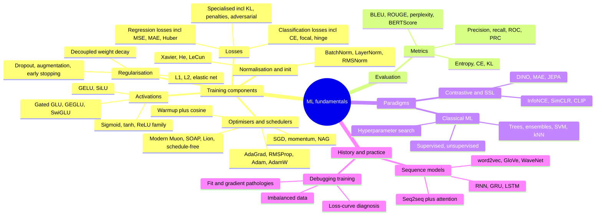

# Topic: ml-fundamentals

⏱ 10 min read · +24h 15m resources

Core machine learning building blocks: the losses, activations, optimisers, normalisation, and metrics every network is assembled from, plus classical ML, contrastive/self-supervised learning, the pre-transformer sequence-model lineage, and a practical training-debugging cookbook. Mostly review material, formatted for fast refresh; genuinely modern developments (SwiGLU, RMSNorm, Muon, JEPA) are flagged inline with dates.

### Taxonomy

### Map of the space

**Losses** are picked from the target type and the outlier profile. **MSE** squares the error, so it converges cleanly near the minimum but lets a single outlier dominate the gradient; **MAE** is linear and therefore outlier-robust, at the cost of a constant gradient that never softens as you approach the optimum; **Huber** is quadratic within a threshold and linear beyond it, taking both behaviours; **log-cosh** is Huber-shaped but twice differentiable, which matters to second-order methods such as XGBoost that want a Hessian. Classification is all **cross entropy** (the negative log likelihood of the correct class, so minimising it is maximum likelihood), varied by reweighting: **label smoothing** replaces the hard one-hot target with a slightly softened one to curb overconfidence and improve calibration; **focal loss** multiplies each term by a `(1-\hat p)^\gamma` factor so easy examples stop dominating and rare hard positives drive the gradient; **hinge loss** is exactly zero once the margin is satisfied, which is what makes an SVM max-margin. **KL divergence** is not a task loss but the distance-like quantity between two distributions, and it is the same object in VAE regularisers, in distillation, and in RLHF's policy anchor.

**Activations.** **GELU** weights the input by its own Gaussian CDF, giving a smooth ReLU with a small negative dip; **SiLU/Swish** is `x\sigma(x)`, an almost identical curve arrived at by architecture search. **Gated linear units** run two parallel projections and let one gate the other elementwise, so the effective slope is learned per neuron rather than fixed; **SwiGLU** is that construction with a SiLU gate, the near-universal transformer FFN today, paid for with a third projection (the hidden dimension is shrunk to `\tfrac23\cdot 4d` to keep the parameter count matched).

**Regularisation.** **L1** drives weights to exactly zero (a Laplace prior, hence feature selection), **L2** shrinks them without zeroing any (a Gaussian prior), **elastic net** mixes the two for correlated features. **Dropout** zeroes each unit with probability p during training so no neuron can rely on one specific partner, which is equivalent to training an implicit ensemble of subnetworks. **Decoupled weight decay** is the whole point of **AdamW**: an L2 term sitting in the loss gets divided by Adam's per-parameter second moment like any other gradient component, so high-gradient weights end up barely decayed; applying the decay in the update rule instead restores it uniformly.

**Optimisers.** **Momentum** accumulates a velocity, so oscillation across a ravine cancels while consistent directions accelerate; **NAG (Nesterov)** evaluates the gradient at the look-ahead point and corrects the step before taking it. The adaptive family scales each parameter's step by its own gradient history: **AdaGrad** divides by the square root of the cumulative squared gradient, which suits sparse features but decays the learning rate to nothing; **RMSProp** swaps that sum for an exponentially decaying average and fixes the decay-to-zero; **Adam** is RMSProp plus momentum plus bias correction; **AdamW** is Adam with decay decoupled, still the LLM default. **Warmup** exists because Adam's moment estimates are built from almost no data in the first steps and produce wild updates, and **cosine decay** then anneals the LR over a known horizon. The 2024-26 challengers change the update geometry rather than the schedule: **Muon** treats a weight matrix as a matrix and orthogonalises the momentum update via Newton-Schulz iterations (approximately steepest descent under the spectral norm), applied to hidden 2D layers only while embeddings and heads keep AdamW, with roughly 2x sample-efficiency gains reported; **Shampoo** and **SOAP** are Kronecker-factored preconditioners, that is, practical second-order methods, with SOAP running Adam inside Shampoo's eigenbasis; **Lion** keeps only the sign of the momentum and one buffer, so it costs less memory than Adam; **schedule-free** methods replace the decay curve with principled iterate averaging, so the total step count need not be known in advance.

**Normalisation and initialisation.** **BatchNorm** normalises each feature over the batch dimension, which speeds up training but ties the model to batch statistics, breaks on small batches and variable-length sequences, and needs moving averages at inference. **LayerNorm** normalises across the feature dimension per example instead, removing all three problems, which is why transformers use it. **RMSNorm** drops LayerNorm's mean subtraction and its bias term on the finding that only the rescaling matters, saving compute at equal quality, and is the default in modern LLMs. Initialisation schemes all chase one invariant, roughly constant activation and gradient variance across layers: **Xavier (Glorot)** scales the variance by fan-in plus fan-out for sigmoid and tanh, **He (Kaiming)** doubles that because ReLU zeroes half the activations, **LeCun** uses `1/n_{in}` and pairs with SELU.

**Metrics.** Precision is correctness among your positive predictions; recall is coverage of the actual positives. The **ROC curve** sweeps the decision threshold plotting true-positive rate against false-positive rate, but FPR's denominator is the entire negative class, so with rare positives thousands of extra false positives barely move it and the curve flatters the model; the **PR curve** uses precision, whose denominator is the model's own positive predictions, so it punishes exactly those false positives. For text, **BLEU** is clipped n-gram precision with a brevity penalty (built for translation), **ROUGE** the recall-oriented n-gram or longest-common-subsequence counterpart (built for summarisation), **perplexity** the reciprocal geometric mean of per-token probabilities and therefore comparable only within one tokeniser, and **BERTScore** the cosine similarity between contextual embeddings of candidate and reference tokens, which survives paraphrase where n-gram overlap does not.

**Classical ML** still owns tabular data. **Random forests** bag many decorrelated trees to cut variance; **gradient boosting** (XGBoost, LightGBM, CatBoost) builds trees sequentially, each fitting the gradient of the loss with respect to the current predictions, which cuts bias instead, and XGBoost's use of second-order information in its split objective is why it prefers twice-differentiable losses. **SVMs** maximise the margin under a hinge loss and use the **kernel trick** (replacing dot products with a kernel) to get nonlinear boundaries without ever building the feature map. **kNN** does no training at all and is the same machinery that underlies modern vector retrieval. On hyperparameter search, **random beats grid** at equal budget because the important dimensions get many distinct values instead of a handful, and **successive halving** (Hyperband, ASHA) goes further by killing weak configurations early wherever partial training is informative.

**Contrastive and self-supervised learning.** **InfoNCE** is cross entropy over one positive against the in-batch negatives, which maximises a lower bound on the mutual information between two views and is why batch size matters so much. **SimCLR** made that work with strong augmentation plus a projection head; **MoCo** decoupled the negative count from the batch size with a momentum-encoder queue; **CLIP** applies the same loss across modalities (an image against its caption), which buys zero-shot classification through text prompts. **DINO** drops negatives entirely, training a student to match a momentum teacher's output distribution across views; **MAE** masks 75% of image patches and reconstructs pixels, BERT-style for vision; **JEPA** predicts the *representations* of masked blocks in latent space rather than pixels, avoiding both negatives and pixel-level reconstruction. The general lesson of the area: the objective, not the backbone, is what makes something an embedding model.

**The pre-transformer lineage.** **word2vec** learns static one-vector-per-word embeddings by predicting context from a word or the reverse, with negative sampling to dodge the full softmax; **GloVe** fits global log co-occurrence counts instead, the count-based counterpart. **WaveNet** showed dilated causal convolutions could model sequences with an exponentially growing receptive field and no recurrence at all. **RNNs** share weights across time and train by backpropagation through time, where the product of many Jacobians drives gradients to zero or infinity and kills long-range dependencies. **LSTMs** fix that with an additively updated cell state (effectively a skip connection through time) governed by forget, input, and output gates; **GRUs** merge cell and hidden state and use two gates for roughly 25% fewer parameters at comparable quality. **Seq2seq** compressed a whole source sentence into one fixed vector, and **attention** removed that bottleneck by keeping every encoder state and letting the decoder score them afresh per output token, which is precisely the piece the transformer kept when it discarded recurrence.

### Map of the deep dives

| Page | Covers | Refresh in one line |
| --- | --- | --- |
| [Loss functions](losses.md) | Regression (MSE/RMSE/MAE/MAPE/Huber/log-cosh), classification (CE family, label smoothing, focal, hinge), KL, penalties, adversarial | Match the loss to the target type and the outlier/imbalance profile |
| [Activation functions](activations.md) | Sigmoid, tanh, ReLU family, softmax, GELU, SiLU, GLU/GEGLU/SwiGLU | ReLU family in hidden layers, task-specific at the output; SwiGLU is the LLM default |
| [Regularisation](regularisation.md) | L1/L2/elastic net, dropout (train vs inference scaling), augmentation, early stopping, decoupled weight decay | Penalise, drop, augment, or stop early; decouple decay from Adam |
| [Optimisers and learning-rate schedulers](optimisers-and-schedulers.md) | GD variants, momentum/NAG, AdaGrad through AdamW, Newton; warmup + cosine; Muon/SOAP/Lion/schedule-free (2024-26) | AdamW + warmup-cosine is the default; Muon is the challenger |
| [Normalisation and initialisation](normalisation-and-initialisation.md) | Feature scaling, BatchNorm (train vs inference), LayerNorm, RMSNorm; naive/random/Xavier/He/LeCun init | Keep activation variance constant across layers, at init and forever after |
| [Evaluation metrics](metrics.md) | Precision/recall/F1, ROC-AUC vs AUPRC on imbalance, BLEU/ROUGE/METEOR/perplexity, BERTScore/MoverScore, entropy vs CE vs KL | Rare positives -> PR curve, not ROC |
| [Classical ML](classical-ml.md) | Supervised/unsupervised map, clustering, anomaly detection, dim reduction, trees/RF/XGBoost, SVM, kNN, grid/random/Bayesian search | Boosted trees still rule tabular; random beats grid |
| [Contrastive and self-supervised learning](contrastive-and-self-supervised.md) | InfoNCE, SimCLR, MoCo, BYOL, CLIP; why contrastive objectives produce encoders; DINO, MAE, JEPA | The objective, not the backbone, makes an embedding model |
| [Sequence models: the pre-transformer lineage](sequence-models.md) | word2vec, GloVe, WaveNet, RNN/BPTT, GRU, LSTM gate-by-gate, seq2seq + attention | Additive cell-state updates beat vanishing gradients; attention removed the bottleneck |
| [Debugging training](debugging-training.md) | Over/underfitting, vanishing/exploding gradients, loss-curve diagnosis (flat/NaN/oscillating/plateau), imbalanced data | Symptom -> causes -> fixes tables; overfit one batch first |

### Related papers

- [Attention Is All You Need (Transformer)](../../papers/2017-06_attention-is-all-you-need/summary.md) (2017): where the sequence-model lineage ends.
- [BERT: Pre-training of Deep Bidirectional Transformers for Language Understanding](../../papers/2018-10_bert/summary.md) (2018): encoder pretraining; referenced from metrics (BERTScore) and contrastive/SSL.
- [Learning Transferable Visual Models From Natural Language Supervision (CLIP)](../../papers/2021-02_clip/summary.md) (2021) and [An Image is Worth 16x16 Words: Transformers for Image Recognition at Scale (ViT)](../../papers/2020-10_vit/summary.md) (2020): contrastive and SSL backbones.

### Best resources for the whole topic

- [A Recipe for Training Neural Networks (Karpathy)](https://karpathy.github.io/2019/04/25/recipe/) (~35 min)
- [Ruder: An overview of gradient descent optimization algorithms](https://www.ruder.io/optimizing-gradient-descent/) (~40 min)
- [Lilian Weng's blog (Lil'Log)](https://lilianweng.github.io/) (blog, ~3h for the core surveys): surveys spanning contrastive learning, SSL, and beyond
- [Deep Learning book (Goodfellow, Bengio, Courville)](https://www.deeplearningbook.org/) (~20h): the textbook backbone for all of the above
- [Activation functions](activations.md)
- [Classical ML](classical-ml.md)
- [Contrastive and self-supervised learning](contrastive-and-self-supervised.md)
- [Debugging training](debugging-training.md)
- [Loss functions](losses.md)
- [Evaluation metrics](metrics.md)
- [Normalisation and initialisation](normalisation-and-initialisation.md)
- [Optimisers and learning-rate schedulers](optimisers-and-schedulers.md)
- [Regularisation](regularisation.md)
- [Sequence models: the pre-transformer lineage](sequence-models.md)
