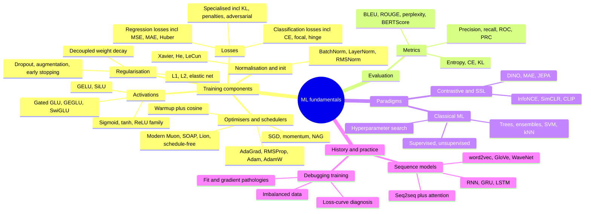

# ML fundamentals

Core machine learning building blocks: the losses, activations, optimisers, normalisation, and metrics every network is assembled from, plus classical ML, contrastive/self-supervised learning, the pre-transformer sequence-model lineage, and a practical training-debugging cookbook. Mostly review material, formatted for fast refresh; genuinely modern developments (SwiGLU, RMSNorm, Muon, JEPA) are flagged inline with dates.

## Taxonomy

## Map of the files

| File | Covers | Refresh in one line |
|---|---|---|
| [losses.md](losses.md) | Regression (MSE/RMSE/MAE/MAPE/Huber/log-cosh), classification (CE family, label smoothing, focal, hinge), KL, penalties, adversarial | Match the loss to the target type and the outlier/imbalance profile |
| [activations.md](activations.md) | Sigmoid, tanh, ReLU family, softmax, GELU, SiLU, GLU/GEGLU/SwiGLU | ReLU family in hidden layers, task-specific at the output; SwiGLU is the LLM default |
| [regularisation.md](regularisation.md) | L1/L2/elastic net, dropout (train vs inference scaling), augmentation, early stopping, decoupled weight decay | Penalise, drop, augment, or stop early; decouple decay from Adam |
| [optimisers-and-schedulers.md](optimisers-and-schedulers.md) | GD variants, momentum/NAG, AdaGrad through AdamW, Newton; warmup + cosine; Muon/SOAP/Lion/schedule-free (2024-26) | AdamW + warmup-cosine is the default; Muon is the challenger |
| [normalisation-and-initialisation.md](normalisation-and-initialisation.md) | Feature scaling, BatchNorm (train vs inference), LayerNorm, RMSNorm; naive/random/Xavier/He/LeCun init | Keep activation variance constant across layers, at init and forever after |
| [metrics.md](metrics.md) | Precision/recall/F1, ROC-AUC vs AUPRC on imbalance, BLEU/ROUGE/METEOR/perplexity, BERTScore/MoverScore, entropy vs CE vs KL | Rare positives -> PR curve, not ROC |
| [classical-ml.md](classical-ml.md) | Supervised/unsupervised map, clustering, anomaly detection, dim reduction, trees/RF/XGBoost, SVM, kNN, grid/random/Bayesian search | Boosted trees still rule tabular; random beats grid |
| [contrastive-and-self-supervised.md](contrastive-and-self-supervised.md) | InfoNCE, SimCLR, MoCo, BYOL, CLIP; why contrastive objectives produce encoders; DINO, MAE, JEPA | The objective, not the backbone, makes an embedding model |
| [sequence-models.md](sequence-models.md) | word2vec, GloVe, WaveNet, RNN/BPTT, GRU, LSTM gate-by-gate, seq2seq + attention | Additive cell-state updates beat vanishing gradients; attention removed the bottleneck |
| [debugging-training.md](debugging-training.md) | Over/underfitting, vanishing/exploding gradients, loss-curve diagnosis (flat/NaN/oscillating/plateau), imbalanced data | Symptom -> causes -> fixes tables; overfit one batch first |

## Related papers (central papers/)

- [Attention Is All You Need (2017)](../../papers/2017-06_attention-is-all-you-need/summary.md): where the sequence-model lineage ends.
- [BERT (2018)](../../papers/2018-10_bert/summary.md): encoder pretraining; referenced from metrics (BERTScore) and contrastive/SSL.
- [CLIP (2021)](../../papers/2021-02_clip/summary.md), [ViT (2020)](../../papers/2020-10_vit/summary.md): contrastive and SSL backbones.

## Best resources for the whole topic

- [A Recipe for Training Neural Networks (Karpathy)](https://karpathy.github.io/2019/04/25/recipe/)
- [Ruder: An overview of gradient descent optimization algorithms](https://www.ruder.io/optimizing-gradient-descent/)
- [Lilian Weng's blog (Lil'Log)](https://lilianweng.github.io/): surveys spanning contrastive learning, SSL, and beyond
- [Deep Learning book (Goodfellow, Bengio, Courville)](https://www.deeplearningbook.org/): the textbook backbone for all of the above
