```mermaid
graph TD
    A[ML infra] --> B[Cluster schedulers]
    A --> C[Managed training platforms]
    A --> D[Pipelines / orchestrators]
    A --> E[IaC + cloud]
    A --> F[Containers for HPC]
    A --> G[Observability + tracking]
    A --> H[Data engines]

    B --> B1[SLURM<br/>HPC default, gang-native]
    B --> B2[Kubernetes<br/>+ Kueue / Volcano for batch]
    B --> B3[Ray clusters<br/>Python-native tasks/actors]

    C --> C1[SageMaker HyperPod<br/>SLURM or EKS + resiliency]
    C --> C2[SageMaker training jobs<br/>ephemeral, managed]
    C --> C3[GCP Vertex AI<br/>custom training + pipelines]

    D --> D1[Dagster<br/>asset graph]
    D --> D2[Airflow 3<br/>DAG of tasks, huge ecosystem]
    D --> D3[Prefect<br/>dynamic Python flows]
    D --> D4[Flyte<br/>typed, K8s-native]
    D --> D5[Metaflow<br/>DS-friendly, Netflix]

    E --> E1[Terraform<br/>state, modules, workspaces]
    E --> E2[AWS ML stack<br/>S3, Lambda, EventBridge, FSx]

    F --> F1[Enroot + Pyxis<br/>NVIDIA, srun --container-image]
    F --> F2[Apptainer<br/>ex-Singularity, rootless SIF]

    G --> G1[Prometheus + Grafana<br/>+ DCGM exporter for GPUs]
    G --> G2[W&B<br/>hosted experiment tracking]
    G --> G3[MLflow<br/>OSS tracking + registry]

    H --> H1[Polars<br/>single-node speed king]
    H --> H2[Dask<br/>distributed pandas/arrays]
    H --> H3[Spark<br/>JVM heavyweight, petabyte-proven]
    H --> H4[Ray Data<br/>streaming into GPU training]
    H --> H5[datatrove<br/>LLM text curation at scale]
```

# ML Infra and Orchestration

Last updated: 2026-08-24

Everything between "I have a training script" and "it runs reliably on 256 GPUs with
metrics, checkpoints, and a bill I can explain". Four layers: **compute schedulers**
(who gets which GPU), **workflow orchestrators** (what runs when and why), **infra as
code + cloud** (how the machines exist at all), and **observability + tracking** (how
you know it worked).

## The map, briefly

**Schedulers** decide who gets GPUs. [SLURM](slurm.md) is the HPC incumbent: gang
scheduling is native, jobs are batch scripts, and it is what HyperPod's Slurm flavour
and most academic clusters run. [Kubernetes](kubernetes-for-ml.md) is the industry
platform everything else is converging on; raw K8s is bad at batch ML, so Kueue
(quota + gang admission), Volcano, and training operators (Kubeflow Trainer v2's
TrainJob, KubeRay) fill the gap. The pragmatic 2026 read: SLURM still wins for pure
large-scale pretraining ergonomics; K8s wins the moment you also serve models, run
many teams, or want one platform for everything.

**Managed training**: SageMaker HyperPod gives you a persistent SLURM or EKS cluster
with health-monitored, auto-replaced nodes and job auto-resume; plain SageMaker
training jobs are ephemeral per-job capacity. Vertex AI is GCP's equivalent. Covered
in [terraform-and-aws-ml.md](terraform-and-aws-ml.md).

**Orchestrators** decide what runs when. Dagster models pipelines as a graph of
**assets** (datasets, models); Airflow models a DAG of **tasks**; Prefect is dynamic
Pythonic flows; Flyte is typed and K8s-native; Metaflow optimises for data scientist
ergonomics. Note: Prefect agreed to acquire Dagster Labs in July 2026, so watch that
space. Comparison and fit in [pipelines-and-data-eng.md](pipelines-and-data-eng.md).

**Data engines**: Polars for single-node (often replacing a whole Spark cluster),
Dask/Spark for distributed dataframes, Ray Data for feeding GPUs, datatrove for
FineWeb-style trillion-token text curation. Same file as pipelines.

**IaC**: Terraform state/modules/workspaces patterns plus the AWS ML stack (S3 layout
for datasets and checkpoints, Lambda/EventBridge glue, cost control) in
[terraform-and-aws-ml.md](terraform-and-aws-ml.md).

**Observability + tracking**: Prometheus + Grafana + DCGM exporter for GPU metrics,
what to alert on for training (throughput drops, NCCL stalls, node health), W&B vs
MLflow, and checkpoint/reproducibility hygiene in
[monitoring-and-tracking.md](monitoring-and-tracking.md).

## Deep dives

| File | Contents |
|---|---|
| [slurm.md](slurm.md) | Partitions/QOS, sbatch/srun, GRES GPU scheduling, arrays, multi-node torchrun, Enroot/Pyxis, preemption, debugging distributed failures |
| [kubernetes-for-ml.md](kubernetes-for-ml.md) | K8s learning track for a SLURM native: core objects, GPU scheduling, Kueue, training operators, SLURM-to-K8s translation table, k3s home lab |
| [pipelines-and-data-eng.md](pipelines-and-data-eng.md) | Dagster vs Airflow vs Prefect vs Flyte; Polars vs Dask vs Spark vs Ray Data; trillion-token text pipelines (datatrove) |
| [terraform-and-aws-ml.md](terraform-and-aws-ml.md) | Terraform patterns, SageMaker + HyperPod, Lambda/EventBridge, S3 design, cost control |
| [monitoring-and-tracking.md](monitoring-and-tracking.md) | DCGM/Prometheus/Grafana, training alerts, W&B vs MLflow, checkpoint hygiene, reproducibility |

## Best starting resources

- [Slurm containers guide](https://slurm.schedmd.com/containers.html) and the
  [NVIDIA Pyxis repo](https://github.com/NVIDIA/pyxis): the container story on HPC.
- [Kueue docs](https://kueue.sigs.k8s.io/docs/): the K8s batch scheduling model.
- [Kubeflow Trainer v2 announcement](https://blog.kubeflow.org/trainer/intro/): where
  K8s training APIs landed after PyTorchJob.
- [SageMaker HyperPod resiliency docs](https://docs.aws.amazon.com/sagemaker/latest/dg/sagemaker-hyperpod-resiliency.html):
  what the platform actually does for you when a GPU dies.
- [The FineWeb paper](https://arxiv.org/abs/2406.17557) +
  [datatrove](https://github.com/huggingface/datatrove): canonical large-scale text
  pipeline design.
