# Topic: ml-infra-and-orchestration

⏱ 4 min read · +3h 35m resources

Everything between "I have a training script" and "it runs reliably on 256 GPUs with

metrics, checkpoints, and a bill I can explain". Four layers: **compute schedulers**

(who gets which GPU), **workflow orchestrators** (what runs when and why), **infra as code + cloud** (how the machines exist at all), and **observability + tracking** (how you know it worked).

```mermaid
graph TD
    A[ML infra] --> B[Cluster schedulers]
    A --> C[Managed training platforms]
    A --> D[Pipelines / orchestrators]
    A --> E[IaC + cloud]
    A --> F[Containers for HPC]
    A --> G[Observability + tracking]
    A --> H[Data engines]

    B --> B1[SLURM<br/>HPC default, gang-native]
    B --> B2[Kubernetes<br/>+ Kueue / Volcano for batch]
    B --> B3[Ray clusters<br/>Python-native tasks/actors]

    C --> C1[SageMaker HyperPod<br/>SLURM or EKS + resiliency]
    C --> C2[SageMaker training jobs<br/>ephemeral, managed]
    C --> C3[GCP Vertex AI<br/>custom training + pipelines]

    D --> D1[Dagster<br/>asset graph]
    D --> D2[Airflow 3<br/>DAG of tasks, huge ecosystem]
    D --> D3[Prefect<br/>dynamic Python flows]
    D --> D4[Flyte<br/>typed, K8s-native]
    D --> D5[Metaflow<br/>DS-friendly, Netflix]

    E --> E1[Terraform<br/>state, modules, workspaces]
    E --> E2[AWS ML stack<br/>S3, Lambda, EventBridge, FSx]

    F --> F1[Enroot + Pyxis<br/>NVIDIA, srun --container-image]
    F --> F2[Apptainer<br/>ex-Singularity, rootless SIF]

    G --> G1[Prometheus + Grafana<br/>+ DCGM exporter for GPUs]
    G --> G2[W&B<br/>hosted experiment tracking]
    G --> G3[MLflow<br/>OSS tracking + registry]

    H --> H1[Polars<br/>single-node speed king]
    H --> H2[Dask<br/>distributed pandas/arrays]
    H --> H3[Spark<br/>JVM heavyweight, petabyte-proven]
    H --> H4[Ray Data<br/>streaming into GPU training]
    H --> H5[datatrove<br/>LLM text curation at scale]
```

### The map, briefly

**Schedulers** decide who gets GPUs. SLURM is the HPC incumbent: gang

scheduling is native, jobs are batch scripts, and it is what HyperPod's Slurm flavour

and most academic clusters run. Kubernetes is the industry

platform everything else is converging on; raw K8s is bad at batch ML, so Kueue

(quota + gang admission), Volcano, and training operators (Kubeflow Trainer v2's

TrainJob, KubeRay) fill the gap. The pragmatic 2026 read: SLURM still wins for pure

large-scale pretraining ergonomics; K8s wins the moment you also serve models, run

many teams, or want one platform for everything. Depth in [SLURM for ML](slurm.md) and [Kubernetes for ML (a learning track for a SLURM native)](kubernetes-for-ml.md).

**Ray** is the third scheduler, and the one no deep dive owns: decorate a function to get a stateless **task**, a class to get a stateful **actor**, and Ray schedules them across a cluster with a shared object store, so distributed code reads as ordinary Python instead of a job script. One runtime spans stages that usually take three systems: **Ray Data** streams and transforms blocks to keep GPUs fed, **Ray Train** wraps distributed training loops including PyTorch DDP and FSDP, **Ray Serve** hosts inference, and **KubeRay** runs Ray clusters as Kubernetes custom resources (RayCluster, RayJob). Pick Ray when preprocessing, training and serving belong in one program, or when the workload is elastic and heterogeneous (RL rollouts, batch inference); pick SLURM for a fixed-size synchronous pretraining run, where Ray's flexibility buys nothing and adds a layer.

**Managed training**: SageMaker HyperPod gives you a persistent SLURM or EKS cluster

with health-monitored, auto-replaced nodes and job auto-resume; plain SageMaker

training jobs are ephemeral per-job capacity. Vertex AI is GCP's equivalent. Covered

in [Terraform and the AWS ML Stack](terraform-and-aws-ml.md).

**Orchestrators** decide what runs when. Dagster models pipelines as a graph of

**assets** (datasets, models); Airflow models a DAG of **tasks**; Prefect is dynamic

Pythonic flows, and since Prefect's 2026 acquisition of Dagster Labs those two are one company shipping two products; Flyte is typed and K8s-native; Metaflow optimises for data scientist

ergonomics.

Comparison and fit in [Pipelines and Data Engineering for ML](pipelines-and-data-eng.md).

**Data engines**: Polars for single-node (often replacing a whole Spark cluster),

Dask/Spark for distributed dataframes, Ray Data for feeding GPUs, datatrove for

FineWeb-style trillion-token text curation. Same page as pipelines.

**IaC**: Terraform state/modules/workspaces patterns plus the AWS ML stack (S3 layout

for datasets and checkpoints, Lambda/EventBridge glue, cost control) in

[Terraform and the AWS ML Stack](terraform-and-aws-ml.md).

**Observability + tracking**: Prometheus + Grafana + DCGM exporter for GPU metrics,

what to alert on for training (throughput drops, NCCL stalls, node health), W&B vs

MLflow, and checkpoint/reproducibility hygiene in

[Monitoring, Experiment Tracking, and Run Hygiene](monitoring-and-tracking.md).

### Deep dives

| Page | Contents |
| --- | --- |
| [SLURM for ML](slurm.md) (10 min read · +3h 15m resources) | Partitions/QOS, sbatch/srun, GRES GPU scheduling, arrays, multi-node torchrun, Enroot/Pyxis, preemption, debugging distributed failures |
| [Kubernetes for ML (a learning track for a SLURM native)](kubernetes-for-ml.md) (12 min read · +4h 40m resources) | K8s learning track for a SLURM native: core objects, GPU scheduling, Kueue, training operators, SLURM-to-K8s translation table, k3s home lab |
| [Pipelines and Data Engineering for ML](pipelines-and-data-eng.md) (10 min read · +5h resources) | Dagster vs Airflow vs Prefect vs Flyte; Polars vs Dask vs Spark vs Ray Data; trillion-token text pipelines (datatrove) |
| [Terraform and the AWS ML Stack](terraform-and-aws-ml.md) (11 min read · +3h 5m resources) | Terraform patterns, SageMaker + HyperPod, Lambda/EventBridge, S3 design, cost control |
| [Monitoring, Experiment Tracking, and Run Hygiene](monitoring-and-tracking.md) (10 min read · +4h 5m resources) | DCGM/Prometheus/Grafana, training alerts, W&B vs MLflow, checkpoint hygiene, reproducibility |

### Best starting resources

- [Slurm containers guide](https://slurm.schedmd.com/containers.html) (~20 min) and the [NVIDIA Pyxis repo](https://github.com/NVIDIA/pyxis) (repo, ~15 min for the entry path): the container story on HPC.
- [Kueue docs](https://kueue.sigs.k8s.io/docs/) (docs, ~30 min for the core pages): the K8s batch scheduling model.
- [Kubeflow Trainer v2 announcement](https://blog.kubeflow.org/trainer/intro/) (~15 min): where K8s training APIs landed after PyTorchJob.
- [SageMaker HyperPod resiliency docs](https://docs.aws.amazon.com/sagemaker/latest/dg/sagemaker-hyperpod-resiliency.html) (~20 min): what the platform actually does for you when a GPU dies.
- [The FineWeb paper](https://arxiv.org/abs/2406.17557) (90 min, long paper) + [datatrove](https://github.com/huggingface/datatrove) (repo, ~25 min for the entry path): canonical large-scale text pipeline design.
- [SLURM for ML](slurm.md)
- [Kubernetes for ML (a learning track for a SLURM native)](kubernetes-for-ml.md)
- [Pipelines and Data Engineering for ML](pipelines-and-data-eng.md)
- [Terraform and the AWS ML Stack](terraform-and-aws-ml.md)
- [Monitoring, Experiment Tracking, and Run Hygiene](monitoring-and-tracking.md)
