# Topic: ml-infra-and-orchestration

⏱ 12 min read · +3h 35m resources

Last updated: 2026-09-21 (merged the duplicated Prefect and Dagster acquisition note into the Dagster paragraph; fixed a page reference)

Everything between "I have a training script" and "it runs reliably on 256 GPUs with

metrics, checkpoints, and a bill I can explain". Four layers: **compute schedulers**

(who gets which GPU), **workflow orchestrators** (what runs when and why), **infra as code + cloud** (how the machines exist at all), and **observability + tracking** (how you know it worked).

```mermaid
graph TD
    A[ML infra] --> B[Cluster schedulers]
    A --> C[Managed training platforms]
    A --> D[Pipelines / orchestrators]
    A --> E[IaC + cloud]
    A --> F[Containers for HPC]
    A --> G[Observability + tracking]
    A --> H[Data engines]

    B --> B1[SLURM<br/>HPC default, gang-native]
    B --> B2[Kubernetes<br/>+ Kueue / Volcano for batch]
    B --> B3[Ray clusters<br/>Python-native tasks/actors]

    C --> C1[SageMaker HyperPod<br/>SLURM or EKS + resiliency]
    C --> C2[SageMaker training jobs<br/>ephemeral, managed]
    C --> C3[GCP Vertex AI<br/>custom training + pipelines]

    D --> D1[Dagster<br/>asset graph]
    D --> D2[Airflow 3<br/>DAG of tasks, huge ecosystem]
    D --> D3[Prefect<br/>dynamic Python flows]
    D --> D4[Flyte<br/>typed, K8s-native]
    D --> D5[Metaflow<br/>DS-friendly, Netflix]

    E --> E1[Terraform<br/>state, modules, workspaces]
    E --> E2[AWS ML stack<br/>S3, Lambda, EventBridge, FSx]

    F --> F1[Enroot + Pyxis<br/>NVIDIA, srun --container-image]
    F --> F2[Apptainer<br/>ex-Singularity, rootless SIF]

    G --> G1[Prometheus + Grafana<br/>+ DCGM exporter for GPUs]
    G --> G2[W&B<br/>hosted experiment tracking]
    G --> G3[MLflow<br/>OSS tracking + registry]

    H --> H1[Polars<br/>single-node speed king]
    H --> H2[Dask<br/>distributed pandas/arrays]
    H --> H3[Spark<br/>JVM heavyweight, petabyte-proven]
    H --> H4[Ray Data<br/>streaming into GPU training]
    H --> H5[datatrove<br/>LLM text curation at scale]
```

### The map, briefly

**Schedulers** decide who gets GPUs. SLURM is the HPC incumbent: gang

scheduling is native, jobs are batch scripts, and it is what HyperPod's Slurm flavour

and most academic clusters run. Kubernetes is the industry

platform everything else is converging on; raw K8s is bad at batch ML, so Kueue

(quota + gang admission), Volcano, and training operators (Kubeflow Trainer v2's

TrainJob, KubeRay) fill the gap. The pragmatic 2026 read: SLURM still wins for pure

large-scale pretraining ergonomics; K8s wins the moment you also serve models, run

many teams, or want one platform for everything.

**Managed training**: SageMaker HyperPod gives you a persistent SLURM or EKS cluster

with health-monitored, auto-replaced nodes and job auto-resume; plain SageMaker

training jobs are ephemeral per-job capacity. Vertex AI is GCP's equivalent. Covered

in [Terraform and the AWS ML Stack](terraform-and-aws-ml.md).

**Orchestrators** decide what runs when. Dagster models pipelines as a graph of

**assets** (datasets, models); Airflow models a DAG of **tasks**; Prefect is dynamic

Pythonic flows; Flyte is typed and K8s-native; Metaflow optimises for data scientist

ergonomics.

Comparison and fit in [Pipelines and Data Engineering for ML](pipelines-and-data-eng.md).

**Data engines**: Polars for single-node (often replacing a whole Spark cluster),

Dask/Spark for distributed dataframes, Ray Data for feeding GPUs, datatrove for

FineWeb-style trillion-token text curation. Same page as pipelines.

**IaC**: Terraform state/modules/workspaces patterns plus the AWS ML stack (S3 layout

for datasets and checkpoints, Lambda/EventBridge glue, cost control) in

[Terraform and the AWS ML Stack](terraform-and-aws-ml.md).

**Observability + tracking**: Prometheus + Grafana + DCGM exporter for GPU metrics,

what to alert on for training (throughput drops, NCCL stalls, node health), W&B vs

MLflow, and checkpoint/reproducibility hygiene in

[Monitoring, Experiment Tracking, and Run Hygiene](monitoring-and-tracking.md).

### What each tool actually is, and why you would pick it

The map above names the layers. This section is the one-paragraph-per-tool version, because a name on its own tells you nothing about when to reach for it.

**Slurm** (Simple Linux Utility for Resource Management) is a batch scheduler built for HPC clusters. It has three objects: nodes, which advertise resources including GPUs as generic resources (GRES); partitions, which are named queues over sets of nodes with their own time limits and priorities; and jobs, which are a resource request plus a shell script. The property that matters for training is that gang scheduling is implicit: a job starts only when every requested node is free simultaneously, which is exactly the guarantee synchronous data-parallel training needs and exactly what plain Kubernetes lacks. Pick it when the workload is large multi-node pretraining and the cluster does one thing. It is also what most academic clusters and the Slurm flavour of SageMaker HyperPod run, so it is frequently not a choice you get to make.

**Kubernetes** is a declarative cluster operating system: you describe the desired state as API objects and controllers reconcile reality toward it, forever. That is the opposite framing to Slurm's "give me 4 nodes for 48 hours", which is why raw Kubernetes is poor at batch training (pods are scheduled one at a time, so a partially placed job holds GPUs and deadlocks) and excellent at everything around it: serving, multi-tenancy, self-healing, and one API for training, inference and data services. Pick it when you also serve models, run several teams, or want a single platform; the converged 2026 ML stack on top of it is the NVIDIA GPU Operator, Kueue, either Kubeflow Trainer or KubeRay, and vLLM or KServe for serving.

**Kueue** is the admission-control layer that makes Kubernetes usable for batch ML. It suspends a job until a **ClusterQueue**, a cluster-wide quota pool (say 64 H100s for one team with borrowing rights over 32 more), can admit the entire workload atomically, which is gang scheduling reimplemented at admission time rather than in the scheduler. It also provides quotas, borrowing between teams, priority-based preemption, and topology-aware placement so ranks land on the same network spine for NCCL bandwidth. It is Slurm's fairshare and QOS layer rebuilt for Kubernetes, and it is the de facto standard. **Volcano** is the older alternative, with its own scheduler and PodGroup objects, still common in Spark-on-Kubernetes and Chinese-cloud stacks.

**Ray** is a distributed execution framework for Python: decorate a function to get a stateless **task**, decorate a class to get a stateful **actor**, and Ray schedules them across a cluster with a shared object store, so distributed code reads as ordinary Python instead of a job script. Its value in ML is that one runtime spans stages that usually take three systems: **Ray Data** streams and transforms blocks to keep GPUs fed, **Ray Train** wraps distributed training loops including PyTorch DDP and FSDP, and **Ray Serve** hosts inference. **KubeRay** runs Ray clusters as Kubernetes custom resources (RayCluster, RayJob). Pick Ray when preprocessing, training and serving belong in one program, or when the workload is elastic and heterogeneous (RL rollouts, batch inference); pick Slurm instead for a fixed-size synchronous pretraining run, where Ray's flexibility buys nothing and adds a layer.

**Kubeflow** is the umbrella project for ML on Kubernetes, and the piece that matters here is **Kubeflow Trainer v2**, whose single **TrainJob** custom resource replaced the old per-framework operators (PyTorchJob, TFJob, MPIJob). It ships **TrainingRuntime** templates for torch distributed, DeepSpeed, MPI and JAX, integrates with Kueue or Volcano for gang admission, and exposes a Python SDK, so it creates the headless services, rank assignments and `MASTER_ADDR` wiring you would otherwise hand-roll with an Indexed Job. Pick it when training lives on Kubernetes and you want restart semantics and elastic scaling handled for you; hand-rolled Indexed Job plus torchrun is worth doing once, to learn the mechanics.

**Airflow** is the incumbent workflow orchestrator: you declare tasks and the edges between them, and it schedules runs, retries and backfills. It knows that a task succeeded, not what data that task produced, which is its structural limitation. Airflow 3 (2025) added DAG versioning, asset-aware and event-driven scheduling, and a task execution API that isolates workers from the metadata database. Pick it when the organisation already runs it: the real moat is the thousand-provider ecosystem, the managed offerings, and the fact that every data engineer already knows it.

**Dagster** models the same problem as a graph of **software-defined assets**: you declare the thing that should exist (this table, this embedding index, this model checkpoint) as a function of its upstream assets, and execution order, lineage, freshness and partition state fall out of the graph instead of being bolted on with sensors. That fits ML unusually well, because ML work *is* materialised artifacts with data dependencies, so "retrain when the features go stale" is a first-class concept. Pick it for a greenfield platform where lineage and freshness matter. One business note that bears on the choice: Prefect agreed to acquire Dagster Labs in July 2026, so watch that space. **Prefect** discovers the graph at runtime from decorated Python functions, so loops and dynamic fan-out are just code, at the cost of the weakest lineage story of the three. **Flyte** compiles strongly typed workflows into containerised tasks on Kubernetes with caching and versioning, making reproducibility structural, and is heavier to operate because it is a platform in its own right. **Metaflow** (Netflix) optimises for the individual data scientist: local-first steps, automatic artifact snapshotting, resume from any step, and decorators to burst onto AWS Batch or Kubernetes.

**Terraform** is infrastructure as code: you declare resources in HCL, Terraform diffs that declaration against a **state file** recording what it believes exists, then applies the difference. Three concepts carry most of the practice. **State** is kept remote in S3 with locking, and split one file per blast-radius unit (network, cluster, data) so a bad apply on experiment infrastructure cannot touch the VPC. **Modules** are reusable parameterised groups of resources, with thin root configurations composing them and versions pinned. **Workspaces** give multiple named states from one configuration, which is right for identical per-developer sandboxes and wrong for dev versus prod, where separate root directories keep the production GPU counts in a file you can code-review. Pick it because capacity reservations, cluster definitions and bucket lifecycle rules are precisely the things you cannot afford to have existing only in someone's console history.

**Prometheus, Grafana and the DCGM exporter** are the GPU observability spine. DCGM is NVIDIA's data centre GPU manager, and **dcgm-exporter** publishes its counters on a metrics endpoint; **Prometheus** scrapes and stores them as time series and evaluates alerting rules; **Grafana** draws them. The reason to care about which metric is that the obvious one lies: `DCGM_FI_DEV_GPU_UTIL` reports only that some kernel was resident, so a job starved by its dataloader still reads near 100%, while `DCGM_FI_PROF_SM_ACTIVE` and `PIPE_TENSOR_ACTIVE` say whether the tensor cores are doing work. Pair these node-level metrics with progress metrics emitted by the training loop, because the expensive failure mode is a job that is running and not progressing.

**MLflow** is the open-source experiment tracker and, more to the point, a **model registry**: runs log parameters, metrics and artifacts, and registered models move through explicit stages toward production, which is the governance piece. It is self-hostable, Databricks-backed, and available managed inside SageMaker. **Weights and Biases (W&B)** does the tracking half considerably better: hosted-first, the strongest run-comparison UI, automatic capture of system and GPU metrics per run, Sweeps for hyperparameter search, and artifacts with lineage. Pick W&B when research velocity across dozens of runs dominates and you accept a vendor holding your metrics; pick MLflow when you need deployment-side governance or must self-host. The common answer is both: W&B during training, the MLflow registry for promotion.

### Deep dives

| Page | Contents |
| --- | --- |
| [SLURM for ML](slurm.md) (10 min read · +3h 15m resources) | Partitions/QOS, sbatch/srun, GRES GPU scheduling, arrays, multi-node torchrun, Enroot/Pyxis, preemption, debugging distributed failures |
| [Kubernetes for ML (a learning track for a SLURM native)](kubernetes-for-ml.md) (12 min read · +4h 40m resources) | K8s learning track for a SLURM native: core objects, GPU scheduling, Kueue, training operators, SLURM-to-K8s translation table, k3s home lab |
| [Pipelines and Data Engineering for ML](pipelines-and-data-eng.md) (10 min read · +5h resources) | Dagster vs Airflow vs Prefect vs Flyte; Polars vs Dask vs Spark vs Ray Data; trillion-token text pipelines (datatrove) |
| [Terraform and the AWS ML Stack](terraform-and-aws-ml.md) (11 min read · +3h 5m resources) | Terraform patterns, SageMaker + HyperPod, Lambda/EventBridge, S3 design, cost control |
| [Monitoring, Experiment Tracking, and Run Hygiene](monitoring-and-tracking.md) (10 min read · +4h 5m resources) | DCGM/Prometheus/Grafana, training alerts, W&B vs MLflow, checkpoint hygiene, reproducibility |

### Best starting resources

- [Slurm containers guide](https://slurm.schedmd.com/containers.html) (~20 min) and the [NVIDIA Pyxis repo](https://github.com/NVIDIA/pyxis) (repo, ~15 min for the entry path): the container story on HPC.
- [Kueue docs](https://kueue.sigs.k8s.io/docs/) (docs, ~30 min for the core pages): the K8s batch scheduling model.
- [Kubeflow Trainer v2 announcement](https://blog.kubeflow.org/trainer/intro/) (~15 min): where K8s training APIs landed after PyTorchJob.
- [SageMaker HyperPod resiliency docs](https://docs.aws.amazon.com/sagemaker/latest/dg/sagemaker-hyperpod-resiliency.html) (~20 min): what the platform actually does for you when a GPU dies.
- [The FineWeb paper](https://arxiv.org/abs/2406.17557) (90 min, long paper) + [datatrove](https://github.com/huggingface/datatrove) (repo, ~25 min for the entry path): canonical large-scale text pipeline design.
- [SLURM for ML](slurm.md)
- [Kubernetes for ML (a learning track for a SLURM native)](kubernetes-for-ml.md)
- [Pipelines and Data Engineering for ML](pipelines-and-data-eng.md)
- [Terraform and the AWS ML Stack](terraform-and-aws-ml.md)
- [Monitoring, Experiment Tracking, and Run Hygiene](monitoring-and-tracking.md)
