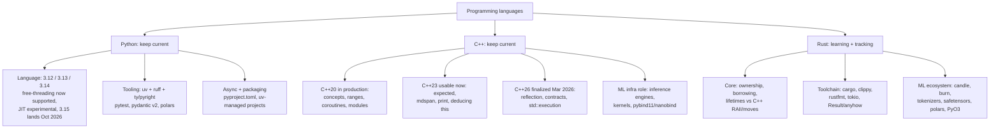

# Programming Languages: Python, C++, Rust

Last full refresh: 2026-08-24.

Three tracks with different goals: Python and C++ are "stay current" tracks (Khalid is
already strong); Rust is a "learn from zero + track the ecosystem" track, approached
through a C++ lens.

Diagram source (mermaid)

## What "current" means per track (as of Aug 2026)

### Python (keep current)
- **Language**: 3.13 is the sensible production floor; 3.14 (Oct 2025) is the headline
  release: free-threaded builds are officially supported (PEP 779), subinterpreters in
  the stdlib (PEP 734), t-strings (PEP 750), experimental JIT in official installers.
  3.15 lands 2026-10-01 with lazy imports (PEP 810) and a stable free-threaded ABI
  (abi3t, PEP 803).
- **Tooling**: uv + ruff are the de-facto standard; ty (Astral's Rust type checker) is
  in beta and worth watching; Astral announced joining OpenAI (Codex team) in Mar 2026.
- **Libraries**: pydantic v2 (v3 signalled via deprecations), polars ~1.x (2.0 roadmap
  open), pytest for testing.

### C++ (keep current)
- **Standard in production**: C++20 everywhere (concepts, ranges, coroutines); modules
  still the laggard. C++23 largely usable in GCC 14/15, Clang 19+, MSVC (full
  /std:c++23 arriving with Build Tools 14.52 / VS 2026).
- **C++26**: finalized 2026-03 (London meeting). Reflection, contracts, and
  std::execution (senders/receivers) are the three headline features; compiler support
  is just beginning.
- **Why it matters for ML**: every serious inference engine (llama.cpp, TensorRT-LLM,
  vLLM's custom kernels), CUDA kernels, and Python binding layers are C++.

### Rust (learning + tracking)
- **Language**: stable releases every 6 weeks; 1.98 as of 2026-08-20; Edition 2024 is
  the current edition (no newer edition shipped as of Aug 2026).
- **Learning goal**: read/write idiomatic Rust, understand ownership deeply via the C++
  mental model, ship one PyO3 extension.
- **Tracking goal**: candle and burn (ML frameworks), HF's Rust core (tokenizers,
  safetensors), polars, uv/ruff/ty themselves; Rust keeps eating Python tooling and
  AI-infra plumbing.

## Files

| File | Contents |
|---|---|
| [python.md](python.md) | Python 3.12-3.15 changes, GIL/JIT status, modern tooling (uv, ruff, ty), async, packaging |
| [cpp.md](cpp.md) | C++20 recap, C++23/26 status and compiler support, C++ in ML infra, modern hygiene |
| [rust.md](rust.md) | From-zero orientation for a C++ programmer, toolchain, async, ML/AI ecosystem, learning path |

## Cross-links
- CUDA/kernels: `../cuda-and-gpu-programming/`
- Inference engines built in C++/Rust: `../inference-and-serving/`
- PyTorch's C++ core and extensions: `../pytorch-ecosystem/`
